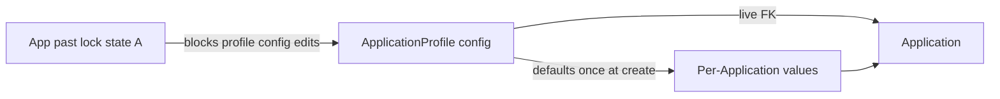

# Visa2026 — Application Profile

**User prompts:** [prompts.md](./prompts.md)

## Agent workflow (every task — mandatory)

1. **Read** [learnings.md](./learnings.md) (**## Entries**, newest first), [IMPLEMENTATION_PLAN.md](./IMPLEMENTATION_PLAN.md) (slice status), and **Scenarios** below.
2. **Classify** — profile config / binding (**this skill**) vs progress transitions (**[visa2026-application-progress](../visa2026-application-progress/SKILL.md)**) vs deprecated Type seed (**[visa2026-lookup-data](../visa2026-lookup-data/SKILL.md)**) vs Resminamalar templates (**[visa2026-resminamalar](../visa2026-resminamalar/SKILL.md)**).
3. **Re-read locked decisions** in [`docs/APPLICATION_PROFILE_PLAN.md`](../../../docs/APPLICATION_PROFILE_PLAN.md) §2 before changing binding, defaults, or lock rules.
4. **Implement** in **Visa2026.Module** (BOs, helpers, controllers, updaters) — Blazor only for wizard / custom DetailView / picker UX.
5. **Verify** — `dotnet build Visa2026.slnx -c Debug`; add tests when resolver/seed/lock logic changes.
6. **Record** — append [learnings.md](./learnings.md) after **verified** work ([MATURITY.md](./MATURITY.md)).
7. **Track** — update slice row in [IMPLEMENTATION_PLAN.md](./IMPLEMENTATION_PLAN.md) and §12 in canonical plan when a slice ships or scope changes.
8. **Suggest** — when officer asks how to configure a profile, use **Configuration suggestions** below + Excel E–H classification ([reference.md](./reference.md)).

## Canonical docs & prototypes

| Doc / artifact | Topic |
|----------------|--------|
| [`docs/APPLICATION_PROFILE_PLAN.md`](../../../docs/APPLICATION_PROFILE_PLAN.md) | Locked decisions, migration, §12 progress |
| [`docs/DEPRECATED.md`](../../../docs/DEPRECATED.md) | `ApplicationType` / `ApplicationTypeFilter` deprecation |
| [`docs/prototypes/application-profile-wizard.html`](../../../docs/prototypes/application-profile-wizard.html) | Configure wizard UX |
| [`docs/prototypes/application-profile-usage.html`](../../../docs/prototypes/application-profile-usage.html) | Pick profile, live FK, lock lifecycle |
| [`docs/prototypes/application-detail-m2m.html`](../../../docs/prototypes/application-detail-m2m.html) | Person M2M DetailView (no ApplicationItem) |
| [`docs/prototypes/Application-profile-wizard-draft.xlsx`](../../../docs/prototypes/Application-profile-wizard-draft.xlsx) | Field E–H classification source |

**Slice tracker:** [IMPLEMENTATION_PLAN.md](./IMPLEMENTATION_PLAN.md) · **File map:** [reference.md](./reference.md) · **Experience:** [learnings.md](./learnings.md) · **Maturity:** [MATURITY.md](./MATURITY.md)

**Related skills:**

| Topic | Skill |
|-------|--------|
| Progress transitions, ministry legs on **Application** (not profile embed yet) | [visa2026-application-progress](../visa2026-application-progress/SKILL.md) |
| `ApplicationType` JSON seed, lookup catalogs | [visa2026-lookup-data](../visa2026-lookup-data/SKILL.md) |
| Field visibility / `[Appearance]` on Application today | grep `ApplicationType.Show*` — migrate to profile in slice 2 |
| Resminamalar / nested Word–Excel on profile | [visa2026-resminamalar](../visa2026-resminamalar/SKILL.md) |
| Person dossier + Start application entry | [visa2026-person-dossier](../visa2026-person-dossier/SKILL.md) |
| Document copies (still ApplicationItem until M2M ships) | [visa2026-document-copies](../visa2026-document-copies/SKILL.md) |
| Schema deploy / `FORCE_XAF_DB_UPDATE` | [visa2026-lifecycle-docker](../visa2026-lifecycle-docker/SKILL.md) |
| VISA2014 import / dual-read Type FK | [visa2014-to-visa2026-import](../visa2014-to-visa2026-import/SKILL.md) |

---

## Scope

| In scope | Out of scope |
|----------|----------------|
| `ApplicationProfile`, `ApplicationProfileApprovalLeg`, `ApplicationProfileTemplate` | Full profile deep-clone (rejected) |
| `Application.ApplicationProfile` live FK + default seeding at create | Unrelated BO refactors |
| Config lock state A (`ApplicationProfileLockHelper`) | ListView row colors → **bo-state-colors** |
| Wizard + profile picker UX (planned) | PDF XFA mapping → **pdf-form-mapping** |
| Seed / cutover from `ApplicationType` | New `ApplicationType` `Show*` flags (forbidden) |
| Switch Appearance / progress reads to profile | ApplicationProgress transition graph edits (unless profile-driven route) |
| Person M2M + hard-remove `ApplicationItem` (planned) | User manual prose unless officer-facing rule changes |

---

## Mental model (locked)

1. **Live FK** — `Application.ApplicationProfile` points at shared config. **No** full profile clone on Application.
2. **Two field classes** — **Configuration-related** (live from profile; not edited on Application) vs **per-Application** (persistent values; defaults copied once at create).
3. **Immutable profile pick** — FK set **only at create** (or Person/Dossier start flow). Never switch profile on existing Application.
4. **Config lock A** — When any linked Application leaves office prep (`OFFICE_PREPARATION` / `DRAFT` excluded), profile **configuration** becomes read-only. New Applications may still pick locked profile. Per-Application fields stay editable.
5. **ApplicationType deprecated** — Dual-read during migration. Do **not** add new Type capability flags; converge on profile.
6. **ApplicationItem retiring** — Target is Person M2M + auto-resolve children; until then do not expand ApplicationItem-only features.

---

## Scenarios (check first)

| Symptom | First step | Likely fix area |
|---------|------------|-----------------|
| Profile picker empty / wrong rows | `ApplicabilityCriteria`, `IsActive`, audience flags | Profile list controller / criteria |
| Defaults not applied on create | `Application.ApplyDefaultsForApplicationProfile` | Profile default FKs; ImmediatePostData |
| Officer can change profile on detail | `[Appearance]` read-only on DetailView | Enforce create-only in controller |
| Config still editable after submit | `ApplicationProfile.IsConfigLocked` + wizard | `ApplicationProfileLockHelper`, `LatestPrimaryStateCode` |
| Visibility still follows ApplicationType | grep `Show*` / `ApplicationType` in Appearance | Slice 2: profile-driven rules |
| Progress route ignores profile | `ApplicationType.ApplicationProgressRoute` still used | Wire `ApplicationProfile.ProgressRoute` in resolver |
| Type required but Profile optional | Dual-read phase | Seed profiles; backfill FK; document in IMPLEMENTATION_PLAN |
| Template list on Application | Nested `ApplicationProfileTemplate` | Read-only child list on Application detail |
| Person tab missing | `RequirePerson*` toggles on profile | Person-config block; M2M slice |
| Import sets Type only | VISA2014 mapper | Map Type → Profile FK in import wave |

---

## Implementation order (do not skip ahead without user approval)

See [IMPLEMENTATION_PLAN.md](./IMPLEMENTATION_PLAN.md) for status. **Default next slice:**

1. ~~**Seed profiles from ApplicationType**~~ — **Done** (`ApplicationProfileSeedSync` + mapper + updater + startup gate).
2. ~~**Switch Appearance / progress to profile**~~ — **Done**.
3. ~~**Config lock on profile edit**~~ — **Done** (read-only DetailView + save guard + Clone).
4. ~~**Wizard UX**~~ — **Done**.
5. ~~**Profile picker at create**~~ — **Done**.
5b. ~~**Custom catalog home**~~ — **Done** (slice 8c; native List/Detail not officer UI).
6. **Person M2M DetailView** — prototype `application-detail-m2m.html`; hard-remove `ApplicationItem`. **10 close-out next**
7. **Person/Dossier Start application** — plan §11.
8. **Remove `Application.ApplicationType` FK** — after cutover + import.

When starting a slice, set its row to **In progress** in IMPLEMENTATION_PLAN; set **Done** only after build + manual officer path (or test) verified.

---

## Configuration suggestions (officer / admin)

Use when user asks *how should I configure this profile?* — tailor to **Action family** and **route**.

### Action family (Related to) — exclusive

| Family | Typical use | Suggest |
|--------|-------------|---------|
| **Issuance** | New visa / permit / invitation | Enable matching **Produce** flags; person toggles for passport + position; via-ministry route if contract-driven |
| **Cancellation** | Cancel existing documents | Enable **Cancel** flags for target doc types; fewer produce flags |
| **Registration** | FM registration flows | **For family member**; suggest family on Person start (§11); registration-related person toggles |
| **Business trip** | Short trip | **Business trip** family; region / trip address per-App fields; lighter person matrix |

### Route (Directed to)

| Route | Suggest |
|-------|---------|
| **Via ministries** | Embed **Approval legs** on profile OR default contract; require **Project contract** on Application; ministry SLA |
| **Direct migration** | No ministry legs on profile; migration SLA; skip contract-for-ministry gate on Person start |

### Person-config toggles

- Always **Passport** for issuance unless exceptional legacy type.
- Turn on **Education / Position / Address** when templates use those `{{…}}` packs or readiness checks need them.
- **TravelHistory** — M2M on Application (not profile scalar); toggle gates tab only.
- Before publish: if nested template references a person pack, corresponding `RequirePerson*` should be on (plan §2.5 recommendation).

### Per-Application defaults

- Set defaults for high-friction lookups (**Visa Type**, **Category**, **Period**, **Urgency**, **Entry check point**) when type always uses same values.
- Leave dates (**Start/End**, **Entry**) without defaults — officer fills per case.
- **Signatory defaults** seed at create but remain editable on Application.

### Lock awareness

- Warn before editing a profile with **Config locked** — changes blocked; duplicate profile for new configuration variant.
- Locked profiles remain valid for **new** Applications.

---

## Common tasks

### Add or change a profile scalar / toggle

1. Confirm Excel E–H class in draft workbook ([reference.md](./reference.md)).
2. Add property on `ApplicationProfile.cs` (configuration) or ensure Application field exists (per-App).
3. EF mapping in `Visa2026DbContext.cs` if FK/index needed.
4. Permissions in `Updater.cs` if new child type.
5. If officer-visible: `UiStrings` / `entities.json` + regenerate localization.
6. Update plan §2.2/§2.3 if classification changes.

### Seed from ApplicationType

1. Map Type → Profile by `SelectionCode` or stable code.
2. Copy route, audience, produce/cancel flags, SLA, person toggles from Type configuration JSON / row.
3. Backfill `Application.ApplicationProfile` where `ApplicationType` set.
4. Idempotent updater — safe on deploy.
5. Log mapping gaps in learnings.md.

### Enforce config lock on wizard

1. `ApplicationProfile.IsConfigLocked` → disable save on configuration fields.
2. Controller on `ApplicationProfile` DetailView / future wizard.
3. Allow read-only view + **duplicate profile** action (suggest to officer).

### Officer UX: suggest profile for scenario

1. Ask: issuance vs cancel vs registration vs trip; employee vs FM; ministry vs direct.
2. Filter active profiles by audience + applicability criteria.
3. Annotate: used before, open app warn, config locked badge (plan §11).

---

## Definition of done

- [ ] Matches locked decisions in `APPLICATION_PROFILE_PLAN.md` §2
- [ ] Logic in **Module**; Blazor only for wizard / picker / custom Application DetailView
- [ ] No new `ApplicationType` capability flags
- [ ] Dual-read documented if Type FK still required
- [ ] `IMPLEMENTATION_PLAN.md` + plan §12 updated when slice completes
- [ ] Append [learnings.md](./learnings.md) when non-obvious
- [ ] Cross-skill note if progress, import, or templates touched

---

## Additional resources

- [reference.md](./reference.md) — file map, E–H field table, open questions
- [IMPLEMENTATION_PLAN.md](./IMPLEMENTATION_PLAN.md) — slice status tracker
- [prompts.md](./prompts.md) — copy-paste chat openers
- [MATURITY.md](./MATURITY.md) — promotion ladder
