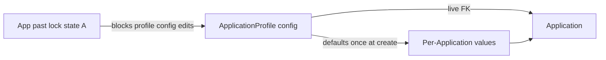

# Visa2026 — Application Profile

**User prompts:** [prompts.md](./prompts.md)

## Agent workflow (every task — mandatory)

1. **Read** [learnings.md](./learnings.md) (**## Entries**, newest first), [IMPLEMENTATION_PLAN.md](./IMPLEMENTATION_PLAN.md) (slice status), and **Scenarios** below.
2. **Classify** — profile config / binding (**this skill**) vs progress transitions (**[visa2026-application-progress](../visa2026-application-progress/SKILL.md)**) vs deprecated Type seed (**[visa2026-lookup-data](../visa2026-lookup-data/SKILL.md)**) vs Resminamalar templates (**[visa2026-resminamalar](../visa2026-resminamalar/SKILL.md)**).
3. **Re-read locked decisions** in [`docs/APPLICATION_PROFILE_PLAN.md`](../../../docs/APPLICATION_PROFILE_PLAN.md) §2 before changing binding, defaults, or lock rules.
4. **Implement** in **Visa2026.Module** (BOs, helpers, controllers, updaters) — Blazor only for wizard / custom DetailView / picker UX.
5. **Verify** — `dotnet build Visa2026.slnx -c Debug`; add tests when resolver/seed/lock logic changes.
6. **Record** — append [learnings.md](./learnings.md) after **verified** work ([MATURITY.md](./MATURITY.md)).
7. **Track** — update slice row in [IMPLEMENTATION_PLAN.md](./IMPLEMENTATION_PLAN.md) and §12 in canonical plan when a slice ships or scope changes.
8. **Suggest** — when officer asks how to configure a profile, use **Configuration suggestions** below + Excel E–H classification ([reference.md](./reference.md)).

## Canonical docs & prototypes

| Doc / artifact | Topic |
|----------------|--------|
| [`docs/APPLICATION_PROFILE_PLAN.md`](../../../docs/APPLICATION_PROFILE_PLAN.md) | Locked decisions, migration, §9 prototype inventory, §12 progress |
| [`docs/DEPRECATED.md`](../../../docs/DEPRECATED.md) | `ApplicationType` / `ApplicationTypeFilter` deprecation |
| [`docs/prototypes/`](../../../docs/prototypes/) | **22 PNG UX mockups** (2026-08-10) — shell, staged, in-process workspace, templates, wizard |
| [`docs/APPLICATION_PROFILE_HTML_PROTOTYPE_PLAN.md`](../../../docs/APPLICATION_PROFILE_HTML_PROTOTYPE_PLAN.md) | PNG → interactive HTML plan (future custom UI) |

**Prototype groups** (all under `docs/prototypes/`):

| Group | Key files |
|-------|-----------|
| App shell | `visa2026-custom-left-navigation-shell-mockup.png` |
| Staged queue | `staged-profiles-listview-table-mockup.png`, `staged-profiles-grid-cards-mockup.png` |
| In process | `process-started-profiles-listview-table-mockup.png`, `process-started-application-profile-workspace-mockup.png`, `process-started-nav-*.png` |
| Templates | `application-profile-templates-listview-mockup.png`, `application-profile-template-overview-mockup.png`, `application-profile-template-wizard*.png` |
| Approval leg versions (2026-08-18) | `application-profile-wizard-approval-leg-versions-prototype.png`, `application-profile-instance-create-choose-approval-legs-prototype.png` |
| Approval leg slot CRUD (2026-08-27) | `approval-leg-profile-slot-01-catalog.png` … `-05-new.png` |
| Choose Approval legs manage (2026-09-03) | `choose-approval-legs-manage-01-picker.png` … `-05-slot-edit.png` — shipped |
| Case summary instance fields (2026-08-18) | `application-profile-instance-case-summary-overview-properties-prototype.png`, `application-profile-instance-case-summary-edit-properties-prototype.png` |
| Case Organization catalogs (2026-09-03) | `application-profile-instance-create-choose-organization-prototype.png`, `application-profile-instance-organization-overview-prototype.png`, `application-profile-instance-organization-edit-prototype.png`, `application-profile-organization-catalogs-prototype.png` — live FKs **10z2**; Config **10z3**; inline **+ New / Edit** (**10z4**: create gear, case section Edit) |
| People & links missing / complete (2026-09-03) | `application-profile-instance-people-links-missing-prototype.png`, `application-profile-instance-people-links-complete-prototype.png` — red short tiles + nav count; green check when complete |
| Overview missing / complete Case summary (2026-09-03) | `application-profile-instance-overview-missing-prototype.png`, `application-profile-instance-overview-complete-prototype.png` — empty required tiles + Overview nav red count / green check |
| Document copies missing / complete (2026-09-03) | `application-profile-instance-document-copies-missing-prototype.png`, `application-profile-instance-document-copies-complete-prototype.png` — amber warning Missing rows + nav count of missing required slots; green check when all required scans are present |

**Retired:** HTML/Excel/`images/` prototypes removed 2026-08-10 — see plan §9.

**Slice tracker:** [IMPLEMENTATION_PLAN.md](./IMPLEMENTATION_PLAN.md) · **File map:** [reference.md](./reference.md) · **Experience:** [learnings.md](./learnings.md) · **Maturity:** [MATURITY.md](./MATURITY.md)

**Related skills:**

| Topic | Skill |
|-------|--------|
| Progress transitions, ministry legs on **Application** (not profile embed yet) | [visa2026-application-progress](../visa2026-application-progress/SKILL.md) |
| `ApplicationType` JSON seed, lookup catalogs | [visa2026-lookup-data](../visa2026-lookup-data/SKILL.md) |
| Field visibility / `[Appearance]` on Application today | grep `ApplicationType.Show*` — migrate to profile in slice 2 |
| Resminamalar / nested Word–Excel on profile | [visa2026-resminamalar](../visa2026-resminamalar/SKILL.md) |
| **Create from yellow marks** (yellow-marked Word/Excel) | [visa2026-template-scan](../visa2026-template-scan/SKILL.md) |
| Document copies on roster (`ApplicationPerson` scope) | [visa2026-document-copies](../visa2026-document-copies/SKILL.md) |
| Case tab catalog vs `#visa-preview-slot` preview-only | [visa2026-preview-slot](../visa2026-preview-slot/SKILL.md) |
| Wizard **Person data** checkboxes | This skill. Templates (this-profile + Shared ON/OFF) live on **case Resminamalar**, not the wizard |
| Person dossier (read-only 360; no Start application) | [visa2026-person-dossier](../visa2026-person-dossier/SKILL.md) |
| Schema deploy / `FORCE_XAF_DB_UPDATE` | [visa2026-lifecycle-docker](../visa2026-lifecycle-docker/SKILL.md) |
| VISA2014 import / dual-read Type FK | [visa2014-to-visa2026-import](../visa2014-to-visa2026-import/SKILL.md) |

---

## Scope

| In scope | Out of scope |
|----------|----------------|
| `ApplicationProfile`, `ApplicationProfileApprovalLeg`, `ApplicationProfileTemplate` | Full profile deep-clone (rejected) |
| `Application.ApplicationProfile` live FK + default seeding at create | Unrelated BO refactors |
| Config lock state A (`ApplicationProfileLockHelper`) | ListView row colors → **bo-state-colors** |
| Wizard + profile picker UX | PDF XFA mapping → **pdf-form-mapping** |
| Seed / cutover from `ApplicationType` | New `ApplicationType` `Show*` flags (forbidden) |
| Blazor officer shell + case workspace (B0–B8) | Preview slot shell CSS/resize → **preview-slot**; **Create from yellow marks** → **visa2026-template-scan** |
| Switch Appearance / progress reads to profile | ApplicationProgress transition graph edits (unless profile-driven route) |
| Person M2M + hard-remove `ApplicationItem` (phase B) | User manual prose unless officer-facing rule changes |

---

## Mental model (locked)

1. **Live FK** — `Application.ApplicationProfile` points at shared config. **No** full profile clone on Application.
2. **Two field classes** — **Configuration-related** (live from profile; not edited on Application) vs **per-Application** (persistent values; defaults copied once at create).
3. **Immutable profile pick** — FK set **only at create** from Application Profile Instances lists. Never switch profile on existing Application. Do not add Person/Dossier Start application.
4. **Config lock A** — When any linked Application leaves office prep (`OFFICE_PREPARATION` / `DRAFT` excluded), profile **configuration** becomes read-only **except this template's Default approval-leg version** (chains live in Configuration; instances keep a snapshot). New Applications may still pick locked profile. Per-Application fields stay editable.
5. **ApplicationType deprecated** — Dual-read during migration. Do **not** add new Type capability flags; converge on profile.
6. **ApplicationItem retiring** — Target is Person M2M + auto-resolve children; until then do not expand ApplicationItem-only features.

---

## Scenarios (check first)

| Symptom | First step | Likely fix area |
|---------|------------|-----------------|
| Start process on Person or Dossier | Hidden by design — create only from Application Profile Instances | Do not re-enable `PersonStartApplication` / `PersonDossierStartApplication` |
| Profile picker empty / wrong rows | `IsActive`, audience flags | Profile list controller / criteria |
| Defaults not applied on create | `Application.ApplyDefaultsForApplicationProfile` | Profile default FKs; ImmediatePostData |
| Officer can change profile on detail | `[Appearance]` read-only on DetailView | Enforce create-only in controller |
| Config still editable after submit | `ApplicationProfile.IsConfigLocked` + wizard | `ApplicationProfileLockHelper`, `LatestPrimaryStateCode` |
| Locked profile cannot change Default approval legs | Default is a lock carve-out (snapshots) | Wizard Identity **Default** only; `HasConfigurationScalarsChanged` ignores `DefaultApprovalLegProfileId`; chains: Choose Approval legs **+ New** / **Open** |
| Visibility still follows ApplicationType | grep `Show*` / `ApplicationType` in Appearance | Slice 2: profile-driven rules |
| Progress route ignores profile | `ApplicationType.ApplicationProgressRoute` still used | Wire `ApplicationProfile.ProgressRoute` in resolver |
| Type required but Profile optional | Dual-read phase | Seed profiles; backfill FK; document in IMPLEMENTATION_PLAN |
| Template list on Application | Nested `ApplicationProfileTemplate` | Read-only child list on Application detail |
| Link on People & links feels frozen | Yield `Task.Delay(16)` then overlay **Linking {name}…** | `OfficerShellPersonLinkPickerComponent`; Last-N resolver is sync |
| Link enabled for person with no / expired / cancelled passport | Picker row `CanLink` + `BlockReason`; `ApplicationProfileInstancePersonLinkPassportGate` | Disable **Link**; show reason on the row |
| Expired visa/WP/invitation/border zone/medical auto-linked | `ApplicationProfileInstancePersonValidItems.CanLink*` | Officer §10.2 gate; import (`IsDataImport`) is exempt; sticky existing links stay. **Passport expiration is not checked.** |
| Template needs last 2 passports / last 2–3 invitations | Wizard **Last 1–3** next to Passport / Visa / Invitation / WP / Border zone | `Person*LastCount`; resolver Take(N); unique index includes `LinkedObjectId` |
| Import sets Type only | VISA2014 mapper | Map Type → Profile FK in import wave |
| Case tab Preview opens duplicate catalog in slot | `OpenPreviewOnly` on slot request | Tab owns catalog; slot viewer only — **preview-slot** |
| Wizard Templates Preview should look filled | No live application in Configure | File occupant + office-to-PDF of the **master** (placeholders) |
| Document copies preview fails on roster line | `TryBuildMergedPdfForRoster` | Roster IDs are `ApplicationPerson`, not `ApplicationItem` |
| Person detail crashes after Open from case | `PersonDetailOpenHelper` | Do not dispose ObjectSpace before `ShowView` |
| Case summary tiles empty / Edit does not save | Profile `Require*` off (number/date are always shown); officer-shell `HeaderFieldChanged`; post-prep lock on type/contract only | `ApplicationWorkspaceCaseHeaderFieldsHelper`; `OfficerShellPropertyEditor.SaveHeaderFieldAsync` |
| Wizard still has Company, Signatories | Removed 2026-09-03 — not profile config | Configuration → Organization catalogs; create **Choose Organization**; case Organization |
| Template overview lists Approval legs catalog | Removed — shared catalog, not profile config | **Choose Approval legs** (pick / Catalog / Make default) |
| Can leave Overview with empty Case summary | Office preparation + red tiles | `ApplicationWorkspaceCaseSummaryCompletenessGate`; People & links stay open |
| People & links zeros look like filled tiles | Short tiles red; nav red count or green check | `ApplicationWorkspacePeopleLinksCompleteness`; `cw-link-tile.is-empty` |
| Overview silent when Case summary has empty required fields | Empty tiles already red; Overview nav was blank | `ResolveOverviewNav` / `MissingRequiredCount`; same red-count / green-check as People |

---

## Implementation order (do not skip ahead without user approval)

See [IMPLEMENTATION_PLAN.md](./IMPLEMENTATION_PLAN.md) for status. **Default next slice:**

1. ~~**Seed profiles from ApplicationType**~~ — **Done** (`ApplicationProfileSeedSync` + mapper + updater + startup gate).
2. ~~**Switch Appearance / progress to profile**~~ — **Done**.
3. ~~**Config lock on profile edit**~~ — **Done** (read-only DetailView + save guard + Clone).
4. ~~**Wizard UX**~~ — **Done**.
5. ~~**Profile picker at create**~~ — **Done**.
5b. ~~**Custom catalog home**~~ — **Done** (slice 8c; native List/Detail not officer UI).
6. **Person M2M DetailView** — skip-navigation `People` (no roster-line BO); F5 heal after Wave 2b (heal DROP CASCADE). `ApplicationItem` hard-remove already shipped.
7. **Person/Dossier Start application** — **removed**; create only from Application Profile Instances picker.
8. **Remove `Application.ApplicationType` FK** — after cutover + import.

**Blazor officer shell (B0–B8):** tracked in [IMPLEMENTATION_PLAN.md](./IMPLEMENTATION_PLAN.md) — staged/in-process queues, templates catalog, 6-tab case workspace, immersive chrome, progress tab, person link picker, preview-slot routing for Resminamalar + Document copies.

When starting a slice, set its row to **In progress** in IMPLEMENTATION_PLAN; set **Done** only after build + manual officer path (or test) verified.

### Case workspace preview routing (locked)

| Entry point | Main area | `#visa-preview-slot` |
|-------------|-----------|----------------------|
| Configure profile → Templates **Preview** | Wizard list / Edit modal | **File occupant** (`OpenFileAsync` master PDF) |
| Case workspace tab → **Preview** | Catalog / list | **Viewer only** (`OpenPreviewOnly` + focus key) |
| Choose Approval legs **+ New** / **Open** (or leftover wizard open) | Picker stays | **Approval-leg catalog** (`OpenApprovalLegCatalogAsync`) |
| Case workspace Progress → ministry letter filename | Timeline (current file name) | **Viewer only** (`ProgressLettersSlotRequest.OpenPreviewOnly` + `FocusProgressId`) |
| Rail / legacy DetailView action | — | Full catalog in slot |

Resminamalar: `ResminamalarSlotRequest`. Document copies: `DocumentCopiesSlotRequest` (`FocusSlotKey`, `ApplicationPerson` roster scope; workspace Preview may pass one person). Progress letters: `ProgressLettersSlotRequest` (`FocusProgressId`). Shell behaviour: **visa2026-preview-slot**. Case workspace Document copies: header chips filter people; **By person** / **By type** catalog — **visa2026-document-copies**.

---

## Configuration suggestions (officer / admin)

Use when user asks *how should I configure this profile?* — tailor to **Action family** and **route**.

### Action family (Related to) — exclusive

| Family | Typical use | Suggest |
|--------|-------------|---------|
| **Issuance** | New visa / permit / invitation | Enable matching **Produce** flags; person toggles for passport + position; via-ministry route if contract-driven |
| **Cancellation** | Cancel existing documents | Enable **Cancel** flags for target doc types; fewer produce flags. Document is cancelled only after the instance reaches **PROCESS_ISSUED** |
| **Change** | Change existing documents | Enable **Change** flags for target doc types. Document is changed only after **PROCESS_ISSUED**; cancelled wins over changed |
| **Registration** | Check-in / check-out / info change / reg extension | Set **Check in**, **Check out**, **Info change**, or **Reg extension**; **Position** always on; **Urgency** never used; **For family member** when FM |
| **Business trip** | Short trip | **Business trip** family; region / trip address per-App fields; lighter person matrix |

### Route (Directed to)

| Route | Suggest |
|-------|---------|
| **Via ministries** | Set **Default** shared approval-leg version on Identity (edit chains in Configuration); officers pick a version at create (snapshot); set **Project** on Results if instances need a contract; profile-specific templates can bind to a Project contract |
| **Direct migration** | No ministry legs on profile; migration SLA; profile-specific templates can bind to a Migration service |

### Person-config toggles

- Always **Passport** for issuance unless exceptional legacy type. Use **Last 2** on **passport-change** (`pasport_change`) only — old + new booklet (expired previous is OK). If only one passport exists, **flag** (`1/2`); **do not block create**. Registration passport-info-change stays Last 1.
- **Invitation / work permit / visa Last 2** means **up to 2 valid rows** (person may have 1 or 2). Missing expected rows are flagged; create is not blocked. Calik: `cancel_invitation` invitation Last 2; `cancel_invitation_wp` invitation + WP Last 2; `cancel_visa_wp` visa + WP Last 2; `cancel_workpermit` WP Last 2.
- **Registration** profiles always turn **Position** on and never use **Urgency**.
- Turn on **Education / Address** when templates use those `{{…}}` packs or readiness checks need them.
- **TravelHistory** — M2M on Application (not profile scalar); toggle gates tab only.
- Before publish: if nested template references a person pack, corresponding `RequirePerson*` should be on (plan §2.5 recommendation).

### Per-Application defaults

- Set defaults for high-friction lookups (**Visa Type**, **Category**, **Period**, **Urgency**, **Entry check point**) when type always uses same values.
- Leave dates (**Start/End**, **Entry**) without defaults — officer fills per case.
- Company / Signatory / Representative are **tenant catalogs**, not profile defaults. Officers pick them at create (**Choose Organization**) and on the case. Tenant **Default** is catalog `IsDefault`. Do not put them on the profile wizard.

### Lock awareness

- Warn before editing a profile with **Config locked** — changes blocked; duplicate profile for new configuration variant.
- Locked profiles remain valid for **new** Applications.

---

## Common tasks

### Add or change a profile scalar / toggle

1. Confirm Excel E–H class in draft workbook ([reference.md](./reference.md)).
2. Add property on `ApplicationProfile.cs` (configuration) or ensure Application field exists (per-App).
3. EF mapping in `Visa2026DbContext.cs` if FK/index needed.
4. Permissions in `Updater.cs` if new child type.
5. If officer-visible: `UiStrings` / `entities.json` + regenerate localization.
6. Update plan §2.2/§2.3 if classification changes.

### Seed from ApplicationType

1. Map Type → Profile by `SelectionCode` or stable code.
2. Copy route, audience, produce/cancel flags, SLA, person toggles from Type configuration JSON / row.
3. Backfill `Application.ApplicationProfile` where `ApplicationType` set.
4. Idempotent updater — safe on deploy.
5. Log mapping gaps in learnings.md.

### Enforce config lock on wizard

1. `ApplicationProfile.IsConfigLocked` → disable save on configuration fields.
2. Controller on `ApplicationProfile` DetailView / future wizard.
3. Allow read-only view + **duplicate profile** action (suggest to officer).

### Officer UX: suggest profile for scenario

1. Ask: issuance vs cancel vs change vs registration vs trip; employee vs FM; ministry vs direct.
2. Filter active profiles by audience + applicability criteria.
3. Annotate: used before, open app warn, config locked badge (plan §11).

---

## Definition of done

- [ ] Matches locked decisions in `APPLICATION_PROFILE_PLAN.md` §2
- [ ] Logic in **Module**; Blazor only for wizard / picker / custom Application DetailView
- [ ] No new `ApplicationType` capability flags
- [ ] Dual-read documented if Type FK still required
- [ ] `IMPLEMENTATION_PLAN.md` + plan §12 updated when slice completes
- [ ] Append [learnings.md](./learnings.md) when non-obvious
- [ ] Cross-skill note if progress, import, or templates touched

---

## Additional resources

- [reference.md](./reference.md) — file map, E–H field table, open questions
- [IMPLEMENTATION_PLAN.md](./IMPLEMENTATION_PLAN.md) — slice status tracker
- [prompts.md](./prompts.md) — copy-paste chat openers
- [MATURITY.md](./MATURITY.md) — promotion ladder
