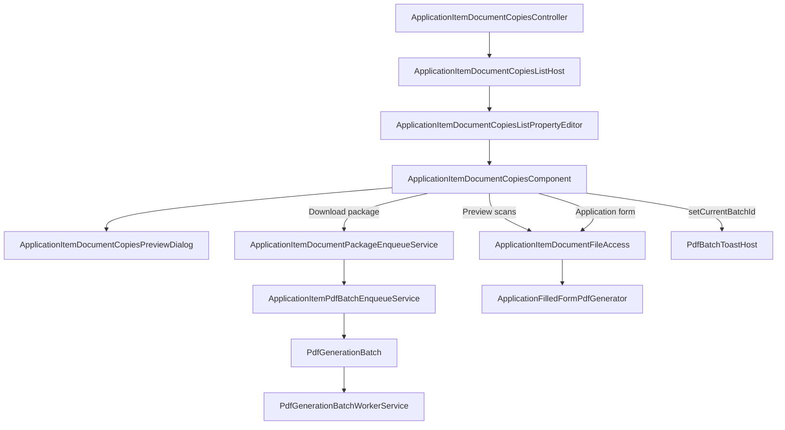

# Document copies — reference

Canonical narrative: [`docs/APPLICATION_ITEM_DOCUMENT_COPIES.md`](../../../docs/APPLICATION_ITEM_DOCUMENT_COPIES.md).

## Pipeline

**Filled form fields wrong?** → [`visa2026-pdf-form-mapping`](../visa2026-pdf-form-mapping/SKILL.md) (not this pipeline’s UI layer).

---

## Module

| File | Role |
|------|------|
| `Controllers/ApplicationItemDocumentCopiesController.cs` | ListView action → modal |
| `BusinessObjects/ApplicationItemDocumentCopiesListHost.cs` | Non-persistent host |
| `Services/ApplicationItemLinkedDocuments/ApplicationItemLinkedDocumentsResolver.cs` | Per-line linked files per slot |
| `Services/ApplicationItemLinkedDocuments/ApplicationItemLinkedDocumentsMerger.cs` | Multi-line merge by `SlotKey` |
| `Services/ApplicationItemLinkedDocuments/ApplicationItemDocumentCopyPdfMerger.cs` | Scan preview PDF (PdfSharpCore) |
| `Services/ApplicationItemLinkedDocuments/ApplicationItemDocumentBatchSummaryPdfBuilder.cs` | Batch summary PDFs |
| `Services/ApplicationItemLinkedDocuments/ApplicationItemDocumentCopiesReadinessSummary.cs` | Gap confirm input |
| `Services/ApplicationItemLinkedDocuments/ApplicationItemDocumentCopiesPackageSlotRules.cs` | Which slots count for gaps |
| `Services/ApplicationItemDocumentPackageOptions.cs` | Options → `PdfBatchEnqueueOptions` |
| `Services/ApplicationItemPdfBatchEnqueueService.cs` | Creates batch (`ItemKeyType` = **Guid**) |
| `Services/ApplicationFilledFormPdfGenerator.cs` | XFA fill (mapping skill) |
| `Localization/ApplicationItemDocumentCopiesSlotLocalization.cs` | Slot labels |

---

## Blazor host

| File | Role |
|------|------|
| `Editors/ApplicationItemDocumentCopiesListPropertyEditor.cs` | Loads resolver + merger |
| `Editors/ApplicationItemDocumentCopiesModel.cs` | Component model |
| `Editors/ApplicationItemDocumentCopiesComponent.razor` | Main dialog |
| `Editors/ApplicationItemDocumentCopiesPreviewDialog.razor` | Scan slot PDF modal only |
| `Services/ApplicationItemDocumentFileAccess.cs` | Secure preview/download |
| `Services/ApplicationItemDocumentPackageEnqueueService.cs` | User + culture → enqueue |
| `Services/PdfGenerationBatchWorkerService.cs` | Background ZIP (shared) |
| `Components/PdfBatchToastHost.razor` | Package progress + Download ZIP |
| `Controllers/PdfBatchesController.cs` | `/api/PdfBatches/{id}/status`, `/my-latest`, `/zip` |
| `wwwroot/css/site.css` | `.app-item-doc-copies*` |

---

## JS helpers (`Pages/_Host.cshtml`)

| Helper | Role |
|--------|------|
| `visaDocumentCopyPreview.createPdfBlobUrl` | Iframe preview blob URL |
| `visaDocumentCopyPreview.revokePdfBlobUrl` | Cleanup |
| `visaPdfBatchToast.setCurrentBatchId` | Register batch for toast |
| `visaPdfBatchToast.fetchJson` | Authorized API fetch (toast) |

---

## Localization

- Prefix: `ApplicationItemDocumentCopies.*` in `tools/GenerateModelLocalization/UiStrings.messages.json`
- Preview progress label reuses: `ApplicationReportPackage.Preview.Downloading`
- Regenerate: `dotnet run --project tools/GenerateModelLocalization/GenerateModelLocalization.csproj`

---

## Verify checklist

- [ ] Single line + multi-line selection
- [ ] Scan slot preview opens modal with iframe
- [ ] Application form Preview: row progress → browser download, **no** second modal
- [ ] Gap confirm when included slots partial
- [ ] Download package → PDF toast (no footer progress bar)
- [ ] `ItemKeyType` Guid on new batch rows
