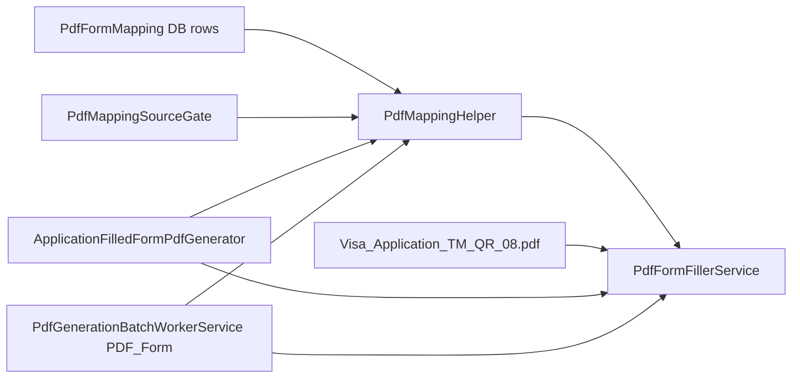

# PDF form mapping — reference

## Canonical docs

| Path | Content |
|------|---------|
| [`Visa2026.Module/BusinessObjects/PdfFormMapping.md`](../../../Visa2026.Module/BusinessObjects/PdfFormMapping.md) | Admin BO reference |
| [`Visa2026.Module/Services/PDF-Form-Filling.md`](../../../Visa2026.Module/Services/PDF-Form-Filling.md) | Full implementation guide |
| [`Visa2026.Module/Resources/XFA_PDF_Integration.md`](../../../Visa2026.Module/Resources/XFA_PDF_Integration.md) | Spire XFA, merge rules, Linux |

## Pipeline

---

## Module — core files

| File | Role |
|------|------|
| `BusinessObjects/PdfFormMapping.cs` | Mapping rule BO |
| `Services/PdfMappingHelper.cs` | BO → `Dictionary<string, object>` |
| `Services/PdfMappingSourceGate.cs` | Skip mappings when slot hidden / link missing |
| `Services/IPdfFormFillerService.cs` | Fill contract |
| `Services/PdfFormFillerService.cs` | Spire.PDF XFA implementation |
| `Services/ApplicationFilledFormPdfGenerator.cs` | One PDF or multi PDF ZIP |
| `Controllers/PdfFormMappingController.cs` | Admin maintenance |
| `Controllers/PdfFormMappingCacheController.cs` | Cache invalidation |
| `Controllers/ApplicationItemPdfController.cs` | Legacy Generate PDF (hidden) |
| `Controllers/ApplicationPdfController.cs` | Legacy application PDF |
| `DatabaseUpdate/PdfFormMappingUpdater.cs` | Seed/sync mapping rows |
| `DatabaseUpdate/OrganizationPdfFormMappingUpdater.cs` | Org-specific mappings |
| `DatabaseUpdate/LookupBaseNameTmPdfFormMappingUpdater.cs` | Lookup-driven mappings |

---

## Template & configuration

| Item | Value |
|------|--------|
| Embedded resource | `Visa2026.Module.Resources.Visa_Application_TM_QR_08.pdf` |
| Constant | `ApplicationFilledFormPdfGenerator.EmbeddedTemplateResourceName` |
| Config | `appsettings.json` → `PdfSettings:TemplatePath` (relative to `AppContext.BaseDirectory`) |
| Fallback | Extract embedded resource to temp file if path missing |

---

## Mapping modes (`PdfFormMapping`)

| Mode | Gated? | Notes |
|------|--------|-------|
| **Property** | Yes — path checked by `PdfMappingSourceGate` | Dot path from `ApplicationItem` |
| **Expression** | Yes — expression + path | Criteria language |
| **Constant** | No | Static PDF value |

---

## XFA rules (do not break)

1. **Do not** use `PdfDocument.MergeFiles()` for filled XFA PDFs — use page import per `XFA_PDF_Integration.md`.
2. **ChoiceList** fields need **raw XFA codes** — `PdfMappingHelper.ResolveRawValue`.
3. Application form preview/download in Document copies **does not** Spire-merge multiple forms — one PDF or ZIP of separate PDFs.

---

## Logging

Enable **Debug** for namespace `Visa2026.Module.Services` to trace per-field mapping, skips, and converter warnings.

---

## Verify checklist

- [ ] `PdfFieldKey` matches template exactly
- [ ] Property path resolves with non-null navigations
- [ ] Gate allows mapping for target `ApplicationType`
- [ ] Document copies application form download
- [ ] Batch ZIP contains correct `PDF_Form/` entries (if worker changed)
- [ ] Docker/Linux: GDI+ dependencies per XFA doc
