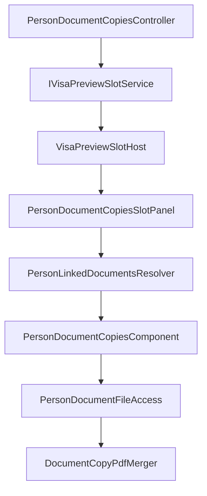

# Person document copies — reference (planned)

Canonical narrative: [`docs/PERSON_DOCUMENT_COPIES.md`](../../../docs/PERSON_DOCUMENT_COPIES.md).

**Status:** paths below are **planned** unless marked *exists today*.

---

## Comparison to ApplicationItem pipeline

| Piece | ApplicationItem (*exists*) | Person (planned) |
|-------|---------------------------|------------------|
| Resolver | `ApplicationItemLinkedDocumentsResolver` | `PersonLinkedDocumentsResolver` |
| Merge for multi-line | `ApplicationItemLinkedDocumentsMerger` | None in v1 (single person) |
| Slot panel | `DocumentCopiesSlotPanel` | `PersonDocumentCopiesSlotPanel` |
| Component | `ApplicationItemDocumentCopiesComponent` | `PersonDocumentCopiesComponent` |
| Slot request | `DocumentCopiesSlotRequest` | `PersonDocumentCopiesSlotRequest` |
| Occupant key | `document-copies:items:…` | `person-document-copies:person:{id}` |
| Package ZIP | `PdfGenerationBatch` | Not v1 |

---

## Planned pipeline



---

## Module (planned)

| File | Role |
|------|------|
| `Services/PersonLinkedDocuments/PersonLinkedDocumentsResolver.cs` | Build sectioned snapshot from `Person` |
| `Services/PersonLinkedDocuments/PersonLinkedDocumentSection.cs` | Section metadata + records |
| `Services/PersonLinkedDocuments/PersonLinkedDocumentRecord.cs` | One child BO + files + `RecordKey` |
| `Services/PersonLinkedDocuments/PersonDocumentCatalogRegistry.cs` | Optional extensible section registry |
| `Localization/PersonDocumentCopiesLocalization.cs` | Labels |
| `Controllers/PersonDocumentCopiesController.cs` | Open slot from Person views |

### Reuse from ApplicationItem stack (*exists*)

| File | Reuse |
|------|--------|
| `ApplicationItemDocumentCopyPdfMerger.cs` | Preview PDF (extract shared helper if needed) |
| `DocumentBase` / `*Document` BOs | File loading |
| `PersonCurrentItems.cs` | Current record badges |
| `BusinessObjects/Person.cs` | Collection roots |

---

## Blazor host (planned)

| File | Role |
|------|------|
| `Components/PersonDocumentCopiesSlotPanel.razor` | Slot catalog + preview toggle |
| `Editors/PersonDocumentCopiesComponent.razor` | Sectioned UI |
| `Editors/PersonDocumentCopiesInlinePreview.razor` | Exclusive preview (or shared inline preview) |
| `Services/PersonDocumentFileAccess.cs` | Secure file access |
| `Services/VisaPreviewSlotService.cs` | Add `OpenPersonDocumentCopiesAsync` |
| `Components/VisaPreviewSlotHost.razor` | New mode branch |
| `Module/Services/PreviewSlot/IVisaPreviewSlotService.cs` | Enum + request types |
| `Module/Services/PreviewSlot/VisaPreviewSlotOccupantKeys.cs` | Key builder |

### Exists today (extend only)

| File | Change |
|------|--------|
| [`PREVIEW_SLOT.md`](../../../docs/PREVIEW_SLOT.md) | Document new occupant when implemented |
| `wwwroot/css/site.css` | Reuse `.resminamalar-slot-panel` — no new theme |

---

## RecordKey convention

```
Passport:{guid}
Passport:{guid}/Visa:{guid}
Education:{guid}
MedicalRecord:{guid}
AddressOfResidence:{guid}
WorkPermitItem:{guid}
InvitationItem:{guid}
RejectionItem:{guid}
PersonDocument:{guid}
FamilyRelationDocument:{guid}
```

---

## Localization (planned)

- `PersonDocumentCopies.*` in `tools/GenerateModelLocalization/UiStrings.messages.json`
- Action id: `ViewPersonDocumentCopies`
- Regenerate: `dotnet run --project tools/GenerateModelLocalization/GenerateModelLocalization.csproj`

---

## ListView column (phase 2 options)

| Approach | Notes |
|----------|--------|
| Custom column + `EditorAlias` | Per-row button in grid |
| `[NotMapped]` link property | ListView-only marker |
| Toolbar only (phase 1) | `PersonDocumentCopiesController` selection |
