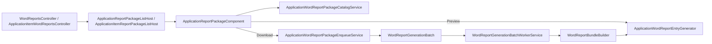

# Resminamalar — reference

Canonical narrative: [`docs/APPLICATION_REPORT_PACKAGE.md`](../../../docs/APPLICATION_REPORT_PACKAGE.md).

## Pipeline (user templates only)



Generators: **`UserReportGenerator`**, **`ExcelReportGenerator`** (not code-backed `IWordReportDefinition` — removed).

---

## Module — catalog & generation

| File | Role |
|------|------|
| `Services/WordReports/ApplicationWordReportPackageCatalogService.cs` | Build catalog entries from visible `UserReportTemplate` |
| `Services/WordReports/ApplicationWordReportPackageReadinessEvaluator.cs` | Ready vs Warning per row |
| `Services/WordReports/ApplicationWordReportPackageDryRunEvaluator.cs` | Empty-field hints (advisory) |
| `Services/WordReports/ApplicationWordReportPackageSelectionHelper.cs` | `SelectedReportKeysJson` serialize/normalize |
| `Services/WordReports/ApplicationWordReportEntryGenerator.cs` | Generate by `user:{Guid}` key |
| `Services/WordReports/ApplicationWordReportBatchEnqueueService.cs` | Create batch row |
| `Services/WordReports/WordReportBundleBuilder.cs` | ZIP over selected keys |
| `Services/WordReports/WordReportGenerationContext.cs` | Application vs Item scope + selected items |
| `Services/WordReports/WordReportDefinitionScopeHelper.cs` | `MatchesUserTemplateScope` |
| `Services/WordReports/ApplicationItemReportPackageValidation.cs` | Item ListView selection rules |
| `Controllers/WordReportsController.cs` | Application DetailView entry |
| `Controllers/ApplicationItemWordReportsController.cs` | ApplicationItem ListView entry |
| `BusinessObjects/ApplicationReportPackageListHost.cs` | Non-persistent host |
| `BusinessObjects/ApplicationItemReportPackageListHost.cs` | Item-scoped host |
| `BusinessObjects/WordReportGenerationBatch.cs` | Batch + JSON selection columns |
| `DatabaseUpdate/UserReportTemplateUpdater.cs` | Seed from embedded `Resources/Templates/` |
| `DatabaseUpdate/WordReportGenerationBatchSelectedReportKeysUpdater.cs` | Schema migration |
| `DatabaseUpdate/WordReportGenerationBatchSelectedApplicationItemIdsUpdater.cs` | Item scope JSON column |

---

## Blazor host — UI & worker

| File | Role |
|------|------|
| `Editors/ApplicationReportPackageListPropertyEditor.cs` | Application scope editor |
| `Editors/ApplicationItemReportPackageListPropertyEditor.cs` | Item scope editor |
| `Editors/ApplicationReportPackageModel.cs` | Component model |
| `Editors/ApplicationReportPackageComponent.razor` | Dialog UI |
| `Editors/ApplicationReportPackagePreviewDialog.razor` | PDF preview popup |
| `Controllers/WordReportPackagePreviewController.cs` | Preview/download API |
| `Services/ApplicationWordReportPackageFileAccess.cs` | Preview file access |
| `Services/ApplicationWordReportOfficePreviewPdfConverter.cs` | Word/Excel → PDF |
| `Services/ApplicationWordReportPackageEnqueueService.cs` | Enqueue + toast |
| `Services/WordReportGenerationBatchWorkerService.cs` | Background ZIP |
| `Services/UserReportTemplateSeedGate.cs` | Post-DI template seed (fixes null ServiceProvider during XAF DB update) |
| `Services/UserReportTemplateEditLinkService.cs` | Edit template deep link |
| `Components/WordReportBatchToastHost.razor` | Progress + Download ZIP |
| `Startup.cs` | DI registrations; calls `UserReportTemplateSeedGate.EnsureSeeded` in `Configure` |

---

## Catalog entry keys

| Source | Key | Example |
|--------|-----|---------|
| User `UserReportTemplate` | `user:{Guid}` | `user:3fa85f64-5717-4562-b3fc-2c963f66afa6` |

Stored on batch as **`SelectedReportKeysJson`** (JSON string array). Null/empty = all applicable (legacy).

Item-scoped batches also set **`SelectedApplicationItemIdsJson`**.

---

## Readiness (UI)

- **Ready** — passes file/placeholder/row checks.
- **Check** — warning; gap confirm before enqueue if checked.
- Hints from dry-run (e.g. empty application field, missing photo count) — **advisory**; hard merge failures surface in batch worker logs.

Common message keys (prefix `ApplicationReportPackage.*` in `UiStrings.messages.json`):

- `Readiness.NoTemplateFile`
- `Readiness.NotValidated` / `InvalidPlaceholders`
- `Readiness.NoApplicationItems`
- `Readiness.DataGaps`
- `Hint.EmptyApplicationField` / `EmptyItemField` / `MissingPhoto`

---

## Template seeding

| Path | Mechanism |
|------|-----------|
| XAF DB update | `UserReportTemplateUpdater.EnsureLinkIndexesAndSeedTemplates` when `ServiceProvider` available |
| Host startup | `UserReportTemplateSeedGate.EnsureSeeded` — **DEBUG:** every start; **Release:** when table empty |

Embedded resources: **`Visa2026.Module/Resources/Templates/`** (+ `Templates/Excel/`). See **user-report-templates** skill for registration details.

---

## Security (quick)

- `ApplicationReportPackageListHost`, `ApplicationItemReportPackageListHost` — read in `Updater.cs`.
- Preview API: auth + entry key must match catalog for application.
- **Edit template:** Write on `UserReportTemplate`; Extract needs delete on `UserReportPlaceholder` (Users role).

---

## Localization

```powershell
dotnet run --project tools/GenerateModelLocalization/GenerateModelLocalization.csproj
```

Keys: `ApplicationReportPackage.*`, `ApplicationItemReportPackage.*`, action `GenerateWordReports` caption **Resminamalar** in model.
