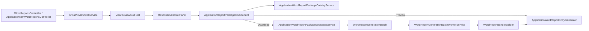

# Resminamalar — reference

Canonical narrative: [`docs/APPLICATION_REPORT_PACKAGE.md`](../../../docs/APPLICATION_REPORT_PACKAGE.md).

## Pipeline (user templates only)


```mermaid
flowchart LR
  BTN[WordReportsController / ApplicationItemWordReportsController]
  SLOT[IVisaPreviewSlotService]
  HOST[VisaPreviewSlotHost]
  PANEL[ResminamalarSlotPanel]
  UI[ApplicationReportPackageComponent]
  CAT[ApplicationWordReportPackageCatalogService]
  GEN[ApplicationWordReportEntryGenerator]
  ENQ[ApplicationWordReportPackageEnqueueService]
  BATCH[WordReportGenerationBatch]
  WORK[WordReportGenerationBatchWorkerService]
  ZIP[WordReportBundleBuilder]
  BTN --> SLOT --> HOST --> PANEL --> UI
  UI --> CAT
  UI -->|Preview| GEN
  UI -->|Download| ENQ --> BATCH --> WORK --> ZIP --> GEN
```

Generators: **`UserReportGenerator`**, **`ExcelReportGenerator`** (not code-backed `IWordReportDefinition` — removed).

---

## Module — catalog & generation

| File | Role |
|------|------|
| `Services/WordReports/ApplicationWordReportPackageCatalogService.cs` | Build catalog entries from visible `UserReportTemplate` |
| `Services/WordReports/ApplicationWordReportPackageReadinessEvaluator.cs` | Ready vs Warning per row |
| `Services/WordReports/ApplicationWordReportPackageDryRunEvaluator.cs` | Empty-field hints (advisory) |
| `Services/WordReports/ApplicationWordReportPackageSelectionHelper.cs` | `SelectedReportKeysJson` serialize/normalize |
| `Services/WordReports/ApplicationWordReportEntryGenerator.cs` | Generate by `user:{Guid}` key |
| `Services/WordReports/ApplicationWordReportBatchEnqueueService.cs` | Create batch row |
| `Services/WordReports/WordReportBundleBuilder.cs` | ZIP over selected keys |
| `Services/WordReports/WordReportGenerationContext.cs` | Application vs Item scope + selected items |
| `Services/WordReports/WordReportDefinitionScopeHelper.cs` | `MatchesUserTemplateScope` |
| `Services/WordReports/ApplicationItemReportPackageValidation.cs` | Item ListView selection rules |
| `Controllers/WordReportsController.cs` | Application DetailView → `IVisaPreviewSlotService.OpenResminamalarAsync` |
| `Controllers/ApplicationItemWordReportsController.cs` | ApplicationItem ListView → inline slot (item scope) |
| `Services/PreviewSlot/IVisaPreviewSlotService.cs` | Slot orchestrator contract + `ResminamalarSlotRequest` |
| `Services/PreviewSlot/VisaPreviewSlotOccupantKeys.cs` | Stable occupant keys (app vs items vs file) |
| `Services/PreviewSlot/VisaPreviewSlotViewHelper.cs` | `View.Id` for slot owner tracking |
| `BusinessObjects/ApplicationReportPackageListHost.cs` | Non-persistent host |
| `BusinessObjects/ApplicationItemReportPackageListHost.cs` | Item-scoped host |
| `BusinessObjects/WordReportGenerationBatch.cs` | Batch + JSON selection columns |
| `DatabaseUpdate/UserReportTemplateUpdater.cs` | Seed from embedded `Resources/Templates/` |
| `DatabaseUpdate/WordReportGenerationBatchSelectedReportKeysUpdater.cs` | Schema migration |
| `DatabaseUpdate/WordReportGenerationBatchSelectedApplicationItemIdsUpdater.cs` | Item scope JSON column |
| `Services/UserReports/UserReportTemplateStagingService.cs` | Export/import staged templates on UNC share |
| `Services/UserReports/UserReportTemplateMaintenanceService.cs` | Extract + Validate (DetailView + post-sync import) |
| `Services/UserReports/TemplateEditStagingOptions.cs` | `TemplateEditStaging` config binding |

---

## Template staging (desktop Word/Excel)

Canonical: [`docs/TEMPLATE_STAGING_EDIT.md`](../../../docs/TEMPLATE_STAGING_EDIT.md).

| File | Role |
|------|------|
| `Services/UserReports/UserReportTemplateStagingPathHelper.cs` | UNC paths, sanitize names, `ms-word`/`ms-excel` URLs |
| `Services/UserReports/UserReportTemplateStagingMeta.cs` | Sidecar `.meta.json` on share |
| `Module.Tests/UserReports/UserReportTemplateStagingPathHelperTests.cs` | Path/helper unit tests |
**Officer flow:** gear → **Edit template** → edit on share → **Sync to database** → **Refresh** (catalog only, no import).

Config: `TemplateEditStaging:Enabled`, `LocalFolderSubfolderName` in `appsettings` / `appsettings.Development.json`. Production requires HTTPS — see `docs/TEMPLATE_STAGING_EDIT.md`.

---

## Blazor host — UI & worker

| File | Role |
|------|------|
| `Services/VisaPreviewSlotService.cs` | Scoped slot state + `StateChanged` |
| `Components/VisaPreviewSlotHost.razor` | File vs Resminamalar mode in `#visa-preview-slot` |
| `Components/ResminamalarSlotPanel.razor` | Catalog + inline preview shell |
| `Components/VisaFilePreviewDrawer.razor` | File mode (ministry letter; `HostManaged` when under slot host) |
| `Controllers/VisaPreviewSlotCloseController.cs` | Owner-aware close when opening view deactivates |
| `Editors/ApplicationReportPackageListPropertyEditor.cs` | Application scope editor (modal hosts — legacy) |
| `Editors/ApplicationItemReportPackageListPropertyEditor.cs` | Item scope editor (modal hosts — legacy) |
| `Editors/ApplicationReportPackageModel.cs` | Component model |
| `Editors/ApplicationReportPackageComponent.razor` | Catalog UI (`UseInlinePreview` for slot) |
| `Editors/ReportPackageInlinePreview.razor` | In-slot PDF viewer |
| `Editors/ApplicationReportPackagePreviewDialog.razor` | Legacy PDF preview popup (property editors) |
| `Controllers/WordReportPackagePreviewController.cs` | Preview/download API |
| `Services/ApplicationWordReportPackageFileAccess.cs` | Preview file access |
| `Services/ApplicationWordReportOfficePreviewPdfConverter.cs` | Word/Excel → PDF |
| `Services/ApplicationWordReportPackageEnqueueService.cs` | Enqueue + toast |
| `Services/WordReportGenerationBatchWorkerService.cs` | Background ZIP |
| `Services/UserReportTemplateSeedGate.cs` | Post-DI template seed (fixes null ServiceProvider during XAF DB update) |
| `Services/UserReportTemplateEditLinkService.cs` | Legacy DetailView URL helper (catalog uses staging export, not this link) |
| `Controllers/UserReportTemplateStagingController.cs` | Staging API — export / import-all |
| `Services/UserReportTemplateStagingUiService.cs` | Catalog wrapper for staging service |
| `wwwroot/js/template-staging-local.js` | FSA folder picker, export, sync uploads, copy path, Office open |
| `Components/WordReportBatchToastHost.razor` | Progress + Download ZIP |
| `Startup.cs` | DI registrations; calls `UserReportTemplateSeedGate.EnsureSeeded` in `Configure` |
| `Pages/_Host.cshtml` | `#visa-app-shell`, `visaPreviewDrawer.open` / `openResminamalar` JS |

---

## Catalog entry keys

| Source | Key | Example |
|--------|-----|---------|
| User `UserReportTemplate` | `user:{Guid}` | `user:3fa85f64-5717-4562-b3fc-2c963f66afa6` |

Stored on batch as **`SelectedReportKeysJson`** (JSON string array). Null/empty = all applicable (legacy).

Item-scoped batches also set **`SelectedApplicationItemIdsJson`**.

---

## Readiness (UI)

- **Ready** — passes file/placeholder/row checks.
- **Check** — warning; gap confirm before enqueue if checked.
- Hints from dry-run (e.g. empty application field, missing photo count) — **advisory**; hard merge failures surface in batch worker logs.

Common message keys (prefix `ApplicationReportPackage.*` in `UiStrings.messages.json`):

- `Readiness.NoTemplateFile`
- `Readiness.NotValidated` / `InvalidPlaceholders`
- `Readiness.NoApplicationItems`
- `Readiness.DataGaps`
- `Hint.EmptyApplicationField` / `EmptyItemField` / `MissingPhoto`

---

## Template seeding

| Path | Mechanism |
|------|-----------|
| XAF DB update | `UserReportTemplateUpdater.EnsureLinkIndexesAndSeedTemplates` when `ServiceProvider` available |
| Host startup | `UserReportTemplateSeedGate.EnsureSeeded` — **DEBUG:** every start; **Release:** when table empty |

Embedded resources: **`Visa2026.Module/Resources/Templates/`** (+ `Templates/Excel/`). See **user-report-templates** skill for registration details.

---

## Security (quick)

- `ApplicationReportPackageListHost`, `ApplicationItemReportPackageListHost` — read in `Updater.cs`.
- Preview API: auth + entry key must match catalog for application.
- **Edit template:** Export bytes to officer PC sandbox; sync uploads to DB. Gated by `UserReportTemplateEditAccess.CanEditTemplates()`. Extract needs delete on `UserReportPlaceholder` (Users role).

---

## Localization

```powershell
dotnet run --project tools/GenerateModelLocalization/GenerateModelLocalization.csproj
```

Keys: `ApplicationReportPackage.*`, `ApplicationItemReportPackage.*`, action `GenerateWordReports` caption **Resminamalar** in model.
