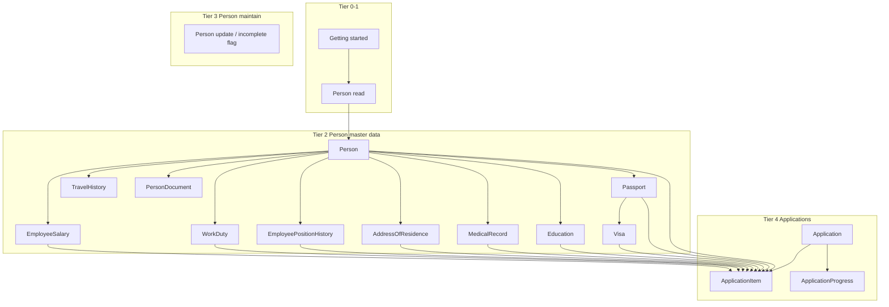

# User manual — documentation curriculum

**Pedagogy:** document from **simplest** (read/navigate, basic CRUD on one BusinessObject) to **hardest** (Word/Excel **template authoring** and staging). Do not publish advanced guides before earlier tiers exist for the same BO family.

**Skill:** [SKILL.md](./SKILL.md) · **Advisory:** [advisory.md](./advisory.md) · **Backlog:** [tracking.md](./tracking.md) § Guide inventory

---

## 1. Why this order

| Reason | Detail |
|--------|--------|
| Officer learning curve | Officers master Person before Application before packages |
| E2E complexity | `PersonOfficerJourney` before multi-BO application flows |
| BO catalog dependency | Reference pages for `Person`/`Passport` before `ApplicationItem` |
| Risk | Template guides wrong if CRUD guides omit required fields |
| Manual nav | MkDocs sidebar follows tiers — readers see a clear path |

**Rule:** new guide `tier` frontmatter must be ≥ any prerequisite tier. Validator may warn on skip (Phase 2+).

**BO dependency rule (mandatory):** publish guides in **parent → child** order on the domain graph (§2.1). Do **not** draft `applications/add-items` until Person nested master-data guides exist — `ApplicationItem` resolves `CurrentPassport`, `CurrentVisa`, `CurrentEducation`, and other `Current*` fields from `Person` children via `PersonCurrentItems` and `ApplyCurrentFieldsFromSelectedPerson` ([`ApplicationItem.cs`](../../../Visa2026.Module/BusinessObjects/ApplicationItem.cs)).

---

## 2. Tier ladder (simple → hard)

| Tier | Name | Officer skills | Typical BOs | Doc focus |
|------|------|----------------|-------------|-----------|
| **0** | Getting started | Login, shell, roles, daily overview | — | No CRUD |
| **1** | **Read & navigate** | Open lists, filters, detail views | `Person`, lookups (read-only use) | **R** in CRUD |
| **2** | **Create** | New employee, child records | `Person`, `Passport`, `Education` | **C** |
| **3** | **Update & maintain** | Edit fields, incomplete flag, collections | `Person`, `EmployeeSalary`, nested tabs | **U** |
| **4** | **Application workflow** | Header + items + progress | `Application`, `ApplicationItem`, `ApplicationProgress` | Multi-BO |
| **5** | **Packages & previews** | Document copies, Resminamalar ZIP | `ApplicationItem`, hosts | Generate/download |
| **6** | **360° & tracking** | Dossier, Report Dashboard | `PersonDossierHost`, dashboard | Read + export |
| **7** | **Template generation** | Upload template, placeholders, staging sync | `UserReportTemplate` | **Hardest** |
| **8** | **Office configuration** | Company, contracts, SLA, expiry alerts, upload limits | `CompanyProfile`, `ProjectContract`, `ExpirationAlertRule`, … | Admin / VisaOffice |

**Delete:** rarely officer-facing; document only where product allows (e.g. cancel application) — usually **tier 4** side note, not a dedicated tier.

---

## 2.1 Business object dependency (manual generation order)

Domain ownership in [`Visa2026.Module/BusinessObjects/`](../../../Visa2026.Module/BusinessObjects/). **Issued-document** collections on `Person` (Application items, Work permit items, Invitations, Rejections) are **workflow outputs** — document in **tier 4 application guides**, not as Person nested-create guides.



### Why `ApplicationItem` blocks early application guides

When an officer picks **Person** on an application line, Visa2026 fills **Current\*** references from person master data ([`PersonCurrentItems`](../../../Visa2026.Module/BusinessObjects/PersonCurrentItems.cs)):

| `ApplicationItem` field | Resolved from (Person child) | ApplicationType gate (examples) |
|-------------------------|------------------------------|----------------------------------|
| `CurrentPassport` | `Person.Passports` | Always (line requires person) |
| `CurrentVisa` | `Passport.Visas` | `ShowCurrentVisa` |
| `CurrentEducation` | `Person.Educations` | `ShowCurrentEducation` (employee; not registration FM) |
| `CurrentMedicalRecord` | `Person.MedicalRecords` | `ShowCurrentMedicalRecord` |
| `CurrentAddressOfResidence` | `Person.AddressesOfResidence` | `ShowCurrentAddressOfResidence` |
| `CurrentPositionHistory` | `Person.PositionHistory` | Purpose of travel / employee lines |
| `CurrentWorkDuty` | `Person.WorkDuties` | `ShowCurrentWorkDuty` |
| `CurrentSalary` | `Person.Salaries` | `ShowCurrentSalary` |
| `CurrentWorkPermitItem` / `CurrentInvitationItem` | Issued tabs | Workflow — tier 4 only |

**Manual rule:** complete **orders 5–15** (Person nested creates) before **`applications/add-items`** (order 19).

### Employee detail tabs → guide mapping

Guides are scoped by **`PersonRecordRole`** (`employee/`, `family-member/`, `temporary-visitor/`) because typed detail views hide different tabs and required header fields ([`Person.cs`](../../../Visa2026.Module/BusinessObjects/Person.cs), [`PERSON_DETAIL_NESTED_COLLECTION_TABS.md`](../../../docs/PERSON_DETAIL_NESTED_COLLECTION_TABS.md)).

| Person record tab | Child BO | Employee guide | Family member guide | Temporary visitor guide |
|-------------------|----------|----------------|---------------------|-------------------------|
| **Passports** → nested **Visas** | `Passport`, `Visa` | `employee/add-passport`, `employee/add-visa` | `family-member/add-passport`, `family-member/add-visa` | `temporary-visitor/add-passport`, `temporary-visitor/add-visa` |
| **Educations** | `Education` | `employee/add-education` | — (tab hidden) | — (tab hidden) |
| **Medical records** | `MedicalRecord` | `employee/add-medical-record` | `family-member/add-medical-record` | `temporary-visitor/add-medical-record` |
| **Addresses of residence** | `AddressOfResidence` | `employee/add-address` | `family-member/add-address` | `temporary-visitor/add-address` |
| **Position history** | `EmployeePositionHistory` | `employee/add-position-history` | — (tab hidden) | — (tab hidden) |
| **Work duties** | `WorkDuty` | `employee/add-work-duty` | — | — |
| **Salaries** | `EmployeeSalary` | `employee/add-salary` | — | — |
| **Travel histories** | `TravelHistory` | `employee/add-travel` | — | `temporary-visitor/add-travel` |
| **CV & personal files** | `PersonDocument` | `employee/add-cv-documents` | — | — |
| **Family relation documents** | `FamilyRelationDocument` | — | `family-member/add-family-relation-documents` | — |

**Cross-role guides** (any `PersonRecordRole`): `person/open-and-search` (nav: **Getting started**); `person/mark-incomplete` (same page under **Employee**, **Family member**, and **Temporary visitor**).

---

## 3. Guide sequence (recommended publish order)

Publish in **order** column. **Phase 2** = orders **1–20** (through `applications/progress`). **Do not** start order 19 until orders **5–15** are at least `draft`.

| Order | Tier | Slug | Title | `bo` | Parent | `personRole` | Prereq guides |
|------:|------|------|-------|------|--------|--------------|---------------|
| 1 | 0 | `getting-started/login` | Sign in to Visa2026 | — | — | — | — |
| 2 | 0 | `getting-started/navigation` | Main navigation | — | — | — | 1 |
| 3 | 1 | `person/open-and-search` | Find and open a person | Person | — | — | 2 |
| 4 | 2 | `employee/register` | Register a new employee | Person | — | Employee | 3 |
| 5a | 2 | `employee/add-passport` | Add a passport (employee) | Person | — | Employee | 4 |
| 5b | 2 | `family-member/add-passport` | Add a passport (family member) | Person | — | FamilyMember | 3 |
| 6a | 2 | `employee/add-visa` | Add a visa (employee) | Person | Passport | Employee | 5a |
| 6b | 2 | `family-member/add-visa` | Add a visa (family member) | Person | Passport | FamilyMember | 5b |
| 5c | 2 | `temporary-visitor/add-passport` | Add a passport (temporary visitor) | Person | — | TemporaryVisitor | 3 |
| 6c | 2 | `temporary-visitor/add-visa` | Add a visa (temporary visitor) | Person | Passport | TemporaryVisitor | 5c |
| 7 | 2 | `employee/add-education` | Add an education record | Person | — | Employee | 4 |
| 8a | 2 | `employee/add-medical-record` | Add a medical record (employee) | Person | — | Employee | 4 |
| 8b | 2 | `family-member/add-medical-record` | Add a medical record (family member) | Person | — | FamilyMember | 3 |
| 8c | 2 | `temporary-visitor/add-medical-record` | Add a medical record (TV) | Person | — | TemporaryVisitor | 3 |
| 9a | 2 | `employee/add-address` | Add an address (employee) | Person | — | Employee | 4 |
| 9b | 2 | `family-member/add-address` | Add an address (family member) | Person | — | FamilyMember | 3 |
| 9c | 2 | `temporary-visitor/add-address` | Add an address (temporary visitor) | Person | — | TemporaryVisitor | 3 |
| 10 | 2 | `employee/add-position-history` | Add position history | Person | — | Employee | 4 |
| 11 | 2 | `employee/add-work-duty` | Add a work duty | Person | — | Employee | 4 |
| 12 | 2 | `employee/add-salary` | Add a salary record | Person | — | Employee | 4 |
| 13 | 2 | `employee/add-travel` | Add a travel history | Person | — | Employee | 4 |
| 14 | 2 | `employee/add-cv-documents` | Add CV and personal files | Person | — | Employee | 4 |
| 15 | 3 | `employee/edit-employee` | Update employee details | Person | — | Employee | 4 |
| 16 | 3 | `person/mark-incomplete` | Mark incomplete / complete | Person | — | — | 4 |
| 17 | 4 | `applications/create` | Create an application | Application | — | 4 |
| 18 | 4 | `applications/add-items` | Add application items | ApplicationItem | Application + Person\* | 17, **5–14** |
| 19 | 4 | `applications/progress` | Track application progress | ApplicationProgress | Application | 17, 18 |
| 20 | 5 | `applications/document-copies` | Ministry document copies | ApplicationItem | Application | 18 |
| 21 | 5 | `applications/resminamalar` | Resminamalar report package | Application | — | 17 |
| 22 | 6 | `person/dossier` | Person dossier | Person | — | 3, 15 |
| 23 | 6 | `tracking/report-dashboard` | Report Dashboard | — | — | 2 |
| 24 | 7 | `administration/user-report-templates` | User report templates | UserReportTemplate | — | 21 |
| 25 | 7 | `administration/template-staging` | Edit and sync templates | UserReportTemplate | — | 24 |
| 28 | 8 | `administration/configuration/overview` | Configuration overview | — | — | 19, 23 |
| 29 | 8 | `administration/configuration/organization` | Organization settings | CompanyProfile | — | 28 |
| 30 | 8 | `administration/configuration/contracts-and-approvals` | Contracts and approvals | ProjectContract | — | 28, 17 |
| 31 | 8 | `administration/configuration/sla` | SLA settings | ApplicationMigrationSlaProfile | — | 28, 19 |
| 32 | 8 | `administration/configuration/alerts-and-upload-limits` | Alerts and upload limits | ExpirationAlertRule | — | 28 |

\*Person\* = officer must understand nested master data on the person before adding lines (orders 5–14), not necessarily every guide `published`.

**Renamed:** `person/nested-education` → `person/add-education` (consistent with `person/add-passport`).

---

## 4. Tier → CRUD mapping (per BO family)

Use when splitting one BO into multiple guides.

### Person family (tiers 1–3)

| Operation | Guide pattern | Examples (BO dependency order) |
|-----------|---------------|--------------------------------|
| **Read** | Open list → open detail | `person/open-and-search` |
| **Create** | New → required fields → Save | `person/register` |
| **Create child** | Detail tab → New → Save | `person/add-passport` → `person/add-visa`; then parallel Person children (`add-education`, `add-medical-record`, …) |
| **Update** | Detail → edit → Save | `person/edit-employee` |
| **Update (flag)** | Toolbar popup / Incomplete data tab | `person/mark-incomplete` |

### Application family (tier 4)

| Operation | Guide pattern |
|-----------|---------------|
| **Create** | Application type → header fields → Save |
| **Create child** | Items tab → add person lines |
| **Update** | Progress history / manual advance |
| **Read** | List filters, status columns |

### Packages (tier 5) — not CRUD

Officers **select and generate**; underlying BOs are not edited in the dialog.

| Feature | Guide | Skill doc source |
|---------|-------|------------------|
| Ministry PDF ZIP | `applications/document-copies` | `APPLICATION_ITEM_DOCUMENT_COPIES.md` |
| Word/Excel ZIP | `applications/resminamalar` | `APPLICATION_REPORT_PACKAGE.md` |

### Template generation (tier 7) — hardest

| Step | Officer/admin action | Dev counterpart |
|------|----------------------|-----------------|
| 1 | Understand when to use custom template | `USER_TEMPLATE_AUTHOR_GUIDE.md` |
| 2 | Upload `.docx` / `.xlsx` | User Report Templates BO |
| 3 | Extract placeholders | Toolbar |
| 4 | Validate placeholders | Toolbar |
| 5 | Set visibility / active | Detail form |
| 6 | (Optional) Edit template → Sync to database | `TEMPLATE_STAGING_EDIT.md` |
| 7 | Verify in Resminamalar preview + ZIP | Tier 5 guide |

**Do not** put tier 7 content in tier 2 guides — link forward only.

### Office configuration (tier 8)

| Area | Configuration menu items | Guide |
|------|--------------------------|-------|
| Organization singletons | Company, Application Numbering, Authorized Signatory, Authorized Representative | `administration/configuration/organization` |
| Contracts & ministry routes | Project contracts, Approving ministries, Approval Leg Profile | `administration/configuration/contracts-and-approvals` |
| SLA | Application Migration Sla Profile, Ministry review SLA | `administration/configuration/sla` |
| Alerts & limits | Document expiration alerts, Upload limits | `administration/configuration/alerts-and-upload-limits` |

Hub: `administration/configuration/overview` maps all eleven left-menu items.

---

## 5. MkDocs sidebar structure (follow tiers)

```text
Getting started          (tier 0)
Person records           (tiers 1–3) — BO order: search → register → passport → visa → education → … → edit / incomplete
Applications             (tier 4) — only after Person nested master data (orders 5–14)
Document packages        (tier 5)
Tracking & dossier       (tier 6)
Administration           (tier 7 — templates; tier 8 — configuration)
Reference                (auto from catalog — all tiers)
```

Within **Person records**, sort by **order** column in [tracking.md](./tracking.md) (BO dependency), not alphabetically.

---

## 6. Frontmatter (tier + prerequisites)

```yaml
---
title: Register a new employee
slug: person/register
tier: 2
tierName: Create
bo: Person
prerequisiteSlugs:
  - person/open-and-search
operations: [create]
status: draft
---
```

| Field | Purpose |
|-------|---------|
| `tier` | 0–7; controls sidebar sort |
| `tierName` | Human label for index pages |
| `prerequisiteSlugs` | Must be `published` before this guide goes `published` |
| `operations` | `read` \| `create` \| `update` \| `delete` \| `generate` |

---

## 7. Agent rules

1. **Plan backlog** using §3 **order** — respect §2.1 BO graph; **never** draft `applications/add-items` before Person nested guides (orders 5–14).
2. **Offer user** “next guide in curriculum” vs “infra only” ([advisory.md](./advisory.md) §5).
3. **One CRUD operation per guide** when possible (easier E2E + screenshots).
4. **Reference pages** (catalog) can exist early; **how-to** guides follow BO dependency order.
5. **Template generation** last — depends on Resminamalar (tier 5) for verification story.
6. **`bo` frontmatter** = primary BO of the guide; child BOs use `parentBo` when added to frontmatter schema (Phase 2+).

---

## 8. Phase alignment

| Phase | Curriculum coverage |
|-------|---------------------|
| **2** | Tiers 0–4: Person nested master data (orders 5–14) **before** `applications/add-items`; then `applications/progress` |
| **3** | E2E + media for tiers 2–4 guides |
| **4** | Tiers 5–6 + **tr/tk/ru** for earlier tiers |
| **4–5** | Tier 7 administration |

---

## 9. Changelog

| Date | Change |
|------|--------|
| 2026-08-04 | Initial curriculum v0.1 — CRUD-first through template generation |
| 2026-08-05 | **BO dependency graph** (§2.1) — Person nested children before `Application` / `ApplicationItem`; inventory expanded to 25 guides; `ApplicationItem` Current\* table |
