# Application supporting-document package — implementation plan

> **Filename note:** `APPLICATION_DIPLOMA_PACKAGE_PLAN.md` is kept for continuity; scope includes **diplomas (education)**, **passport copies** (current + previous), **visa copies** (current + previous), **medical record** (**`CurrentMedicalRecord`**), **address of residence** (**`CurrentAddressOfResidence`**), **work permit** scans for **employee** applicants only (**`Person.IsEmployee == true`**, parent **`WorkPermit`** via **`CurrentWorkPermitItem`** / **`PreviousWorkPermitItem`** — **per application line** under **`WorkPermit/{itemSlug}/Current|Previous/`**, mirroring passport/visa), **invitation** scans (parent **`Invitation`**, via **`CurrentInvitationItem`** / **`PreviousInvitationItem`** when set — **per line** under **`Invitation/{itemSlug}/Current|Previous/`**), and — when the applicant **`Person`** is a **family member** (**`Person.IsEmployee == false`**) — **relationship evidence** via **`PersonDocument`** (**`FileData`**) under **`FamilyRelationship/{itemSlug}/Current/`**. **v1 ZIP packing uses `FileData` / `*Document` rows only** (§4.8); **`ImageBase` / `byte[]` / `*Image`** attachments (including **`FamilyMemberImage`**) are **not** read by the worker to limit memory use on **Docker** on the **droplet**. The **`Relationship`** lookup (**`Person.Relationship`**) has **no** attachments; scans for the ZIP are **file-backed** per §4.8. **Batch-wide merged PDFs** at **`Passport/CurrentPassports.pdf`**, **`Visa/CurrentVisas.pdf`**, **`WorkPermit/CurrentWorkPermits.pdf`** (current slot only), and **`Diplomas/AllDiplomas.pdf`** are built by **importing PDF page streams** with **PdfSharpCore** after each attachment is turned into a **one-page (or passthrough PDF) slice**: PDF bytes copy through; rasters try **PdfSharpCore** `XImage` first, then **Spire.PDF** if the format is not decodable there (common for **TIFF** scans). **Spire.PDF** remains primary for **XFA form fill** and **`IPdfFormFillerService.MergePdfs`** (non–ZIP-merge paths). Final **concatenation** of slices for those ZIP merges stays **PdfSharpCore** (`SupportingDocumentsPdfSharpHelper.MergePdfStreams`).

This document is the **product / layout plan** for the supporting-document ZIP; behaviour is implemented in **`Visa2026.Module`** (`ApplicationSupportingDocumentsPacker`, `SupportingDocumentsPdfSharpHelper`) and orchestrated from **`PdfGenerationBatchWorkerService`**. Update this file when layout or eligibility rules change. **§4.9** (`PACKAGING_NOTES.txt`) is **implemented** in code (ZIP entry + **`PdfGenerationBatch.PdfPackagingNotes`**).

## 1. Context

### 1.1 Single entry point: same **Generate PDF** as the visa application form

We **reuse the existing XAF action** on **`ApplicationItem`** — **Generate PDF** (`ApplicationItemPdfController` → `PdfGenerationBatch`) — the same flow that produces filled PDFs from **`PdfSettings:TemplatePath`** (typically **`Visa2026.Module/Resources/Visa_Application_TM_QR_08.pdf`**, also available as an embedded fallback in the worker).

- **One button**, **one queued batch**, **one completed `ZipFile`** per job (same **My PDF Jobs** / download experience as today).
- The worker continues to fill **one application PDF per selected `ApplicationItem`** exactly as now; **supporting files** (diplomas, passport, visa, medical record, address of residence, work permit, invitation — per batch flags) are **additional ZIP entries** when options say so (see §5.1).
- **No separate actions** for each document type are required for the baseline; one **Generate PDF** run can include any combination via batch options.

### 1.2 Domain recap

- Users create an **`Application`** with **`ApplicationItem`** rows (one per person on the application).
- They already generate **filled visa/application PDFs** per item and download a **ZIP** via **`PdfGenerationBatch`** (queued from **`ApplicationItemPdfController`**, processed by **`PdfGenerationBatchWorkerService`** in the Blazor host).
- **Education (diplomas):** **`Person`** has many **`Education`** records. The BO may have both **`EducationImage`** (`ImageBase`) and **`EducationDocument`** (`DocumentBase` / **`FileData`**); **v1 ZIP packing reads `EducationDocument` only** (§4.8). **`ApplicationItem.CurrentEducation`** is selected per item for forms; **which educations to pack** is a batch option (§4.1), gated by **§1.3** (**`Person`** must be set; **current-only** scope also requires **`CurrentEducation`** set on the item).
- **Passport:** **`ApplicationItem.CurrentPassport`** and **`ApplicationItem.PreviousPassport`**. Each **`Passport`** may have **`PassportImage`** and **`PassportDocument`** in the app; **v1 packer emits `PassportDocument.File` only** (§4.8). Pack **only** when each **`ApplicationItem`** link is **set** (non-null); see §1.3.
- **Visa:** **`ApplicationItem.CurrentVisa`** and **`ApplicationItem.PreviousVisa`**. **`VisaDocument`** only in v1 ZIP (§4.8). Pack **only** when the corresponding **`ApplicationItem`** property is set (§1.3).
- **Medical record:** **`ApplicationItem.CurrentMedicalRecord`**. **`MedicalRecordDocument`** only in v1 ZIP (§4.8). Pack **only** when **`CurrentMedicalRecord`** is set on the item (§1.3).
- **Address of residence:** **`ApplicationItem.CurrentAddressOfResidence`**. **`AddressOfResidenceDocument`** and, when lodging applies, **`LodgingDocument`** only in v1 ZIP (§4.8). Pack **only** when that property is set on the item (§1.3).
- **Work permit (employees only):** **`ApplicationItem.CurrentWorkPermitItem`** and **`ApplicationItem.PreviousWorkPermitItem`** apply **only** when **`ApplicationItem.Person.IsEmployee == true`**. **`ApplicationItem.ApplyCurrentFieldsFromSelectedPerson`** clears both work permit slots when the selected **`Person`** is **not** an employee; the worker still **guards** on **`IsEmployee`**. When **`Person.IsEmployee == true`**, each slot must be **set** on the item to contribute (§1.3). **`WorkPermitItem`** → parent **`WorkPermit`**; **v1 packer reads `WorkPermitDocument` only** (§4.8). ZIP paths: **`WorkPermit/{itemSlug}/Current/`** and **`WorkPermit/{itemSlug}/Previous/`** (mirror passport/visa). If **current** and **previous** slots on the **same line** reference the **same** **`WorkPermit.ID`**, pack **Current** only and log a warning. If **multiple lines** share one **`WorkPermit`**, **per-line folder entries** may still repeat the same **`FileData`** under each **`itemSlug`** (layout consistency). **`WorkPermit/CurrentWorkPermits.pdf`** (batch merge, when enabled) **deduplicates by `WorkPermit.ID`** for the **current** slot: after the first line contributes merge slices for a permit, later lines skip adding duplicate slices for that same permit (implementation records the ID only **after** at least one slice succeeds). **Persistence:** **`PreviousWorkPermitItem`** → SQL **`SecondWorkPermitItemId`** (**`Visa2026DbContext`**).
- **Invitation:** **`ApplicationItem.CurrentInvitationItem`** / **`PreviousInvitationItem`** → **`InvitationItem`** → **`Invitation`**. **`InvitationDocument`** only in v1 ZIP (§4.8). ZIP paths: **`Invitation/{itemSlug}/Current/`** and **`Invitation/{itemSlug}/Previous/`** when each slot is set (§1.3). If both slots reference the same **`Invitation`** (or the same **`InvitationItem`**), pack **Current** only and log a warning (same rule as passport/visa). The same **`Invitation`** reused on several lines may repeat under each **`itemSlug`**.
- **Family member vs employee (`Person.IsEmployee`):** **`Person`** is a single BO; **`IsEmployee == true`** means the record is the **employee** (work permit items, company, etc.); **`IsEmployee == false`** means a **family member** of a sponsoring employee (**`Person.SponsoringEmployee`**) with a required **`Person.Relationship`** lookup (spouse, child, …). **`Relationship`** itself is a **`LookupBase`** row — **no** `Image` / `FileData` on that type. For this ZIP feature, **relationship packaging applies only when `Person.IsEmployee` is false** and packs **`PersonDocument`** (**`FileData`**) only (§4.6, §4.8). The UI may still offer **`FamilyMemberImage`** (`byte[]`) for other workflows; it is **out of scope** for the v1 supporting-doc worker.

### 1.3 Item-level eligibility — **`ApplicationItem`** links must be **set** (non-null)

Supporting ZIP content for **document slots** is driven **only** by what is **assigned on `ApplicationItem`**, not by “what exists somewhere on **`Person`**.” In EF/XAF terms, each relevant navigation / FK on **`ApplicationItem`** must be **non-null** before that branch is **eligible** for file generation under the corresponding include flag. **Do not** infer a previous passport, previous visa, second work permit, alternate address, etc. from **`Person.Passports`**, **`Person.MedicalRecords`**, or other collections when the **`ApplicationItem`** property for that slot is **unset**.

| `ApplicationItem` property | Eligibility for packing that branch |
|-----------------------------|-------------------------------------|
| **`CurrentPassport`** | **`Include passport copies`**: pack **`Current/…`** only if **`CurrentPassport`** is set. |
| **`PreviousPassport`** | Pack **`Previous/…`** only if **`PreviousPassport`** is set. If unset, **no** previous-passport files for that item — even if **`Person.Passports`** contains another passport. |
| **`CurrentVisa`** / **`PreviousVisa`** | Same rule: each side only if the matching property on **`ApplicationItem`** is set. |
| **`CurrentMedicalRecord`** | **`Include medical record copies`**: only if **`CurrentMedicalRecord`** is set. |
| **`CurrentAddressOfResidence`** | **`Include address of residence copies`**: only if **`CurrentAddressOfResidence`** is set. |
| **`CurrentWorkPermitItem`** / **`PreviousWorkPermitItem`** | **`Include work permit copies`**: pack when slot is **set** on **`ApplicationItem`** **and** **`Person.IsEmployee == true`** (§4.5). Per-line trees stay under **`WorkPermit/{itemSlug}/…`** (shared permits may repeat there). Batch merge **`CurrentWorkPermits.pdf`** dedupes **current** work permit **merge slices** by **`WorkPermit.ID`** (§1.2). |
| **`CurrentInvitationItem`** | **`Include invitation copies`**: parent **`Invitation`** **Current** slot when **`CurrentInvitationItem`** is **set** on **`ApplicationItem`** (§1.3, §4.7). |
| **`PreviousInvitationItem`** | **`Include invitation copies`**: **Previous** slot when **`PreviousInvitationItem`** is **set** (§1.3, §4.7). |
| **`CurrentEducation`** | **`Include diploma files`**, scope **current only** (§4.1): pack only when **`CurrentEducation`** is set on **`ApplicationItem`**. |
| **`Person`** | Required for the application line; if null, skip per-item supporting sections that need a person. **Family relationship** (§4.6) additionally requires **`Person.IsEmployee == false`**. |

**“Set” means:** reference assigned (non-null). **Empty `*Document` / `FileData` collections** on the **target** BO (e.g. a passport with no **`PassportDocument`** rows) still mean that branch was **eligible** for ZIP output but produces **no files** — skip silently / log, no failure (see §6). **`*Image` / `byte[]` rows are ignored by the v1 packer** (§4.8) — if only images exist and no **`FileData`**, the branch is effectively **empty** for ZIP purposes (optional **warn** so users upload PDFs/files via **`Document`** collections).

**Diploma scope “all educations” (§4.1 option A):** rows come from **`Person.Educations`**; the **`ApplicationItem.Person`** link must still be set. Do **not** pack educations for a null person or for a different person than the item’s **`Person`**.

## 2. Goals

1. When a user clicks **Generate PDF** (the same control used for **`Visa_Application_TM_QR_08`** / configured template), the resulting ZIP should optionally include, per selected **`ApplicationItem`**:
   - **Diploma / education** file copies from **`EducationDocument`** (`FileData`) per §4.1 / §4.8, and/or
   - **Passport** file copies from **`PassportDocument`** on **`CurrentPassport`** and **`PreviousPassport`**, with paths or filenames that clearly say **`Current`** vs **`Previous`** (§4.4, §5.1), and/or
   - **Visa** file copies from **`VisaDocument`** on **`CurrentVisa`** and **`PreviousVisa`**, likewise labelled **`Current`** vs **`Previous`**, and/or
   - **Medical record** file copies from **`MedicalRecordDocument`** on **`CurrentMedicalRecord`** under **`MedicalRecord/`** per item (§4.4, §5.1), and/or
   - **Address of residence** proofs from **`AddressOfResidenceDocument`** and **`LodgingDocument`** when applicable (§4.3) under **`AddressOfResidence/`** per item, and/or
   - **Work permit** files from **`WorkPermitDocument`** on the parent **`WorkPermit`** reached via **`CurrentWorkPermitItem`** and **`PreviousWorkPermitItem`** (**employee** **`Person`** only — §4.5), under **`WorkPermit/{itemSlug}/Current|Previous/`** (per line; §5.1), and/or
   - **Invitation** files from **`InvitationDocument`** on the parent **`Invitation`** reached via **`CurrentInvitationItem`** / **`PreviousInvitationItem`**, under **`Invitation/{itemSlug}/Current/`** and **`Invitation/{itemSlug}/Previous/`** (per line; §5.1), and/or
   - **Family relationship** file copies for lines where **`ApplicationItem.Person.IsEmployee`** is **false**: **`PersonDocument`** (`FileData`) only (§4.6, §4.8),
   with **no second primary workflow**.
2. Preserve **original fidelity** (no mandatory re-layout through XtraReports for scans).
3. Stay aligned with **Module** domain + **existing worker/controller** boundaries (see §5.4).
4. Support **clear filenames** and predictable folder layout for clerks and external organisations — including an unambiguous distinction between **current** and **previous** passport and visa attachments, **`Current/`** segments for medical, address, family relationship, invitation, and work-permit slots where applicable, **per-line** work permit and invitation trees (same **`itemSlug`** convention as passport/visa), and **as short as practical** folder/file names without dropping information needed to tell entries apart (§4.4).
5. **Packaging disclosure:** every batch ZIP includes a root-level **`PACKAGING_NOTES.txt`** (§4.9) so recipients see whether **expected** `FileData` / **`*Document`** attachments were missing or unusable for **included** categories, or an explicit statement that **none** were detected under those rules.

## 3. Non-goals (initial phase)

- Replacing or duplicating the **XFA form PDF** pipeline (`PdfMappingHelper`, `IPdfFormFillerService`).
- A standalone **XAF report** whose primary job is to render diploma / passport / visa / medical / address / work permit / invitation scans (reports may be used later only as an **optional cover sheet** — see §8).
- Changing how **`CurrentEducation`** is chosen for forms unless product explicitly requires it.

## 4. Product decisions (lock before implementation)

### 4.1 Which education rows to include

| Option | Meaning |
|--------|--------|
| **A — All active educations** | Every non-deleted **`Education`** on **`ApplicationItem.Person`**, ordered (e.g. graduation year descending, then institution). **Requires** **`ApplicationItem.Person`** set. **Recommended default** for “all diplomas for this applicant.” |
| **B — Current only** | Only the education row referenced by **`ApplicationItem.CurrentEducation`** when that property is **set** on the item (the line’s chosen education for forms — typically aligned with **`Person.CurrentEducation`** after sync). If **`CurrentEducation`** is **null** on **`ApplicationItem`**, **do not** pack diploma files for that item under this scope (§1.3). |

**Action:** Confirm with stakeholders. The implementation should read this from a **single enum or bool** on the batch (or application type) so we can switch without rewriting the packer. **Attachments (v1):** **`EducationDocument`** (`FileData`) only — not **`EducationImage`** (§4.8).

### 4.2 Output shapes (user-visible)

Implement as **batch options** (stored on **`PdfGenerationBatch`** or passed when enqueueing — see §5.2):

| Flag / option | Behaviour |
|----------------|-----------|
| **Include diploma files** | When true, packer adds diploma outputs under `Diplomas/…` (§5.1). Default per product. |
| **Include passport copies** | When true, packer adds **`PassportDocument`** (`FileData`) **only** for **`ApplicationItem.CurrentPassport`** / **`PreviousPassport`** where each property is **set** (non-null) — **v1: no `PassportImage`** (§4.8). Unset slot → **no** files for that slot (§1.3). ZIP paths or file names **must** include **`Current`** or **`Previous`** (§4.4). |
| **Include visa copies** | When true, same for **`VisaDocument`** on **`CurrentVisa`** / **`PreviousVisa`** — each branch only if set on **`ApplicationItem`** (§1.3), **`Current`** / **`Previous`** labelling, **no `VisaImage`** (§4.8). |
| **Include medical record copies** | When true, packer adds **`MedicalRecordDocument`** only when **`ApplicationItem.CurrentMedicalRecord`** is set; then under `MedicalRecord/…` (§4.3, §5.1). If null on the item, skip entirely (§1.3). |
| **Include address of residence copies** | When true, packer adds **`AddressOfResidenceDocument`** / **`LodgingDocument`** only when **`ApplicationItem.CurrentAddressOfResidence`** is set (§4.3, §5.1). If null on the item, skip (§1.3). |
| **Include work permit copies** | When true, pack **`WorkPermitDocument`** from each **set** **`CurrentWorkPermitItem`** / **`PreviousWorkPermitItem`** on **`ApplicationItem`** rows where **`Person.IsEmployee == true`** (§1.3, §4.5, §4.8). Paths: **`WorkPermit/{itemSlug}/Current/`** and **`…/Previous/`**. **No** work permit files for **family member** lines (`IsEmployee == false`), regardless of stale slot values. |
| **Include invitation copies** | When true, pack **`InvitationDocument`** when **`CurrentInvitationItem`** and/or **`PreviousInvitationItem`** is **set** on **`ApplicationItem`** (§1.3, §4.7, §4.8). Paths: **`Invitation/{itemSlug}/Current/`**, **`Invitation/{itemSlug}/Previous/`**. |
| **Include family relationship copies** | When true, for each **`ApplicationItem`** whose **`Person`** has **`IsEmployee == false`**, pack all **`PersonDocument`** (**`Person.Documents`**, `FileData`) under **`FamilyRelationship/{itemSlug}/Current/…`** (§4.6, §4.8, §5.1). For **`IsEmployee == true`**, skip this subtree for that item. |
| **Separate files** | One ZIP entry per source **`FileData`** / document row (extensions / sanitisation in implementation). Gated by **`SupportingZipMergeOption`** ≠ **merged PDF summaries only** for passport, visa, work permit, and diploma trees (§5.2). |
| **Merged PDF (optional)** | Category-root batch merges and optional per-line merged diplomas per §4.3 / §5.2 (`SupportingZipMergeOption`, **`IncludeMergedDiplomaPdf`**). |
| **Both** (where merged exists) | **`SupportingZipMergeOption.IndividualFilesAndMergedPdfs`**: per-line files **and** merged summaries when include flags are on. |

**Default recommendation:** **`SupportingZipMergeOption`**: **individual + merged** for clerks who want both trees and **`CurrentPassports.pdf` / `CurrentVisas.pdf` / `CurrentWorkPermits.pdf` / `AllDiplomas.pdf`**; **merged summaries only** for smaller ZIPs when stakeholders agree. **`IncludeMergedDiplomaPdf`** off unless recipients need per-line merged diploma PDFs. **Include passport / visa / medical / address / work permit / invitation / family relationship** default **on** with diplomas for a “full application package” is a reasonable v1 if stakeholders agree; otherwise default off for stricter minimal ZIPs.

### 4.3 Passport, visa, medical record, and address of residence (which object, which files)

**Prerequisite (§1.3):** Each row below applies **only** if the **`ApplicationItem`** navigation in the first column is **set** (non-null). Unset → that branch is **ineligible**; do **not** substitute from **`Person`** collections.

| Source on `ApplicationItem` | BO | Attachments to pack |
|------------------------------|-----|---------------------|
| **`CurrentPassport`** | `Passport` | All **`PassportDocument`** rows (`FileData`) on that passport — **v1: no `PassportImage`** (§4.8). ZIP layout / names **must** include **`Current`** (§4.4). |
| **`PreviousPassport`** | `Passport` | Same for the previous passport row (**`PassportDocument`** only). Names **must** include **`Previous`**. Skip entire branch if null. |
| **`CurrentVisa`** | `Visa` | All **`VisaDocument`** (`FileData`) — **v1: no `VisaImage`** (§4.8). Names **must** include **`Current`**. |
| **`PreviousVisa`** | `Visa` | Same for the previous visa row (**`VisaDocument`** only). Names **must** include **`Previous`**. Skip if null. |
| **`CurrentMedicalRecord`** | `MedicalRecord` | All **`MedicalRecordDocument`** (`FileData`) on that record only — **v1: no `MedicalRecordImage`** (§4.8). **`MedicalRecord/{itemSlug}/Current/…`** (§4.4, §5.1). **No** `PreviousMedicalRecord` on **`ApplicationItem`** — do not pull other **`Person.MedicalRecords`**. |
| **`CurrentAddressOfResidence`** | `AddressOfResidence` | (1) All **`AddressOfResidenceDocument`** on that address row (`FileData`). (2) If **`Type == Lodging`** and **`Lodging`** is not null, also pack all **`LodgingDocument`** on **`Lodging`**. **v1: no `*Image` rows** (§4.8). **`AddressOfResidence/{itemSlug}/Current/…`**; lodging under **`…/Current/Lodging/…`** (§4.4, §5.1). **No** `PreviousAddressOfResidence` on **`ApplicationItem`**. |
| **`CurrentInvitationItem`** | `InvitationItem` → **`Invitation`** (parent) | All **`InvitationDocument`** (`FileData`) on that **`Invitation`** only — **v1: no `InvitationImage`** (§4.8). **`Invitation/{itemSlug}/Current/…`** per line (§4.7, §5.1). |
| **`PreviousInvitationItem`** | `InvitationItem` → **`Invitation`** (parent) | Same as **Current**, under **`Invitation/{itemSlug}/Previous/…`** when set. Same **`Invitation`** on both slots → **Current** only + warning. |

**Same entity twice:** If **`CurrentPassport`** and **`PreviousPassport`** reference the same **`Passport`** ID (data error), pack **once** under **`Current`** and do not duplicate under **`Previous`** (log warning). Same rule for **`CurrentVisa`** / **`PreviousVisa`**.

**Merged-PDF (implemented):** Batch-wide **`Passport/CurrentPassports.pdf`**, **`Visa/CurrentVisas.pdf`**, **`WorkPermit/CurrentWorkPermits.pdf`** ( **`Current`** work permit documents only, in batch line order), and **`Diplomas/AllDiplomas.pdf`** are built by collecting **per-attachment PDF slices** then **concatenating** with **PdfSharpCore** (`MergePdfStreams`). Each **non-PDF** attachment becomes a slice via **PdfSharpCore** raster layout when possible, else **Spire.PDF** (`PdfImage.FromStream` on the bytes) so formats like **TIFF** still produce a slice. **Visa** raster slices for **`CurrentVisas.pdf`** use **A4 landscape**; passport, work permit, and diploma rasters use **A4 portrait**. Per-item **`Diplomas/{itemSlug}/Merged/_AllDiplomas_merged.pdf`** when **`IncludeMergedDiplomaPdf`** is on also uses the same slice + PdfSharpCore merge pattern. **Spire.PDF** remains for **XFA form fill** and **`IPdfFormFillerService.MergePdfs`**; it is **not** used to concatenate those ZIP batch merge outputs (PdfSharpCore import does). If a merged passport/visa PDF were ever split by slot, prefer **separate files** or **clearly ordered sections** — avoid a single undifferentiated stack.

### 4.4 Naming (including **Current** vs **Previous**, **MedicalRecord**, **AddressOfResidence**, and **brevity**)

- ZIP outer layout stays consistent with today: inner root folder + per-item form PDFs (see worker).
- **Requirement:** Any packed passport or visa file must be identifiable as **current** or **previous** without opening the file.
- **Brevity vs differentiation:** Generate **as short as possible** folder segments and file stems while **keeping** whatever users need to (a) match a ZIP entry to the **application line** (index / compact person slug), (b) see **category** (passport, visa, diploma, …), (c) tell **current** from **previous** where the product exposes both, (d) separate **collisions** (duplicate names in one folder — short numeric or OID suffix), and (e) keep **work permit** and **invitation** trees under the **same** **`itemSlug`** convention as passport/visa (per-line **`Current/`** / **`Previous/`** for work permit; **`Current/`** for invitation — §4.5, §4.7). **Do not** drop those signals to save characters; **do** drop redundancy (e.g. avoid repeating the full person slug in every leaf filename when the parent folder already encodes the line). Prefer **abbreviations only when still obvious in context** (e.g. `Cur` / `Prev` are **not** recommended unless stakeholders explicitly accept them — `Current` / `Previous` stay clearer for little extra length). For optional traceability tokens (**passport / visa / medical numbers**, address snippets, **`WorkPermitNumber`**, **`InvitationNumber`**), use **minimal length that still disambiguates** in normal batches (e.g. last few digits + sanitised short slug), not full raw values. Prefer a **shallower path** when the same information can live in **filename prefixes** instead of extra folders (see bullet below). Validate **full path length** on Windows (see §9); if close to limits, shorten category folder labels only after confirming they remain intuitive (e.g. `FamilyRelationship` → `FamilyRel` if product agrees).
- **Medical record:** **`MedicalRecord/{itemSlug}/Current/…`** so medical scans align with other **`Current/`** slots.
- **Address of residence:** **`AddressOfResidence/{itemSlug}/Current/…`** for **`AddressOfResidenceDocument`**; **`AddressOfResidence/{itemSlug}/Current/Lodging/…`** for **`LodgingDocument`** when lodging applies.
- **Recommended layout** (paths include literal segments `Current` and `Previous`):

  - `Passport/01_Last_First/Current/…` — scans for **`CurrentPassport`**
  - `Passport/01_Last_First/Previous/…` — scans for **`PreviousPassport`**
  - `Visa/01_Last_First/Current/…` — scans for **`CurrentVisa`**
  - `Visa/01_Last_First/Previous/…` — scans for **`PreviousVisa`**

  Alternative acceptable if path depth is a concern: single folder per item with **filename prefix** `Current_` / `Previous_` on every entry (e.g. `Passport/01_Last_First/Current_doc01.pdf`). Pick one scheme in code and stay consistent.

- Use the same **item index + person slug** as form PDFs (`01_FirstName_LastName`) for correlation; **shorten the slug** in implementation if needed (initials + last name, max length cap) **as long as** items in the batch remain uniquely identifiable (document the rule in code). Document the final scheme in code comments to avoid path length issues on Windows.

### 4.5 Work permit items and parent **`WorkPermit`** (per line — **employees only**)

**Who qualifies:** **`ApplicationItem.Person`** must be **set** and **`Person.IsEmployee == true`**. Work permit packaging **does not run** for **family members** (`IsEmployee == false`). The worker **guards** on **`IsEmployee`** so mis-linked historical rows never emit work permit files for dependents.

**Properties on `ApplicationItem`:** **`CurrentWorkPermitItem`** and **`PreviousWorkPermitItem`** (same slot idea as passport/visa).

**Where files live:** **`WorkPermitItem`** → **`WorkPermit`**. Attachments are on the **parent** only: **`WorkPermitDocument`** → **`FileData`**. **v1:** **`WorkPermitImage`** / **`Images`** are **not** read (§4.8).

**ZIP rule (implemented):** For each **eligible** application line, write documents under **`WorkPermit/{itemSlug}/Current/`** when **`CurrentWorkPermitItem`** resolves to a **`WorkPermit`**, and under **`WorkPermit/{itemSlug}/Previous/`** when **`PreviousWorkPermitItem`** resolves to a **`WorkPermit`**. **`doc01`, `doc02`, …** with stable ordering (`OrderBy` document id). If **both** slots on the **same line** point at the **same** **`WorkPermit.ID`**, pack **only** the **Current** tree and log a warning (same idea as duplicate passport/visa on a line). **No** batch-wide **`WorkPermit/_Shared/…`** folder — if many lines share one **`WorkPermit`**, the same **`FileData`** may still appear under each **`itemSlug`** for **individual** ZIP entries; **`WorkPermit/CurrentWorkPermits.pdf`** (when merge is enabled) includes each shared **`WorkPermit`** at most **once** in merge order (§1.2).

### 4.6 Family members — relationship evidence (not the `Relationship` lookup row)

**Trigger:** **`ApplicationItem.Person`** is **set** (non-null) and **`Person.IsEmployee == false`** (family member; see **`Person.cs`** — **`SponsoringEmployee`**, **`Relationship`**). If **`Person`** is null on the item, skip (§1.3).

**What to pack** (when **Include family relationship copies** is on — §4.2):

| Source on `Person` | BO | Attachments |
|--------------------|-----|-------------|
| **`Documents`** | **`PersonDocument`** | Each row: **`File`** (`FileData`), optional **`Description`**. **v1 only** — **`Images` / `FamilyMemberImage` / `byte[]`** are **not** packed (§4.8). |

**What *not* to treat as a file source:** **`Person.Relationship`** navigates to a **`Relationship`** lookup — labels only (**`LookupBase`**); there is nothing to stream from that entity for the ZIP.

**Optional metadata in ZIP:** Filenames or a small sidecar text line may include sanitised **`Relationship.Name`** (or localized caption) for clerk context — **optional**, not a substitute for packing **`PersonDocument`**.

**Employees:** When **`Person.IsEmployee == true`**, do **not** add the **`FamilyRelationship/`** folder for that application line via this flag (work permits and other item-linked objects remain governed by their own flags). If product later wants **`PersonDocument`** on employees in the same ZIP, that would be a **separate** batch flag and scope decision.

### 4.7 Invitation item and parent **`Invitation`** (per line)

**Properties on `ApplicationItem`:** **`CurrentInvitationItem`** and **`PreviousInvitationItem`** (each optional; mirror passport/visa slot rules).

**Where files live:** **`InvitationItem`** → **`Invitation`**. **`InvitationDocument`** → **`FileData`** on the parent. **v1:** **`InvitationImage`** / **`Images`** are **not** read (§4.8).

**ZIP rule (implemented):** When **`CurrentInvitationItem`** / **`PreviousInvitationItem`** is **set** and the linked **`Invitation`** is non-null, write **`InvitationDocument`** rows under **`Invitation/{itemSlug}/Current/`** or **`…/Previous/`** (`doc01`, …). **Do not** pack from **`Person.InvitationItems`** unless reached through a **set** slot on the line (§1.3). **No** **`Invitation/_Shared/…`** dedupe folder — shared invitations may repeat per line for layout consistency.

### 4.8 v1 packer: **`FileData` / `*Document` only** (no **`ImageBase` / `byte[]` / `*Image`**)

**Scope:** The supporting-doc ZIP worker (**v1**) streams **only** attachment rows backed by **`DocumentBase`** (**`File`** → **`FileData`**) — e.g. **`PassportDocument`**, **`EducationDocument`**, **`PersonDocument`**, **`WorkPermitDocument`**, **`InvitationDocument`**, **`VisaDocument`**, **`MedicalRecordDocument`**, **`AddressOfResidenceDocument`**, **`LodgingDocument`**. It **does not** enumerate or load **`ImageBase`** / **`byte[]`** / **`*Image`** collections (**`PassportImage`**, **`EducationImage`**, **`FamilyMemberImage`**, **`WorkPermitImage`**, **`InvitationImage`**, …).

**Rationale:** Large **`byte[]`** / image columns inflate EF materialization and memory on the server. The **Blazor host running in Docker on the DigitalOcean droplet** should prefer **file-backed** reads (**`FileData`**) and smaller object graphs for batch ZIP work.

**Family (§4.6):** Under **`FamilyRelationship/`**, pack **`PersonDocument`** only — **no** **`Images/`** subtree from **`Person.Images`** in v1.

**UX:** Users who attach scans only as **images** will see an **empty** branch for ZIP until they add **`FileData`** on the **`Document`** side (upload PDF or other file on the relevant **`*Document`** row). Optional **warn** in UI or logs when a flagged branch has **`*Image`** rows but **no** **`*Document`** rows (§1.3).

**v2 (optional):** Server-side image→PDF conversion or packing **`byte[]`** could be revisited with a dedicated pipeline — **out of scope** for v1 droplet worker.

### 4.9 `PACKAGING_NOTES.txt` — packaging disclosure *(implemented)*

**Purpose:** Clerks and auditors who keep only the ZIP should **not** have to infer silent skips. A short **UTF-8 plain-text** manifest at the **archive root** (same level as **`{PDF_Form}/`** and category folders — §5.1) records **gaps detected during the supporting-document pass** for categories the batch **asked** to include (`Include*` flags on **`PdfGenerationBatch`**).

**Always emit the file** for batch ZIP output from **Generate PDF** / **`PdfGenerationBatchWorkerService`**:  
- If **no gaps** were detected under the rules below, the file still contains an **explicit affirmative** line (e.g. that **no missing or empty packable attachments** were detected for the **included** categories — wording should avoid implying legal “completeness” beyond what the packer evaluated).  
- If **gaps** exist, list them (and keep the same affirmative **or** a clear header so the structure is predictable).

**What counts as a “missing” line in the notes (recommended v1):**

- **Include flag on** for a category **and** the **`ApplicationItem`** branch is **eligible** (§1.3 — navigation set where required, employee vs family rules for work permit / family relationship) **but** either:
  - there are **zero** **`*Document`** rows on the target BO for that branch, or  
  - one or more rows exist but **`FileData`** is **missing or empty**, or  
  - **`FileData`** was present but **not written** to the ZIP (e.g. corrupt / unreadable stream — align with §6 policy: note + skip, batch may still complete).

**What to omit from the notes (avoid noise):**

- Do **not** list “missing” for categories whose **include flag is false**.  
- Do **not** treat **ineligible** branches (unset **`ApplicationItem`** link) as “missing files” unless product explicitly wants that — those are **skipped by design** (§1.3); optional one-line summary (“N lines had no current passport link”) is a **later** refinement.

**Per-line identification:** Use the same **item index + person label** convention as elsewhere (**`itemSlug`** / “Item 01 — …”) — avoid raw GUIDs in the file where possible (§5.5).

**In-app mirror:** The **same text** is persisted on **`PdfGenerationBatch.PdfPackagingNotes`** (unlimited string) when the batch completes successfully, alongside **`PdfMappingVisibilityNotes`**. **`PdfBatchesController`** (`/api/PdfBatches/my-latest`, `/api/PdfBatches/{id}/status`) exposes **`PdfPackagingNotes`** for the Blazor PDF toast when gaps are detected.

**Size / safety:** Cap total file length (e.g. tens of KB); if truncated, state so in the file footer. No stack traces or secrets in the file — server logs remain for detail.

## 5. Technical design

### 5.1 ZIP layout (conceptual)

Existing structure (simplified):

```text
{PDF_Form}/                    # inner folder (worker already uses a stem like PDF_Form)
  01_FirstName_LastName.pdf   # filled application PDF per ApplicationItem
  ...
```

**Extended structure** (when supporting documents are included — any combination):

```text
PACKAGING_NOTES.txt            # §4.9 (always; UTF-8 plain text)
{PDF_Form}/
  01_FirstName_LastName.pdf
  ...
  Passport/                              # if Include passport copies (PassportDocument only — §4.8)
    CurrentPassports.pdf                 # optional batch merge (PdfSharpCore — §4.3)
    01_FirstName_LastName/
      Current/
        doc01.pdf
      Previous/
        ...
  Visa/
    CurrentVisas.pdf                     # optional batch merge (PdfSharpCore)
    01_FirstName_LastName/
      Current/
        doc01.pdf
      Previous/
        ...
  Diplomas/
    AllDiplomas.pdf                      # optional batch merge (PdfSharpCore)
    01_FirstName_LastName/
      E01_{EducationShortLabel}_{GraduationYear}_doc01.pdf
      ...
      Merged/
        _AllDiplomas_merged.pdf          # optional per-line merge (PdfSharpCore — §4.3)
  MedicalRecord/
    01_FirstName_LastName/
      Current/
        doc01.pdf
        ...
  AddressOfResidence/
    01_FirstName_LastName/
      Current/
        doc01.pdf
        Lodging/
          doc01.pdf
          ...
  WorkPermit/                            # employee lines only; WorkPermitDocument only; per line (§4.5)
    CurrentWorkPermits.pdf               # optional batch merge: Current slot only; deduped by WorkPermit ID (§4.3)
    01_FirstName_LastName/
      Current/
        doc01.pdf
      Previous/
        ...
  Invitation/
    01_FirstName_LastName/
      Current/
        doc01.pdf
        ...
  FamilyRelationship/                    # family members only (PersonDocument — §4.8)
    01_FirstName_LastName/
      Current/
        doc01.pdf
        ...
```

#### 5.1.1 Folder and file structure — grouping diagram

The ZIP is organized into **three logical groups** (see also §4.3–§4.7):

1. **Form PDFs** — one filled application PDF per **`ApplicationItem`** (same ordering / slug as today’s worker).
2. **Per-line supporting files** — each category has its own top-level folder; under it, **one subfolder per application line** (`01_FirstName_LastName` …). **Passport** and **Visa** add **`Current/`** vs **`Previous/`** under that line. **Medical record**, **address**, **work permit**, **invitation**, and **family relationship** use a **`Current/`** segment under the line where applicable (§4.4–§4.7). **`FamilyRelationship/`** appears only for **family member** lines when that include flag is on (**`PersonDocument`** files only in v1 — §4.8).
3. **Batch-level merged PDFs** (optional; gated by **`PdfGenerationBatch.SupportingZipMergeOption`** — §5.2) — at category root: **`Passport/CurrentPassports.pdf`**, **`Visa/CurrentVisas.pdf`**, **`WorkPermit/CurrentWorkPermits.pdf`**, **`Diplomas/AllDiplomas.pdf`**, built from slices then **PdfSharpCore** `MergePdfStreams` (§4.3). Per-line **`Diplomas/{itemSlug}/Merged/_AllDiplomas_merged.pdf`** when **`IncludeMergedDiplomaPdf`** is on and merge mode is not **individual files only**.
4. **`PACKAGING_NOTES.txt` (§4.9)** — root-level disclosure for included categories; always present for the batch ZIP job.

```mermaid
flowchart TB
  subgraph ZIP["ZIP archive root (alongside {PDF_Form}/, Passport/, …)"]
    direction TB

    subgraph G1["Group 1 — Application form PDFs (per ApplicationItem)"]
      F1["01_FirstName_LastName.pdf"]
      F2["02_OtherPerson.pdf"]
    end

    subgraph G2["Group 2 — Per-line supporting scans (itemSlug under each category)"]
      direction TB
      D["Diplomas / itemSlug / education files + optional Merged/"]
      P["Passport / itemSlug / Current | Previous / scans"]
      V["Visa / itemSlug / Current | Previous / scans"]
      M["MedicalRecord / itemSlug / Current / scans"]
      A["AddressOfResidence / itemSlug / Current / (+ Lodging if applicable)"]
      WP["WorkPermit / itemSlug / Current | Previous (employees only)"]
      INV["Invitation / itemSlug / Current | Previous"]
      R["FamilyRelationship / itemSlug / Current (family members only)"]
    end

    subgraph G3["Group 3 — Batch merged PDFs (category root)"]
      direction TB
      MP["Passport / CurrentPassports.pdf"]
      MV["Visa / CurrentVisas.pdf"]
      MWP["WorkPermit / CurrentWorkPermits.pdf"]
      MD["Diplomas / AllDiplomas.pdf"]
    end

    PN["PACKAGING_NOTES.txt (§4.9)"]
  end
```



**Legend**

| Token / folder | Meaning |
|----------------|--------|
| **`itemSlug`** | Same per-line folder name as form PDFs (e.g. `01_FirstName_LastName`); correlates ZIP entries to one **`ApplicationItem`**. |
| **`Current` / `Previous`** | Under **`Passport/`**, **`Visa/`**, **`WorkPermit/`**, and **`Invitation/`**; omitted when the matching **`ApplicationItem`** link is unset (§1.3). |
| **`CurrentPassports.pdf` / `CurrentVisas.pdf` / `CurrentWorkPermits.pdf` / `AllDiplomas.pdf`** | Optional batch merges at the category root (slices + **PdfSharpCore** merge — §4.3). **`CurrentWorkPermits.pdf`**: **Current** slot only; shared **`WorkPermit`** deduped in the merge list (§1.2). |
| **`Merged/`** | Per-line merged diploma PDF when that output mode is enabled (§4.3). |
| **`PACKAGING_NOTES.txt`** | **§4.9:** UTF-8 plain text at archive root; always present; lists missing/unusable packable attachments for **included** categories or states that none were detected under packer rules. |

**Naming tokens:** Prefer **short** composed names (§4.4): education index / graduation / institution (abbreviate institution only if still recognisable); for passport/visa include **`Current`** or **`Previous`** in the path (or filename prefix); optionally embed **short** sanitised fragments of **`PassportNumber`** / **`VisaNumber`** / medical **`DocumentNumber`** / address / **`WorkPermitNumber`** / **`InvitationNumber`** / relationship label (**`Relationship`**) — **truncate** to the minimum needed to differentiate files in a typical batch; preserve **`FileData`** extension when available (original client filename may be long — sanitise and shorten per §4.4).

### 5.2 Extending `PdfGenerationBatch`

Today: `ItemKeyType`, `ItemKeysJson`, `ZipFile`, status counters.

**Supporting ZIP merge mode** (`SupportingZipMergeOption`): **individual files only** (no category-root batch merges, no per-line merged diploma PDF), **merged PDF summaries only** (batch merges + per-line merged diplomas when enabled; no separate per-line passport/visa/work permit/diploma file trees except as required for merged diplomas layout), or **both** (default in code when uninitialized batches are repaired). Medical, address, invitation, and family relationship categories **do not** participate in batch merges; when **merged PDF summaries only**, those categories are omitted from the ZIP entirely.

**Batch option fields** (see **`PdfGenerationBatch`** in the Module; names may differ slightly in code):

- `IncludeDiplomaFiles` (`bool`).
- `DiplomaScope` (`enum`: `AllEducations` | `CurrentEducationOnly`) — when `IncludeDiplomaFiles`.
- `IncludePassportCopies` (`bool`) — when true, pack **`CurrentPassport`** / **`PreviousPassport`** only where set on **`ApplicationItem`** (§1.3), with **Current** / **Previous** naming per §4.4.
- `IncludeVisaCopies` (`bool`) — when true, pack **`CurrentVisa`** / **`PreviousVisa`** only where set on **`ApplicationItem`** (§1.3), with **Current** / **Previous** naming per §4.4.
- `IncludeMedicalRecordCopies` (`bool`) — when true, pack **`CurrentMedicalRecord`** attachments only when that property is set on **`ApplicationItem`** (§1.3).
- `IncludeAddressOfResidenceCopies` (`bool`) — when true, pack **`CurrentAddressOfResidence`** (and linked **`Lodging`** when applicable) per §4.3 only when **`CurrentAddressOfResidence`** is set on **`ApplicationItem`** (§1.3).
- `IncludeWorkPermitCopies` (`bool`) — when true, pack parent **`WorkPermit`** attachments per §4.5 only through **set** item slots on **employee** lines (**`Person.IsEmployee == true`**, §1.3), under **`WorkPermit/{itemSlug}/Current|Previous/`** (per line; no **`_Shared/`** folder; **`CurrentWorkPermits.pdf`** dedupes merge slices — §1.2).
- `IncludeInvitationCopies` (`bool`) — when true, pack parent **`Invitation`** attachments per §4.7 when **`CurrentInvitationItem`** and/or **`PreviousInvitationItem`** is set on **`ApplicationItem`** (§1.3), under **`Invitation/{itemSlug}/Current/`** and **`…/Previous/`** (per line).
- `IncludeFamilyRelationshipCopies` (`bool`) — when true, for each item whose **`Person.IsEmployee`** is **false**, pack **`PersonDocument`** per §4.6 / §4.8 (omit **`FamilyRelationship/`** for employees).
- `SupportingZipMergeOption` (`PdfSupportingZipMergeOption`): **individual files only** | **merged PDF summaries only** | **individual files and merged PDFs** (controls whether per-line trees and/or category-root batch merges are emitted for passport, visa, work permit, and diplomas; see **`ApplicationItemPdfController`** copy for exact UX).
- `IncludeMergedDiplomaPdf` (`bool`): when true with diplomas and merge mode ≠ individual-only, also emit per-line **`Diplomas/{itemSlug}/Merged/_AllDiplomas_merged.pdf`** (see **`PdfGenerationBatch`** XML comments).

**Migration:** EF migration in **`Visa2026.Module`** + update **`Visa2026DbContext`** configuration if needed.

**Enqueue:** **`ApplicationItemPdfController`** — when the user runs **Generate PDF**, create the batch with **all** supporting-document flags set there (e.g. **parameter dialog** before commit, or **defaults** on `PdfGenerationBatch` for v1). This is the **only** enqueue path for this feature in the baseline design. Defaults from **`ApplicationType`** or global settings can be a **later** enhancement.

### 5.3 Worker logic (`PdfGenerationBatchWorkerService`)

Same service and **same ZIP archive** as today’s **Generate PDF** job: for each `ApplicationItem` key, write the filled **visa application** PDF entry first (unchanged), then append supporting-document entries per batch flags. Layout and streaming are implemented in **`Visa2026.Module`** via **`ApplicationSupportingDocumentsPacker`** (and **`SupportingDocumentsPdfSharpHelper`** for slice build + **PdfSharpCore** merge); **`PdfGenerationBatchWorkerService`** invokes that packer after form PDFs.

**Naming:** Every passport- and visa-related ZIP entry must sit under **`Current/`** vs **`Previous/`** as specified in §4.4 — **never** mix both into one undistinguished folder. Apply §4.4 **brevity** rules to every path segment and file stem. **Medical record** files use **`MedicalRecord/{itemSlug}/Current/…`**. **Address of residence** uses **`AddressOfResidence/{itemSlug}/Current/…`**, with **`Current/Lodging/…`** for lodging-sourced files when applicable (§4.4). **Work permit** files use **`WorkPermit/{itemSlug}/Current/`** and **`WorkPermit/{itemSlug}/Previous/`** for **employee** lines only (§4.5). **Invitation** files use **`Invitation/{itemSlug}/Current/`** and **`Invitation/{itemSlug}/Previous/`** when each slot is set (§4.7). **Family relationship** files use **`FamilyRelationship/{itemSlug}/Current/…`** (**`PersonDocument`** only — §4.6, §4.8) when the person is a family member.

After generating each item’s **form PDF** entry, for that same item:

**A — Diplomas**

1. Resolve **`ApplicationItem`** → **`Person`** (skip supporting docs if **`Person`** unset or item deleted; form PDF handling stays as today). For diplomas, apply **§4.1** + §1.3 (**current only** requires **`CurrentEducation`** set on the item; **all educations** requires **`Person`** set).
2. If **`IncludeDiplomaFiles`**: load **`Education`** rows per **§4.1**; enumerate **`EducationDocument`** only (§4.8); write ZIP entries and optional merged outputs per **`SupportingZipMergeOption`** and **`IncludeMergedDiplomaPdf`** (merged outputs: slices + **PdfSharpCore** — §4.3).

**B — Passport**

3. If **`IncludePassportCopies`**:
   - If **`ApplicationItem.CurrentPassport`** is **set**: enumerate **`PassportDocument`**; write under `Passport/{itemSlug}/Current/…` (or equivalent prefix scheme per §4.4). If unset, **no** `Current` passport files for that item (§1.3).
   - If **`ApplicationItem.PreviousPassport`** is **set**: enumerate **`PassportDocument`**; write under `Passport/{itemSlug}/Previous/…`. If unset, **no** `Previous` files — **do not** pick another passport from **`Person`** (§1.3). If **`CurrentPassport`** and **`PreviousPassport`** share the same **`Passport`** ID, pack **only** under **`Current`** and log (§4.3).

**C — Visa**

4. If **`IncludeVisaCopies`**:
   - If **`ApplicationItem.CurrentVisa`** is **set**: enumerate **`VisaDocument`**; write under `Visa/{itemSlug}/Current/…`. If unset, skip **`Current`** branch (§1.3).
   - If **`ApplicationItem.PreviousVisa`** is **set**: write under `Visa/{itemSlug}/Previous/…`. If unset, skip **`Previous`** branch (§1.3). Deduplicate if current and previous reference the same **`Visa`** ID (§4.3).

**D — Medical record**

5. If **`IncludeMedicalRecordCopies`** and **`ApplicationItem.CurrentMedicalRecord`** is **set** (§1.3): enumerate **`MedicalRecordDocument`**; write under `MedicalRecord/{itemSlug}/Current/…` (§4.4, §5.1). If **`CurrentMedicalRecord`** is unset on the item, skip.

**E — Address of residence**

6. If **`IncludeAddressOfResidenceCopies`** and **`ApplicationItem.CurrentAddressOfResidence`** is **set** (§1.3):
   - Enumerate **`AddressOfResidenceDocument`**; write under `AddressOfResidence/{itemSlug}/Current/…`.
   - If residence **`Type`** is **Lodging** and **`Lodging`** is not null: enumerate **`LodgingDocument`**; write under `AddressOfResidence/{itemSlug}/Current/Lodging/…`.
   If **`CurrentAddressOfResidence`** is unset on the item, skip.

**F — Work permit (per line, employees only)**

7. If **`IncludeWorkPermitCopies`** and **`Person`** is set with **`Person.IsEmployee == true`**: for **set** **`CurrentWorkPermitItem`** / **`PreviousWorkPermitItem`**, resolve parent **`WorkPermit`** and emit **`WorkPermitDocument`** streams under `WorkPermit/{itemSlug}/Current/…` and `WorkPermit/{itemSlug}/Previous/…` respectively (§4.5). If both slots reference the same **`WorkPermit.ID`**, **`Current/`** only + warning. **Per-line ZIP entries** may repeat the same **`WorkPermit`** under each **`itemSlug`**; **`CurrentWorkPermits.pdf`** merge list **dedupes by `WorkPermit.ID`** for the **current** slot after the first successful merge slice (§1.2).

**H — Invitation (per line)**

8. If **`IncludeInvitationCopies`** and **`CurrentInvitationItem`** / **`PreviousInvitationItem`** is **set** for a slot: enumerate **`InvitationDocument`** on the parent **`Invitation`**; write under `Invitation/{itemSlug}/Current/…` or `…/Previous/…` (§4.7). **No** batch dedupe folder.

**G — Family relationship (per item, family members only)**

9. If **`IncludeFamilyRelationshipCopies`** and **`Person`** is not null and **`Person.IsEmployee`** is **false**: enumerate **`PersonDocument`** on **`Person.Documents`**; write under `FamilyRelationship/{itemSlug}/Current/…` (§4.6, §5.1). If **`Person.IsEmployee`** is **true**, skip this step for that item.

**Shared:**

10. **Merged PDFs (when `SupportingZipMergeOption` allows merges):** accumulate slices then build **`Passport/CurrentPassports.pdf`**, **`Visa/CurrentVisas.pdf`**, **`WorkPermit/CurrentWorkPermits.pdf`**, **`Diplomas/AllDiplomas.pdf`**, and per-line **`Diplomas/{itemSlug}/Merged/_AllDiplomas_merged.pdf`** when **`IncludeMergedDiplomaPdf`**, via **`SupportingDocumentsPdfSharpHelper`** (PdfSharpCore merge; raster slices use PdfSharp then **Spire** fallback — §4.3). **`IPdfFormFillerService.MergePdfs`** (Spire page import) is **not** used for these ZIP batch concatenations.
11. **`PACKAGING_NOTES.txt` (§4.9):** after all items and merges, write **one** root-level ZIP entry with the aggregated disclosure text (affirmative when no gaps; otherwise list gaps). Reserve entry path with the same collision rules as other roots.
12. **Progress / errors:** increment `ProcessedItems` as today; missing optional sections (no passport files, no visa, no diplomas, no medical files, no address files, no work permit files, no invitation files, no family relationship files) — skip + log (recommend); **also** reflect qualifying gaps in **`PACKAGING_NOTES.txt`** (§4.9).

**Performance:** Stream each **`FileData`** to the ZIP **one document at a time** where practical to avoid holding the whole dossier in memory (especially on the droplet Docker host).

### 5.4 New or moved code (where logic lives)

| Concern | Location |
|---------|----------|
| Enumerating **Education** / **Passport** / **Visa** / **MedicalRecord** / **AddressOfResidence** / **Lodging** / **WorkPermit** / **Invitation** / **`PersonDocument`** (when **`Person.IsEmployee == false`**) **`*Document`** / **`FileData`** rows, sanitising paths, shared “write stream to ZIP entry” helpers, **PdfSharpCore** merge + raster slice helpers (**Spire** fallback for undecodable rasters) | **`Visa2026.Module`** — **`ApplicationSupportingDocumentsPacker`**, **`SupportingDocumentsPdfSharpHelper`**; consumed by **`PdfGenerationBatchWorkerService`** |
| **`PACKAGING_NOTES.txt` text aggregation** | **`ApplicationSupportingDocumentsPacker`**: **`BuildPackagingNotesText`**, **`WritePackagingNotesZipEntryAsync`**, **`AddPackagingNote`** during append/merge; **`PdfGenerationBatchWorkerService`** writes the ZIP entry at end of the archive and sets **`PdfGenerationBatch.PdfPackagingNotes`** (§4.9). |
| ZIP writing orchestration | **`PdfGenerationBatchWorkerService`** (Blazor.Server) — **calls** Module helper with `IObjectSpace` / keys |
| Domain types | Already in Module: `Education` + **`EducationDocument`** (v1 ZIP: document side only; **`EducationImage`** exists but not packed — §4.8); `Passport` + **`PassportDocument`**; `Visa` + **`VisaDocument`**; `MedicalRecord` + **`MedicalRecordDocument`**; `AddressOfResidence` + **`AddressOfResidenceDocument`**; `Lodging` + **`LodgingDocument`**; `WorkPermit` + **`WorkPermitDocument`**; `WorkPermitItem`; `Invitation` + **`InvitationDocument`**; `InvitationItem`; `Application` + `ApplicationItems`; `ApplicationItem` (`CurrentWorkPermitItem`, `PreviousWorkPermitItem`, `CurrentInvitationItem`, `PreviousInvitationItem`, `CurrentPassport`, `PreviousPassport`, `CurrentVisa`, `PreviousVisa`, `CurrentMedicalRecord`, `CurrentAddressOfResidence`, `CurrentEducation` / `Person`); `Person` (`IsEmployee`, `Images` → `FamilyMemberImage` **not v1 ZIP**, `Documents` → `PersonDocument`, `Relationship` lookup — no blobs); `Relationship` (`LookupBase`) |

Keep the Blazor worker as a **thin orchestrator** that already has configuration, PDF services, and non-secured `ObjectSpace`.

### 5.5 Security

Batch processing already uses **`INonSecuredObjectSpaceFactory`**. **`FileData`** / **`*Document`** streams must be read only for **objects reachable from the batch’s `ApplicationItem` keys** (`CurrentPassport`, `PreviousPassport`, `CurrentVisa`, `PreviousVisa`, `CurrentMedicalRecord`, `CurrentAddressOfResidence` / nested **`Lodging`**, `CurrentWorkPermitItem` / `PreviousWorkPermitItem` / nested **`WorkPermit`** **only on employee lines** (`Person.IsEmployee == true`), `CurrentInvitationItem` / `PreviousInvitationItem` / nested **`Invitation`**, `Person` / `Education` per scope, and when the family flag is on: **`Person.Documents`** for that same **`Person`** only when **`IsEmployee == false`**) — same trust model as current PDF fill (worker runs server-side). **v1:** do **not** traverse **`Person.Images`** or other **`*Image`** navigations for ZIP (§4.8). No change to client-side security model unless new UI surfaces are added.

### 5.6 UI

- **`ApplicationItemPdfController`**: extend **only** the existing **Generate PDF** handler. Dialog or v1 defaults must cover **diplomas + passport + visa + medical record + address of residence + work permit + invitation + family relationship** include flags (and diploma scope / output mode).
- **`PdfGenerationBatch`** Detail/List: show new columns so users see what they queued. **§4.9:** memo **`PdfPackagingNotes`** mirrors **`PACKAGING_NOTES.txt`** for users who do not unzip (add to XAF model when desired).

### 5.7 API / download

Existing **`PdfBatchesController`** exposes download when batch completes and returns **`PdfPackagingNotes`** on **`/api/PdfBatches/my-latest`** and **`/api/PdfBatches/{id}/status`**. Verify **timeout / max size** for very large attachment sets (many education rows + passport + visa + medical + address/lodging + work permit + invitation **`FileData`** rows + family **`PersonDocument`** — document in ops if limits exist). **`PACKAGING_NOTES.txt`** (§4.9) adds a small fixed overhead.

## 6. Edge cases

| Case | Handling |
|------|----------|
| Person has educations but **no** **`EducationDocument`** rows | No diploma file entries for that section; form PDFs still generated. |
| **Diploma scope “current only”, `ApplicationItem.CurrentEducation` null** | No diploma files for that item even if **`Person.CurrentEducation`** exists — item link must be set (§1.3, §4.1). |
| **`CurrentPassport`** is null | Skip only `…/Current/` under passport for that item; still pack **`PreviousPassport`** if set. If both null, omit passport subtree entirely. |
| **`PreviousPassport`** is null on **`ApplicationItem`** | Skip only `…/Previous/`; still pack **`Current`** if **`CurrentPassport`** is set (§1.3). |
| **`PreviousPassport`** unset but **`Person.Passports`** has multiple rows | **No** `Previous/` subtree — do **not** infer a previous passport from **`Person`** (§1.3). |
| **`CurrentVisa`** is null on **`ApplicationItem`** | Skip only `…/Current/` under visa; still pack **`PreviousVisa`** if set. |
| **`PreviousVisa`** is null on **`ApplicationItem`** | Skip only `…/Previous/`; still pack **`CurrentVisa`** if set. |
| **`PreviousVisa`** unset but other visas exist on **`Person`** | **No** `Previous/` subtree from **`Person`** — only **`ApplicationItem.PreviousVisa`** when set (§1.3). |
| **`CurrentVisa`** and **`PreviousVisa`** both null | Omit visa subtree (common when **`ApplicationType`** does not use visa on the item). |
| **`CurrentPassport`** / **`PreviousPassport`** both null | Omit passport subtree. |
| **Same `Passport` ID** on **`CurrentPassport`** and **`PreviousPassport`** | Pack once under **`Current`** only; log warning (§4.3). |
| **Same `Visa` ID** on **`CurrentVisa`** and **`PreviousVisa`** | Pack once under **`Current`** only; log warning (§4.3). |
| **`CurrentMedicalRecord`** is null | Omit **`MedicalRecord/`** subtree for that item (common when **`ApplicationType.ShowCurrentMedicalRecord`** is false or data not filled). |
| **`CurrentAddressOfResidence`** is null | Omit **`AddressOfResidence/`** subtree for that item (common when **`ApplicationType.ShowCurrentAddressOfResidence`** is false or data not filled). |
| Address row exists but **no** **`AddressOfResidenceDocument`** / **`LodgingDocument`** rows to pack | Omit content under **`AddressOfResidence/`**; no failure. |
| **`Type == Lodging`** but **`Lodging`** is null | Pack only direct **`AddressOfResidenceDocument`** rows (if any); **`Current/Lodging/`** subfolder empty or omitted. |
| Medical record exists but **no** **`MedicalRecordDocument`** rows | Skip **`MedicalRecord/`** content; no failure. |
| **`Person.IsEmployee == false`** (family member) with **set** **`CurrentWorkPermitItem`** / **`PreviousWorkPermitItem`** (data anomaly) | **No** work permit ZIP content from that line — ignore slots unless **`IsEmployee == true`** (§4.5); optional debug log. |
| **Same `WorkPermit` ID** referenced from multiple **`ApplicationItem`** / **`WorkPermitItem`** lines | Each **employee** line still gets its own **`WorkPermit/{itemSlug}/…`** trees; identical **`WorkPermitDocument`** streams may repeat there (§4.5). **`CurrentWorkPermits.pdf`** includes that permit’s **current** documents **once** in merge order (deduped slice list). |
| **`CurrentWorkPermitItem`** and **`PreviousWorkPermitItem`** both null | No work permit files for that item. |
| **`WorkPermit`** has no **`WorkPermitDocument`** rows | Skip that **`WorkPermit.ID`**; no failure. |
| Passport/visa exist but **no** **`PassportDocument`** / **`VisaDocument`** rows | Skip that section; no failure. |
| **Very long** institution or file names | Truncate/slug per **§4.4 brevity** (keep distinguishing tail + extension); reuse sanitisation patterns from `BuildZipName` / `SanitizeFileNamePart`. |
| Duplicate filenames in same folder | Append `_2`, `_3` or include image/document **OID** suffix. |
| Corrupt or unreadable `FileData` | Log, skip file, continue; mark batch **Failed** only if **critical** failure (policy: prefer **Completed** with partial output vs **Failed** — align with PDF batch philosophy). |
| **Same person** on two application items (if ever allowed) | Each item gets its own subtrees under that item’s **`itemSlug`** (`Diplomas/`, `Passport/`, `Visa/`, `MedicalRecord/`, `AddressOfResidence/`, `WorkPermit/`, `Invitation/`, `FamilyRelationship/`) to avoid collisions. |
| **`IncludeFamilyRelationshipCopies`** on, **`Person.IsEmployee == true`** | No **`FamilyRelationship/`** subtree for that line (employee). |
| **`IncludeFamilyRelationshipCopies`** on, **`Person.IsEmployee == false`**, empty **`Documents`** (no **`PersonDocument`**) | Omit **`FamilyRelationship/`** content (or empty folder); no failure. |
| Family member line, **`Relationship`** set but **no** **`PersonDocument`** rows | Same as above — optional filename hint from relationship name only if implemented (§4.6). |
| **`CurrentInvitationItem`** / **`PreviousInvitationItem`** unset on **`ApplicationItem`** but **`Person.InvitationItems`** has rows | **No** invitation files from **`Person`** — only via **set** slots on the line (§1.3, §4.7). |
| **Same `Invitation` ID** on **Current** and **Previous** invitation slots on one line | Pack **Current** only + warning (same as passport/visa duplicate-slot rule). |
| **Same `Invitation` ID** from multiple **`ApplicationItem`** / **`InvitationItem`** lines | Same files may appear under **`Invitation/{itemSlug}/Current/`** or **`…/Previous/`** for each line (§4.7). |
| **`Invitation`** has no **`InvitationDocument`** rows | Skip that **`Invitation.ID`**; no failure. |
| **`PACKAGING_NOTES.txt` would exceed size cap** (§4.9) | Truncate with explicit footer line; full detail remains in server logs if needed. |

## 7. Dependencies

- **PdfSharpCore** — concatenating PDF slices for batch / per-line merged outputs inside the supporting-doc ZIP (**`CurrentPassports`**, **`CurrentVisas`**, **`CurrentWorkPermits`**, **`AllDiplomas`**, per-item diploma merge — §4.3, **`SupportingDocumentsPdfSharpHelper.MergePdfStreams`**).
- **Spire.PDF** (already used) — **XFA form fill**; **`IPdfFormFillerService.MergePdfs`** for non–ZIP-merge product paths; **also** raster→PDF **slice** fallback when PdfSharpCore cannot decode attachment bytes (§4.3).
- **System.IO.Compression** (already used for ZIP).

## 8. Optional later: XAF cover sheet

If a branded **cover page** is required, add a **small** XtraReport that prints metadata only, export to PDF, **prepend** to a merged PDF (e.g. diplomas bundle). **Not** part of the first milestone unless requested.

## 9. Verification checklist (after implementation)

- [x] **Packaging notes (§4.9):** **`PACKAGING_NOTES.txt`** at ZIP root on every batch job; UTF-8; contains explicit **no gaps** wording when applicable; when gaps exist, lines match **included** categories and **eligible** branches only; size cap + truncation footer if needed; **`PdfPackagingNotes`** on the batch + API.
- [ ] **§1.3:** No supporting branch reads from **`Person`** collections when the matching **`ApplicationItem`** navigation is unset (e.g. **`PreviousPassport`** null → no **`Previous/`** files, even if **`Person.Passports`** has extra rows).
- [ ] **§4.8 / §1.3:** Worker never loads **`*Image`** / **`byte[]`** for ZIP; only **`FileData`** / **`*Document`** rows.
- [ ] **Naming / §4.4:** Paths and stems are **as short as practical** without losing line, category, and **Current**/**Previous** clarity; no redundant long tokens; optional business-key fragments are truncated.
- [ ] **Passport** enabled: **`Current`** and **`Previous`** subtrees (or prefixes) are both present when the corresponding `ApplicationItem` properties are non-null; never ambiguous.
- [ ] **Passport** enabled: attachments come **only** from **`PassportDocument`** on **`CurrentPassport`** / **`PreviousPassport`** on the item — not from other **`Person.Passports`**.
- [ ] **Visa** enabled: **`Current`** / **`Previous`** layout; sources only **`VisaDocument`** on **`CurrentVisa`** / **`PreviousVisa`** on the item.
- [ ] **Duplicate current/previous:** same passport (or visa) ID on current and previous → **single** packed copy under **`Current`**, warning logged.
- [ ] **Medical record** enabled: `MedicalRecord/{itemSlug}/Current/…` populated **only** from **`MedicalRecordDocument`** on **`CurrentMedicalRecord`** on the item — not from other **`Person.MedicalRecords`**.
- [ ] **Address of residence** enabled: `AddressOfResidence/{itemSlug}/Current/…` from **`AddressOfResidenceDocument`** on **`CurrentAddressOfResidence`** only; **`Current/Lodging/`** populated when type is lodging and **`Lodging`** is set; not from other **`Person.AddressesOfResidence`**.
- [ ] **Work permit** enabled: **`WorkPermitDocument`** under **`WorkPermit/{itemSlug}/Current|Previous/`** per **set** slots on **employee** lines only; **no** **`_Shared/`** tree; same parent **`WorkPermit`** may repeat across lines in **per-line** folders when shared; duplicate current/previous on one line → **`Current/`** only + warning; when batch merges are on, **`WorkPermit/CurrentWorkPermits.pdf`** dedupes **current** slot by **`WorkPermit.ID`** (§1.2).
- [ ] **Invitation** enabled: **`InvitationDocument`** under **`Invitation/{itemSlug}/Current/`** and **`…/Previous/`** when **`CurrentInvitationItem`** / **`PreviousInvitationItem`** is set; **no** **`_Shared/`** dedupe; shared **`Invitation`** may repeat per line.
- [ ] **Family relationship** enabled: for **`Person.IsEmployee == false`**, `FamilyRelationship/{itemSlug}/Current/…` contains only that person’s **`PersonDocument`** rows; **no** subtree for employees; **no** files streamed from **`Relationship`** lookup; **no** **`FamilyMemberImage`** in v1 ZIP.
- [ ] **Generate PDF** with diplomas enabled: form PDFs + `Diplomas/` (per **`SupportingZipMergeOption`** and **`IncludeMergedDiplomaPdf`**).
- [ ] When merge mode includes batch summaries: **`Passport/CurrentPassports.pdf`**, **`Visa/CurrentVisas.pdf`**, **`WorkPermit/CurrentWorkPermits.pdf`** (employee lines, **current** slot), **`Diplomas/AllDiplomas.pdf`** present and open cleanly; built with **PdfSharpCore** slice concatenation (rasters may use **Spire** only to **build** a slice — §4.3).
- [ ] Batch with **all educations** includes every non-deleted education’s **`EducationDocument`** attachments when that scope is selected.
- [ ] **Current only** respects **`ApplicationItem.CurrentEducation`** when set; if null on the item, **no** diplomas for that line (§1.3, §4.1).
- [ ] ZIP opens on Windows; paths under **260 chars** in typical cases (or use safe short names per §4.4).
- [ ] **PdfSharpCore** batch merges (when flags on) open in Adobe and a common non-Adobe viewer.
- [ ] Large file / many items: worker completes without OOM (smoke test).

## 10. References (code)

- `Visa2026.Module/BusinessObjects/ApplicationItem.cs` — `CurrentWorkPermitItem`, `PreviousWorkPermitItem`, `CurrentInvitationItem`, `PreviousInvitationItem`, `CurrentPassport`, `PreviousPassport`, `CurrentVisa`, `PreviousVisa`, `CurrentMedicalRecord`, `CurrentAddressOfResidence`, `CurrentEducation`, `Person`, `Application`; **`ApplyCurrentFieldsFromSelectedPerson`** clears **`CurrentWorkPermitItem`** / **`PreviousWorkPermitItem`** when **`Person.IsEmployee`** is false
- `Visa2026.Module/BusinessObjects/Person.cs` — **`IsEmployee`** (work permit packaging only when **true**); `SponsoringEmployee`, `Relationship`, `Images` (`FamilyMemberImage`), `Documents` (`PersonDocument`)
- `Visa2026.Module/BusinessObjects/FamilyMemberImage.cs`, `PersonDocument.cs`
- `Visa2026.Module/BusinessObjects/LookupBusinessObjects.cs` — `Relationship` (lookup; no attachments)
- `Visa2026.Module/BusinessObjects/Education.cs`, `EducationImage.cs`, `EducationDocument.cs`
- `Visa2026.Module/BusinessObjects/Passport.cs`, `PassportImage.cs`, `PassportDocument.cs`
- `Visa2026.Module/BusinessObjects/Visa.cs`, `VisaImage.cs`, `VisaDocument.cs`
- `Visa2026.Module/BusinessObjects/MedicalRecord.cs`, `MedicalRecordImage.cs`, `MedicalRecordDocument.cs`
- `Visa2026.Module/BusinessObjects/AddressOfResidence.cs`, `AddressOfResidenceImage.cs`, `AddressOfResidenceDocument.cs`
- `Visa2026.Module/BusinessObjects/Lodging.cs`, `LodgingImage.cs`, `LodgingDocument.cs`
- `Visa2026.Module/BusinessObjects/WorkPermit.cs`, `WorkPermitImage.cs`, `WorkPermitDocument.cs`
- `Visa2026.Module/BusinessObjects/WorkPermitItem.cs` — `WorkPermit` parent navigation
- `Visa2026.Module/BusinessObjects/Invitation.cs`, `InvitationImage.cs`, `InvitationDocument.cs`
- `Visa2026.Module/BusinessObjects/InvitationItem.cs` — `Invitation` parent navigation
- `Visa2026.Module/BusinessObjects/PdfGenerationBatch.cs` — **`SupportingZipMergeOption`**, **`IncludeMergedDiplomaPdf`**, include flags
- `Visa2026.Module/BusinessObjects/PdfSupportingZipMergeOption.cs`
- `Visa2026.Module/Controllers/ApplicationItemPdfController.cs` — **Generate PDF** → enqueue batch (`GenerateApplicationPdfBatch`)
- `Visa2026.Blazor.Server/Services/PdfGenerationBatchWorkerService.cs` — ZIP build; template from `PdfSettings:TemplatePath` or embedded `Visa2026.Module.Resources.Visa_Application_TM_QR_08.pdf`
- `Visa2026.Module/Resources/Visa_Application_TM_QR_08.pdf` — default visa application form asset
- `Visa2026.Module/Services/ApplicationSupportingDocumentsPacker.cs` — supporting-doc ZIP layout, per-line trees, streaming **`FileData`**; **`PACKAGING_NOTES.txt`** aggregation (§4.9)
- `Visa2026.Module/Services/SupportingDocumentsPdfSharpHelper.cs` — **PdfSharpCore** merge for ZIP batch outputs; **Spire** raster fallback for merge **slices**
- `Visa2026.Module/Services/PdfFormFillerService.cs` — **`MergePdfs`** (Spire) for non–ZIP-merge product paths; **not** the implementation used for **`CurrentPassports` / `CurrentVisas` / `CurrentWorkPermits` / `AllDiplomas`** ZIP slice concatenation (§4.3)

---

**Document status:** **Implemented** as described for supporting-doc ZIP, merges, slice pipeline (§4.3), and **`PACKAGING_NOTES.txt`** / batch **`PdfPackagingNotes`** (**§4.9**). **`ApplicationSupportingDocumentsPacker`** / **`SupportingDocumentsPdfSharpHelper`** in **`Visa2026.Module`** and **`PdfGenerationBatchWorkerService`** in **`Visa2026.Blazor.Server`** are the source of truth when behaviour diverges from prose — update this document when layout or eligibility rules change.

**Scope recap:** Item-scoped supporting files are **eligible** only when the corresponding **`ApplicationItem`** property is **set** (§1.3); then diplomas (**`EducationDocument`** per §4.1 / §4.8), passport and visa files (**`PassportDocument`**, **`VisaDocument`** on **`CurrentPassport`** / **`PreviousPassport`**, **`CurrentVisa`** / **`PreviousVisa`**) with mandatory **Current** vs **Previous** naming, **`MedicalRecordDocument`** on **`CurrentMedicalRecord`** under **`MedicalRecord/{itemSlug}/Current/`**, **`AddressOfResidenceDocument`** / **`LodgingDocument`** under **`AddressOfResidence/{itemSlug}/Current/`**, **`WorkPermitDocument`** via **set** **`CurrentWorkPermitItem`** / **`PreviousWorkPermitItem`** on **`Person.IsEmployee == true`** lines under **`WorkPermit/{itemSlug}/…`** (§4.5), **`InvitationDocument`** via **set** **`CurrentInvitationItem`** / **`PreviousInvitationItem`** under **`Invitation/{itemSlug}/Current/`** and **`…/Previous/`** (§4.7), and for **`Person.IsEmployee == false`** **`PersonDocument`** under **`FamilyRelationship/{itemSlug}/Current/`**; optional batch merges at **`Passport/`**, **`Visa/`**, **`WorkPermit/`**, **`Diplomas/`** roots when **`SupportingZipMergeOption`** allows (§4.3, §5.2). **v1:** **no `*Image` / `byte[]`** in worker (§4.8).
