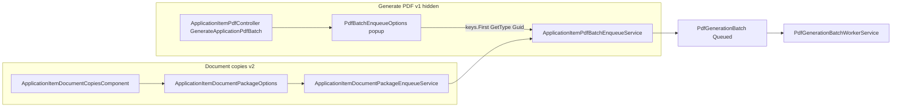
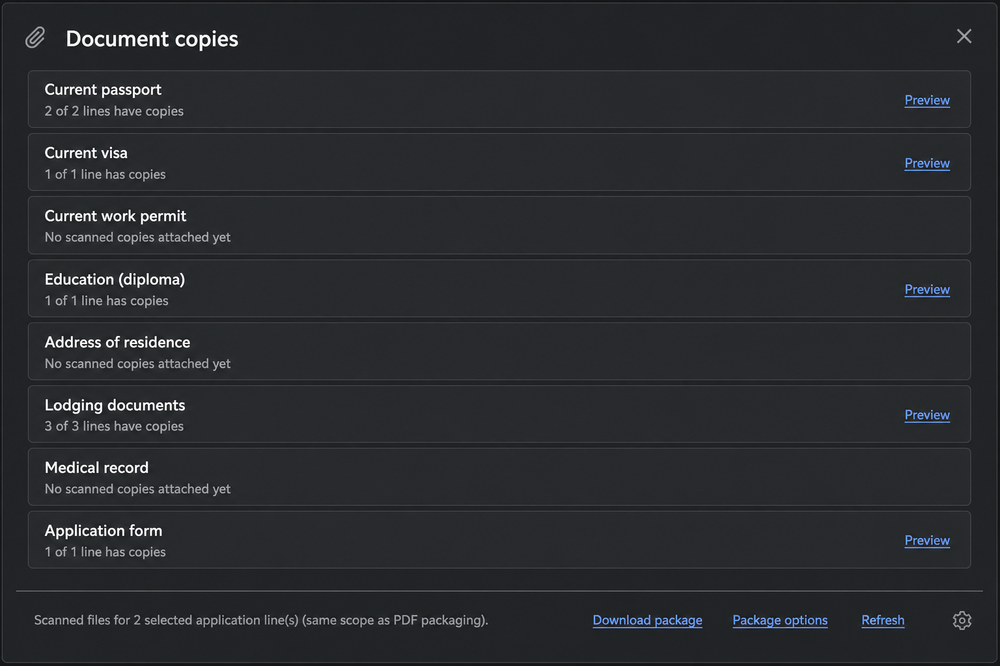
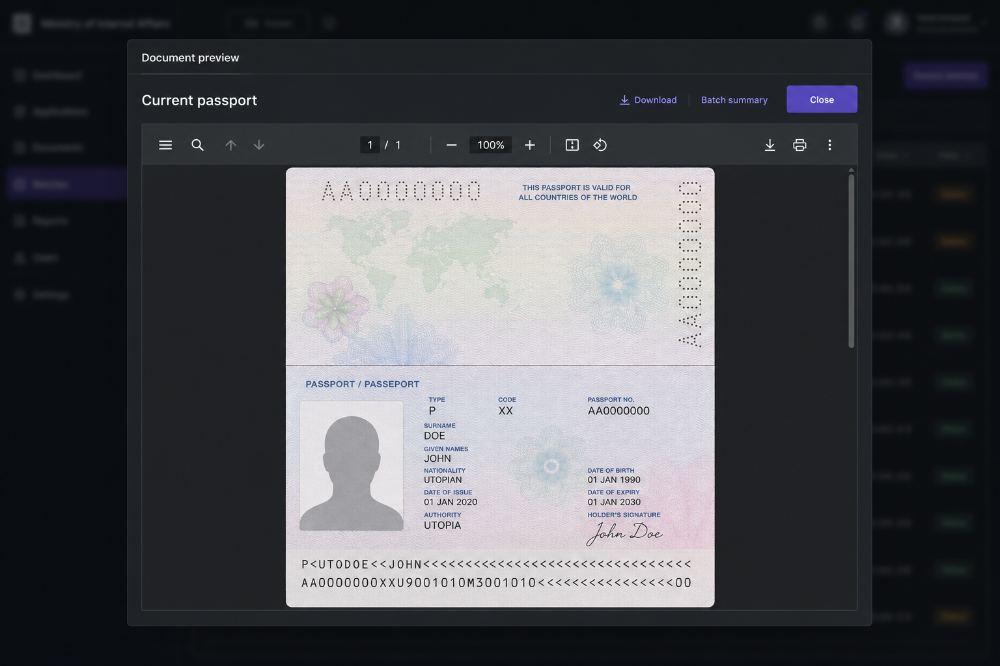
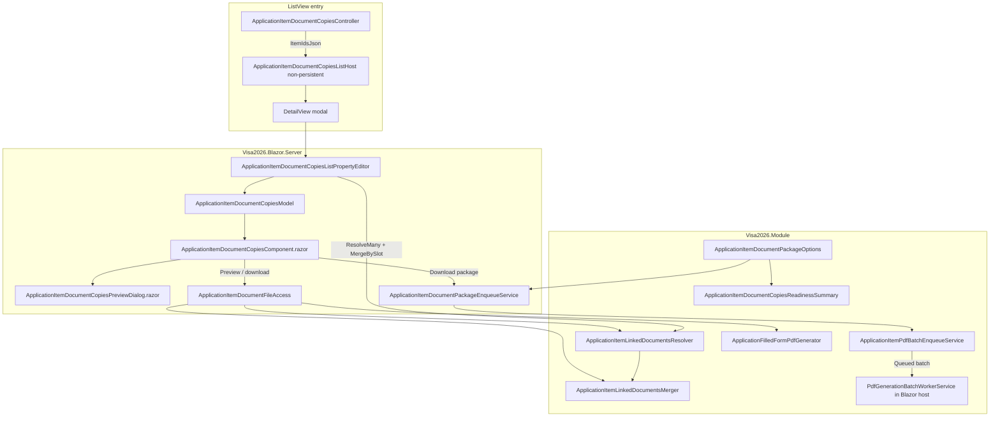

# Application item document copies dialog

**Document copies** is the **improved successor** to the **`ApplicationItem`** ListView **Generate PDF** button. It keeps the same ministry ZIP output (`PdfGenerationBatch` worker, filled application forms, supporting scans, packaging notes) and adds attachment readiness, per-slot preview, clearer package options, and gap confirmation — all in one dialog instead of a separate options popup and jobs list.

This document describes **why** it replaces Generate PDF, **what** officers get in the UI, **how it builds on the PDF batch pipeline**, and **how** it is implemented in Visa2026 (Module domain + Blazor custom editor).

## Why it is needed (improvements over Generate PDF)

**Generate PDF** (v1) queued a background ZIP job but gave officers little visibility before export:

- No in-app view of which passport, visa, diploma, or medical scans were attached per line.
- No preview of merged scans for multi-select without waiting for the full ZIP.
- Options only in a separate XAF popup; progress in **My PDF Jobs** — extra clicks and context switching.

**Document copies** (v2) is the same export capability, **designed as an improved officer workflow**:

| Generate PDF (v1) | Document copies (v2 — improved) |
|-------------------|----------------------------------|
| Queue ZIP from toolbar only | See **readiness per document slot** across selected lines, then queue |
| Options in detached popup | **Package options** in the same dialog (footer); defaults unchanged |
| No pre-flight attachment check | **Gap confirm** when included slots are partial or missing |
| Download results after batch completes | **Preview** (+ download / batch summary in preview) before or while ZIP runs |
| **My PDF Jobs** for progress | **PDF generation** toast (`PdfBatchToastHost`) — same batch API as v1 |
| Application form only in ZIP | Application form row last; preview/download without Spire merge issues |

**Generate PDF** and **My PDF Jobs** are **hidden** on the ListView (`ApplicationItemPdfController`, `Active["HideObsoleteAction"] = false). Officers should use **Document copies**; the batch worker and `PdfGenerationBatch` storage are unchanged underneath.

Related product/layout rules for ZIP contents: [`docs/APPLICATION_DIPLOMA_PACKAGE_PLAN.md`](APPLICATION_DIPLOMA_PACKAGE_PLAN.md).

## Successor to Generate PDF (same ZIP engine, better UX)

Document copies is **not** a second ZIP builder. It is the **evolved entry point** for the **`PdfGenerationBatch`** pipeline that Generate PDF originally exposed. Export semantics stay the same; the dialog adds visibility, preview, and safer queuing on top.

### Design principle

| Layer | Approach |
|-------|----------|
| **ZIP contents & worker** | **Unchanged** — proven ministry package from Generate PDF: `PdfGenerationBatchWorkerService`, `ApplicationSupportingDocumentsPacker`, XFA fill, `PACKAGING_NOTES.txt`, merged PDF summaries |
| **Batch record** | **Same** — `PdfGenerationBatch`, `ZipFile`, `Include*` flags, `RequestedBy`, culture |
| **Enqueue logic** | **Shared / extracted** — `ApplicationItemPdfBatchEnqueueService.TryEnqueuePackage` (Document copies is the primary caller; legacy controller retained in code only) |
| **Options** | **Same flags, better UI** — `ApplicationItemDocumentPackageOptions` mirrors `PdfBatchEnqueueOptions` via `ApplyTo` / `CopyTo(batch)` |
| **ListView** | **Document copies** is the supported action; Generate PDF / My PDF Jobs hidden |

### Officer workflow: v1 → v2

| Former **Generate PDF** / **My PDF Jobs** | **Document copies** (improved) |
|------------------------------------------------------|-------------------------|
| Select lines → **Generate PDF** popup (`PdfBatchEnqueueOptions` DetailView) | **Package options** panel (same include flags, diploma scope, supporting ZIP merge mode, advanced merged-diploma toggle) |
| Accept popup → queue batch | **Download package** (optional **gap confirm** when included slots are partial/empty — uses `ApplicationItemDocumentCopiesReadinessSummary`, respects current include flags only) |
| Success / passport warning toast | Optional passport notice in footer after queue; batch progress in **PDF generation** toast |
| **My PDF Jobs** modal ListView (`PdfGenerationBatch` filtered by user) | **PDF generation** toast only (`PdfBatchToastHost`) — same batch as v1 |
| No attachment overview before queue | **Slot list** + optional **gear** details (readiness per document type) |
| Download filled form / scans only after ZIP completes | **Preview** per scan slot (+ **Download** / **Batch summary** in preview header); **Application form** row downloads filled PDF/ZIP directly (row progress + footer notice, no second modal) |
| — | **Refresh** reloads linked documents from DB |

### Code paths (both enqueue the same worker job)

**Generate PDF path (v1, hidden)** — `ApplicationItemPdfController.GeneratePdfBatchAction_Execute`:

- Still creates `PdfGenerationBatch` directly in-controller **or** could be refactored to call `TryEnqueuePackage` (today it inlines the same steps: passport snapshot, `opts.CopyTo(batch)`, commit).
- Sets `ItemKeyType` from **`keys.First().GetType()`** (correct: **`Guid`**).

**Document copies path (v2, primary)**:

1. `ApplicationItemDocumentCopiesComponent` → `ApplicationItemDocumentPackageEnqueueService.EnqueuePackageAsync`
2. Resolves signed-in user + UI culture from HTTP context
3. `ApplicationItemPdfBatchEnqueueService.TryEnqueuePackage(applicationItemIds, packageOptions, …)`
4. `packageOptions.ApplyTo(PdfBatchEnqueueOptions)` then `CopyTo(batch)` — same batch shape as Generate PDF
5. `visaPdfBatchToast.setCurrentBatchId(batchId)` so **`PdfBatchToastHost`** can track the job (same as Generate PDF).

**Important fix:** Document copies enqueue must store **`typeof(Guid)`** in `ItemKeyType`, not `typeof(ApplicationItem)`. String keys in `ItemKeysJson` are GUIDs; the worker’s `ConvertKey` fails if the type is wrong. `PdfGenerationBatchWorkerService.ResolveKeyType` also treats legacy `ApplicationItem` key type as `Guid` for older queued rows.

## Progress feedback

**Preview** and **package download** use different UI:

### Preview progress (Preview button — same as Resminamalar)

Uses the **same row pattern** as `ApplicationReportPackageComponent` (Resminamalar):

1. **Preview** is replaced by a blue **“Generating {slot}…”** label (`ApplicationReportPackage.Preview.Downloading`).
2. **Indeterminate bar** — shared classes `app-report-package__entry-progress`, `app-report-package__preview-progress-track`, `app-report-package__preview-progress-indeterminate`.
3. **Row outline** — `app-report-package__entry--previewing` while work runs; other Preview buttons disabled.
4. **Minimum visible duration** — 1.5s (same as Resminamalar) so the bar does not flash on fast merges.
5. **Preview modal** — same bar + generating label while merged scan PDF is built (application form does not open this modal).

Preview work is synchronous server-side merge/generation; there is no batch id or percentage.

### Package download progress (PDF toast only)

After **Download package**, batch status and ZIP download use the **global PDF generation toast** (`PdfBatchToastHost`) — the same surface officers had after **Generate PDF**. The dialog only registers the batch via `visaPdfBatchToast.setCurrentBatchId`; it does **not** show an inline footer progress bar.

| Piece | Role |
|-------|------|
| `visaPdfBatchToast.setCurrentBatchId` | Stores the queued batch id in `localStorage` (`_Host.cshtml`) |
| `PdfBatchToastHost.razor` | Fixed toast; polls `GET /api/PdfBatches/my-latest` every 2s |
| `PdfBatchesController` | Status + ZIP download API for the toast |

Optional enqueue notices (e.g. passport snapshot warning) may appear as a short footer hint; progress and **Download ZIP** stay in the toast.

### Improvements added on top of Generate PDF

| Capability | Benefit over v1 |
|------------|-----------------|
| `ApplicationItemLinkedDocumentsResolver` / `Merger` | See every slot and line before export |
| `ApplicationItemDocumentCopyPdfMerger` | Preview merged scans without full ZIP |
| `ApplicationItemDocumentBatchSummaryPdfBuilder` | Batch summary PDFs from preview |
| `ApplicationItemDocumentFileAccess` | Secure preview/download |
| Gap confirm before queue | Informed consent when included slots are incomplete |
| Custom Blazor dialog | One surface: list, options, preview, download; batch progress via toast |

### Deliberate UX changes (not regressions)

- **My PDF Jobs** list → toast for the active job (simpler; history remains in DB).
- **Generate PDF** popup → inline **Package options** in the dialog.
- Per-row download links → **Preview** modal (download / batch summary in header).

### When the packer changes

When you change **`PdfBatchEnqueueOptions`**, **`PdfGenerationBatch`**, or **`ApplicationSupportingDocumentsPacker`**:

1. Update **`ApplicationItemDocumentPackageOptions`** defaults and `ApplyTo`.
2. Update the **Package options** checkboxes/selects in `ApplicationItemDocumentCopiesComponent.razor`.
3. Update **`ApplicationItemDocumentCopiesPackageSlotRules`** if new slots need gap detection.
4. Smoke-test **Download package** — output must match a v1 batch with the same flags.

**Download package** in Document copies is the functional equivalent of **Generate PDF** accept; treat any packer change as affecting both.

## Screenshots

Reference UI (representative layout; replace with a live capture from your environment when preparing release notes):

### Main dialog

Multi-select on **Application items** → **Document copies**. Scan slots appear first; **Application form** is last. Package actions and subtitle sit in the footer.

### Preview modal

**Preview** on a scan slot opens a resizable modal. **Download** and **Batch summary** (multi-line) are in the header. The **Application form** row does not open this modal — **Preview** generates and downloads the filled form immediately.

## User-facing behaviour

### Opening the dialog

1. On an **`Application`** detail view, open the **Application items** nested ListView (or any ListView of `ApplicationItem`).
2. Select one or more lines (or focus a single row).
3. Click **Document copies** (`ViewApplicationItemDocumentCopies`).

The action is enabled only when at least one line is selected.

### Dialog layout (top → bottom)

1. **Document slot list** — scrollable cards with spacing between rows (`gap` on `.app-item-doc-copies__groups`).
   - Scan slots from linked documents (passport, visa, work permit, education, address, lodging, medical record, family relationship, …) in resolver/merger order.
   - **Application form** is always **last** (after medical record and other slots).
   - Each row with files shows **Preview** only (no row-level Download / Batch summary — those live in the preview header).
2. **Package options panel** (optional) — expands above the footer when **Package options** is toggled.
3. **Footer**
   - Subtitle: *Scanned files for N selected application line(s) (same scope as PDF packaging).*
   - **Download package** | **Package options** | **Refresh**
   - Status / gap-confirm hints when queuing or after errors
   - **Gear** — toggles per-file detail rows (file names, sizes, missing-line breakdown)

### Preview modal

- **Scan slots:** merged PDF in an iframe; header offers **Download** and **Batch summary** (when 2+ lines and merge options allow).
- **Application form:** **Preview** on the main dialog row shows generating progress, then triggers browser download (single PDF or `PDF_Form/` ZIP for multiple lines). A short notice may appear in the footer. Uses raw `FillForm` output per line — **no Spire merge** (see `ApplicationFilledFormPdfGenerator`). No preview popup.

### Download package (replaces Generate PDF accept)

This is the **improved export action** — same ZIP as v1 **Generate PDF**, with extra safeguards:

1. Optional **gap confirm** when included slots have missing or partial attachments (`ApplicationItemDocumentCopiesReadinessSummary` + current package options).
2. Creates **`PdfGenerationBatch`** via `ApplicationItemPdfBatchEnqueueService.TryEnqueuePackage` (shared enqueue service; **`Guid`** item keys).
3. Registers the batch on `visaPdfBatchToast` so the **PDF generation toast** tracks the job (see [Progress feedback](#progress-feedback)).

Default package options mirror `PdfBatchEnqueueOptions` / full supporting-document ZIP defaults (`ApplicationItemDocumentPackageOptions.CreateDefaults()`).

## Architecture

### XAF integration pattern

Visa2026 uses the standard **non-persistent host + custom Blazor property editor** approach:

| Piece | Role |
|-------|------|
| `ApplicationItemDocumentCopiesController` | ListView `SimpleAction`; serializes selected `ApplicationItem` GUIDs into `ItemIdsJson`; opens modal `DetailView`. |
| `ApplicationItemDocumentCopiesListHost` | `[DomainComponent]` shell; `ListUi` property with `[EditorAlias(ApplicationItemDocumentCopiesEditorAliases.ListPanel)]`. |
| `ApplicationItemDocumentCopiesListPropertyEditor` | Loads items, calls resolver + merger, binds `ApplicationItemDocumentCopiesModel`. |
| `ApplicationItemDocumentCopiesComponent.razor` | Custom UI (not generated XAF layout beyond the single `ListUi` editor). |
| `Model.DesignedDiffs.xafml` | `ApplicationItemDocumentCopiesListHost_DetailView` with `CustomCSSClassName="app-item-doc-copies-list-detail"` for full-height modal layout. |

The `ListUi` string property is a placeholder type for the property editor; the real UI is entirely in the Razor component.

## Document slots

Slots are identified by stable **`SlotKey`** strings from `ApplicationItemLinkedDocumentsResolver` (e.g. `Passport.Current`, `MedicalRecord.Current`, `Education.Current`). Labels come from `ApplicationItemDocumentCopiesSlotLocalization` → `VisaUiMessages` keys under `ApplicationItemDocumentCopies.Slot.*`.

`ApplicationItemLinkedDocumentsMerger.MergeBySlot`:

- Aggregates files across selected lines per slot.
- Preserves first-seen slot order across lines.
- Tracks **missing lines** (link missing or no files) for partial summaries.

Package **include** flags map slots to options in `ApplicationItemDocumentCopiesPackageSlotRules` (used for gap detection before enqueue).

## Module services (`Visa2026.Module`)

| File | Responsibility |
|------|----------------|
| `Services/ApplicationItemLinkedDocuments/ApplicationItemLinkedDocumentsResolver.cs` | Per-line snapshot: linked BO + `FileData` attachments per slot. |
| `Services/ApplicationItemLinkedDocuments/ApplicationItemLinkedDocumentsMerger.cs` | Multi-line merge by `SlotKey`. |
| `Services/ApplicationItemLinkedDocuments/ApplicationItemDocumentCopyPdfMerger.cs` | Build merged preview PDF for a slot (PdfSharpCore slices; image fallbacks). |
| `Services/ApplicationItemLinkedDocuments/ApplicationItemDocumentBatchSummaryPdfBuilder.cs` | Batch summary PDFs (passport/visa/work permit/diploma merges) for preview download. |
| `Services/ApplicationItemLinkedDocuments/ApplicationItemDocumentBatchSummaryKindMapping.cs` | Maps slot + options → summary kind. |
| `Services/ApplicationItemLinkedDocuments/ApplicationItemDocumentCopiesReadinessSummary.cs` | Ready / partial / gap counts for confirm-before-download. |
| `Services/ApplicationItemLinkedDocuments/ApplicationItemDocumentCopiesPackageSlotRules.cs` | Which merged groups count for gap checks given include flags. |
| `Services/ApplicationItemDocumentPackageOptions.cs` | Document copies option model; `ApplyTo(PdfBatchEnqueueOptions)`. |
| `Services/ApplicationItemPdfBatchEnqueueService.cs` | Creates `PdfGenerationBatch` (shared with legacy controller). |
| `Services/ApplicationFilledFormPdfGenerator.cs` | Filled XFA form: one PDF or multi-file ZIP without Spire merge. |
| `Controllers/ApplicationItemDocumentCopiesController.cs` | Opens dialog from ListView. |
| `BusinessObjects/ApplicationItemDocumentCopiesListHost.cs` | Non-persistent host BO. |
| `Editors/ApplicationItemDocumentCopiesEditorAliases.cs` | `ListPanel` editor alias constant. |
| `Localization/ApplicationItemDocumentCopiesSlotLocalization.cs` | Slot key → message key. |

Domain rules for **which links appear** follow the same eligibility ideas as the ZIP packer (item-level `Current*` / `Previous*` set, employee vs family member, etc.) — see §1.2–§1.3 in [`APPLICATION_DIPLOMA_PACKAGE_PLAN.md`](APPLICATION_DIPLOMA_PACKAGE_PLAN.md).

## Blazor host (`Visa2026.Blazor.Server`)

| File | Responsibility |
|------|----------------|
| `Editors/ApplicationItemDocumentCopiesListPropertyEditor.cs` | XAF property editor; refresh reloads resolver data. |
| `Editors/ApplicationItemDocumentCopiesModel.cs` | `ComponentModel` for Blazor binding. |
| `Editors/ApplicationItemDocumentCopiesComponent.razor` | Main dialog UI; registers batch for PDF toast on package download. |
| `Editors/ApplicationItemDocumentCopiesPreviewDialog.razor` | Preview popup, download, batch summary. |
| `Services/ApplicationItemDocumentFileAccess.cs` | Secure file/merge/form access for preview and download. |
| `Services/ApplicationItemDocumentPackageEnqueueService.cs` | HTTP user + culture → batch enqueue. |
| `Services/DocumentCopyPreviewFormats.cs` | Content-type helpers for preview. |
| `Services/PdfGenerationBatchWorkerService.cs` | Background ZIP build (unchanged; shared pipeline). |
| `wwwroot/css/site.css` | `.app-item-doc-copies*` layout, modal fill, group spacing. |
| `Startup.cs` | DI: `ApplicationItemDocumentCopyPdfMerger`, `ApplicationItemDocumentBatchSummaryPdfBuilder`, `ApplicationItemDocumentFileAccess`, `ApplicationItemDocumentPackageEnqueueService`, `ApplicationItemPdfBatchEnqueueService`. |

Preview uses JS helper `visaDocumentCopyPreview.createPdfBlobUrl` for iframe blob URLs.

## Localization

- UI strings: `tools/GenerateModelLocalization/UiStrings.messages.json` → prefix `ApplicationItemDocumentCopies.*`
- Regenerate: `dotnet run --project tools/GenerateModelLocalization/GenerateModelLocalization.csproj`
- Action caption / view caption: `Model.DesignedDiffs.xafml` and locale `Model.*.xafml` files (`ViewApplicationItemDocumentCopies`, `ApplicationItemDocumentCopiesListHost_DetailView`).

## Security

- `ApplicationItemDocumentCopiesListHost` is exported in `Module.cs` and granted to the standard user role in `DatabaseUpdate/Updater.cs` (read/use for the modal).
- File reads for preview/download use `INonSecuredObjectSpaceFactory` but **`ApplicationItemDocumentFileAccess`** verifies each `FileData` id belongs to the resolved snapshot for the requested `ApplicationItem` (no arbitrary file id download).
- Package enqueue requires a signed-in user name (`ApplicationItemDocumentPackageEnqueueService`).

## Maintenance notes

- **Keep ZIP parity:** changes to `PdfBatchEnqueueOptions`, `ApplicationSupportingDocumentsPacker`, or worker flags should be reflected in `ApplicationItemDocumentPackageOptions` and the Document copies options UI.
- **Enqueue keys:** `ItemKeyType` on new batches must remain **`Guid`** (stringified in `ItemKeysJson`). Storing `typeof(ApplicationItem)` breaks the worker (`ConvertKey` invalid cast).
- **Preview vs ZIP merge:** application form preview intentionally avoids Spire `MergePdfs`; the batch worker still writes one filled PDF per line under `PDF_Form/` in the ZIP.
- **Legacy UI:** **Document copies** supersedes Generate PDF / My PDF Jobs; do not re-enable toolbar actions without product decision.

## Related code (quick links)

- Generate PDF v1 (hidden): `Visa2026.Module/Controllers/ApplicationItemPdfController.cs`
- ZIP worker: `Visa2026.Blazor.Server/Services/PdfGenerationBatchWorkerService.cs`
- Supporting packer: `Visa2026.Module/Services/ApplicationSupportingDocumentsPacker.cs`
