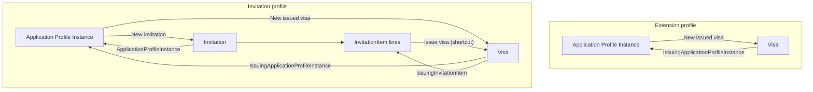
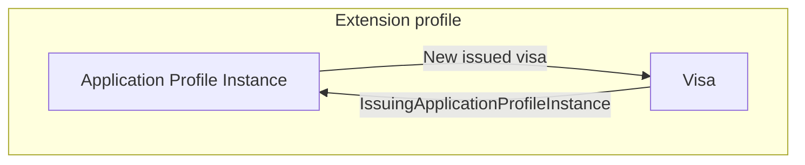
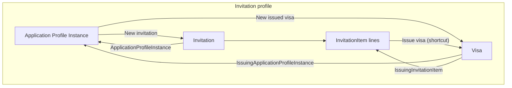
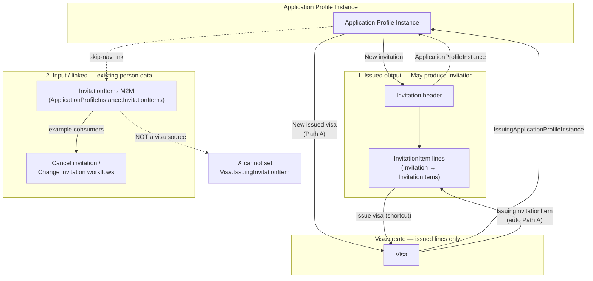
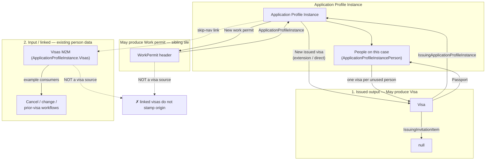

# Application Profile — issued visa origin

Canonical mental model for **where officers create issued visas** and **which FKs are authoritative** after the Application Profile Instance cutover.

**Related:** [APPLICATION_PROFILE_PLAN.md](./APPLICATION_PROFILE_PLAN.md) §10.1 decision 11 · [Issued work permit origin](./APPLICATION_PROFILE_ISSUED_WORK_PERMIT_ORIGIN.md) · Agent skill [visa2026-application-profile](../.cursor/skills/visa2026-application-profile/SKILL.md).

---

## Summary (humans)

| Concept | Property | Required on officer create? |
|---------|----------|----------------------------|
| **Case origin** — which application case authorized this visa | `Visa.IssuingApplicationProfileInstance` | **Yes** |
| **Invitation consumption** — which invitation line on the letter was used | `Visa.IssuingInvitationItem` | Optional (invitation-based flows only) |
| **Stamp target** — passport the visa is on | `Visa.Passport` | Yes (required field) |

**Always blocked:** Passport → Visas → **New** (no issuing case FK).

**Two profile families:**

1. **Extension / direct visa** — instance is the direct business source; `IssuingInvitationItem` stays null.
2. **Invitation-based** — business source is the invitation letter; case origin is still the **same instance that produced the invitation**; `IssuingInvitationItem` identifies the issued person line consumed (not input M2M).

---

## Diagrams (Mermaid)

Editable sources: [`docs/diagrams/issued-visa-origin/`](./diagrams/issued-visa-origin/) (`.mmd` files — see [README](./diagrams/issued-visa-origin/README.md)).

### Combined mental model (overview)



Source: [`mental-model-combined.mmd`](./diagrams/issued-visa-origin/mental-model-combined.mmd)

### Extension profile (e.g. `App_Visa_Ext`, `App_Visa_and_WP_Ext`)

Direct source = **Application Profile Instance**. No invitation consumption link.



Source: [`extension-profile.mmd`](./diagrams/issued-visa-origin/extension-profile.mmd)

### Invitation profile (e.g. `App_Inv`, `App_Inv_And_WP`)

Business source = **invitation letter** (via `IssuingInvitationItem` → issued line). Case origin = instance that issued the invitation.



Source: [`invitation-profile.mmd`](./diagrams/issued-visa-origin/invitation-profile.mmd)

### Issued vs input InvitationItem (visa source)

Only **issued output** lines (`Invitation.ApplicationProfileInstance` → `InvitationItems`) may set `Visa.IssuingInvitationItem`. Input/linked M2M items on the instance are for cancel/change workflows — not visa issuing.



Source: [`invitation-item-issued-vs-input.mmd`](./diagrams/issued-visa-origin/invitation-item-issued-vs-input.mmd)

### Roster vs linked Visa (extension / direct source)

Only **people on this case** (`ApplicationProfileInstancePerson`) may receive a new issued visa. Input/linked M2M `ApplicationProfileInstance.Visas` is for cancel/change / prior-visa workflows — not issuing. A **Work permit** tile (when May produce WP) is a sibling issued output, not a visa source and not a card group. `IssuingInvitationItem` stays **null**.



Source: [`instance-roster-issued-vs-input.mmd`](./diagrams/issued-visa-origin/instance-roster-issued-vs-input.mmd)

**Officer entry points (extension / direct profile):**

| Entry | When to use |
|-------|-------------|
| Instance → **Issued records → New issued visa** | Profile **May produce → Visa** and **not** Invitation; one card per unused roster person |
| Work permit compose | Independent sibling when **May produce → Work permit**; does not feed visa cards |

**Officer entry points (invitation profile):**

| Entry | When to use |
|-------|-------------|
| Instance → **Issued records → New issued visa** | General path when **May produce → Visa** is on; Path A matcher may auto-pick an unused issued `InvitationItem` → `IssuingInvitationItem` when profile also produces invitation |
| **InvitationItem → Issue visa** | When **May produce → Invitation** is on (invitation-item-centric); pre-fills instance + `IssuingInvitationItem` + passport |

Both paths stamp the same FKs. The shortcut does not change the data model.

---

## Machine-readable spec (YAML)

Agents, migration, and validation logic should treat this block as the source of truth for issued-visa origin (officer UI + import Path B).

```yaml
# docs/APPLICATION_PROFILE_ISSUED_VISA_ORIGIN.md — issued visa origin
issued_visa_origin:
  version: 1
  updated: 2026-08-26

  diagram_sources:
    directory: docs/diagrams/issued-visa-origin/
    combined_overview: docs/diagrams/issued-visa-origin/mental-model-combined.mmd
    extension_profile: docs/diagrams/issued-visa-origin/extension-profile.mmd
    invitation_profile: docs/diagrams/issued-visa-origin/invitation-profile.mmd
    invitation_item_issued_vs_input: docs/diagrams/issued-visa-origin/invitation-item-issued-vs-input.mmd
    instance_roster_issued_vs_input: docs/diagrams/issued-visa-origin/instance-roster-issued-vs-input.mmd
    canonical_doc: docs/APPLICATION_PROFILE_ISSUED_VISA_ORIGIN.md

  authoritative:
    case_fk:
      type: Visa.IssuingApplicationProfileInstance
      inverse: ApplicationProfileInstance.IssuedVisas
      officer_required: true
      import_path: Visa2014VisaIssuingApplicationProfileInstanceIndex  # Path B

  optional:
    invitation_consumption_fk:
      type: Visa.IssuingInvitationItem
      inverse: InvitationItem.IssuedVisa
      officer_required: false
      when: profile.produce_invitation == true
      uniqueness: one visa per IssuingInvitationItem  # Visa_IssuingInvitationItemSingleUse
      is_used_semantics: InvitationItem.IsUsed  # visa consumption only; not output-line roster

  stamp_target:
    passport_fk: Visa.Passport
    person_rule: Passport.Person must be on issuing instance roster

  blocked_officer_create:
    - path: Passport.Visas.New
      reason: missing IssuingApplicationProfileInstance
    - path: root Visa list New  # if exposed; prefer instance Issued records

  profile_families:
    extension:
      produce_invitation: false
      produce_visa: true
      invitation_item: null
      instance_single_visa: false  # one visa per unused roster person when IssuingInvitationItem is null (officer prototypes 2026-08-26)
      example_profile_codes:
        - visa_ext
        - extend_visa_wp
      create_entry_points:
        - ApplicationProfileInstance.IssuedRecords.NewIssuedVisa
        - ApplicationProfileInstance.DetailView.IssuedVisas.New

    invitation:
      produce_invitation: true
      produce_visa: false  # May produce tab; visa stamped after invitation
      invitation_item: required_for_consumption
      instance_single_visa: false  # one visa per IssuingInvitationItem; same IssuingApplicationProfileInstance allowed
      example_profile_codes:
        - get_invitation
        - get_invitation_wp
      create_entry_points:
        - ApplicationProfileInstance.IssuedRecords.NewIssuedVisa
        - ApplicationProfileInstance.DetailView.IssuedVisas.New
        - InvitationItem.IssueVisa  # shortcut; same FKs as instance path

  path_a_matcher:
    service: VisaIssuingLinkPathAMatcher.TryApplyOnce
    runs_when:
      - new officer Visa
      - IssuingApplicationProfileInstance already set
      - IssuingInvitationItem not pre-set
    does_not: guess IssuingApplicationProfileInstance from passport roster

  path_b_import:
    service: Visa2014VisaODataImporter
    backfill: IssuingApplicationProfileInstance
    correction_cli: --correct-visa2014-issuing-application-profile-instance
    exempt: MigrationImportContext  # officer origin policy skipped

  implementation:
    policy: VisaIssuingOriginPolicy
    block_passport_nested: PassportVisasNestedCreateBlockController
    invitation_item_shortcut: VisaFromInvitationItemHelper
    defaults_on_open: VisaDefaultsController
```

---

## UI entry points (officer)

| Action | Location | Sets |
|--------|----------|------|
| **New issued visa** | Application Profile Instance → Issued records (workspace or DetailView **Issued visas**) | `IssuingApplicationProfileInstance`; optional `IssuingInvitationItem` via Path A |
| **Issue visa** | `InvitationItem` ListView / DetailView (unused line) | `IssuingApplicationProfileInstance`, `IssuingInvitationItem`, `Passport` |
| ~~New visa~~ | Passport → Visas nested list | **Blocked** |

---

## Validation rules (save)

| Rule | Extension profile | Invitation profile |
|------|-------------------|-------------------|
| `Visa_IssuingApplicationProfileInstanceRequired` | Yes | Yes |
| `Visa_IssuingApplicationProfileInstanceSingleUse` | One visa per person on the case (no `IssuingInvitationItem`) | Skipped when `IssuingInvitationItem` set or `ProduceInvitation` |
| `Visa_IssuingInvitationItemSingleUse` | N/A | One visa per line |
| `Visa_InvitationOnlyWhenCanIssueInvitation` | N/A | `IssuingInvitationItem` only when profile can issue invitation |
| `Visa_IssuingChronologyValid` | Issue date after instance date | Also after invitation issued date |

---

## Code map

| Area | Path |
|------|------|
| Origin policy | `Visa2026.Module/Services/VisaIssuingOriginPolicy.cs` |
| Path A matcher | `Visa2026.Module/Services/VisaIssuingLinkPathAMatcher.cs` |
| Invitation-item shortcut | `Visa2026.Module/Services/VisaFromInvitationItemHelper.cs` |
| Issue visa action | `Visa2026.Module/Controllers/InvitationItemIssueVisaController.cs` |
| Block Passport nested New | `Visa2026.Module/Controllers/PassportVisasNestedCreateBlockController.cs` |
| Instance nested New | `Visa2026.Module/Controllers/IssuedHeaderNestedCreateController.cs` |
| Workspace create | `Visa2026.Module/Services/ApplicationWorkspace/ApplicationWorkspaceIssuedHeaderOpenHelper.cs` |
| Issued visa compose | `Visa2026.Module/Services/PreviewSlot/IssueIssuedVisaComposeService.cs` |
| Import Path B | `Visa2026.DataImporter/legacy/visa2014/Visa2014VisaIssuingApplicationProfileInstanceIndex.cs` |

---

## Import note

Officer create rules are gated by `MigrationImportContext.IsDataImport`. Legacy rows backfill `IssuingApplicationProfileInstance` via OData / correction CLI; they do not use officer entry points or Path A matcher.
