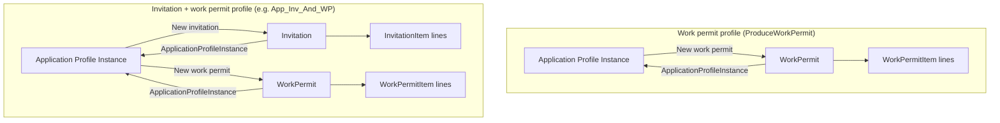
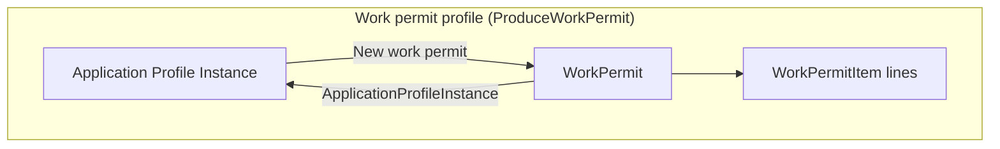
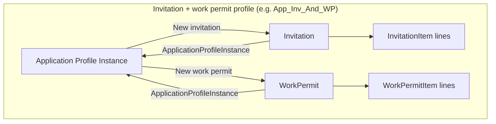

# Application Profile — issued work permit origin

Canonical mental model for **where officers create issued work permits** and **which FKs are authoritative**. Mirrors [`APPLICATION_PROFILE_ISSUED_VISA_ORIGIN.md`](./APPLICATION_PROFILE_ISSUED_VISA_ORIGIN.md). Invitation header origin: application-profile learnings (2026-08-22 issued invitation slice).

**Status:** Diagram + YAML locked · Module enforcement **shipped** (2026-08-22).

**Related:** [APPLICATION_PROFILE_PLAN.md](./APPLICATION_PROFILE_PLAN.md) §10.1 decision 11 · [Issued visa origin](./APPLICATION_PROFILE_ISSUED_VISA_ORIGIN.md) · Agent skill [visa2026-application-profile](../.cursor/skills/visa2026-application-profile/SKILL.md).

---

## Summary (humans)

| Concept | Property | Required on officer create? |
|---------|----------|------------------------------|
| **Case origin** — which application case authorized this work permit letter | `WorkPermit.ApplicationProfileInstance` | **Yes** |
| **Output lines** — people on the issued ministry letter | `WorkPermit.WorkPermitItems[]` | Auto per roster person when issued from instance (planned helper) |
| **Input predecessor lines** | `WorkPermitItem.ApplicationProfileInstances` M2M | Only when profile `RequirePersonWorkPermitItem`; **not** the issued-header path |

**Blocked:** root **Work Permit** list **New** (`WorkPermitStandaloneCreateBlockController`).

**Distinct from visa:** there is no “consume a work permit item to issue another header” link. `WorkPermitItem` on an **issued** header is an **output line**, not visa-style consumption (`InvitationItem.IsUsed`).

---

## Diagrams (Mermaid)

Editable sources: [`docs/diagrams/issued-work-permit-origin/`](./diagrams/issued-work-permit-origin/) (`.mmd` files — see [README](./diagrams/issued-work-permit-origin/README.md)).

### Combined mental model (overview)



Source: [`mental-model-combined.mmd`](./diagrams/issued-work-permit-origin/mental-model-combined.mmd)

### Work permit profile (`ProduceWorkPermit`)

Direct source = **Application Profile Instance**. Output lines on the letter = `WorkPermitItem` children.



Source: [`work-permit-direct.mmd`](./diagrams/issued-work-permit-origin/work-permit-direct.mmd)

Examples: `extend_visa_wp` (`App_Visa_and_WP_Ext`), WP-only issuance types.

### Invitation + work permit profile (`App_Inv_And_WP`)

Same case may issue **both** headers in parallel. No FK between Invitation and WorkPermit headers.



Source: [`invitation-and-work-permit.mmd`](./diagrams/issued-work-permit-origin/invitation-and-work-permit.mmd)

Example: `get_invitation_wp` — **May produce** Invitation + Work permit; visa stamped later via [issued visa origin](./APPLICATION_PROFILE_ISSUED_VISA_ORIGIN.md) (separate step).

**Officer entry points:**

| Entry | Sets |
|-------|------|
| Instance → **Issued records → New work permit** | `WorkPermit.ApplicationProfileInstance`; roster `WorkPermitItem` lines |
| Instance DetailView → **Work permits** nested **New** | Same |

---

## Machine-readable spec (YAML)

```yaml
# docs/APPLICATION_PROFILE_ISSUED_WORK_PERMIT_ORIGIN.md — issued work permit origin
issued_work_permit_origin:
  version: 1
  updated: 2026-08-22
  implementation_status: shipped

  diagram_sources:
    directory: docs/diagrams/issued-work-permit-origin/
    combined_overview: docs/diagrams/issued-work-permit-origin/mental-model-combined.mmd
    work_permit_direct: docs/diagrams/issued-work-permit-origin/work-permit-direct.mmd
    invitation_and_work_permit: docs/diagrams/issued-work-permit-origin/invitation-and-work-permit.mmd
    canonical_doc: docs/APPLICATION_PROFILE_ISSUED_WORK_PERMIT_ORIGIN.md
    related_visa_origin: docs/APPLICATION_PROFILE_ISSUED_VISA_ORIGIN.md

  authoritative:
    case_fk:
      type: WorkPermit.ApplicationProfileInstance
      inverse: ApplicationProfileInstance.WorkPermits
      officer_required: true
      note: same property name as Invitation header; not Visa.IssuingApplicationProfileInstance

  output_lines:
    collection: WorkPermit.WorkPermitItems
    type: WorkPermitItem
    helper: WorkPermitIssuedRosterItemsHelper
    roster_filter: employees only
    not_input_m2m: WorkPermitItem.ApplicationProfileInstances

  input_predecessor:
    type: WorkPermitItem.ApplicationProfileInstances
    when: profile.require_person_work_permit_item == true
    not_issued_header_path: true

  blocked_officer_create:
    - path: root WorkPermit list New
      controller: WorkPermitStandaloneCreateBlockController
      reason: missing ApplicationProfileInstance at create

  profile_families:
    work_permit_direct:
      produce_work_permit: true
      produce_invitation: false
      example_profile_codes:
        - extend_visa_wp
      create_entry_points:
        - ApplicationProfileInstance.IssuedRecords.NewWorkPermit
        - ApplicationProfileInstance.DetailView.WorkPermits.New

    invitation_and_work_permit:
      produce_work_permit: true
      produce_invitation: true
      example_profile_codes:
        - get_invitation_wp
      create_entry_points:
        - ApplicationProfileInstance.IssuedRecords.NewWorkPermit
        - ApplicationProfileInstance.IssuedRecords.NewInvitation
      parallel_headers: true
      no_cross_header_fk: true

  import:
    existing: WorkPermit.yaml maps ApplicationProfileInstance
    backfill: Visa2014WorkPermitODataImporter
    exempt: MigrationImportContext

  implementation:
    policy: WorkPermitIssuingOriginPolicy
    block_root_new: WorkPermitStandaloneCreateBlockController
    roster_helper: WorkPermitIssuedRosterItemsHelper
    nested_create: IssuedHeaderNestedCreateController
    workspace_create: ApplicationWorkspaceIssuedHeaderOpenHelper
    work_permit_bo: Visa2026.Module/BusinessObjects/WorkPermit.cs
    work_permit_item_appearance: WorkPermitItem_InputApplicationProfileInstancesHiddenWhenIssued
```

---

## Comparison to issued visa / invitation

| | Work permit header | Invitation header | Issued visa |
|--|-------------------|-------------------|-------------|
| Case FK | `WorkPermit.ApplicationProfileInstance` | `Invitation.ApplicationProfileInstance` | `Visa.IssuingApplicationProfileInstance` |
| Output lines | `WorkPermitItem` (on letter) | `InvitationItem` (on letter) | — |
| Consumption FK | — | `Visa.IssuingInvitationItem` (visa only) | — |
| Item-centric create shortcut | — (not planned) | — | `InvitationItem.IssueVisa` |

---

## Code map

| Area | Path |
|------|------|
| Header FK + validation | `Visa2026.Module/BusinessObjects/WorkPermit.cs` |
| Origin policy | `Visa2026.Module/Services/WorkPermitIssuingOriginPolicy.cs` |
| Roster output lines | `Visa2026.Module/Services/WorkPermitIssuedRosterItemsHelper.cs` |
| Block root New | `Visa2026.Module/Controllers/WorkPermitStandaloneCreateBlockController.cs` |
| Nested New + workspace | `IssuedHeaderNestedCreateController.cs`, `ApplicationWorkspaceIssuedHeaderOpenHelper.cs` |
| Hide input M2M on items | `WorkPermitItem.cs` Appearance |
| Import | `Visa2014WorkPermitODataImporter.cs` |

---

## Import note

Officer create rules will be gated by `MigrationImportContext.IsDataImport` (same pattern as visa/invitation). Legacy rows use OData / field-map `ApplicationProfileInstance`; no officer entry points on import.
