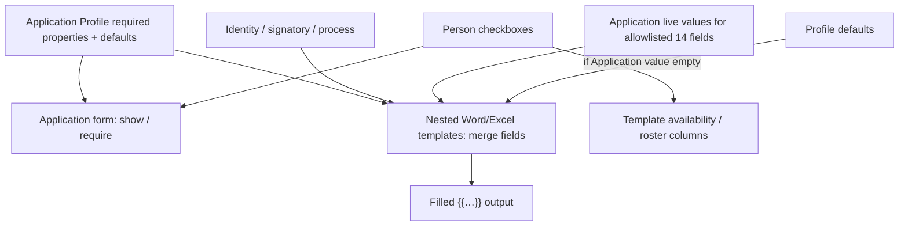
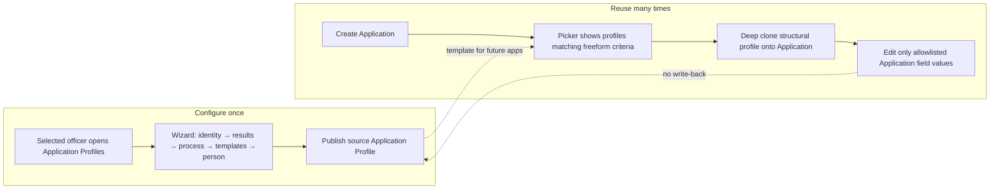

# Application Profile — configuration & clone model (plan)

**Status:** Decisions locked (see §2) · UX prototyping in progress · no domain implementation yet  
**Prototypes:**
- Wizard: [`docs/prototypes/application-profile-wizard.html`](prototypes/application-profile-wizard.html)
- Usage storyboard: [`docs/prototypes/application-profile-usage.html`](prototypes/application-profile-usage.html)
- Storyboard images: [`docs/prototypes/images/`](prototypes/images/)
**Input draft:** [`docs/prototypes/Application-profile-wizard-draft.xlsx`](prototypes/Application-profile-wizard-draft.xlsx)  
**Related today:** `ApplicationType`, `Application`, `ApplicationItem`, `ApplicationProgress`, `ApprovalLegProfile`, `UserReportTemplate`, `ProjectContract`

---

## 1. Problem

Application-type behavior is **scattered**:

| Concern | Where it lives today |
|--------|----------------------|
| UI visibility / required fields | Dozens of `Show*` flags on `ApplicationType` + `[Appearance]` on `Application` / `ApplicationItem` |
| Issue capabilities | `CanIssueVisa` / `CanIssueInvitation` / `CanIssueWorkPermit` (+ catalog JSON) |
| Progress route / ministry depth | `ApplicationProgressRoute`, `MinistryReviewDepth` on type; legs on `ApprovalLegProfile` / `ProjectContract` |
| Defaults (visa type/period/…) | Hard-coded in `Application.cs` by type `Name` |
| Report applicability | `UserReportTemplate` links to types / type groups / project contracts |
| SLA | `ApplicationMigrationSlaProfile` (+ duration fields) |
| Selection UX | `SelectionCode` + quick code (see `APPLICATION_BO_TYPE_SELECTION_REFACTOR.md`) |

Creating or tweaking a “new kind of application” requires editing lookup flags, seed JSON, Appearance criteria, and often C# defaults — poor officer UX and hard to reuse.

---

## 2. Locked decisions

| # | Topic | Decision |
|---|--------|----------|
| 1 | Clone on Application create | **Always deep-clone.** No live link to the source profile. |
| 2 | Re-sync from source | **Not supported.** Divergence is permanent. Source edits affect **future** Applications only. Lineage FK (`SourceProfileId`) is informational. |
| 3 | Clone storage | **Full owned BO graph in XAF** (see §3). Not a JSON blob. |
| 4 | Scope / applicability | **Freeform criteria** (XAF criteria against Application context) filters which source profiles appear in the picker. |
| 5 | “Related to” (action family) | **Exclusive radio:** Issuance \| Cancellation \| Registration \| Business trip. |
| 6 | Approval legs | **Embedded** on the profile (ordered ministry legs). Do not reference `ApprovalLegProfile` as the owner. |
| 7 | Process states | **Freely enable** ministry / migration state checklists from Excel (profile defines allowed states + SLA-track flags). Transition rules derived from enabled set (replace hard-coded route tables over time). |
| 8 | Templates | **Nest files inside the profile** (name, type, `FileData`). Profile is the store for that template set — not association-only to `UserReportTemplate`. |
| 9 | Person data (v1) | **Four checkboxes only:** Passport, Education, Position, Local address of residence. Full `ShowCurrent*` matrix is a later phase. |
| 10 | Who configures | **Selected officers** (permissioned), not Administrators-only. |
| 11 | Config UX (v1) | **Wizard** (as prototyped), not a single long DetailView. |
| 12 | Required properties dual use | Each checked **Application property required** is both **(a)** shown/required on the Application form and **(b)** a **merge field** for nested Word/Excel templates on that profile. Same list, two jobs. |
| 13 | Defaults in template fill | When merging Word/Excel, if the Application value is empty, **use the profile default** for that property. |
| 14 | Automatic placeholders | Beyond the required-properties list, **identity / signatory / process** fields (name, description, code, route, SLA, signatory, representative, enabled states summary, etc.) are **always** available as merge placeholders. |
| 15 | Person checkboxes → templates | Person requirements also **drive template availability** (e.g. which person-roster columns / item-level placeholders are in play), not form/readiness only. |
| 16 | Placeholder naming | Keep today’s **`{{…}}`** conventions (existing map / Word–Excel pipeline). |
| 17 | Clone divergence allowlist | Officers may change **only** the allowlisted Application field values on the Application (see §2.1). Structural profile config (route, action family, produce/cancel, legs, states, nested template files, person requirement flags, which properties are required) is **frozen** on the clone — not reconfigured per Application. |

### 2.1 Clone-editable Application properties (allowlist)

These are the only Application-side values officers may set/override after clone (and that participate in the dual form + merge property list). Source profile still defines which are required and their defaults; the Application holds the live values.

| # | Property |
|---|----------|
| 1 | Visa Type |
| 2 | Visa Category |
| 3 | Visa Period |
| 4 | Border Zone |
| 5 | Migration Service |
| 6 | Start Date |
| 7 | End Date |
| 8 | Region (City) |
| 9 | Business Trip Address |
| 10 | Project |
| 11 | Urgency |
| 12 | Work Permit Location |
| 13 | Entry Date |
| 14 | Entry Check Point |

**Not clone-reconfigurable (examples):** action family, route, produce/cancel sets, embedded legs, process state checklists, nested template file set, person requirement checkboxes, applicability criteria, profile identity (name/code of the *source* template).

### Still open (narrow)

| # | Topic | Notes |
|---|--------|------|
| A | Naming in UI | Confirm officers never see “Application type” after cutover; interim dual labels OK? |
| B | Temporary visitor | Real audience for v1, or seed later? |
| C | Scope criteria target | Criteria against `Application` only, or also ProjectContract / person context at pick time? |
| D | Cancel-existing “Application(s)” | Excel showed radio for that one row — treat all cancel targets as checkboxes? |
| E | Field placement | Which of the 14 live on Application header vs ApplicationItem (e.g. entry date / checkpoint)? |
| F | SLA integers | Raw ministry/migration days on profile replace `ApplicationMigrationSlaProfile` tiers? |
| G | Merge host | Profile-owned nested files use the same Resminamalar / Word–Excel merge host with `{{…}}`, with data resolved from Application + profile defaults + person flags — confirm no parallel engine. |

---

## 3. Properties → form + Word/Excel merge



### Merge data resolution (conceptual)

1. Build merge dictionary from Application + clone lineage.  
2. For each required property on the profile: map to today’s `{{…}}` placeholder key.  
3. Value = Application allowlisted field if set; else **profile default**.  
4. Always add identity / signatory / process automatic placeholders.  
5. Person flags gate which person/item placeholders or roster columns are available (and readiness).  
6. Fill nested profile Word/Excel files with that dictionary.

---

## 4. Clone storage — full owned BO graph

**Chosen: full XAF-owned aggregate**, deep-cloned onto the Application.

| | Owned BO graph (chosen) | Serialized JSON snapshot |
|--|-------------------------|---------------------------|
| Nested template **files** | Native `FileData` / aggregated children | Awkward (bytes in JSON or side tables anyway) |
| Embedded **approval legs** | Ordered child BOs on source; **frozen on Application clone** | Thin custom editor required |
| Free state checklists | Child rows/flags; frozen on clone | Harder Appearance / RuleCriteria |
| Allowlisted field values | Live on `Application` (14 properties) | Still need real columns for form + merge |
| Progress / reports runtime | Queryable graph + Application values | Deserialize + map on every use |

```
ApplicationProfile                    // source template (Configuration nav)
  ├─ FieldRequirement[]               // which of the 14 are required + default value
  ├─ ApprovalLeg[]                    // embedded, ordered
  ├─ ProcessStateFlag[]               // ministry/migration + SLA track
  ├─ NestedTemplate[] + FileData      // files owned by profile; {{…}} merge
  ├─ PersonDataRequirements           // 4 bools (v1) → form + template availability
  ├─ ApplicabilityCriteria (string)   // freeform XAF criteria
  └─ identity / route / audience / action family / produce / cancel / signatory / SLA days

Application
  ├─ allowlisted field values         // Visa Type … Entry Check Point (live data)
  └─ ApplicationProfileInstance       // deep clone of structural config (frozen for officer reconfigure)
       ├─ FieldRequirement[] snapshot // required+default as cloned (not officer-edited)
       ├─ legs / states / nested templates / person flags (frozen snapshot)
       ├─ SourceProfileId?            // lineage only
       └─ ClonedAt
```

**Clone algorithm (conceptual):** pick source profile → deep-copy structural aggregate into `Application.ProfileInstance` → seed allowlisted Application fields from defaults → officer edits only those Application field values → merge uses Application values with default fallback → never write back to source.

---

## 5. How officers use Application Profile



### Story A — Create / edit a source profile
1. Officer with permission opens **Application Profiles**.
2. Runs the **wizard** (Excel sections).
3. Sets which of the **14 properties** are required + defaults (feeds form **and** Word/Excel merge).
4. Embeds approval legs; enables process states; uploads nested templates; sets person checkboxes (form + template availability).
5. Optional freeform **applicability criteria**.
6. **Publish** → available in Application picker (when criteria match).

### Story B — Create an Application from a profile
1. New Application → **Choose Application Profile**.
2. System **deep-clones** structural profile → `Application.ProfileInstance`.
3. Allowlisted fields seeded from defaults; produce/cancel capabilities drive collections.
4. Progress uses cloned legs + enabled states + SLA days.
5. Nested templates fill via `{{…}}` from Application values, defaults, identity/signatory/process, and person-gated placeholders.

### Story C — Adjust this Application only
1. Officer changes **allowlisted** field values (Visa Type, Period, Project, …).
2. Structural clone (legs, states, templates, person flags, which fields are required) stays as cloned — **not** reconfigured on the Application.
3. Source profile unchanged; **no re-sync**.

### Story D — Improve the template for next time
1. Edit source profile (wizard): required properties, defaults, nested files, person flags, legs, etc.
2. Existing Applications keep their structural clones and already-entered field values.
3. Next new Application gets the updated clone + new defaults.

---

## 6. Excel → wizard mapping

| Excel section | Wizard step | Locked behavior |
|---------------|-------------|-----------------|
| Name / Description / Code | 1 Identity | Source identity; also **automatic** merge placeholders |
| Directed to | 1 Route | Ministry vs direct migration; automatic merge placeholders |
| For | 1 Audience | Employee / FM / Temporary visitor (multi checkbox) |
| Related to | 1 Action family | **Exclusive** radio |
| Result may produce / cancel | 2 Results | Capability sets |
| Properties required + defaults | 2 Fields | **14-property list** · form show/require **and** Word/Excel merge · defaults used when Application empty |
| Signatory | 2 Signatory | Defaults; **automatic** merge placeholders |
| Approval legs + states + SLA | 3 Process | Embedded legs; free state checklists; day integers; process fields → automatic placeholders |
| Application templates | 4 Templates | **Nested files** · filled with `{{…}}` from properties + automatic + person-gated fields |
| Required person-related data | 4 Person | **Four checkboxes** · form/readiness **and** template availability |
| Scope | 1 / Review | Freeform criteria |

---

## 7. Migration posture (after UX sign-off)

1. Lock remaining open items (§2).  
2. Field dictionary: each of the 14 properties → Application/ApplicationItem member → `{{…}}` placeholder → current `Show*`.  
3. Introduce `ApplicationProfile` + `ApplicationProfileInstance` alongside `ApplicationType`.  
4. Seed profiles from existing type catalog (best-effort mapping).  
5. Dual-read period: Type still set; clone also present.  
6. Switch Appearance / progress / reports to read **instance** + allowlisted Application values.  
7. Deprecate `ApplicationType`, type groups, type-linked template filters, hard-coded defaults.  
8. Point nested profile templates through the existing `{{…}}` merge pipeline (defaults + person gating).

---

## 8. Non-goals (this prototyping phase)

- EF entities, ModuleUpdater, production wizard host.
- VISA2014 import remapping.
- Expanding person requirements beyond the four Excel checkboxes.
- Re-sync / live-link features.
- Letting officers reconfigure structural profile settings on an existing Application clone.

---

## 9. Prototype checklist

| Artifact | Purpose |
|----------|---------|
| `application-profile-wizard.html` | Configure source profile (5 steps); properties dual-use callouts |
| `application-profile-usage.html` | Usage storyboard (picker → clone → allowlisted edits) |
| `images/ap-01-configure-wizard.png` | Visual: officer configuring profile |
| `images/ap-02-pick-on-application.png` | Visual: picking profile on new Application |
| `images/ap-03-clone-on-application.png` | Visual: Application with clone (structural frozen; fields editable) |
| `images/ap-04-lifecycle.png` | Visual: template vs clone lifecycle |
