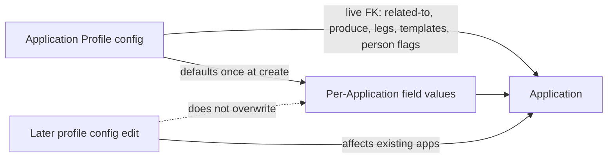
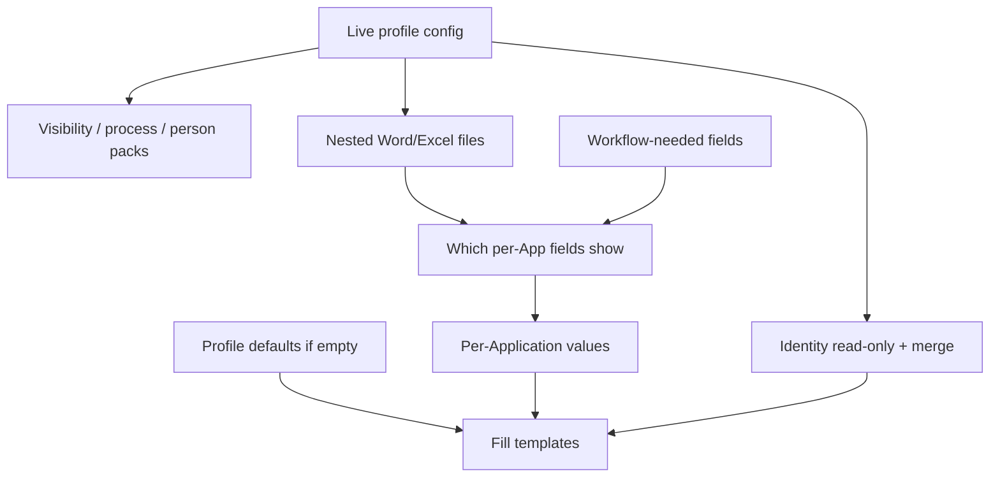

# Application Profile — live configuration + per-Application values (plan)

**Status:** Binding model revised (see §2) — **no full profile clone** · UX prototyping · no domain implementation yet  
**Prototypes:**
- Wizard: [`docs/prototypes/application-profile-wizard.html`](prototypes/application-profile-wizard.html)
- Usage storyboard: [`docs/prototypes/application-profile-usage.html`](prototypes/application-profile-usage.html)
- Storyboard images: [`docs/prototypes/images/`](prototypes/images/) *(lifecycle images still show older “clone” wording — refresh next)*  
**Input draft:** [`docs/prototypes/Application-profile-wizard-draft.xlsx`](prototypes/Application-profile-wizard-draft.xlsx) (columns E–H classify each field)  
**Related today:** `ApplicationType`, `Application`, `ApplicationItem`, `ApplicationProgress`, `ApprovalLegProfile`, `UserReportTemplate`, `ProjectContract`

---

## 1. Problem

Application-type behavior is **scattered** across `ApplicationType` `Show*` / `CanIssue*` flags, hard-coded defaults in `Application.cs`, progress/legs, and template applicability. Officers need one **Application Profile** that is easy to configure and reuse.

**Why not full clone:** if the Application kept a frozen copy of the whole profile, later configuration fixes (route, “related to”, produce/cancel, legs, templates, person requirements) would **not** affect existing Applications. That defeats central configuration. The updated Excel splits fields into **configuration-related** (live) vs **per-Application** (persistent values with defaults).

---

## 2. Locked decisions

### 2.0 Binding model (replaces full clone)

| # | Topic | Decision |
|---|--------|----------|
| 1 | Profile binding | Application holds a **live FK** to `ApplicationProfile`. **Do not** deep-clone the whole profile. |
| 2 | Configuration changes | Edits to **configuration-related** profile fields take effect on **all Applications** that reference that profile (visibility, tracking, process rules, templates, person requirements). |
| 3 | Per-Application values | **Per-Application** fields are stored on the Application (or its items). On first use / create, seed from profile **defaults**; afterward officers edit them independently. Profile default changes do **not** overwrite existing Application values. |
| 4 | Excel classification | Each wizard field is tagged (Excel cols E–H): Visibility on Application · Editable+persistent per Application · Configuration related · Only per Application related. |

### 2.1 Other locked product decisions

| # | Topic | Decision |
|---|--------|----------|
| 5 | Scope / applicability | **Freeform criteria** filters which profiles appear in the Application picker. |
| 6 | “Related to” (action family) | **Exclusive radio:** Issuance \| Cancellation \| Registration \| Business trip. **Configuration-related** — drives tracking / property visibility. |
| 7 | Approval legs | **Embedded** on the profile. Configuration-related (live). |
| 8 | Process states | **Freely enable** ministry / migration state checklists. Configuration-related (live). |
| 9 | Templates | **Nest files** on the profile. Configuration-related; list **visible** on Application, **not** editable per Application. |
| 10 | Person data (v1) | Four checkboxes: Passport, Education, Position, Local address. Configuration-related (live readiness / template packs). |
| 11 | Who configures | **Selected officers**; **wizard** UX for v1. |
| 12 | Defaults in template fill | If a per-Application value is empty at merge, use profile default. |
| 13 | Placeholder naming | Keep today’s **`{{…}}`**. |
| 14 | Workflow-only fields | Catalog fields needed for progress/routing still appear on Application even if unused in Word/Excel. |
| 15 | Template-driven surface | Per-Application catalog fields visible primarily from nested-template usage ∪ workflow need. |
| 16 | Profile identity on Application | Name / Description / Code: **visible** on Application, **not** editable there (read live from profile); also available to merge. |
| 17 | Signatory on Application | Authorized signatory + Visa representative: **visible + editable + persistent** per Application (Excel); defaults from profile at create. |

### 2.2 Configuration-related (live from profile)

Stored only on `ApplicationProfile`. Application **reads** them via FK. Officers do **not** edit these on the Application. Profile updates apply to existing Applications.

| Group | Fields | Visible on Application? |
|-------|--------|-------------------------|
| Identity | Application Name, Description, Code | Yes (read-only) |
| Directed to | Via ministry · Direct migration | No (controls behavior) |
| May be for | Employee · Family member · Temporary visitor | No |
| Related to | Issuance · Cancellation · Registration · Business trip | No (controls tracking / visibility) |
| Produce | Invitation · Work permit · Visa · Border zone · Work location | No |
| Cancel existing | Invitation(s) · WP(s) · Visa(s) · Border zone · Application(s) | No |
| Process | Approval legs · ministry/migration states · SLA days | No |
| Templates | Name · Type · File | Yes (catalog list; not editable) |
| Person requirements | Passport · Education · Position · Address | No (gates readiness / packs) |

### 2.3 Per-Application related (persistent on Application)

Stored on Application. Seeded from profile defaults at initial usage. Editable afterward. Profile default changes do not overwrite saved values.

| # | Property | Notes |
|---|----------|--------|
| 1 | Visa Type | Lookup · often has default |
| 2 | Visa Category | Lookup · often has default |
| 3 | Visa Period | Lookup · often has default |
| 4 | Border Zone | Lookup |
| 5 | Migration Service | Lookup · also workflow |
| 6 | Start Date | Date |
| 7 | End Date | Date |
| 8 | Region (City) | Lookup |
| 9 | Business Trip Address | Lookup |
| 10 | Project | Lookup · also workflow |
| 11 | Urgency | Lookup |
| 12 | Work Permit Location | Lookup |
| 13 | Entry Date | Date |
| 14 | Entry Check Point | Lookup |
| 15 | Authorized signatory | Lookup · default from profile |
| 16 | Visa representative | Lookup · default from profile |

Visibility of 1–14 still follows §2.4 (template ∪ workflow). Signatory fields follow Excel: visible + editable.

### 2.4 Application form visibility (per-Application catalog)

| Shown / editable when | Rule |
|----------------------|------|
| Used in nested Word/Excel | `{{…}}` in at least one profile template → visible + editable |
| Workflow-only | Needed for progress/routing even if unused in templates → still visible + editable |
| Neither | Hidden on Application |

Configuration-related fields are never “edited on Application”; some are shown read-only (identity, template list).

### 2.5 Person toggles — recommendation (pending confirm)

Keep **explicit** profile toggles for readiness + enabling person/roster `{{…}}` packs; constrain publish if a template references a pack while its toggle is off.

### Still open (narrow)

| # | Topic | Notes |
|---|--------|------|
| A | Mid-flight profile edits | If officers change “Related to” / produce / legs on a profile while Applications are in progress — always OK, or lock profile when any Application is past a state? |
| B | Switch profile | Can an Application change `ApplicationProfile` after create, or only at create? |
| C | Required-to-save vs visible | Undecided. Recommendation: visible = template ∪ workflow; required = separate flag. |
| D | Derive vs constrain catalog | Undecided. Recommendation: hybrid extract + hard-block unknown placeholders. |
| E | Temporary visitor | Real for v1? |
| F | Field placement | Which of 1–14 are Application header vs ApplicationItem? |
| G | SLA integers vs tiers | Raw days on profile? |
| H | Merge host | Same Resminamalar / Word–Excel pipeline? |
| I | Confirm person toggles | §2.5 |

---

## 3. Domain shape (sketch — not implemented)

```
ApplicationProfile                         // configuration (live)
  ├─ Name, Description, Code
  ├─ Route, Audience, ActionFamily (Related to)
  ├─ Produce[] / CancelExisting[]
  ├─ FieldCatalog[]                        // which of 14 enabled + default values
  ├─ SignatoryDefault, RepresentativeDefault
  ├─ ApprovalLeg[]
  ├─ ProcessStateFlag[] + SlaDays
  ├─ NestedTemplate[] + FileData
  ├─ PersonDataRequirements                // 4 toggles
  └─ ApplicabilityCriteria

Application
  ├─ ApplicationProfile (FK, required)     // LIVE — not a clone
  ├─ VisaType, VisaCategory, …             // per-Application values (persistent)
  ├─ AuthorizedSignatory, VisaRepresentative
  └─ … progress, items, etc.
```

**Create algorithm:** pick profile → set FK → copy **defaults only** into empty per-Application fields → thereafter read configuration live from profile; persist only per-Application values.



---

## 4. Properties → form + Word/Excel merge



1. Application resolves profile via FK (always current).  
2. Form shows per-Application fields in (template usage ∪ workflow).  
3. Merge value = Application value if set; else profile default.  
4. Identity from live profile (read-only on form; merge). Signatory values from Application (seeded from defaults).  
5. Person toggles on profile gate readiness + packs.  
6. Fill nested profile templates with `{{…}}`.

---

## 5. How officers use Application Profile

### Story A — Configure profile
Selected officer runs wizard; sets configuration-related options and defaults for per-Application fields; publishes.

### Story B — Create Application
Pick profile (criteria filter) → FK set → defaults applied to per-Application fields → officer edits those values.

### Story C — Use Application
Form visibility / process / templates / person rules come **live** from profile. Officer only edits per-Application values (and progress data).

### Story D — Improve configuration
Edit profile (e.g. change Related to, add template, enable Education). **Existing Applications** pick up configuration behavior immediately. Their saved Visa Type / dates / signatory values stay as entered.

---

## 6. Excel → classification (cols E–H)

| Excel meaning | Plan term |
|---------------|-----------|
| G Configuration Related = 1 | Live on profile; not edited on Application |
| H Only Per Application Related = 1 | Persistent on Application; defaults from profile |
| E Visibility on Application = 1 | Show on Application UI (read-only if config; editable if per-App) |
| F Editable Per Application = 1 | Officer may change; value stored on Application |

---

## 7. Migration posture (after UX sign-off)

1. Lock open items A–I.  
2. Field dictionary from Excel E–H → BO members → `{{…}}`.  
3. Introduce `ApplicationProfile` + `Application.ApplicationProfile` FK alongside `ApplicationType`.  
4. Seed profiles from type catalog; dual-read; then deprecate Type.  
5. Refresh prototypes/images that still say “clone”.

---

## 8. Non-goals (this phase)

- EF implementation / ModuleUpdater.  
- Full profile clone / re-sync machinery (rejected).  
- Expanding person matrix beyond four toggles.

---

## 9. Prototype checklist

| Artifact | Purpose | Notes |
|----------|---------|--------|
| `application-profile-wizard.html` | Configure profile | Update copy: live config vs per-App defaults |
| `application-profile-usage.html` | Usage storyboard | Replace clone story with live FK + defaults |
| `images/ap-0*.png` | Visuals | Refresh lifecycle image (no full clone) |
| Excel draft | Source of E–H tags | Updated workbook in repo |
