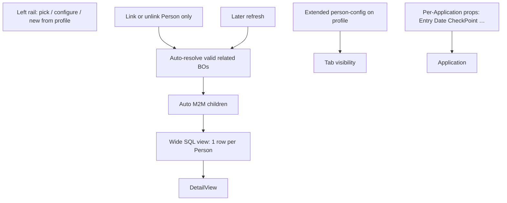
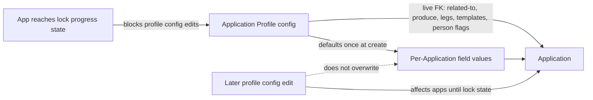
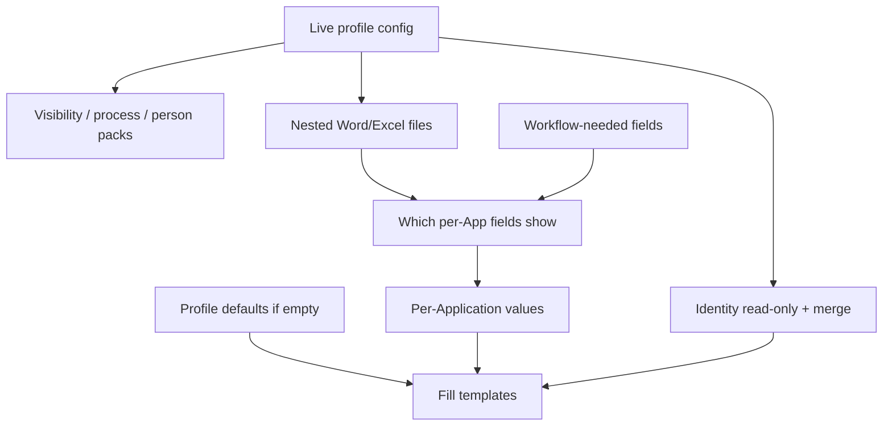

# Application Profile — live configuration + per-Application values (plan)

**Status:** Binding model revised (see §2) — **no full profile clone** · UX prototyping · no domain implementation yet  
**Prototypes:**
- Wizard: [`docs/prototypes/application-profile-wizard.html`](prototypes/application-profile-wizard.html)
- Usage storyboard: [`docs/prototypes/application-profile-usage.html`](prototypes/application-profile-usage.html)
- Application DetailView (M2M, no ApplicationItem): [`docs/prototypes/application-detail-m2m.html`](prototypes/application-detail-m2m.html)
- Storyboard images: [`docs/prototypes/images/`](prototypes/images/)
**Input draft:** [`docs/prototypes/Application-profile-wizard-draft.xlsx`](prototypes/Application-profile-wizard-draft.xlsx) (columns E–H classify each field)  
**Related today:** `ApplicationType`, `Application`, `ApplicationItem` *(planned retire)*, `ApplicationProgress`, `Person` + related BOs, `ApprovalLegProfile`, `UserReportTemplate`, `ProjectContract`

---

## 1. Problem

Application-type behavior is **scattered** across `ApplicationType` `Show*` / `CanIssue*` flags, hard-coded defaults in `Application.cs`, progress/legs, and template applicability. Officers need one **Application Profile** that is easy to configure and reuse.

**Why not full clone:** if the Application kept a frozen copy of the whole profile, later configuration fixes (route, “related to”, produce/cancel, legs, templates, person requirements) would **not** affect existing Applications. That defeats central configuration. The updated Excel splits fields into **configuration-related** (live) vs **per-Application** (persistent values with defaults).

---

## 2. Locked decisions

### 2.0 Binding model (replaces full clone)

| # | Topic | Decision |
|---|--------|----------|
| 1 | Profile binding | Application holds a **live FK** to `ApplicationProfile`. **Do not** deep-clone the whole profile. |
| 2 | Configuration changes | Edits to **configuration-related** profile fields take effect on **all Applications** that reference that profile (visibility, tracking, process rules, templates, person requirements). |
| 3 | Per-Application values | **Per-Application** fields are stored on the Application (or its items). On first use / create, seed from profile **defaults**; afterward officers edit them independently. Profile default changes do **not** overwrite existing Application values. |
| 4 | Excel classification | Each wizard field is tagged (Excel cols E–H): Visibility on Application · Editable+persistent per Application · Configuration related · Only per Application related. |

### 2.1 Other locked product decisions

| # | Topic | Decision |
|---|--------|----------|
| 5 | Scope / applicability | **Freeform criteria** filters which profiles appear in the Application picker. |
| 6 | “Related to” (action family) | **Exclusive radio:** Issuance \| Cancellation \| Registration \| Business trip. **Configuration-related** — drives tracking / property visibility. |
| 7 | Approval legs | **Embedded** on the profile. Configuration-related (live). |
| 8 | Process states | **Freely enable** ministry / migration state checklists. Configuration-related (live). |
| 9 | Templates | **Nest files** on the profile. Configuration-related; list **visible** on Application, **not** editable per Application. |
| 10 | Person data (v1) | Four checkboxes: Passport, Education, Position, Local address. Configuration-related (live readiness / template packs). |
| 11 | Who configures | **Selected officers**; **wizard** UX for v1. |
| 12 | Defaults in template fill | If a per-Application value is empty at merge, use profile default. |
| 13 | Placeholder naming | Keep today’s **`{{…}}`**. |
| 14 | Workflow-only fields | Catalog fields needed for progress/routing still appear on Application even if unused in Word/Excel. |
| 15 | Template-driven surface | Per-Application catalog fields visible primarily from nested-template usage ∪ workflow need. |
| 16 | Profile identity on Application | Name / Description / Code: **visible** on Application, **not** editable there (read live from profile); also available to merge. |
| 17 | Signatory on Application | Authorized signatory + Visa representative: **visible + editable + persistent** per Application (Excel); defaults from profile at create. |
| 18 | Profile pick timing | Application may set `ApplicationProfile` **only at create**. No switch to another profile afterward. |
| 19 | Profile edit lock | When any Application using the profile has reached the **lock progress state** (§2.6 = option **A**), configuration-related edits on that profile are blocked. New Applications may still select a locked profile. |

### 2.2 Configuration-related (live from profile)

Stored only on `ApplicationProfile`. Application **reads** them via FK. Officers do **not** edit these on the Application. Profile updates apply to existing Applications.

| Group | Fields | Visible on Application? |
|-------|--------|-------------------------|
| Identity | Application Name, Description, Code | Yes (read-only) |
| Directed to | Via ministry · Direct migration | No (controls behavior) |
| May be for | Employee · Family member · Temporary visitor | No |
| Related to | Issuance · Cancellation · Registration · Business trip | No (controls tracking / visibility) |
| Produce | Invitation · Work permit · Visa · Border zone · Work location | No |
| Cancel existing | Invitation(s) · WP(s) · Visa(s) · Border zone · Application(s) | No |
| Process | Approval legs · ministry/migration states · SLA days | No |
| Templates | Name · Type · File | Yes (catalog list; not editable) |
| Person requirements | Passport · Education · Position · Address | No (gates readiness / packs) |

### 2.3 Per-Application related (persistent on Application)

Stored on Application. Seeded from profile defaults at initial usage. Editable afterward. Profile default changes do not overwrite saved values.

| # | Property | Notes |
|---|----------|--------|
| 1 | Visa Type | Lookup · often has default |
| 2 | Visa Category | Lookup · often has default |
| 3 | Visa Period | Lookup · often has default |
| 4 | Border Zone | Lookup |
| 5 | Migration Service | Lookup · also workflow |
| 6 | Start Date | Date |
| 7 | End Date | Date |
| 8 | Region (City) | Lookup |
| 9 | Business Trip Address | Lookup |
| 10 | Project | Lookup · also workflow |
| 11 | Urgency | Lookup |
| 12 | Work Permit Location | Lookup |
| 13 | Entry Date | Date |
| 14 | Entry Check Point | Lookup |
| 15 | Authorized signatory | Lookup · default from profile |
| 16 | Visa representative | Lookup · default from profile |

Visibility of 1–14 still follows §2.4 (template ∪ workflow). Signatory fields follow Excel: visible + editable.

### 2.4 Application form visibility (per-Application catalog)

| Shown / editable when | Rule |
|----------------------|------|
| Used in nested Word/Excel | `{{…}}` in at least one profile template → visible + editable |
| Workflow-only | Needed for progress/routing even if unused in templates → still visible + editable |
| Neither | Hidden on Application |

Configuration-related fields are never “edited on Application”; some are shown read-only (identity, template list).

### 2.5 Person toggles — recommendation (pending confirm)

Keep **explicit** profile toggles for readiness + enabling person/roster `{{…}}` packs; constrain publish if a template references a pack while its toggle is off.

### 2.6 Profile edit lock (in-progress Applications)

**Rule:** Allow profile configuration edits **until** at least one Application that references the profile reaches lock state **A**. After that, lock configuration-related editing on the profile.

| Topic | Decision |
|-------|----------|
| **Lock state (A)** | First progress beyond office preparation / **submitted** to ministry or migration (left-office / submitted) |
| Trigger | Any linked Application’s current progress ≥ lock state A |
| Effect | Block wizard/config edits to configuration-related fields (Related to, legs, states, produce/cancel, templates, person toggles, route, audience, identity) |
| Per-Application values | Unaffected — officers still edit Visa Type, dates, signatories, etc. on each Application |
| Profile FK on Application | Set **only at create** — never switch afterward (§18) |
| New Applications on locked profile | **Yes** — still allowed (FK + defaults); profile config remains read-only |
| Unlock | **Open** — recommendation: auto-unlock when no Applications remain at/above lock state A; optional admin override |

### Still open (narrow)

| # | Topic | Notes |
|---|--------|------|
| A | Unlock / admin override | Recommend auto-unlock when no apps at/above lock state A. |
| B | Required-to-save vs visible | Undecided. Recommendation: visible = template ∪ workflow; required = separate flag. |
| C | Derive vs constrain catalog | Undecided. Recommendation: hybrid extract + hard-block unknown placeholders. |
| D | Temporary visitor | Real for v1? |
| E | Field placement | Which of the 14 live on Application header vs elsewhere (ApplicationItem retired). |
| F | SLA integers vs tiers | Raw days on profile? |
| G | Merge host | Same Resminamalar / Word–Excel pipeline? |
| H | Confirm person toggles | §2.5 — also drive M2M tab visibility (§10.2) |
| I | Application DetailView remaining | §10.3 (left rail, resolve refresh, “valid” rules, travel fields home, …) |

---

## 10. Application DetailView redesign — retire ApplicationItem

**Status:** Decisions largely locked (§10.1) · UX prototype · no domain implementation  
**Prototype:** [`docs/prototypes/application-detail-m2m.html`](prototypes/application-detail-m2m.html)  
**Image:** [`docs/prototypes/images/ap-05-application-detail-m2m.png`](prototypes/images/ap-05-application-detail-m2m.png)

### 10.1 Locked decisions

| # | Topic | Decision |
|---|--------|----------|
| 1 | ApplicationItem | **Hard remove** (no migrate-in-place dual model). |
| 2 | Roster | Application has **many People** via M2M (replaces one-row-per-person `ApplicationItem`). |
| 3 | Link on Person add | When a `Person` is linked, **auto-resolve and link** related M2M rows for that person — **only active / valid** rows (§10.2). |
| 4 | Auto-resolve timing | At Person link time **and refresh later** (e.g. reopen Application, profile person-config change, or explicit refresh) so newly valid/current rows appear and expired ones drop as rules dictate. |
| 5 | Manual child links | Officers **only link/unlink `Person`**. Passport / Visa / Education / … are **never** manually linked or unlinked — always auto-resolved. |
| 6 | SQL presentation | **One wide roster SQL view** — **one row per linked Person** with joined columns from auto-linked children. |
| 7 | Tab visibility | Driven by Application Profile **person-config block** (Excel). **Extend** that block beyond Passport / Education / Position / Address to cover Visa, InvitationItem, WorkPermitItem, BorderZoneItem, Salary, Medical, Rejection, etc. |
| 8 | Travel / registration / entry fields | Live as **per-Application properties** on `Application` (Excel “Application properties required”: Start/End Date, Entry Date, Entry Check Point, Region, Business Trip Address, …). Visibility + defaults from profile; **not** on an Application↔Person join entity. |
| 9 | Left rail (Application Profiles) | Used for **all**: create-time profile pick, open/edit profile configuration, and “new Application from profile”. |
| 10 | Issued documents | Input: existing InvitationItem / WorkPermitItem / Visa via auto M2M. Output: new Invitation / WorkPermit headers; new Visa via **`Visa.IssuingApplication`** (remove `IssuingApplicationItem`). |

### 10.2 Valid / active resolve rules

| BO | Include when |
|----|----------------|
| Passport | Not expired |
| Visa | Not expired |
| AddressOfResidence | Current (PersonCurrentItems-style) |
| Education | Current |
| EmployeePositionHistory (Position) | Current |
| EmployeeSalary | Current |
| MedicalRecord | Current |
| InvitationItem | Current / active (existing rules) |
| WorkPermitItem | Current / active (existing rules) |
| BorderZoneItem | **TBD** (recommend: current / not cancelled) |
| RejectionItem | **TBD** (recommend: current / relevant open rejection) |

### 10.3 Person-config block → tabs (extend Excel)

Profile toggles (configuration-related, live) control which person-data tabs/requirements apply. Excel today lists Passport, Education, Position, Local address — **extend** the same pattern for Visa, InvitationItem, WorkPermitItem, BorderZoneItem, Salary, Medical, Rejection, …

| Profile toggle (examples) | Effect when enabled |
|---------------------------|---------------------|
| Passport / Education / Position / Address | Tab + requirement for linked people |
| Visa / Invitation item / WP item / … | Same — extended Excel rows |

### 10.4 Per-Application property catalog (travel / entry / …)

From Excel **Application properties required** (all: visible on Application, editable+persistent per Application, not configuration-related):

| # | Property | Default from profile? |
|---|----------|------------------------|
| 1–5 | Visa Type, Category, Period, Border Zone, Migration Service | Yes |
| 6–7 | Start Date, End Date | No |
| 8–9 | Region (City), Business Trip Address | No |
| 10–11 | Project, Urgency | Yes |
| 12 | Work Permit Location | No |
| 13 | Entry Date | No |
| 14 | Entry Check Point | Yes |

These replace former ApplicationItem travel/registration placement for fields that are application-scoped in the Excel.

### 10.5 Still open (narrow)

1. **BorderZoneItem / RejectionItem “valid”** — confirm include rules (recommend current / not cancelled).
2. **Refresh triggers** — exact list: Application DetailView open, after Person link/unlink, after profile person-config save, nightly job?
3. **Wide view columns** — which joined columns are mandatory in v1 roster?
4. **Unlock profile config** — auto when no apps ≥ lock state A?

### Sketch layout (prototype)

| Region | Content |
|--------|---------|
| Left rail | Profiles: pick at create · open config · new Application from profile |
| Top | Progress · header (incl. per-Application props as profile-visible) · SLA |
| Middle | Live Application Profile summary |
| Bottom | Wide person roster + tabs from extended person-config |



---

## 3. Domain shape (sketch — not implemented)

```
ApplicationProfile                         // configuration (live)
  ├─ Name, Description, Code
  ├─ Route, Audience, ActionFamily (Related to)
  ├─ Produce[] / CancelExisting[]
  ├─ FieldCatalog[]                        // which of 14 enabled + default values
  ├─ SignatoryDefault, RepresentativeDefault
  ├─ ApprovalLeg[]
  ├─ ProcessStateFlag[] + SlaDays
  ├─ NestedTemplate[] + FileData
  ├─ PersonDataRequirements                // 4 toggles
  ├─ ApplicabilityCriteria
  └─ (derived) IsConfigLocked            // true when any linked App ≥ lock state A

Application
  ├─ ApplicationProfile (FK, required)     // LIVE — set only at create; never switch
  ├─ VisaType, VisaCategory, …             // per-Application values (persistent)
  ├─ AuthorizedSignatory, VisaRepresentative
  ├─ People M2M (+ auto-resolved child M2Ms)
  ├─ Invitations / WorkPermits (issued headers)
  └─ … progress, etc.
// Visa.IssuingApplication → Application (replaces IssuingApplicationItem)
```

**Create algorithm:** pick profile (only at create) → set FK → copy **defaults only** into empty per-Application fields → thereafter read configuration live from profile; persist only per-Application values. Profile FK is immutable after create.



---

## 4. Properties → form + Word/Excel merge



1. Application resolves profile via FK (always current).  
2. Form shows per-Application fields in (template usage ∪ workflow).  
3. Merge value = Application value if set; else profile default.  
4. Identity from live profile (read-only on form; merge). Signatory values from Application (seeded from defaults).  
5. Person toggles on profile gate readiness + packs.  
6. Fill nested profile templates with `{{…}}`.

---

## 5. How officers use Application Profile

### Story A — Configure profile
Selected officer runs wizard; sets configuration-related options and defaults for per-Application fields; publishes.

### Story B — Create Application
Pick profile **once at create** (criteria filter) → FK set (immutable) → defaults applied to per-Application fields → officer edits those values.

### Story C — Use Application
Form visibility / process / templates / person rules come **live** from profile. Officer only edits per-Application values (and progress data). Cannot change profile.

### Story D — Improve configuration (while unlocked)
Edit profile (e.g. change Related to, add template). **Existing Applications** pick up configuration behavior. Saved per-Application values stay as entered.

### Story E — Profile locks
When any linked Application reaches lock state **A** (first progress beyond office preparation / submitted to ministry or migration), the configuration wizard becomes read-only for that profile. New Applications may still pick the locked profile. Per-Application field edits on Applications continue.
---

## 6. Excel → classification (cols E–H)

| Excel meaning | Plan term |
|---------------|-----------|
| G Configuration Related = 1 | Live on profile; not edited on Application |
| H Only Per Application Related = 1 | Persistent on Application; defaults from profile |
| E Visibility on Application = 1 | Show on Application UI (read-only if config; editable if per-App) |
| F Editable Per Application = 1 | Officer may change; value stored on Application |

---

## 7. Migration posture (after UX sign-off)

1. Lock open items A–I.  
2. Field dictionary from Excel E–H → BO members → `{{…}}`.  
3. Introduce `ApplicationProfile` + `Application.ApplicationProfile` FK alongside `ApplicationType`.  
4. Seed profiles from type catalog; dual-read; then deprecate Type.  
5. Refresh prototypes/images that still say “clone”.

---

## 8. Non-goals (this phase)

- EF implementation / ModuleUpdater.  
- Full profile clone / re-sync machinery (rejected).  
- Expanding person matrix beyond four toggles.

---

## 9. Prototype checklist

| Artifact | Purpose | Notes |
|----------|---------|--------|
| `application-profile-wizard.html` | Configure profile | Update copy: live config vs per-App defaults |
| `application-profile-usage.html` | Usage storyboard | Replace clone story with live FK + defaults |
| `images/ap-0*.png` | Visuals | Refresh lifecycle image (no full clone) |
| `application-detail-m2m.html` | Custom Application DetailView sketch (M2M tabs, no ApplicationItem) |
| `images/ap-05-application-detail-m2m.png` | Visual mock of Application DetailView |
| Excel draft | Source of E–H tags | Updated workbook in repo |
