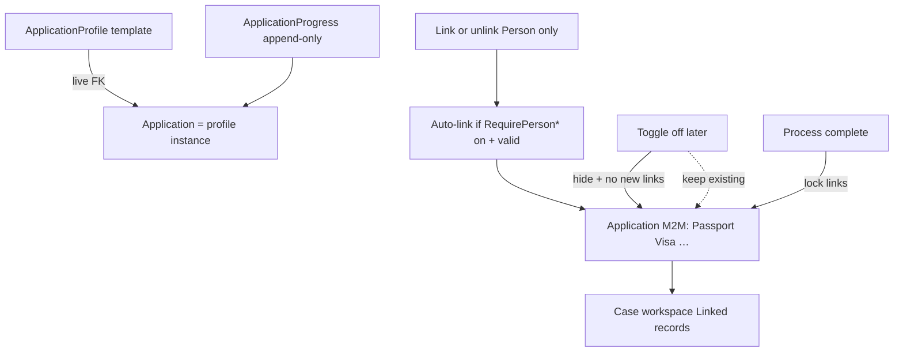
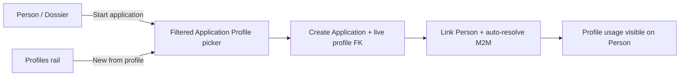
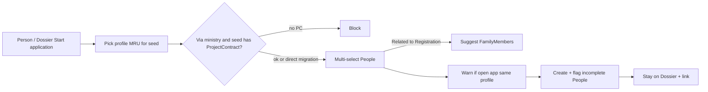
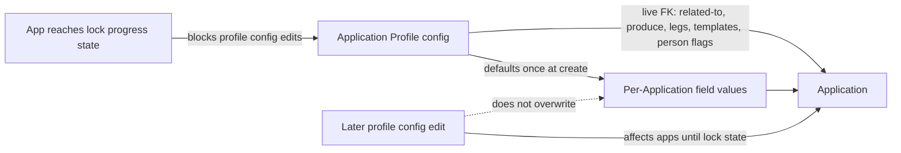
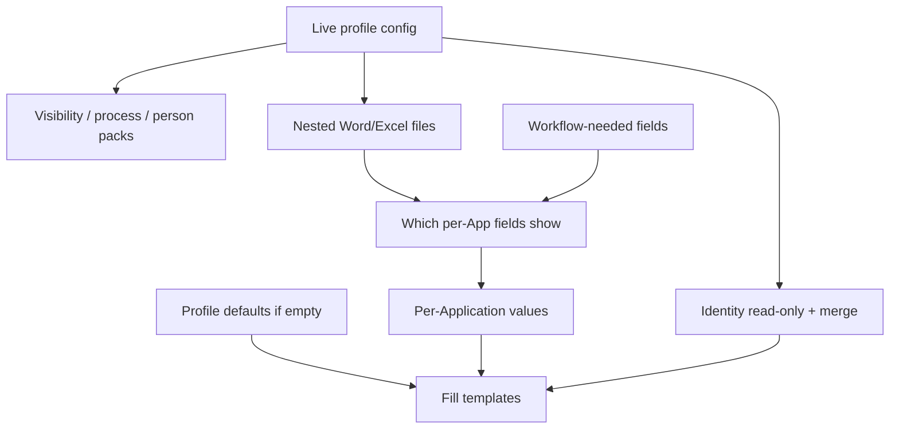

# Application Profile — live configuration + per-Application values (plan)

**Status:** Binding model locked · **`ApplicationType` deprecated** · first code slice: `ApplicationProfile` BO + `Application.ApplicationProfile` FK (dual-read) · UX prototypes · ApplicationItem / M2M DetailView not implemented yet  
**Agent skill:** [`.cursor/skills/visa2026-application-profile/SKILL.md`](../.cursor/skills/visa2026-application-profile/SKILL.md) — implementation tracker ([`IMPLEMENTATION_PLAN.md`](../.cursor/skills/visa2026-application-profile/IMPLEMENTATION_PLAN.md)), experience log (`learnings.md`), officer configuration suggestions.  
**Prototypes:** [`docs/prototypes/`](prototypes/) — **22 PNG mockups** (2026-08-10). Retired same date: HTML storyboards (`application-profile-wizard.html`, `application-profile-usage.html`, `application-detail-m2m.html`), `images/ap-*.png`, `Application-profile-wizard-draft.xlsx`. Field E–H classification remains in this plan (§6) and [skill `reference.md`](../.cursor/skills/visa2026-application-profile/reference.md).

| Group | Files |
|-------|--------|
| App shell | `visa2026-custom-left-navigation-shell-mockup.png`, `application-profiles-navigation-sidebar-mockup.png` |
| Staged profiles | `staged-application-profiles-workspace-mockup.png`, `staged-profiles-listview-table-mockup.png`, `staged-profiles-grid-cards-mockup.png` |
| In process | `process-started-profiles-listview-table-mockup.png`, `process-started-profiles-list-cards-mockup.png`, `process-started-application-profile-workspace-mockup.png`, `process-started-nav-*.png` (5 workspace tabs) |
| Profile templates | `application-profile-templates-listview-mockup.png`, `application-profile-templates-grid-mockup.png`, `application-profile-template-overview-mockup.png`, `application-profile-template-wizard-mockup.png` + `step2`–`step5` |
| Wizard template scopes / upload / edit (2026-08-12) | `application-profile-wizard-templates-three-scopes-prototype.png`, `application-profile-wizard-template-initial-upload-prototype.png`, `application-profile-wizard-template-data-scope-prototype.png`, `application-profile-wizard-template-edit-*-prototype.png`, `application-profile-wizard-template-add-data-scope-prototype.png` |
| Approval leg versions (2026-08-18) | `application-profile-wizard-approval-leg-versions-prototype.png`, `application-profile-instance-create-choose-approval-legs-prototype.png` |
| Case summary instance fields (2026-08-18) | `application-profile-instance-case-summary-overview-properties-prototype.png`, `application-profile-instance-case-summary-edit-properties-prototype.png` |

Full inventory: **§9**. **Interactive HTML (planned):** [`APPLICATION_PROFILE_HTML_PROTOTYPE_PLAN.md`](APPLICATION_PROFILE_HTML_PROTOTYPE_PLAN.md).
**Related today:** `ApplicationProfile` *(replacement)*, `ApplicationType` *(deprecated — dual-read)*, `Application`, `ApplicationItem` *(planned hard remove)*, `ApplicationProgress`, `Person` + related BOs, `ApprovalLegProfile`, `UserReportTemplate`, `ProjectContract`

---

## 1. Problem

Application-type behavior is **scattered** across `ApplicationType` `Show*` / `CanIssue*` flags, hard-coded defaults in `Application.cs`, progress/legs, and template applicability. Officers need one **Application Profile** that is easy to configure and reuse.

**Why not full clone:** if the Application kept a frozen copy of the whole profile, later configuration fixes (route, “related to”, produce/cancel, legs, templates, person requirements) would **not** affect existing Applications. That defeats central configuration. The updated Excel splits fields into **configuration-related** (live) vs **per-Application** (persistent values with defaults).

---

## 2. Locked decisions

### 2.0 Binding model (replaces full clone)

| # | Topic | Decision |
|---|--------|----------|
| 1 | Profile binding | Application holds a **live FK** to `ApplicationProfile`. **Do not** deep-clone the whole profile. |
| 2 | Configuration changes | Edits to **configuration-related** profile fields take effect on **all Applications** that reference that profile (visibility, tracking, process rules, templates, person requirements). |
| 3 | Per-Application values | **Per-Application** fields are stored on the Application (or its items). On first use / create, seed from profile **defaults**; afterward officers edit them independently. Profile default changes do **not** overwrite existing Application values. |
| 4 | Excel classification | Each wizard field is tagged (Excel cols E–H): Visibility on Application · Editable+persistent per Application · Configuration related · Only per Application related. |

### 2.1 Other locked product decisions

| # | Topic | Decision |
|---|--------|----------|
| 5 | Scope / applicability | **Freeform criteria** filters which profiles appear in the Application picker. |
| 6 | “Related to” (action family) | **Exclusive radio:** Issuance \| Cancellation \| Registration \| Business trip. When **Registration**, also **Check in**, **Check out**, **Info change**, or **Reg extension** (`RegistrationKind`) for Report Dashboard queries. **Configuration-related**. |
| 7 | Approval legs | **Shared** tenant catalog: `ApprovalLegProfile` (Configuration), like Company / Signatory. Each via-ministry profile stores only **`DefaultApprovalLegProfile`**. Officer **must pick a shared version** at instance create. Instance **snapshots** ministries; later Configuration or default edits do not change already-started cases. Do **not** copy chains onto each profile. |
| 8 | Process states | **Not officer-configured.** Instance steps follow **Directed to** + **Approval legs** + the fixed progress graph. Profile stores **SLA days** only. |
| 9 | Templates | **Nest files** on the profile. Configuration-related; list **visible** on Application, **not** editable per Application. |
| 10 | Person data (v1) | Four checkboxes: Passport, Education, Position, Local address. Configuration-related (live readiness / template packs). |
| 11 | Who configures | **Selected officers**; **wizard** UX for v1. |
| 12 | Defaults in template fill | If a per-Application value is empty at merge, use profile default. |
| 13 | Placeholder naming | Keep today’s **`{{…}}`**. |
| 14 | Workflow-only fields | Catalog fields needed for progress/routing still appear on Application even if unused in Word/Excel. |
| 15 | Template-driven surface | Per-Application catalog fields visible primarily from nested-template usage ∪ workflow need. |
| 16 | Profile identity on Application | Name / Description / Code: **visible** on Application, **not** editable there (read live from profile); also available to merge. |
| 17 | Signatory on Application | Authorized signatory + Visa representative: **visible + editable + persistent** per Application (Excel); defaults from profile at create. |
| 18 | Profile pick timing | Application may set `ApplicationProfile` **only at create**. No switch to another profile afterward. |
| 20 | ApplicationType deprecation | **`ApplicationType` is deprecated.** New configuration and officer UX use **`ApplicationProfile`**. Keep Type table/FK for dual-read and import until cutover; do not add new Type flags. Registry: [`docs/DEPRECATED.md`](DEPRECATED.md). |

### 2.2 Configuration-related (live from profile)

Stored only on `ApplicationProfile`. Application **reads** them via FK. Officers do **not** edit these on the Application. Profile updates apply to existing Applications.

| Group | Fields | Visible on Application? |
|-------|--------|-------------------------|
| Identity | Application Name, Description, Code | Yes (read-only) |
| Directed to | Via ministry · Direct migration | No (controls behavior) |
| May be for | Employee · Family member · Temporary visitor | No |
| Related to | Issuance · Cancellation · Registration (Check in \| Check out \| Info change \| Reg extension) · Business trip | No (controls tracking / visibility / dashboard) |
| Produce | Invitation · Work permit · Visa · Border zone · Work location | No |
| Cancel existing | Invitation(s) · WP(s) · Visa(s) · Border zone · Application(s) | No |
| Process | Approval legs (**shared** `ApprovalLegProfile` catalog; profile holds **Default** only; **snapshot** on the instance after create) · SLA days (ministry / migration, live) | No |
| Templates | Name · Type · File. Profile-specific rows may bind to a Project contract (Via ministry) or Migration service (Direct); instance catalog filters by the instance lookup. Empty binding = all instances. | Yes (catalog list; not editable) |
| Person requirements | Passport · Education · Position · Address | No (gates readiness / packs) |

### 2.3 Per-Application related (persistent on Application)

Stored on Application. Seeded from profile defaults at initial usage. Editable afterward. Profile default changes do not overwrite saved values.

| # | Property | Notes |
|---|----------|--------|
| 1 | Visa Type | Lookup · often has default |
| 2 | Visa Category | Lookup · often has default |
| 3 | Visa Period | Lookup · often has default |
| 4 | Border Zone | Lookup |
| 5 | Migration Service | Lookup · also workflow |
| 6 | Start Date | Date |
| 7 | End Date | Date |
| 8 | Region | Lookup · often paired with City |
| 8b | City | Lookup · belongs to Region |
| 9 | Business Trip Address | Lookup |
| 10 | Project | Lookup · also workflow; filters profile-specific templates (Via ministry) |
| 11 | Urgency | Lookup |
| 12 | Work Permit Location | Lookup |
| 13 | Entry Date | Date |
| 14 | Entry Check Point | Lookup |
| 15 | Authorized signatory | Lookup · default from profile |
| 16 | Visa representative | Lookup · default from profile |

Visibility of 1–14 still follows §2.4 (template ∪ workflow). Signatory fields follow Excel: visible + editable.

### 2.4 Application form visibility (per-Application catalog)

| Shown / editable when | Rule |
|----------------------|------|
| Used in nested Word/Excel | `{{…}}` in at least one profile template → visible + editable |
| Workflow-only | Needed for progress/routing even if unused in templates → still visible + editable |
| Neither | Hidden on Application |

Configuration-related fields are never “edited on Application”; some are shown read-only (identity, template list).

### 2.5 Person toggles — recommendation (pending confirm)

Keep **explicit** profile toggles for readiness + enabling person/roster `{{…}}` packs; constrain publish if a template references a pack while its toggle is off.

### 2.6 Profile edit lock (in-progress Applications)

**Rule:** Allow profile configuration edits **until** at least one Application that references the profile reaches lock state **A**. After that, lock configuration-related editing on the profile.

| Topic | Decision |
|-------|----------|
| **Lock state (A)** | First progress beyond office preparation / **submitted** to ministry or migration (left-office / submitted) |
| Trigger | Any linked Application’s current progress ≥ lock state A |
| Effect | Block wizard/config edits to configuration-related fields (Related to, Directed to, produce/cancel, templates, person toggles, route, audience, identity). **Exception:** **approval-leg versions** may be added, duplicated, renamed, and edited while locked (instances keep a snapshot at create). Cannot remove the last version while locked. |
| Per-Application values | Unaffected — officers still edit Visa Type, dates, signatories, etc. on each Application |
| Profile FK on Application | Set **only at create** — never switch afterward (§18) |
| New Applications on locked profile | **Yes** — still allowed (FK + defaults); profile config remains read-only |
| Unlock | **Open** — recommendation: auto-unlock when no Applications remain at/above lock state A; optional admin override |

### Still open (narrow)

| # | Topic | Notes |
|---|--------|------|
| A | Unlock / admin override | Recommend auto-unlock when no apps at/above lock state A. |
| B | Required-to-save vs visible | Undecided. Recommendation: visible = template ∪ workflow; required = separate flag. |
| C | Derive vs constrain catalog | **Closed for template AI convert** ([`TEMPLATE_AI_CONVERT_ENGINEERING_SPEC.md`](TEMPLATE_AI_CONVERT_ENGINEERING_SPEC.md) `E-D5`): **constrain** — profile-scoped allowed set; unknown names never become mergeable tokens. Still undecided for other placeholder surfaces. |
| D | Temporary visitor | Real for v1? |
| E | Field placement | Largely settled: 14 props on Application (§10.4). Any remaining former ApplicationItem-only fields? |
| F | SLA integers vs tiers | Raw days on profile? |
| G | Merge host | Same Resminamalar / Word–Excel pipeline? |
| H | Person-config Excel sync | Re-attach updated `Application.xlsx` (Downloads) — not present in cloud workspace yet. |
| I | TravelHistory validity | Current/latest vs broader set when auto-resolving. |
| J | Wide view columns | Mandatory joined columns for v1 roster? |
| K | Unlock profile config | Auto when no apps ≥ lock state A? |

---

## 10. Application DetailView redesign — retire ApplicationItem

**Status:** Decisions locked (§10.1 + §10.1a naming) · UX prototypes · People M2M shipped · §10 auto-link + sticky + Linked records tiles + process-complete lock shipped (10n–10p) · Overview **Issued records** 1:N create (10q)
**Prototype:** [`docs/prototypes/process-started-application-profile-workspace-mockup.png`](prototypes/process-started-application-profile-workspace-mockup.png) (+ `process-started-nav-*.png` workspace tabs). Staged queue: `staged-profiles-*.png`.

### 10.1a Naming (product vs persistence)

| Product language | Persisted BO | Role |
|------------------|--------------|------|
| **Application Profile** (template) | `ApplicationProfile` | Shared live configuration (toggles, templates, route, …) |
| **Application Profile instance** (“in process”) | `ApplicationProfileInstance` | One running case; **live FK** to profile |
| Progress lines / Application Process | `ApplicationProfileInstanceProgress` | Append-only steps on that **instance** |
| Linked records (Passport, Visa, …) | `ApplicationProfileInstancePersonResolvedLink` | Sticky auto-links per `(instance, person, kind)`; gated by profile `RequirePerson*` |
| People on a case | Skip-navigation M2M (join table, **not** a BO) | `People` / `ApplicationProfileInstances`; officers link/unlink Person only |
| Linked child records (Passport, Visa, …) | Skip-navigation M2M + sticky `ApplicationProfileInstancePersonResolvedLink` | Same join pattern as People; auto-filled when Person is linked |

- **`ApplicationNumber` / `ApplicationDate`** live on the **instance** (`ApplicationProfileInstance`) — not on the shared `ApplicationProfile` template. CLR property names may remain until a follow-on polish; **UI captions** must say profile instance / process number.
- Persistence cutover: **§13** (new tables + same-Guid copy + hard break). Legacy name `Application` is removed.

### 10.1 Locked decisions

| # | Topic | Decision |
|---|--------|----------|
| 1 | ApplicationItem | **Hard remove** (no migrate-in-place dual model). |
| 2 | Roster | Application has **many People** via **EF skip-navigation M2M**. Person-related child BOs (Passport, Visa, Education, AddressOfResidence, EmployeePositionHistory, EmployeeSalary, MedicalRecord, WorkDuty, InvitationItem, WorkPermitItem, BorderZoneItem, TravelHistory) have the **same skip-nav M2M** (`ApplicationProfileInstances` on the child; hidden collections on the instance). Join tables are composite PK only — **no XAF join BO**, no `[Aggregated]`. Sticky history also stays on `ApplicationProfileInstancePersonResolvedLink`; LinkPerson dual-writes M2M membership. **Output headers** Invitation / WorkPermit / BorderZone / Rejection / IssuedVisas are **1:N** (instance has many; child FK) — not skip-nav. Visibility on the instance is **May produce**. |
| 3 | Link on Person add | When a `Person` is linked, **auto-resolve and link** related M2M rows for that person — **only** types with profile **`RequirePerson*` checked**, and **only active / valid** rows (§10.2). |
| 4 | Sticky links (history) | Keep the **originally linked** child instances. Do **not** silently swap to a newer passport/visa on reopen. Person **unlink** removes that person’s auto-linked child links on the instance. |
| 5 | Manual child links | Officers **only link/unlink `Person`**. Child BOs are **never** manually linked or unlinked — always auto-resolved (when toggles allow). |
| 6 | SQL presentation | **One wide roster SQL view** — **one row per linked Person** with joined columns from auto-linked children. |
| 7 | Tab / linked-record visibility | Driven by Application Profile **person-config** (`RequirePerson*` / wizard “Required person-related data”). |
| 8 | Application-scoped props | Per-Application catalog on `Application` (Visa Type … Entry Check Point, etc.). Visibility + defaults from profile. |
| 9 | TravelHistory | **Not** profile scalar configuration. `TravelHistory` M2M on **Application**, auto-resolved when Person is linked **if** `RequirePersonTravelHistory` is on. |
| 10 | Left rail | Pick at create · open/edit profile config · new Application from profile. |
| 11 | Issued documents | Input M2M: existing InvitationItem / WorkPermitItem / BorderZoneItem / Visa / … Output headers: **1:N** Invitation / WorkPermit / BorderZone / Rejection / **IssuedVisas** on the instance (`[Aggregated]` + FK; tabs hidden unless profile **May produce**). New visa and visa-extension results use **`Visa.IssuingApplicationProfileInstance`** → `IssuedVisas` (input linked visas stay skip-nav `Visas`). |
| 12 | Toggle turned off later | **Hide** that type + **stop new** auto-links. **Do not unlink** existing instance links (preserves history). |
| 13 | Process complete | After the instance process completes, linked person-related BOs on that instance are **locked** from further change (live links only until then). |
| 14 | Progress integration | Case workspace progress stepper/timeline is append-only **`ApplicationProgress`** on the instance (not nested under the config profile BO). |

### 10.2 Valid / active resolve rules

| BO | Include when |
|----|----------------|
| Passport | Not expired |
| Visa | Started, not cancelled/changed, and not expired |
| AddressOfResidence | Current (PersonCurrentItems-style) |
| Education | Current |
| EmployeePositionHistory (Position) | Current |
| EmployeeSalary | Current |
| MedicalRecord | Not expired |
| InvitationItem | Active (`!IsCancelled && !IsChanged && !IsUsed`) and parent Invitation not expired |
| WorkPermitItem | Not cancelled and not expired |
| BorderZoneItem | Not cancelled and parent BorderZone not expired |
| RejectionItem | **Current / not cancelled** |
| TravelHistory | **TBD** (recommend: current / latest relevant movements — confirm) |

**Officer vs import:** §10.2 validity is for **manual officer** link/create (`ApplicationProfileInstancePersonValidItems.EnforceOfficerLinkValidity`). **VISA2014 import** (`MigrationImportContext.IsDataImport`) keeps historical current rows via `PersonCurrentItems` — expired/past related data still auto-links.

### 10.3 Person-config block → tabs / linked records

Profile toggles (configuration-related, live) control which person-data tabs and **Linked records** tiles apply, and which types auto-link when People are linked. Wizard step 4 **Required person-related data** maps to `RequirePerson*` on `ApplicationProfile`.

Expected members: Passport · Education · Position · Address of residence · Visa · Invitation item · Work permit item · Border zone item · Salary · Medical · Rejection item · Travel history · …

| Toggle | Effect |
|--------|--------|
| **On** | Visible; auto-link valid instances when Person is linked |
| **Off** | Not visible for new work; no new auto-links; existing instance links kept (§10.1 #12) |

### 10.4 Per-Application property catalog

From Excel **Application properties required** (visible + editable + persistent per Application instance):

| # | Property | Default from profile? |
|---|----------|------------------------|
| 1–5 | Visa Type, Category, Period, Border Zone, Migration Service | Yes |
| 6–7 | Start Date, End Date | No |
| 8–9 | Region (City), Business Trip Address | No |
| 10–11 | Project, Urgency | Yes |
| 12 | Work Permit Location | No |
| 13 | Entry Date | No |
| 14 | Entry Check Point | Yes |

These remain **Application** (instance) fields. Movement history itself comes from **`TravelHistory` M2M** on the instance.

### 10.5 Still open (narrow)

1. **TravelHistory “valid”** — current/latest only, or all non-cancelled movements in a window?
2. **Wide view columns** — mandatory joined columns for v1 roster?
3. **Unlock profile config** — auto when no apps ≥ lock state A?
4. ~~**Process-complete lock trigger**~~ — **Locked 2026-08-12 (slice 10p):** same as `Application.IsWorkflowTerminal` — latest progress `PROCESS_ISSUED`, `PROCESS_REJECTED`, or `PROCESS_CANCELLED`. Ministry review rejects (`*_REVIEW_REJECTED`) are **not** lock triggers (process may continue). Unlock by editing/deleting the last progress step (existing workflow-terminal UX).

### Sketch layout (prototype)

| Region | Content |
|--------|---------|
| Left rail | Profiles: pick at create · open config · new instance from profile |
| Top | Progress · header (№ / date on instance) · SLA |
| Middle | Live profile summary + linked records |
| Bottom | People roster + tabs from person-config |



---

## 11. Start Application from Person / Dossier (proposed)

**Status:** Suggestion for UX — not implemented · complements manual Application create + profile pick

### Problem

Creating an Application only from the Application side (pick profile → add people) is slow when the officer is already on a **Person** or **Dossier**. Officers also need to see **which Application Profiles were already used** for that person (renewals, follow-ups, avoid duplicate open apps).

### Suggestion (recommended)

Keep **one** create pipeline (same as today planned): set `Application.ApplicationProfile` FK → seed per-Application defaults → link Person → auto-resolve children. Add **extra entry points** that pre-select the person and profile.

| Entry | Officer action | Result |
|-------|----------------|--------|
| Person DetailView | **Start application…** | Profile picker → **multi-select People** (seed Person pre-selected) → create Application with all selected linked |
| Person Dossier | **Start application…** (header or Applications section) | Same; multi-select People |
| Application Profiles rail / list | **New Application from profile** | Create Application with profile set; officer adds people (multi-select or later on Application) |
| Application create (blank) | Pick profile then add people | Existing plan |



### Track Application Profiles used for a Person

**Prefer derived tracking** (no second write model):

- Source of truth: Applications where Person ∈ Application.People M2M, grouped by `Application.ApplicationProfile`.
- Person / Dossier UI surfaces:
  - **Applications** list (number, date, state, profile name/code)
  - **Profiles used** chips or compact list (distinct profiles ever used)
  - Optional: **Open applications** using a profile (warn before starting another)

Avoid a separate `PersonApplicationProfileUsage` table unless you need to record “officer considered profile X but cancelled before save.”

### Picker UX (from Person / Dossier)

1. Show Application Profiles matching **applicability criteria** + audience (Employee / FM / visitor vs person role).
2. Annotate each row: **Used before** (count / last date) · **Has open Application** · lock badge if profile config locked.
3. Confirm → create Application → link **all selected People** → auto-resolve each → open Application DetailView.

### Why this improves UX

- Starts where officers already work (Person / Dossier).
- Same binding rules (live profile FK, defaults, auto-resolve) — no parallel create path.
- Profile history is free from M2M + FK — supports renewals and duplicate awareness.

### Open questions (§11)

**Locked (Person / Dossier start dialog):**

| # | Topic | Decision |
|---|--------|----------|
| 1 | Multi-select People | Yes — seed Person pre-selected; officer may add more for the same Application / profile. |
| 2 | Candidate mix | **Mix**, with route rule: profiles **via ministry** → candidates restricted to **same ProjectContract** as seed (or app context); profiles **direct migration** → **no** same-ProjectContract requirement (broader search). Family / other filters may still apply as UX aids. |
| 3 | Family suggest | Auto-**suggest** FamilyMembers of an Employee seed **only** when Application Profile **Related to = Registration**; suggestions remain optional (officer can deselect). |
| 4 | Audience mismatch | **Allow** selecting People who don’t match profile “may be for”; **validate on confirm** (errors if incompatible). |
| 5 | Duplicate open Application | **Warn** if any selected Person already has an open Application on that profile; officer may continue. |
| 6 | Profile picker sort | **Most recently used** for the **seed** Person first. |
| 7 | After create from Dossier | **Stay on Dossier** with a link to the new Application. |
| 8 | Missing required person data | **Create anyway** and **flag** Persons who lack required valid data (e.g. passport when profile requires it) — do not block create. |
| 9 | “Open” Application (warn) | Any Application that is **not** in a **terminal** state — treat **issued** and **cancelled** (and other workflow terminals) as closed; everything else is open for the duplicate-profile warn. |
| 10 | Via ministry + no ProjectContract | If seed Person has **no** ProjectContract and profile is **via ministry** → **block** start (cannot proceed until ProjectContract is set / resolvable). |
| 11 | Dossier Applications section | **Yes** — remodel to Application↔Person M2M + profile name when ApplicationItem is removed. |

**Still open (narrow):** none for §11 — remaining plan opens are outside this flow (TravelHistory validity, Excel sync, unlock policy, etc.).



---

## 3. Domain shape (sketch — not implemented)

```
ApplicationProfile                         // configuration (live)
  ├─ Name, Description, Code
  ├─ Route, Audience, ActionFamily (Related to)
  ├─ Produce[] / CancelExisting[]
  ├─ FieldCatalog[]                        // which of 14 enabled + default values
  ├─ SignatoryDefault, RepresentativeDefault
  ├─ ApprovalLeg[]
  ├─ ProcessStateFlag[] + SlaDays
  ├─ NestedTemplate[] + FileData
  ├─ PersonDataRequirements                // 4 toggles
  ├─ ApplicabilityCriteria
  └─ (derived) IsConfigLocked            // true when any linked App ≥ lock state A

Application
  ├─ ApplicationProfile (FK, required)     // LIVE — set only at create; never switch
  ├─ VisaType, VisaCategory, …             // per-Application values (persistent)
  ├─ AuthorizedSignatory, VisaRepresentative
  ├─ People M2M (+ auto-resolved child M2Ms incl. TravelHistory)
  ├─ Invitations / WorkPermits (issued headers)
  └─ … progress, etc.
// Visa.IssuingApplication → Application (replaces IssuingApplicationItem)
// TravelHistory M2M — not profile scalar travel configuration
```

**Create algorithm:** pick profile (only at create) → set FK → copy **defaults only** into empty per-Application fields → thereafter read configuration live from profile; persist only per-Application values. Profile FK is immutable after create.



---

## 4. Properties → form + Word/Excel merge



1. Application resolves profile via FK (always current).  
2. Form shows per-Application fields in (template usage ∪ workflow).  
3. Merge value = Application value if set; else profile default.  
4. Identity from live profile (read-only on form; merge). Signatory values from Application (seeded from defaults).  
5. Person toggles on profile gate readiness + packs.  
6. Fill nested profile templates with `{{…}}`.

---

## 5. How officers use Application Profile

### Story A — Configure profile
Selected officer runs wizard; sets configuration-related options and defaults for per-Application fields; publishes.

### Story B — Create Application
Pick profile **once at create** (criteria filter) → FK set (immutable) → defaults applied to per-Application fields → officer edits those values.

### Story C — Use Application
Form visibility / process / templates / person rules come **live** from profile. Officer only edits per-Application values (and progress data). Cannot change profile.

### Story D — Improve configuration (while unlocked)
Edit profile (e.g. change Related to, add template). **Existing Applications** pick up configuration behavior. Saved per-Application values stay as entered.

### Story E — Profile locks
When any linked Application reaches lock state **A** (first progress beyond office preparation / submitted to ministry or migration), the configuration wizard becomes read-only for that profile. New Applications may still pick the locked profile. Per-Application field edits on Applications continue.
---

## 6. Excel → classification (cols E–H)

| Excel meaning | Plan term |
|---------------|-----------|
| G Configuration Related = 1 | Live on profile; not edited on Application |
| H Only Per Application Related = 1 | Persistent on Application; defaults from profile |
| E Visibility on Application = 1 | Show on Application UI (read-only if config; editable if per-App) |
| F Editable Per Application = 1 | Officer may change; value stored on Application |

---

## 7. Migration posture (after UX sign-off)

1. Lock open items A–I.  
2. Field dictionary from Excel E–H → BO members → `{{…}}`.  
3. Introduce `ApplicationProfile` + `Application.ApplicationProfile` FK; mark **`ApplicationType` deprecated** (dual-read).  
4. Seed profiles from type catalog; switch Appearance / progress / reports to profile.  
5. Remove `Application.ApplicationType` FK and retire Type/group/template-type links.  
5. Align plan copy with staged → in-process PNG prototypes (§9); pivot to template → staged → merge model as product direction evolves.

---

## 12. Implementation progress

**Maintained in sync with:** [`.cursor/skills/visa2026-application-profile/IMPLEMENTATION_PLAN.md`](../.cursor/skills/visa2026-application-profile/IMPLEMENTATION_PLAN.md)

| Slice | Status |
|-------|--------|
| Plan + prototypes | Done |
| **Deprecate `ApplicationType` BO** (registry, UI caption/tooltip, dual-read retained) | Done |
| `ApplicationProfile` BO + approval legs + nested templates | Done (v1 scalars/collections) |
| `Application.ApplicationProfile` live FK + default seeding | Done (optional during dual-read) |
| Permissions (Users read / VisaOffice manage) | Done |
| Seed profiles from ApplicationType catalog | Done |
| Switch Appearance / progress to profile | Done |
| Config lock enforcement on profile edit | Done |
| Configuration wizard UX | Done |
| Wizard Registration Check in / Check out | **Done** |
| Wizard Process & SLA duration only | Done |
| Profile-specific template applicability (contract / migration service) | Done |
| Approval leg versions (shared catalog + instance snapshot) | **Done** (Phase B 2026-08-20: imported instances keep inferred chain; snapshots + version name backfill) |
| Locked profile: still set Default approval legs | **Done** |
| Wizard Project contract on Identity (Via ministry) | Done |
| Profile overview (live linked instances) | Done |
| Custom catalog home (replace native List/Detail officer UI) | Done |
| Profile picker at Application create | Done |
| Case summary instance Use fields (overview tiles + Edit/Done) | **Done** |
| Person M2M DetailView / hard-remove ApplicationItem | In progress (skip-navigation People + roster-line BO deleted; F5 heal pending) |
| Workspace Document copies person filter + person catalog | Done (header chips; person-grouped catalog; slot viewer-only) |
| Document copies from linked records (ID labels) | Done (ResolvedLinks; Passport/Visa numbers — not Current/Previous) |
| §10.2 valid/not-expired auto-link gate | Done (officer-only; VISA2014 import keeps historical current rows) |
| Overview Issued records (1:N Invitation / WorkPermit / BorderZone / Rejection / issued Visa) | Done (May produce tiles + New from Overview) |
| Person/Dossier Start application | Done |
| Remove `Application.ApplicationType` FK | Deferred (after import cutover) |
| **§13 Instance rename** (`Application` → `ApplicationProfileInstance`) | Done (R0–R6; Demo F5/import operator-run) |

---

## 13. Instance rename cutover (`Application` → `ApplicationProfileInstance`)

**Status:** Decisions locked 2026-08-12 · Implementation slices R0–R6 in skill IMPLEMENTATION_PLAN  
**Canonical agent plan:** `.cursor/plans/profile_instance_cutover_*.plan.md` (do not edit from product docs)

### 13.1 Locked decisions

| Topic | Decision |
|-------|----------|
| Timing | Parallel with Wave 2b (do not wait for ApplicationItem hard-remove) |
| Cutover | Big-bang (no dual-read OData alias) |
| Persistence | New tables + **same-Guid copy**, then drop old |
| Name scope | Header + related instance types (Progress, Person, ResolvedLink, ApprovalLegSnapshot, child FKs, Visa.Issuing*) |
| Import | Hard break: `--entity ApplicationProfileInstance` |
| Officer UI | “Application Profile instance” / process number only — no residual case “Application” |

**Do not rename:** `ApplicationProfile*`, `ApplicationType*`, `ApplicationState` / `ApplicationLocation`, `ApplicationUser*`, `ApplicationRuntimeLog*`, `ApplicationNumberingProfile`, `ApplicationMigrationSlaProfile`, DevExpress `XafApplication`.

### 13.2 Rename map

| Today | After |
|-------|--------|
| `Application` / `Applications` | `ApplicationProfileInstance` / `ApplicationProfileInstances` |
| `ApplicationProgress` | `ApplicationProfileInstanceProgress` |
| `ApplicationPerson` (+ ResolvedLink) | Skip-nav People + `ApplicationProfileInstancePersonResolvedLink` (no roster-line BO) |
| `ApplicationApprovalLegSnapshot` | `ApplicationProfileInstanceApprovalLegSnapshot` |
| `Visa.IssuingApplication` | `Visa.IssuingApplicationProfileInstance` |
| Import `--entity Application` | `--entity ApplicationProfileInstance` |

`ApplicationItem` is **not** renamed — Wave 2b hard-remove path; FK points at instance table until dropped.

### 13.3 Phases (R0–R6)

See skill IMPLEMENTATION_PLAN slices R0–R6: spec → new BOs/tables → copy updater → code/OData/import/SQL hard switch → drop old → UI copy → verify.

---

## 8. Non-goals (this phase)

- Full profile clone / re-sync machinery (rejected).  
- Expanding person matrix beyond four toggles in the first UX slice (Excel person-config may extend later).

---

## 9. Prototype inventory (PNG — 2026-08-10)

All files live in [`docs/prototypes/`](prototypes/) only (no subfolders).

| File | Purpose |
|------|---------|
| `visa2026-custom-left-navigation-shell-mockup.png` | Custom app shell — replaces native XAF left nav |
| `application-profiles-navigation-sidebar-mockup.png` | Staged / In process / Profile templates nav IA |
| `staged-application-profiles-workspace-mockup.png` | Staged profiles — grouped workspace + Start process |
| `staged-profiles-listview-table-mockup.png` | Staged profiles — ListView |
| `staged-profiles-grid-cards-mockup.png` | Staged profiles — grid |
| `process-started-profiles-listview-table-mockup.png` | In process — ListView |
| `process-started-profiles-list-cards-mockup.png` | In process — card grid |
| `process-started-application-profile-workspace-mockup.png` | In process case — Overview tab |
| `process-started-nav-overview.png` | Workspace — Overview (alt) |
| `process-started-nav-overview-issued-records.png` | Overview — Issued records card (1:N Invitation / Work permit / Border zone / Rejection; May produce) |
| `process-started-nav-overview-issued-records-add.png` | Overview — Add invitation empty state under Issued records |
| `process-started-nav-people-links.png` | Workspace — People & links |
| `process-started-nav-progress.png` | Workspace — Progress |
| `process-started-nav-overview-approval-legs.png` | Overview stepper — office + 3 ministry legs + migration (mixed complete / current / pending) |
| `process-started-nav-progress-approval-legs.png` | Progress tab — same mixed legs; current ministry expanded |
| `process-started-nav-progress-migration-in-process.png` | Progress tab — all ministry legs approved; Migration On process |
| `process-started-nav-document-copies.png` | Workspace — Document copies |
| `process-started-nav-resminamalar.png` | Workspace — Resminamalar |
| `process-started-nav-sla-deadlines.png` | Workspace — SLA & deadlines |
| `application-profile-templates-listview-mockup.png` | Profile templates catalog — ListView |
| `application-profile-templates-grid-mockup.png` | Profile templates catalog — grid |
| `application-profile-template-overview-mockup.png` | Single template — read-only overview |
| `application-profile-template-wizard-mockup.png` | Template wizard — step 1 Identity & purpose |
| `application-profile-template-wizard-step2-mockup.png` | Template wizard — step 2 Results & defaults |
| `application-profile-template-wizard-step3-mockup.png` | Template wizard — step 3 Process & SLA |
| `application-profile-template-wizard-step4-mockup.png` | Template wizard — step 4 Templates & person |
| `application-profile-template-wizard-step5-mockup.png` | Template wizard — step 5 Review & publish |
| `application-profile-wizard-templates-three-scopes-prototype.png` | Step 4 — three scopes (profile / category / global) |
| `application-profile-wizard-template-initial-upload-prototype.png` | Step 4 — Add template initial upload |
| `application-profile-wizard-template-data-scope-prototype.png` | Step 4 — Data for this template (header / M2M / both) |
| `application-profile-wizard-template-add-data-scope-prototype.png` | Step 4 — Add modal (upload + data scope) |
| `application-profile-wizard-template-edit-ui-prototype.png` | Step 4 — Edit template modal |
| `application-profile-wizard-template-edit-scenario-prototype.png` | Step 4 — Edit Word/Excel scenario |
| `application-profile-wizard-template-edit-word-prototype.png` | Step 4 — Edit Word template (detail) |
| `application-profile-wizard-approval-leg-versions-prototype.png` | Identity — named **approval-leg versions** on this profile (own copies; Default + Duplicate / Remove / Add version) |
| `application-profile-instance-create-choose-approval-legs-prototype.png` | New instance — **required** pick of a version; ministries snapshot onto the application |
| `application-profile-instance-case-summary-overview-properties-prototype.png` | Overview **Case summary** — read-only tiles for profile **Use** fields; **Edit** switches to form mode |
| `application-profile-instance-case-summary-edit-properties-prototype.png` | Overview **Case summary** — edit mode (dropdowns/dates); **Done** returns to tiles |

**Retired (do not link):** `application-profile-wizard.html`, `application-profile-usage.html`, `application-detail-m2m.html`, `application-profile-platform-prototype.html`, `images/ap-*.png`, `Application-profile-wizard-draft.xlsx`.
