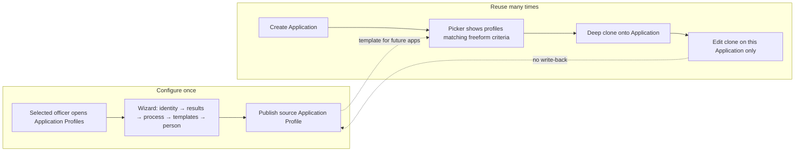

# Application Profile — configuration & clone model (plan)

**Status:** Decisions locked (see §2) · UX prototyping in progress · no domain implementation yet  
**Prototypes:**
- Wizard: [`docs/prototypes/application-profile-wizard.html`](prototypes/application-profile-wizard.html)
- Usage storyboard: [`docs/prototypes/application-profile-usage.html`](prototypes/application-profile-usage.html)
- Storyboard images: [`docs/prototypes/images/`](prototypes/images/)
**Input draft:** [`docs/prototypes/Application-profile-wizard-draft.xlsx`](prototypes/Application-profile-wizard-draft.xlsx)  
**Related today:** `ApplicationType`, `Application`, `ApplicationItem`, `ApplicationProgress`, `ApprovalLegProfile`, `UserReportTemplate`, `ProjectContract`

---

## 1. Problem

Application-type behavior is **scattered**:

| Concern | Where it lives today |
|--------|----------------------|
| UI visibility / required fields | Dozens of `Show*` flags on `ApplicationType` + `[Appearance]` on `Application` / `ApplicationItem` |
| Issue capabilities | `CanIssueVisa` / `CanIssueInvitation` / `CanIssueWorkPermit` (+ catalog JSON) |
| Progress route / ministry depth | `ApplicationProgressRoute`, `MinistryReviewDepth` on type; legs on `ApprovalLegProfile` / `ProjectContract` |
| Defaults (visa type/period/…) | Hard-coded in `Application.cs` by type `Name` |
| Report applicability | `UserReportTemplate` links to types / type groups / project contracts |
| SLA | `ApplicationMigrationSlaProfile` (+ duration fields) |
| Selection UX | `SelectionCode` + quick code (see `APPLICATION_BO_TYPE_SELECTION_REFACTOR.md`) |

Creating or tweaking a “new kind of application” requires editing lookup flags, seed JSON, Appearance criteria, and often C# defaults — poor officer UX and hard to reuse.

---

## 2. Locked decisions

| # | Topic | Decision |
|---|--------|----------|
| 1 | Clone on Application create | **Always deep-clone.** No live link to the source profile. |
| 2 | Re-sync from source | **Not supported.** Divergence is permanent. Source edits affect **future** Applications only. Lineage FK (`SourceProfileId`) is informational. |
| 3 | Clone storage | **Full owned BO graph in XAF** (recommended — see §3). Not a JSON blob. |
| 4 | Scope / applicability | **Freeform criteria** (XAF criteria against Application context) filters which source profiles appear in the picker. |
| 5 | “Related to” (action family) | **Exclusive radio:** Issuance \| Cancellation \| Registration \| Business trip. |
| 6 | Approval legs | **Embedded** on the profile (ordered ministry legs). Do not reference `ApprovalLegProfile` as the owner. |
| 7 | Process states | **Freely enable** ministry / migration state checklists from Excel (profile defines allowed states + SLA-track flags). Transition rules derived from enabled set (replace hard-coded route tables over time). |
| 8 | Templates | **Nest files inside the profile** (name, type, `FileData`). Profile is the store for that template set — not association-only to `UserReportTemplate`. |
| 9 | Person data (v1) | **Four checkboxes only:** Passport, Education, Position, Local address of residence. Full `ShowCurrent*` matrix is a later phase. |
| 10 | Who configures | **Selected officers** (permissioned), not Administrators-only. |
| 11 | Config UX (v1) | **Wizard** (as prototyped), not a single long DetailView. |

### Still open (narrow)

| # | Topic | Notes |
|---|--------|------|
| A | Naming in UI | Confirm officers never see “Application type” after cutover; interim dual labels OK? |
| B | Temporary visitor | Real audience for v1, or seed later? |
| C | Scope criteria target | Criteria against `Application` only, or also ProjectContract / person context at pick time? |
| D | Cancel-existing “Application(s)” | Excel showed radio for that one row — treat all cancel targets as checkboxes? |
| E | Field placement | Which Excel “required properties” belong on Application header vs ApplicationItem (entry date / checkpoint)? |
| F | SLA integers | Raw ministry/migration days on profile replace `ApplicationMigrationSlaProfile` tiers? |
| G | Nested template engine | New profile-owned files still feed Resminamalar / Word merge via same placeholder pipeline, or parallel path? |

---

## 3. Clone storage recommendation — full owned BO graph

**Recommendation: full XAF-owned aggregate**, deep-cloned onto the Application.

| | Owned BO graph (chosen) | Serialized JSON snapshot |
|--|-------------------------|---------------------------|
| Nested template **files** | Native `FileData` / aggregated children | Awkward (bytes in JSON or side tables anyway) |
| Embedded **approval legs** | Ordered child BOs, editable in clone | Thin custom editor required |
| Free state checklists | Child rows or flags, validation rules | Harder to Appearance / RuleCriteria |
| Officer edits on Application clone | Standard DetailView / nested ListViews | Custom UI for every change |
| Progress / reports runtime | Queryable graph, same shape as source | Deserialize + map on every use |
| Schema / migration cost | Higher (more tables) | Lower initially, debt later |

Because decisions already require **nested files**, **embedded legs**, **editable clones**, and **officer configuration**, JSON would immediately fight the product shape. Use one aggregate shape for source and clone:

```
ApplicationProfile                    // source template (Configuration nav)
  ├─ FieldRequirement[]               // required + default value
  ├─ ApprovalLeg[]                    // embedded, ordered
  ├─ ProcessStateFlag[]               // ministry/migration + SLA track
  ├─ NestedTemplate[] + FileData      // files owned by profile
  ├─ PersonDataRequirements           // 4 bools (v1)
  ├─ ApplicabilityCriteria (string)   // freeform XAF criteria
  └─ identity / route / audience / action family / produce / cancel / signatory / SLA days

Application
  └─ ApplicationProfileInstance       // deep clone, Aggregated
       ├─ (same child shape as above)
       ├─ SourceProfileId?            // lineage only; never auto-updated
       └─ ClonedAt
```

**Clone algorithm (conceptual):** on Application create, after officer picks a source profile → deep-copy aggregate into `Application.ProfileInstance` → apply field defaults onto Application header → never write back to source.

---

## 4. How officers use Application Profile



### Story A — Create / edit a source profile
1. Officer with permission opens **Application Profiles**.
2. Runs the **wizard** (Excel sections).
3. Sets freeform **applicability criteria** (optional).
4. Embeds approval legs, enables process states, uploads nested templates, sets person checkboxes.
5. **Publish** → available in Application picker (when criteria match).

### Story B — Create an Application from a profile
1. New Application → **Choose Application Profile** (filtered by criteria + audience/action family).
2. System **deep-clones** profile → `Application.ProfileInstance`.
3. Header fields get profile defaults (visa type/period/…); produce/cancel capabilities drive collections.
4. Progress uses cloned legs + enabled states + SLA days.

### Story C — Adjust this Application only
1. On Application detail, open **Profile (this application)**.
2. Change a default, leg order, or replace a nested template file.
3. Source profile unchanged; other Applications unchanged; **no re-sync**.

### Story D — Improve the template for next time
1. Edit source profile (wizard).
2. Existing Applications keep their clones.
3. Next new Application gets the updated clone.

---

## 5. Excel → wizard mapping

| Excel section | Wizard step | Locked behavior |
|---------------|-------------|-----------------|
| Name / Description / Code | 1 Identity | Source profile identity |
| Directed to | 1 Route | Ministry vs direct migration |
| For | 1 Audience | Employee / FM / Temporary visitor (multi checkbox) |
| Related to | 1 Action family | **Exclusive** radio |
| Result may produce / cancel | 2 Results | Capability sets |
| Properties required + defaults | 2 Fields | Replaces `Show*` + C# defaults |
| Signatory | 2 Signatory | Defaults on clone |
| Approval legs + states + SLA | 3 Process | Embedded legs; free state checklists; day integers |
| Application templates | 4 Templates | **Nested files** on profile |
| Required person-related data | 4 Person | **Four checkboxes (v1)** |
| Scope | 1 / Review | Freeform criteria |

---

## 6. Migration posture (after UX sign-off)

1. Lock remaining open items (§2).  
2. Field dictionary: Excel row → profile property → current `Show*` / capability.  
3. Introduce `ApplicationProfile` + `ApplicationProfileInstance` alongside `ApplicationType`.  
4. Seed profiles from existing type catalog (best-effort mapping).  
5. Dual-read period: Type still set; clone also present.  
6. Switch Appearance / progress / reports to read **instance**.  
7. Deprecate `ApplicationType`, type groups, type-linked template filters, hard-coded defaults.  
8. Resminamalar path: consume nested profile templates (or migrate `UserReportTemplate` rows into profile seeds).

---

## 7. Non-goals (this prototyping phase)

- EF entities, ModuleUpdater, production wizard host.
- VISA2014 import remapping.
- Expanding person requirements beyond the four Excel checkboxes.
- Re-sync / live-link features.

---

## 8. Prototype checklist

| Artifact | Purpose |
|----------|---------|
| `application-profile-wizard.html` | Configure source profile (5 steps) |
| `application-profile-usage.html` | End-to-end usage storyboard (picker → clone → edit) |
| `images/ap-01-configure-wizard.png` | Visual: officer configuring profile |
| `images/ap-02-pick-on-application.png` | Visual: picking profile on new Application |
| `images/ap-03-clone-on-application.png` | Visual: cloned profile on Application (independent) |
| `images/ap-04-lifecycle.png` | Visual: template vs clone lifecycle |
