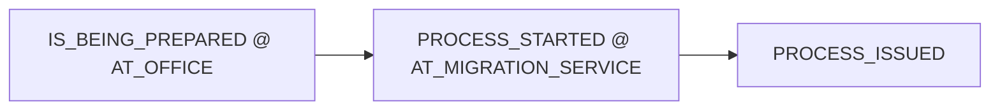
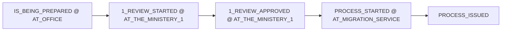
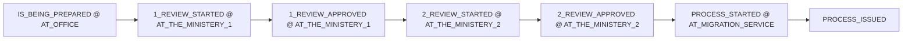

# Application progress — approval processes and contract-based ministry depth

> **Purpose:** Reference for how officers record **`ApplicationProgress`** approval steps, how **ministry legs** are chosen per application, and how **`ProjectContract`** overrides type defaults. For validation layers, SLA, and transition graphs see [`APPLICATION_PROGRESS_STATE_VALIDATION.md`](APPLICATION_PROGRESS_STATE_VALIDATION.md).
>
> **Related:**
> - [`APPLICATION_PROGRESS_DOMAIN_NOTES.md`](APPLICATION_PROGRESS_DOMAIN_NOTES.md) — domain ideation and route-on-type design (§8)
> - [`APPLICATION_LISTVIEW_STATE_COLORS.md`](APPLICATION_LISTVIEW_STATE_COLORS.md) — ListView row color from latest progress
> - [`LOOKUP_SEEDING.md`](LOOKUP_SEEDING.md) — tenant catalog sync (`project-contract.json`)
> - Module: [`ApplicationProgress.cs`](../Visa2026.Module/BusinessObjects/ApplicationProgress.cs), [`ApplicationProgressProfileResolver.cs`](../Visa2026.Module/BusinessObjects/ApplicationProgressProfileResolver.cs), [`ApplicationProgressRouteHelper.cs`](../Visa2026.Module/BusinessObjects/ApplicationProgressRouteHelper.cs), [`ApplicationProgressTransitionHelper.cs`](../Visa2026.Module/BusinessObjects/ApplicationProgressTransitionHelper.cs)
> - Catalogs: [`application-state.json`](../Visa2026.Module/DatabaseUpdate/LookupCatalogs/application-state.json), [`application-location.json`](../Visa2026.Module/DatabaseUpdate/LookupCatalogs/application-location.json), [`tenant/project-contract.json`](../Visa2026.Module/DatabaseUpdate/LookupCatalogs/tenant/project-contract.json)

---

## 1. Officer model: append-only progress history

Each **`ApplicationProgress`** row is one **audited milestone**. Officers do not flip a single “current status” field; they **add rows** to `Application.ProgressHistory`.

| Field | Lookup / type | Role |
|-------|----------------|------|
| `State` | `ApplicationState` (`Code`) | *What happened* in the workflow (preparing, review started, approved, issued, …) |
| `Location` | `ApplicationLocation` (`Code`) | *Where the file is* (office, ministry 1, ministry 2, migration service) |
| `Date` | `DateTime` | When the step took effect (anchor for elapsed days / SLA) |
| `Description` | optional text | Officer comment |

**Effective position** = latest row by `Date`, then `ID` ([`ApplicationProgressHelper.GetLatest`](../Visa2026.Module/BusinessObjects/ApplicationProgressHelper.cs)).

On the **`ApplicationProgress`** detail view:

- **`AvailableStatesForNextStep`** — states legal as the *next* step from the prior row (transition graph ∩ route profile).
- **`AvailableLocationsForSelectedState`** — locations legal for the chosen state (canonical pairs ∩ route).

Implemented in [`ApplicationProgress.cs`](../Visa2026.Module/BusinessObjects/ApplicationProgress.cs); validation on save in [`ApplicationProgressCommitValidationController`](../Visa2026.Module/Controllers/ApplicationProgressViewController.cs).

---

## 2. Two axes: route and ministry depth

Workflow is **not** inferred from `ShowProjectContract` (that flag only controls whether the contract field appears on the Application form).

### 2.1 Progress route (`ApplicationType.ApplicationProgressRoute`)

| `ApplicationProgressRouteKind` | After office preparation | Ministry states |
|--------------------------------|--------------------------|-----------------|
| `ViaMinistries` | → first ministry review | `1_REVIEW_*`, optionally `2_REVIEW_*` |
| `DirectToMigrationService` | → migration service | **No** ministry states |

Seeded per type in [`ApplicationTypeConfigurationCatalog.json`](../Visa2026.Module/DatabaseUpdate/LookupCatalogs/ApplicationTypeConfigurationCatalog.json).

Navigation splits list views by route ([`ApplicationProgressRouteNavigation`](../Visa2026.Module/BusinessObjects/ApplicationProgressRouteNavigation.cs), [`CustomNavigationUpdater`](../Visa2026.Module/DatabaseUpdate/CustomNavigationUpdater.cs)).

### 2.2 Ministry depth (`MinistryReviewDepth`)

When route is **`ViaMinistries`**, how many ministry **legs** apply:

| Value | Meaning | Extra states / locations |
|-------|---------|---------------------------|
| `FirstMinistryOnly` | One ministry approval | `1_REVIEW_*`, `AT_THE_MINISTERY_1` only |
| `FirstAndSecondMinistry` | Two ministry approvals | Above + `2_REVIEW_*`, `AT_THE_MINISTERY_2` |
| `None` | N/A | Used only when route is direct to migration (normalized away for via-ministries) |

**Phase 1 (implemented):** depth is resolved **per application** — see §3.  
**Phase 2 (planned):** replace enum depth with `MinistryReviewLegCount` (1…N) and build the transition graph in a loop so a third ministry only needs catalog rows + config, not new C# branches.

---

## 3. Contract-based ministry depth (Phase 1)

Some application types show **`Application.ProjectContract`** (`ShowProjectContract = true`) and use the **via ministries** route. For those, **the same type** can require **one or two** ministry legs depending on **which project/contract** the application is under.

### 3.1 Data

| Entity | Property | Role |
|--------|----------|------|
| [`ProjectContract`](../Visa2026.Module/BusinessObjects/ProjectContract.cs) | `MinistryReviewDepth` | **Authoritative** depth for applications linked to this contract (tenant lookup) |
| [`ApplicationType`](../Visa2026.Module/BusinessObjects/LookupBusinessObjects.cs) | `MinistryReviewDepth` | **Default** when no contract is selected, or when `ShowProjectContract` is false |
| [`Application`](../Visa2026.Module/BusinessObjects/Application.cs) | `ProjectContract` | Selected contract on the application (when visible) |

Tenant seed example ([`tenant/project-contract.json`](../Visa2026.Module/DatabaseUpdate/LookupCatalogs/tenant/project-contract.json)):

```json
{ "NameTm": "GT-15", "MinistryReviewDepth": "FirstMinistryOnly", "IsDefault": true },
{ "NameTm": "Şatlyk‑1", "MinistryReviewDepth": "FirstAndSecondMinistry" }
```

Deploy: EF schema adds `ProjectContracts.MinistryReviewDepth`; tenant catalog sync applies values on update (see [`LOOKUP_SEEDING.md`](LOOKUP_SEEDING.md)).

### 3.2 Resolution (`ApplicationProgressProfileResolver`)

Single entry point for runtime depth:

```text
GetMinistryReviewDepth(Application)

1. Route = DirectToMigrationService     → None
2. Route = ViaMinistries:
     a. ShowProjectContract AND ProjectContract set
        → ProjectContract.MinistryReviewDepth (normalized)
     b. Else → ApplicationType.MinistryReviewDepth (normalized)
```

Used by:

- [`ApplicationProgressRouteHelper`](../Visa2026.Module/BusinessObjects/ApplicationProgressRouteHelper.cs) — allowed state/location codes, route validation
- [`ApplicationProgressTransitionHelper`](../Visa2026.Module/BusinessObjects/ApplicationProgressTransitionHelper.cs) — legal next steps and transition graph

`ShowProjectContract` does **not** set depth by itself; it only gates whether contract-based resolution applies.

### 3.3 Business rules (agreed)

| Rule | Enforcement |
|------|----------------|
| Contract **required** before leaving office preparation | **Block** on save — first row may be `IS_BEING_PREPARED` @ `AT_OFFICE` without contract; any later progress row requires `ProjectContract` when `RequiresProjectContract(application)` |
| Cannot clear contract after ministry/migration steps | **Block** on Application save if progress exists beyond office prep |
| Change contract after progress history exists | **Warn** only ([`ApplicationProjectContractProgressController`](../Visa2026.Module/Controllers/ApplicationProjectContractProgressController.cs)) |
| Depth change when swapping contracts | **Additional warning** (one ministry ↔ two ministries) |

UI messages: `ApplicationProgress.ProjectContractRequired`, `Application.ProjectContractChangedAfterProgress`, `Application.ProjectContractMinistryDepthChanged` in [`UiStrings.messages.json`](../tools/GenerateModelLocalization/UiStrings.messages.json).

Suggested next step after office prep is **not** auto-filled until a contract is selected when one is required.

---

## 4. Approval process flows (by profile)

Stable codes live in [`ApplicationProgressCatalogCodes`](../Visa2026.Module/BusinessObjects/ApplicationProgressCatalogCodes.cs) and JSON catalogs. Below is the **happy path**; reject/cancel branches exist on the same graph (see state validation doc §5).

### 4.1 Direct to migration (`DirectToMigrationService`)



No ministry review states or locations.

### 4.2 Via ministries — one leg (`FirstMinistryOnly`)

Typical when `ProjectContract.MinistryReviewDepth = FirstMinistryOnly` (e.g. GT-15).



After first ministry approval, the file goes **straight to migration** (no `2_REVIEW_*`).

### 4.3 Via ministries — two legs (`FirstAndSecondMinistry`)

Typical when contract requires two ministries (e.g. Şatlyk‑1) or type default is two legs without contract override.



### 4.4 Terminal and rejection codes

Shared across profiles (non-exhaustive):

| State codes | Meaning |
|-------------|---------|
| `1_REVIEW_REJECTED`, `2_REVIEW_REJECTED` | Ministry rejection (terminal for that leg) |
| `PROCESS_REJECTED` | Rejected at migration / general rejection |
| `PROCESS_CANCELLED` | Application cancelled |
| `PROCESS_ISSUED` | Completed successfully |

Officers cannot add progress after a terminal state ([`ApplicationProgressTransitionHelper`](../Visa2026.Module/BusinessObjects/ApplicationProgressTransitionHelper.cs)).

---

## 5. Configuration checklist

| Task | Where |
|------|--------|
| Set type route (ministries vs direct) | `ApplicationTypeConfigurationCatalog.json` → `ApplicationProgressRoute` |
| Set type **default** ministry depth | Same catalog → `MinistryReviewDepth` (fallback) |
| Set **per-contract** depth | Lookup → Organization → **Project contracts**, or `tenant/project-contract.json` |
| Verify state/location catalogs | `application-state.json`, `application-location.json` (global; not duplicated per route) |
| Localize contract field / messages | `UiStrings.entities.json`, `UiStrings.messages.json` → run `GenerateModelLocalization` |

**Do not** use `ShowProjectContract` to mean “two ministries” — use `ProjectContract.MinistryReviewDepth` or type default.

---

## 6. Tests and extension points

| Area | Location |
|------|----------|
| Resolver unit tests | [`ApplicationProgressProfileResolverTests.cs`](../Visa2026.Module.Tests/BusinessObjects/ApplicationProgressProfileResolverTests.cs) |
| Route / transition tests | [`ApplicationProgressRouteHelperTests.cs`](../Visa2026.Module.Tests/BusinessObjects/ApplicationProgressRouteHelperTests.cs), [`ApplicationProgressTransitionHelperTests.cs`](../Visa2026.Module.Tests/BusinessObjects/ApplicationProgressTransitionHelperTests.cs) |

**Phase 2 sketch:** `ProjectContract.MinistryReviewLegCount` (int), dynamic transition builder over `{n}_REVIEW_*` / `AT_THE_MINISTERY_{n}`, snapshot depth on first non-office row if contract changes must not affect existing history.

---

## 7. Changelog

| Date | Change |
|------|--------|
| 2026-06-01 | Phase 1: `ProjectContract.MinistryReviewDepth`, `ApplicationProgressProfileResolver`, contract required before leaving office prep, warn on contract change after progress |
