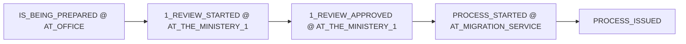
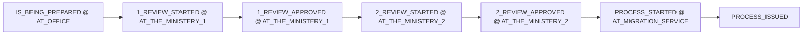

# Application progress — approval processes and contract-based ministry depth

> **Purpose:** Reference for how officers record **`ApplicationProgress`** approval steps, how **ministry legs** are chosen per application, and how **`ProjectContract`** overrides type defaults. For validation layers, SLA, and transition graphs see [`APPLICATION_PROGRESS_STATE_VALIDATION.md`](APPLICATION_PROGRESS_STATE_VALIDATION.md).
>
> **Related:**
> - [`APPLICATION_PROGRESS_DOMAIN_NOTES.md`](APPLICATION_PROGRESS_DOMAIN_NOTES.md) — domain ideation and route-on-type design (§8)
> - [`APPLICATION_LISTVIEW_STATE_COLORS.md`](APPLICATION_LISTVIEW_STATE_COLORS.md) — ListView row color from latest progress
> - [`OPTIONAL_DETAIL_FIELDS.md`](OPTIONAL_DETAIL_FIELDS.md) — gear toggle; item optional fields stay editable after office prep (§3.4)
> - [`LOOKUP_SEEDING.md`](LOOKUP_SEEDING.md) — tenant catalog sync (`project-contract.json`)
> - Module: [`ApplicationProgress.cs`](../Visa2026.Module/BusinessObjects/ApplicationProgress.cs), [`ApplicationProgressProfileResolver.cs`](../Visa2026.Module/BusinessObjects/ApplicationProgressProfileResolver.cs), [`ApplicationProgressRouteHelper.cs`](../Visa2026.Module/BusinessObjects/ApplicationProgressRouteHelper.cs), [`ApplicationProgressTransitionHelper.cs`](../Visa2026.Module/BusinessObjects/ApplicationProgressTransitionHelper.cs)
> - Catalogs: [`application-state.json`](../Visa2026.Module/DatabaseUpdate/LookupCatalogs/application-state.json), [`application-location.json`](../Visa2026.Module/DatabaseUpdate/LookupCatalogs/application-location.json), [`tenant/project-contract.json`](../Visa2026.Module/DatabaseUpdate/LookupCatalogs/tenant/project-contract.json)

---

## 1. Officer model: append-only progress history

Each **`ApplicationProgress`** row is one **audited milestone**. Officers do not flip a single “current status” field; they **add rows** to `Application.ProgressHistory`.

| Field | Lookup / type | Role |
|-------|----------------|------|
| `State` | `ApplicationState` (`Code`) | *What happened* in the workflow (preparing, review started, approved, issued, …) |
| `Location` | `ApplicationLocation` (`Code`) | *Where the file is* (office, ministry 1, ministry 2, migration service) |
| `Date` | `DateTime` | When the step took effect (anchor for elapsed days / SLA) |
| `Description` | optional text | Officer comment |

**Effective position** = latest row by `Date`, then `ID` ([`ApplicationProgressHelper.GetLatest`](../Visa2026.Module/BusinessObjects/ApplicationProgressHelper.cs)).

On the **`ApplicationProgress`** detail view:

- **`AvailableStatesForNextStep`** — states legal as the *next* step from the prior row (transition graph ∩ route profile).
- **`AvailableLocationsForSelectedState`** — locations legal for the chosen state (canonical pairs ∩ route).

Implemented in [`ApplicationProgress.cs`](../Visa2026.Module/BusinessObjects/ApplicationProgress.cs); validation on save in [`ApplicationProgressCommitValidationController`](../Visa2026.Module/Controllers/ApplicationProgressViewController.cs).

---

## 2. Two axes: route and ministry depth

Workflow is **not** inferred from `ShowProjectContract` (that flag only controls whether the contract field appears on the Application form).

### 2.1 Progress route (`ApplicationType.ApplicationProgressRoute`)

| `ApplicationProgressRouteKind` | After office preparation | Ministry states |
|--------------------------------|--------------------------|-----------------|
| `ViaMinistries` | → first ministry review | `1_REVIEW_*`, optionally `2_REVIEW_*`, … up to 5 |
| `DirectToMigrationService` | → migration service | **No** ministry states |

Seeded per type in [`ApplicationTypeConfigurationCatalog.json`](../Visa2026.Module/DatabaseUpdate/LookupCatalogs/ApplicationTypeConfigurationCatalog.json).

Navigation splits list views by route ([`ApplicationProgressRouteNavigation`](../Visa2026.Module/BusinessObjects/ApplicationProgressRouteNavigation.cs), [`CustomNavigationUpdater`](../Visa2026.Module/DatabaseUpdate/CustomNavigationUpdater.cs)).

### 2.2 Ministry depth (flattened model)

When route is **`ViaMinistries`**, how many ministry **legs** apply is determined by the **selected `ProjectContract`** (each contract row *is* one approval process variant):

| Source | Meaning |
|--------|---------|
| [`ProjectContract.MinistryLegs`](../Visa2026.Module/BusinessObjects/ProjectContractMinistryLeg.cs) | Ordered 1…5 `ApprovingMinistry` rows on the contract |
| [`Application.ApprovalLegSnapshots`](../Visa2026.Module/BusinessObjects/ApplicationApprovalLegSnapshot.cs) | Immutable copy at contract selection time (shows ministry short names on progress) |
| Legacy `ApplicationType.MinistryReviewDepth` | Fallback when contract has no legs configured |

**Removed (2026-06 flatten):** nested `ProjectContractApprovalProfile`, second dropdown `Application.ContractApprovalProfile`, visa-period auto-filter (`MinDurationMonths` / `MaxDurationMonths`). Officers pick the **contract row** directly (e.g. Şatlyk‑1 gysga vs Şatlyk‑1 uzyn).

Dynamic transition graph: [`ApplicationProgressLegCodes`](../Visa2026.Module/BusinessObjects/ApplicationProgressLegCodes.cs) (supports 1…5 legs).

---

## 3. Contract-based ministry legs

When `ShowProjectContract = true` and route is **via ministries**, each **`ProjectContract`** row defines one approval process. Multiple variants share the same **`Code`** (e.g. both GT-15 rows use `Code = "GT-15"`) but differ by **`NameTm`** and leg count.

### 3.1 Data

| Entity | Role |
|--------|------|
| [`ApprovingMinistry`](../Visa2026.Module/BusinessObjects/ApprovingMinistry.cs) | Tenant lookup — government **review** ministries only (`ShortNameTm` on progress ministry legs). **Not** migration service — that is [`MigrationService`](../Visa2026.Module/BusinessObjects/LookupBusinessObjects.cs) on Application + automatic `AT_MIGRATION_SERVICE` progress step |
| [`ProjectContract`](../Visa2026.Module/BusinessObjects/ProjectContract.cs) | One approval process per row; `IsActive`, optional `Description`; **`MinistryLegs`** collection |
| [`ProjectContractMinistryLeg`](../Visa2026.Module/BusinessObjects/ProjectContractMinistryLeg.cs) | Ministry + sequence on the contract |
| [`Application.ProjectContract`](../Visa2026.Module/BusinessObjects/Application.cs) | Officer's chosen process (single dropdown, active contracts only) |
| [`ApplicationApprovalLegSnapshot`](../Visa2026.Module/BusinessObjects/ApplicationApprovalLegSnapshot.cs) | Immutable ministry short names at selection time |

GT-15 seed example ([`tenant/project-contract.json`](../Visa2026.Module/DatabaseUpdate/LookupCatalogs/tenant/project-contract.json) + [`ProjectContractMinistrySeedUpdater`](../Visa2026.Module/DatabaseUpdate/ProjectContractMinistrySeedUpdater.cs)):

| Contract row | Legs |
|--------------|------|
| GT-15 | 1 (default project contract for reports / E2E) |
| Şatlyk‑1 — gysga (1 ministrlik) | 1 |
| Şatlyk‑1 (2 ministrlik) | 2 |
| Şatlyk‑1 — uzyn (3 ministrlik) | 3 |

### 3.2 Resolution (`ApplicationProgressProfileResolver`)

```text
GetMinistryLegCount(Application)

1. Route = DirectToMigrationService → 0
2. ApprovalLegSnapshots present     → snapshot count
3. ProjectContract with MinistryLegs → leg count
4. Else                             → ApplicationType.MinistryReviewDepth (legacy enum → 0/1/2)
```

No visa-period filtering — officer selects the appropriate contract row manually.

### 3.3 Business rules

| Rule | Enforcement |
|------|----------------|
| Contract required before leaving office prep | **Block** (unchanged) |
| Active contract ministry legs | **Optional** on contract save — legs can be added later. SLA (`MaxDaysInReview`) validated only when legs exist. Applications on via-ministries routes still require configured legs before progress beyond office preparation (`Application.ProjectContractLegsRequired`). |
| Contract locked after ministry/migration steps | **Block** revert — `Application.ProjectContractLockedAfterProgress` |
| Contract legs immutable once referenced | **Block** structural leg edits — `ProjectContract.MinistryLegsStructuralEditBlocked` |
| Progress shows ministry name | `ApplicationProgress.MinistryStepLabel` from snapshot |

Controllers: [`ApplicationProjectContractMinistryController`](../Visa2026.Module/Controllers/ApplicationProjectContractMinistryController.cs), [`ProjectContractMinistryController`](../Visa2026.Module/Controllers/ProjectContractMinistryController.cs).

### 3.4 Application header lock after office preparation

Once approval has **left office preparation** — any `ApplicationProgress` row that is **not** `IS_BEING_PREPARED @ AT_OFFICE` (`ApplicationProgressProfileResolver.HasProgressBeyondOfficePreparation`) — core **application identity** fields are read-only in the UI and on save. Workflow fields and child data filled **later in the process** stay editable.

| Locked (UI + commit) | Still editable |
|----------------------|----------------|
| `IsManualEntry`, `ApplicationNumber`, `AppNumberPrefix`, `FullApplicationNumber`, `ApplicationDate` | Visa / urgency / migration lookups (`VisaPeriod`, `VisaCategory`, `VisaType`, `MigrationService`, `Urgency`, …) |
| `ApplicationTypeQuickCode` / `ApplicationType` | Business trip and location fields (`BusinessTrip*`, `BorderZoneLocation`, `MovementPermitLocation`, `FromCity`, `ToCity`, …) |
| `ProjectContract` (also reverted on change in [`ApplicationProjectContractMinistryController`](../Visa2026.Module/Controllers/ApplicationProjectContractMinistryController.cs)) | Child tabs: `ApplicationItems`, `Invitations`, `Rejections`, `WorkPermits` |
| | `ProgressHistory` (officers keep appending rows) |
| | `ApplicationItem` lines — including gear-hidden optional fields (`RegistrationDate`, `TravelType`, …); see [`OPTIONAL_DETAIL_FIELDS.md`](OPTIONAL_DETAIL_FIELDS.md) |

**Single source for locked member names:** [`ApplicationProgressProfileResolver.LockedApplicationHeaderTargetItems`](../Visa2026.Module/BusinessObjects/ApplicationProgressProfileResolver.cs) — used by the class-level `[Appearance("ApplicationReadOnlyAfterOfficePreparation", …)]` on [`Application`](../Visa2026.Module/BusinessObjects/Application.cs) and by `TryValidateApplicationUnchangedAfterProgress` on commit ([`ApplicationProgressCommitValidationController`](../Visa2026.Module/Controllers/ApplicationProgressViewController.cs)).

**Officer message:** `Application.FieldsLockedAfterProgress` (`tools/GenerateModelLocalization/UiStrings.messages.json`).

**Not locked by this rule:** `IsProjectContractLocked` / contract UI disable applies only when `ShowProjectContract` is true; the header lock itself applies to all application types once progress has advanced.

Migration from Phase 2 profiles: [`ProjectContractApprovalProfileFlattenMigrationUpdater`](../Visa2026.Module/DatabaseUpdate/ProjectContractApprovalProfileFlattenMigrationUpdater.cs) (single-profile contracts), then [`ProjectContractApprovalProfileSchemaCleanupUpdater`](../Visa2026.Module/DatabaseUpdate/ProjectContractApprovalProfileSchemaCleanupUpdater.cs) drops legacy tables.

---

## 4. Approval process flows (by leg count)

Stable codes live in [`ApplicationProgressCatalogCodes`](../Visa2026.Module/BusinessObjects/ApplicationProgressCatalogCodes.cs) and JSON catalogs. Below is the **happy path**; reject/cancel branches exist on the same graph (see state validation doc §5).

### 4.1 Direct to migration (`DirectToMigrationService`)


```mermaid
flowchart LR
  A["IS_BEING_PREPARED @ AT_OFFICE"] --> B["PROCESS_STARTED @ AT_MIGRATION_SERVICE"]
  B --> C["PROCESS_ISSUED"]
```

No ministry review states or locations.

### 4.2 Via ministries — one leg

Typical when contract has one `MinistryLeg` (e.g. GT-15 or Şatlyk‑1 gysga).


```mermaid
flowchart LR
  A["IS_BEING_PREPARED @ AT_OFFICE"] --> B["1_REVIEW_STARTED @ AT_THE_MINISTERY_1"]
  B --> C["1_REVIEW_APPROVED @ AT_THE_MINISTERY_1"]
  C --> D["PROCESS_STARTED @ AT_MIGRATION_SERVICE"]
  D --> E["PROCESS_ISSUED"]
```

After first ministry approval, the file goes **straight to migration** (no `2_REVIEW_*`).

### 4.3 Via ministries — two legs

Typical for Şatlyk‑1 (2 ministrlik) or legacy `FirstAndSecondMinistry`.


```mermaid
flowchart LR
  A["IS_BEING_PREPARED @ AT_OFFICE"] --> B["1_REVIEW_STARTED @ AT_THE_MINISTERY_1"]
  B --> C["1_REVIEW_APPROVED @ AT_THE_MINISTERY_1"]
  C --> D["2_REVIEW_STARTED @ AT_THE_MINISTERY_2"]
  D --> E["2_REVIEW_APPROVED @ AT_THE_MINISTERY_2"]
  E --> F["PROCESS_STARTED @ AT_MIGRATION_SERVICE"]
  F --> G["PROCESS_ISSUED"]
```

Three or more legs follow the same pattern through `ApplicationProgressLegCodes` (legs 3–5).

### 4.4 Terminal and rejection codes

Shared across profiles (non-exhaustive):

| State codes | Meaning |
|-------------|---------|
| `1_REVIEW_REJECTED`, `2_REVIEW_REJECTED`, … | Ministry rejection (terminal for that leg) |
| `PROCESS_REJECTED` | Rejected at migration / general rejection |
| `PROCESS_CANCELLED` | Application cancelled |
| `PROCESS_ISSUED` | Completed successfully |

Officers cannot add progress after a terminal state ([`ApplicationProgressTransitionHelper`](../Visa2026.Module/BusinessObjects/ApplicationProgressTransitionHelper.cs)).

---

## 5. Configuration checklist

| Task | Where |
|------|--------|
| Set type route (ministries vs direct) | `ApplicationTypeConfigurationCatalog.json` → `ApplicationProgressRoute` |
| Set type **default** ministry depth (fallback) | Same catalog → `MinistryReviewDepth` |
| Configure **ministry legs** per contract | Project contract detail → **Ministrlik ädimleri**; ministries under Lookup → Organization → **ApprovingMinistry** |
| Add contract variants (same `Code`, different legs) | `tenant/project-contract.json` — one row per process |
| Verify state/location catalogs | `application-state.json`, `application-location.json` (legs 3–5 codes) |
| Localize contract field / messages | `UiStrings.entities.json`, `UiStrings.messages.json` → run `GenerateModelLocalization` |

**Do not** use `ShowProjectContract` to mean “two ministries” — configure **`ProjectContract.MinistryLegs`** or add a second contract row.

---

## 6. Tests and extension points

| Area | Location |
|------|----------|
| Resolver unit tests | [`ApplicationProgressProfileResolverTests.cs`](../Visa2026.Module.Tests/BusinessObjects/ApplicationProgressProfileResolverTests.cs) |
| Three-leg transition tests | [`ApplicationProgressTransitionHelperThreeLegTests.cs`](../Visa2026.Module.Tests/BusinessObjects/ApplicationProgressTransitionHelperThreeLegTests.cs) |

---

## 7. Changelog

| Date | Change |
|------|--------|
| 2026-06-13 | **Flatten:** each `ProjectContract` row = one process; `ProjectContractMinistryLeg`; removed approval profiles + second Application dropdown; migration updaters |
| 2026-06-13 | Phase 2 (superseded): `ProjectContractApprovalProfile` / legs, `Application.ContractApprovalProfile`, visa-period filter |
| 2026-06-01 | Phase 1: `ProjectContract.MinistryReviewDepth`, `ApplicationProgressProfileResolver`, contract required before leaving office prep |
