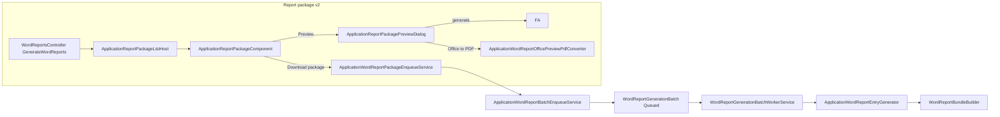
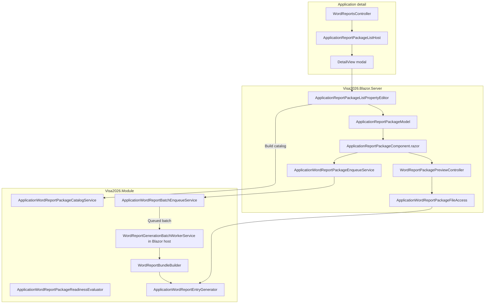

# Application report package dialog (Resminamalar v2)

**Resminamalar** on the **`Application`** detail view is the **improved successor** to the one-click **Generate Word Reports** flow. It keeps the same ministry ZIP output (`WordReportGenerationBatch` worker, `WordReportBundleBuilder`, system `IWordReportDefinition` + user Word/Excel templates) and adds a **report catalog**, **readiness chips**, **per-report selection**, **in-app PDF preview**, and **gap confirmation** — in one modal dialog.

This document describes **why** it replaces one-click Resminamalar, **what** officers get in the UI, **how it builds on the Word report batch pipeline**, and **how** it is implemented (Module domain + Blazor custom editor).

## Why it is needed (improvements over one-click Resminamalar)

**One-click Resminamalar (v1)** queued a background ZIP with little visibility:

- No list of which system letters, sanawy tables, or user templates would run.
- No readiness check before export (missing placeholders, empty item rows, etc.).
- All applicable reports always included — no subset.
- No single-report preview without waiting for the full ZIP.

**Report package dialog (v2)** is the same export capability with a better officer workflow:

| One-click Resminamalar (v1) | Report package dialog (v2) |
|-----------------------------|----------------------------|
| Queue ZIP immediately | See **catalog** (system + custom templates), then queue |
| All applicable reports | **Checkboxes** — ZIP contains checked rows only |
| No pre-flight check | **Readiness chips** + **gap confirm** for checked warnings |
| Download after batch | **Preview** per row — in-app **PDF viewer** (Office → PDF via DevExpress Office File API) + optional **Download Word/Excel** |
| Success toast only | **Resminamalar batch toast** with **Download ZIP** |

The **`GenerateWordReports`** action still uses caption **Resminamalar**; it now **opens the dialog** instead of enqueueing directly.

Related: [`docs/WORD_REPORT_GENERATION_IDEA.md`](WORD_REPORT_GENERATION_IDEA.md), user templates [`docs/USER_DEFINED_WORD_TEMPLATES_IDEA.md`](USER_DEFINED_WORD_TEMPLATES_IDEA.md).

## Successor to one-click Resminamalar (same ZIP engine, better UX)

The dialog is **not** a second ZIP builder. It is the **evolved entry point** for the existing pipeline.

### Design principle

| Layer | Approach |
|-------|----------|
| **ZIP contents & worker** | **Unchanged engine** — `WordReportBundleBuilder` / `ApplicationWordReportEntryGenerator`, `IWordFormFillerService`, `UserReportGenerator`, `ExcelReportGenerator` |
| **Batch record** | **Extended** — `WordReportGenerationBatch` + optional `SelectedReportKeysJson` (null/empty = all applicable, legacy batches) |
| **Enqueue** | **Shared** — `ApplicationWordReportBatchEnqueueService.TryEnqueueApplication` |
| **Catalog / readiness** | **New** — `ApplicationWordReportPackageCatalogService`, `ApplicationWordReportPackageReadinessEvaluator` |
| **UI** | **Custom Blazor dialog** — `ApplicationReportPackageComponent.razor` |

### Officer workflow: v1 → v2

| Former one-click | Report package (v2) |
|------------------|---------------------|
| Click **Resminamalar** → queue | Click **Resminamalar** → **dialog** |
| — | Review **System reports** / **Custom templates** sections |
| — | **Include** checkboxes (default all on first open) |
| — | **Preview** → in-app PDF popup (Document copies pattern) |
| — | **Download package** → optional gap confirm → queue |
| Toast / **Download ZIP** | Same **`WordReportBatchToastHost`** + `visaWordBatchToast.setCurrentBatchId` |

### Code paths



**Download package** = functional equivalent of v1 queue accept, with selection and safeguards.

**Preview** generates the same file as the ZIP (`ApplicationWordReportEntryGenerator`), converts **Word (`.docx`)** and **Excel (`.xlsx`)** to PDF with **DevExpress Office File API** (`DevExpress.Document.Processor`), and shows the PDF in a resizable popup (same iframe pattern as Document copies). Header actions: **Download Word/Excel**, **Download PDF**, **Close**. The REST preview endpoint remains for direct file download if needed.

**Office File API** requires a DevExpress Universal or Office File API subscription license (same as other DevExpress components in this app).

### Entry keys (`SelectedReportKeysJson`)

Stable keys from the catalog (JSON string array on the batch):

| Source | Key format | Example |
|--------|------------|---------|
| System `IWordReportDefinition` | `system:{FullTypeName}` | `system:Visa2026.Module.Services.WordReports.BusinessTripSanawyReportDef` |
| User `UserReportTemplate` | `user:{Guid}` | `user:3fa85f64-5717-4562-b3fc-2c963f66afa6` |

Legacy batches with null/empty `SelectedReportKeysJson` still generate **all** applicable reports.

## User-facing behaviour

### Opening the dialog

1. Open an **`Application`** detail view.
2. Click **Resminamalar** (`GenerateWordReports`) when at least one report applies.

### Dialog layout

1. **Report list** — scrollable cards:
   - **System reports** — `IWordReportDefinition` rows (output filename, `.docx`).
   - **Custom templates** — visible active `UserReportTemplate` rows (`.docx` / `.xlsx`).
   - Each row: **include checkbox**, **Ready** / **Check** chip, optional warning text, **Preview**.
2. **Footer**
   - Subtitle: *N of M report(s) selected for application …*
   - **Select all** | **Clear selection** | **Download package** | **Refresh**
   - Gap-confirm when **checked** rows have warnings; status after queue

### Preview

- **Preview** generates and **downloads** the report immediately from the main dialog (correct `.docx` / `.xlsx` file name). Status text in the footer reminds officers to use **Open** in the browser download bar for Word or Excel. The REST preview API remains for direct links.
- Same merge logic as ZIP; not a separate template path.

### Download package

1. At least one report must be checked.
2. Optional **gap confirm** when checked rows have **Check** readiness.
3. Creates **`WordReportGenerationBatch`** with `SelectedReportKeysJson` for checked keys only.
4. Registers batch on **`visaWordBatchToast`**; officer uses **Download ZIP** when complete.

## Architecture



### XAF integration pattern

Same approach as Document copies: **non-persistent host + custom Blazor property editor**.

| Piece | Role |
|-------|------|
| `WordReportsController` | Opens modal with `ApplicationReportPackageListHost` + `ApplicationId`. |
| `ApplicationReportPackageListHost` | `[DomainComponent]` shell; `ListUi` → `ApplicationReportPackageListPanel` editor. |
| `ApplicationReportPackageListPropertyEditor` | Loads application, builds catalog + readiness. |
| `ApplicationReportPackageComponent.razor` | Custom UI (checkboxes, preview, enqueue). |
| `Model.DesignedDiffs.xafml` | `ApplicationReportPackageListHost_DetailView`, CSS `app-report-package-list-detail`. |

## Module services (`Visa2026.Module`)

| File | Responsibility |
|------|----------------|
| `Services/WordReports/ApplicationWordReportPackageCatalogService.cs` | Applicable system defs + user templates; entry keys, filenames, readiness. |
| `Services/WordReports/ApplicationWordReportPackageReadinessEvaluator.cs` | User template warnings (file, placeholders, rows). |
| `Services/WordReports/ApplicationWordReportPackageDryRunEvaluator.cs` | Empty-field dry-run hints for catalog rows. |
| `Services/WordReports/ApplicationWordReportPackageSelectionHelper.cs` | Serialize/deserialize/normalize `SelectedReportKeysJson`. |
| `Services/WordReports/ApplicationWordReportEntryGenerator.cs` | Generate one or many reports by entry key (shared by ZIP + preview). |
| `Services/WordReports/ApplicationWordReportBatchEnqueueService.cs` | Creates `WordReportGenerationBatch`. |
| `Services/WordReports/WordReportBundleBuilder.cs` | ZIP wrapper over entry generator. |
| `Services/WordReports/IWordReportBatchTrackNotifier.cs` | Toast bridge from controller/enqueue. |
| `BusinessObjects/ApplicationReportPackageListHost.cs` | Non-persistent host BO. |
| `BusinessObjects/WordReportGenerationBatch.cs` | Batch + `SelectedReportKeysJson`. |
| `Controllers/WordReportsController.cs` | Opens dialog from **Resminamalar**. |

## Blazor host (`Visa2026.Blazor.Server`)

| File | Responsibility |
|------|----------------|
| `Editors/ApplicationReportPackageListPropertyEditor.cs` | Property editor; refresh reloads catalog. |
| `Editors/ApplicationReportPackageModel.cs` | Component model. |
| `Editors/ApplicationReportPackageComponent.razor` | Main dialog UI (catalog, selection, preview trigger). |
| `Editors/ApplicationReportPackagePreviewDialog.razor` | PDF iframe preview popup + Office/PDF download. |
| `Controllers/WordReportPackagePreviewController.cs` | Optional direct Office file download API. |
| `Services/ApplicationWordReportPackageFileAccess.cs` | Preview generation wrapper (+ bundle helper). |
| `Services/WordReports/ApplicationWordReportOfficePreviewPdfConverter.cs` | Word/Excel bytes → PDF (Office File API). |
| `Services/ApplicationWordReportPackageEnqueueService.cs` | HTTP user → batch enqueue + toast track. |
| `Services/WordReportGenerationBatchWorkerService.cs` | Background ZIP (reads `SelectedReportKeysJson`). |
| `Components/WordReportBatchToastHost.razor` | Progress + download link. |
| `wwwroot/css/site.css` | `.app-report-package*` layout. |
| `Pages/_Host.cshtml` | `visaWordBatchToast`, `visaReportPackage.openPreview`. |

## Localization

- UI strings: `tools/GenerateModelLocalization/UiStrings.messages.json` → prefix `ApplicationReportPackage.*`
- Regenerate: `dotnet run --project tools/GenerateModelLocalization/GenerateModelLocalization.csproj`
- Action caption: `GenerateWordReports` = **Resminamalar** in `Model.DesignedDiffs.xafml`

## Security

- `ApplicationReportPackageListHost` exported in `Module.cs`; read granted in `DatabaseUpdate/Updater.cs`.
- Preview API requires auth; entry key must match catalog for the application (no arbitrary template id).
- Enqueue requires signed-in user (`ApplicationWordReportPackageEnqueueService`).

## Maintenance notes

- **Keep ZIP parity:** generator changes must affect both **Preview** and **Download package**.
- **New system report:** ensure `IWordReportDefinition` registration + applicability; catalog picks it up automatically.
- **New user template:** visibility via `UserReportTemplate` + `IUserReportVisibilityService`; readiness rules in `ApplicationWordReportPackageReadinessEvaluator`.
- **Schema:** column `SelectedReportKeysJson` on `WordReportGenerationBatches` — `WordReportGenerationBatchSelectedReportKeysUpdater` (before EF sync); **`BatchWorkerSchemaGate.EnsureBatchSchemaColumns`** in Blazor startup adds the column idempotently before batch APIs/workers run. If still missing, restart once with **`FORCE_XAF_DB_UPDATE=true`** ([`docs/ENVIRONMENTS.md`](ENVIRONMENTS.md)), or run:
  ```sql
  ALTER TABLE dbo.WordReportGenerationBatches ADD SelectedReportKeysJson nvarchar(max) NULL;
  ```

## Implementation phases

| Phase | Status | Scope |
|-------|--------|--------|
| **0** | Done | Shared enqueue, toast `setCurrentBatchId`, track notifier |
| **1** | Done | Dialog, catalog, readiness chips, gap confirm, full ZIP |
| **2** | Done | Checkboxes, subset ZIP, preview API, `SelectedReportKeysJson` |
| **3** | Done | Dry-run readiness hints |
| **4** | Done | In-app PDF preview (DevExpress Office File API, Word + Excel), Document copies–style popup, Office/PDF download |

## Related code

- Legacy idea doc: [`docs/WORD_REPORT_GENERATION_IDEA.md`](WORD_REPORT_GENERATION_IDEA.md)
- Parallel UX pattern: [`docs/APPLICATION_ITEM_DOCUMENT_COPIES.md`](APPLICATION_ITEM_DOCUMENT_COPIES.md)
- Worker: `Visa2026.Blazor.Server/Services/WordReportGenerationBatchWorkerService.cs`
- Bundle: `Visa2026.Module/Services/WordReports/WordReportBundleBuilder.cs`
