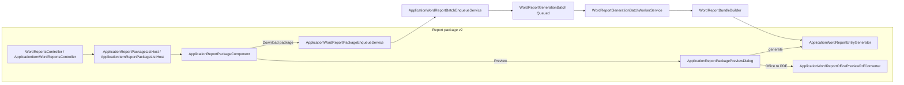

# Application report package dialog (Resminamalar v2)

**Resminamalar** on the **`Application`** detail view (and on **`ApplicationItem`** ListView for item-scoped templates) is the officer-facing **report package dialog**. It lists **user report templates** (`UserReportTemplate` seeded from **`Visa2026.Module/Resources/Templates/`**), supports **readiness chips**, **per-report selection**, **in-app PDF preview**, and **background ZIP download** via the existing `WordReportGenerationBatch` worker.

This document describes **why** it replaced one-click Resminamalar, **what** officers get in the UI, **how it builds on the batch pipeline**, and **how** it is implemented (Module domain + Blazor custom editor).

**Agent skill:** [`.cursor/skills/visa2026-resminamalar/SKILL.md`](../.cursor/skills/visa2026-resminamalar/SKILL.md) (bugs, UX, batch). **Chat prompts:** [`.cursor/skills/visa2026-resminamalar/prompts.md`](../.cursor/skills/visa2026-resminamalar/prompts.md). **Template seeds / merge:** [`.cursor/skills/visa2026-user-report-templates/SKILL.md`](../.cursor/skills/visa2026-user-report-templates/SKILL.md).

## Why it is needed (improvements over one-click Resminamalar)

**One-click Resminamalar (v1)** queued a background ZIP with little visibility:

- No list of which user templates would run.

- No readiness check before export (missing placeholders, empty item rows, etc.).

- All applicable reports always included — no subset.

- No single-report preview without waiting for the full ZIP.

**Report package dialog (v2)** is the same export capability with a better officer workflow:

| One-click Resminamalar (v1) | Report package dialog (v2) |

|-----------------------------|----------------------------|

| Queue ZIP immediately | See **catalog** (user templates), then queue |

| All applicable reports | **Checkboxes** — ZIP contains checked rows only |

| No pre-flight check | **Readiness chips** + **gap confirm** for checked warnings |

| Download after batch | **Preview** per row — in-app **PDF viewer** (Office → PDF) + optional **Download Word/Excel** |

| Success toast only | **Resminamalar batch toast** with **Download ZIP** |

The **`GenerateWordReports`** / **`ViewApplicationItemWordReports`** actions use caption **Resminamalar**; they **open the dialog** instead of enqueueing directly.

Related: user templates [`docs/USER_DEFINED_WORD_TEMPLATES_IDEA.md`](USER_DEFINED_WORD_TEMPLATES_IDEA.md). Legacy code-backed Word / XtraReports: removed — see [`docs/DEPRECATED.md`](DEPRECATED.md).

## Successor to one-click Resminamalar (same ZIP engine, better UX)

The dialog is **not** a second ZIP builder. It is the **evolved entry point** for the existing pipeline.

### Design principle

| Layer | Approach |

|-------|----------|

| **ZIP contents & worker** | `WordReportBundleBuilder` / `ApplicationWordReportEntryGenerator` → **`UserReportGenerator`**, **`ExcelReportGenerator`** |

| **Batch record** | `WordReportGenerationBatch` + optional `SelectedReportKeysJson` (null/empty = all applicable, legacy batches) + optional `SelectedApplicationItemIdsJson` for item scope |

| **Enqueue** | `ApplicationWordReportBatchEnqueueService.TryEnqueueApplication` |

| **Catalog / readiness** | `ApplicationWordReportPackageCatalogService`, `ApplicationWordReportPackageReadinessEvaluator`, dry-run hints |

| **UI** | Custom Blazor dialog — `ApplicationReportPackageComponent.razor` |

| **Template seed** | `UserReportTemplateUpdater` + **`UserReportTemplateSeedGate`** (host startup when XAF DB update had no DI) |

### Officer workflow: v1 → v2

| Former one-click | Report package (v2) |

|------------------|---------------------|

| Click **Resminamalar** → queue | Click **Resminamalar** → **dialog** |

| — | Review template list (checkboxes, Ready / Check) |

| — | Optional **gear**: **Edit template** + hint lines (hidden by default) |

| — | **Preview** → in-app PDF popup |

| — | **Download package** → optional gap confirm → queue |

| Toast / **Download ZIP** | Same **`WordReportBatchToastHost`** + `visaWordBatchToast.setCurrentBatchId` |

### Code paths

**Download package** = functional equivalent of v1 queue accept, with selection and safeguards.

**Preview** generates the same file as the ZIP (`ApplicationWordReportEntryGenerator`), converts **Word (`.docx`)** and **Excel (`.xlsx`)** to PDF with **DevExpress Office File API**, and shows the PDF in a resizable popup (same iframe pattern as Document copies).

### Entry keys (`SelectedReportKeysJson`)

Stable keys from the catalog (JSON string array on the batch):

| Source | Key format | Example |

|--------|------------|---------|

| User `UserReportTemplate` | `user:{Guid}` | `user:3fa85f64-5717-4562-b3fc-2c963f66afa6` |

Legacy batches with null/empty `SelectedReportKeysJson` still generate **all** applicable templates. Old keys prefixed `system:` (removed code-backed reports) are ignored at generation time.

### Data scope (Application vs ApplicationItem)

| Entry point | Scope | Templates shown |

|-------------|-------|-----------------|

| **`Application`** detail — **Resminamalar** | `WordReportPackageScope.Application` | `RootBoType.Application` |

| **`ApplicationItem`** ListView — **Resminamalar** (selected rows, same application) | `WordReportPackageScope.ApplicationItem` | `RootBoType.ApplicationItem` or `Person` |

Item-scoped batches store **`SelectedApplicationItemIdsJson`**. **Word** per-item templates → **one file per selected line** in the ZIP; **Excel ItemList** → **one `.xlsx`** with rows for selected lines. Preview uses the **first selected line** for per-item Word templates and the **full filtered set** for Excel lists.

Shared types: `WordReportGenerationContext`, `WordReportDefinitionScopeHelper`, `ApplicationItemReportPackageListHost`, `ApplicationItemWordReportsController`, `ApplicationItemReportPackageListPropertyEditor` (reuses `ApplicationReportPackageComponent`).

## User-facing behaviour

### Opening the dialog

**Application scope**

1. Open an **`Application`** detail view.

2. Click **Resminamalar** when at least one application-scoped template applies.

**ApplicationItem scope**

1. On an **`ApplicationItem`** ListView, select one or more lines from the **same** application.

2. Click **Resminamalar** when at least one item-scoped template applies.

### Dialog layout

1. **Report list** — scrollable cards for each visible active **`UserReportTemplate`** (`.docx` / `.xlsx` badge).

   - Each row: **include checkbox**, **Ready** / **Check** chip, optional warning text, **Preview**.

   - **Edit template** + readiness hint lines when footer **gear** is on (hidden by default).

2. **Footer**

   - Subtitle: selected count for application / items

   - **Select all** | **Clear selection** | **Download package** | **Refresh** | **gear**

### Preview

- **Preview** opens in-app PDF viewer (Word/Excel → PDF). **Download Word/Excel** and **Download PDF** in the preview header.

- Same merge logic as ZIP.

### Edit custom template

Users with **Write** on **`UserReportTemplate`** see **Edit template** when the footer **gear** is toggled on. **Users role** has Read/Write/Create on templates and full access on **`UserReportPlaceholder`** for Extract. See `UserReportTemplateEditLinkService`, `UserReportTemplateEditAccess`.

### Download package

1. At least one report must be checked.

2. Optional **gap confirm** when checked rows have **Check** readiness (advisory only — cancel skips enqueue).

3. Creates **`WordReportGenerationBatch`** with `SelectedReportKeysJson` for checked keys.

4. Toast **Download ZIP** when the worker completes.

## Architecture

Same XAF pattern as Document copies: **non-persistent host + custom Blazor property editor**. Full file map: [`.cursor/skills/visa2026-resminamalar/reference.md`](../.cursor/skills/visa2026-resminamalar/reference.md).

## Localization

- UI strings: `tools/GenerateModelLocalization/UiStrings.messages.json` → `ApplicationReportPackage.*`, `ApplicationItemReportPackage.*`

- Regenerate: `dotnet run --project tools/GenerateModelLocalization/GenerateModelLocalization.csproj`

## Security

- Host BOs exported in `Module.cs`; read granted in `DatabaseUpdate/Updater.cs`.

- Preview API requires auth; entry key must match catalog for the application.

- Enqueue requires signed-in user.

## Maintenance notes

- **Keep ZIP parity:** generator changes must affect both **Preview** and **Download package**.

- **New user template:** seed under `Resources/Templates/` → `UserReportTemplateUpdater`; visibility via template record + `IUserReportVisibilityService`.

- **Empty template list after deploy:** ensure `UserReportTemplateSeedGate` runs (console log on success); DEBUG re-seeds every startup.
- **Skill experience:** Resminamalar incidents → append [`.cursor/skills/visa2026-resminamalar/learnings.md`](../.cursor/skills/visa2026-resminamalar/learnings.md); promotion rules in [`.cursor/skills/visa2026-resminamalar/MATURITY.md`](../.cursor/skills/visa2026-resminamalar/MATURITY.md).

- **Schema:** `SelectedReportKeysJson`, `SelectedApplicationItemIdsJson` — `BatchWorkerSchemaGate` + updaters; optional `FORCE_XAF_DB_UPDATE=true` once ([`docs/ENVIRONMENTS.md`](ENVIRONMENTS.md)).

## Implementation phases

| Phase | Status | Scope |

|-------|--------|--------|

| **0** | Done | Shared enqueue, toast, track notifier |

| **1** | Done | Dialog, catalog, readiness, full ZIP |

| **2** | Done | Checkboxes, subset ZIP, preview, selection JSON |

| **3** | Done | Dry-run readiness hints |

| **4** | Done | In-app PDF preview (Word + Excel) |

| **5** | Done | ApplicationItem scope; user templates only (code-backed reports removed) |

## Related code

- Parallel UX: [`docs/APPLICATION_ITEM_DOCUMENT_COPIES.md`](APPLICATION_ITEM_DOCUMENT_COPIES.md)

- Worker: `Visa2026.Blazor.Server/Services/WordReportGenerationBatchWorkerService.cs`

- Seed gate: `Visa2026.Blazor.Server/Services/UserReportTemplateSeedGate.cs`

