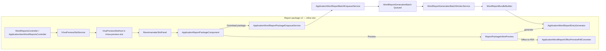

# Application report package dialog (Resminamalar v2)

**Templates** (toolbar / slot caption; historically **Resminamalar**) on the **`Application`** detail view (and on **`ApplicationItem`** ListView for item-scoped templates) is the officer-facing **report package dialog**. It lists **user report templates** (`UserReportTemplate` seeded from **`Visa2026.Module/Resources/Templates/`**), supports **readiness chips**, **per-report selection**, **in-app PDF preview**, and **background ZIP download** via the existing `WordReportGenerationBatch` worker. Brand mark: **`Templates`** ImageName + `.templates-brand*` (see [`PREVIEW_SLOT.md`](PREVIEW_SLOT.md)).

This document describes **why** it replaced one-click Resminamalar, **what** officers get in the UI, **how it builds on the batch pipeline**, and **how** it is implemented (Module domain + Blazor custom editor).

**Agent skill:** [`.cursor/skills/visa2026-resminamalar/SKILL.md`](../.cursor/skills/visa2026-resminamalar/SKILL.md) (bugs, UX, batch, **desktop template staging**). **Chat prompts:** [`.cursor/skills/visa2026-resminamalar/prompts.md`](../.cursor/skills/visa2026-resminamalar/prompts.md). **Template seeds / merge:** [`.cursor/skills/visa2026-user-report-templates/SKILL.md`](../.cursor/skills/visa2026-user-report-templates/SKILL.md). **Desktop Word/Excel edit (local sandbox):** [`docs/TEMPLATE_STAGING_EDIT.md`](TEMPLATE_STAGING_EDIT.md).

## Why it is needed (improvements over one-click Resminamalar)

**One-click Resminamalar (v1)** queued a background ZIP with little visibility:

- No list of which user templates would run.

- No readiness check before export (missing placeholders, empty item rows, etc.).

- All applicable reports always included — no subset.

- No single-report preview without waiting for the full ZIP.

**Report package dialog (v2)** is the same export capability with a better officer workflow:

| One-click Resminamalar (v1) | Report package dialog (v2) |

|-----------------------------|----------------------------|

| Queue ZIP immediately | See **catalog** (user templates), then queue |

| All applicable reports | **Checkboxes** — ZIP contains checked rows only |

| No pre-flight check | **Readiness chips** + **gap confirm** for checked warnings |

| Download after batch | **Preview** per row — in-app **PDF viewer** (Office → PDF) + optional **Download Word/Excel** |

| Success toast only | **Resminamalar batch toast** with **Download ZIP** |

The **`GenerateWordReports`** / **`ViewApplicationItemWordReports`** actions use caption **Resminamalar**; they **open the global inline preview slot** (right panel, default **50vw**, **draggable resize** 320px–100vw, persisted in `sessionStorage` v4) instead of enqueueing directly or opening a modal. While the slot is open, the **left nav collapses**; expanding nav via the menu toggler **closes** the slot.

Related: user templates [`docs/USER_DEFINED_WORD_TEMPLATES_IDEA.md`](USER_DEFINED_WORD_TEMPLATES_IDEA.md). Legacy code-backed Word / XtraReports: removed — see [`docs/DEPRECATED.md`](DEPRECATED.md).

## Successor to one-click Resminamalar (same ZIP engine, better UX)

The dialog is **not** a second ZIP builder. It is the **evolved entry point** for the existing pipeline.

### Design principle

| Layer | Approach |

|-------|----------|

| **ZIP contents & worker** | `WordReportBundleBuilder` / `ApplicationWordReportEntryGenerator` → **`UserReportGenerator`**, **`ExcelReportGenerator`** |

| **Batch record** | `WordReportGenerationBatch` + optional `SelectedReportKeysJson` (null/empty = all applicable, legacy batches) + optional `SelectedApplicationItemIdsJson` for item scope |

| **Enqueue** | `ApplicationWordReportBatchEnqueueService.TryEnqueueApplication` |

| **Catalog / readiness** | `ApplicationWordReportPackageCatalogService`, `ApplicationWordReportPackageReadinessEvaluator`, dry-run hints |

| **UI** | Global **`#visa-preview-slot`** — `ResminamalarSlotPanel` + `ApplicationReportPackageComponent` (`UseInlinePreview`) + `ReportPackageInlinePreview` |
| **Catalog chrome** | Flat selectable cards (`.resminamalar-catalog`) — Document Copies Prototype A **look** (format icon circle + title + summary + READY/CHECK + Preview / Download Template / recycle-bin icon behind gear); keep checkboxes / ZIP selection. Case workspace: same flat catalog; header chips filter people. **Recycle Bin** tab: Restore + Delete permanently. See [`PREVIEW_SLOT.md`](PREVIEW_SLOT.md) § Resminamalar catalog chrome |
| **Slot shell** | [`.cursor/skills/visa2026-preview-slot/SKILL.md`](../.cursor/skills/visa2026-preview-slot/SKILL.md) + [`docs/PREVIEW_SLOT.md`](PREVIEW_SLOT.md) |

| **Slot policy** | Single global occupant — **last open wins** (`OccupantKey` + `Version`); `@key` remount on switch; **owner-aware** auto-close (`OwnerViewId` = XAF `View.Id`) |

### Preview slot switching (single occupant)

One **`#visa-preview-slot`** serves Resminamalar (application scope, item scope) and file preview. **`OpenResminamalarAsync`** / **`OpenFileAsync`** always **preempt** the current occupant (no stacking).

| Concept | Implementation |

|---------|----------------|

| **Occupant identity** | `VisaPreviewSlotOccupantKeys` — e.g. `resminamalar:app:{id}`, `resminamalar:items:{appId}:{itemIds}`, `file:{source}:{id}` |

| **UI remount** | `VisaPreviewSlotHost` — `@key="_state.Version"` on `ResminamalarSlotPanel` / file drawer (resets catalog + inline PDF state) |

| **Owner** | Controllers pass `VisaPreviewSlotViewHelper.ResolveOwnerViewId(View)` |

| **Auto-close** | `VisaPreviewSlotCloseController` closes only when the **owning** view deactivates (nested ApplicationItem ListView does not close Application-owned slot until a new open preempts) |

**Typical flow:** Application DetailView Resminamalar open → officer selects items and clicks Resminamalar on nested ListView → item-scoped catalog replaces application catalog (and any open PDF preview).

| **Template seed** | `UserReportTemplateUpdater` + **`UserReportTemplateSeedGate`** (host startup when XAF DB update had no DI) |

### Officer workflow: v1 → v2

| Former one-click | Report package (v2) |

|------------------|---------------------|

| Click **Resminamalar** → queue | Click **Resminamalar** → **inline slot** (main content shrinks left) |

| — | Review template list (checkboxes, Ready / Check) |

| — | Optional **gear**: **Download Template**, **Review placeholders**, Recycle, and readiness hint lines (hidden by default) |

| — | **Choose template folder** (once), **Sync to database** after editing |

| — | **Preview** → in-slot **PDF viewer** (catalog **or** preview — exclusive toggle; **Close** returns to catalog) |

| — | **Review placeholders** (when Create from yellow marks is enabled) → scan Review on this-profile nested Word/Excel so officers can remap `{{…}}` after Approve stripped yellow |

| — | **Download package** → optional gap confirm → queue |

| Toast / **Download ZIP** | Same **`WordReportBatchToastHost`** + `visaWordBatchToast.setCurrentBatchId` |

**Empty catalog:** slot still opens; localized message inside the panel (e.g. no Application-scope templates for this application type). No modal.

**Recycle Bin:** Recycle-bin icon on an officer-created **this-profile** nested template (Create template / Add existing template) asks to **Move to Recycle Bin**; confirm then shows a progress bar until the row leaves Catalog. Seeded library rows (Category / Global) have no recycle icon. Recycle Bin **Restore** returns the row to the live catalog; **Delete permanently** removes the nested template (and the linked `UserReportTemplate` when no other nested row shares the name). Recycle is profile-wide, not per case.

### Case workspace

On the in-process case **Resminamalar** tab (same header people chips as Document copies):

- Header chips **include or hide** roster people (default: all selected). Catalog Preview and **Download package** use the filtered `Person.ID` set.
- The catalog is a single flat template list (no By person / By type switch). Row **Preview** generates the template for **all** chip-selected people (per-person Word forms such as Şahsy kagyz are merged into one PDF).
- Sanaw / list templates stay one document with a row per selected person.
- ListView / Application DetailView Resminamalar (no case chips) is unchanged: generate for the full roster unless item ids are passed.

### Code paths

```mermaid

flowchart LR

  subgraph current [Report package v2 — inline slot]

    BTN[WordReportsController / ApplicationItemWordReportsController]

    SLOT[IVisaPreviewSlotService]

    HOST[VisaPreviewSlotHost in #visa-preview-slot]

    PANEL[ResminamalarSlotPanel]

    UI[ApplicationReportPackageComponent]

    PREVIEW[ReportPackageInlinePreview]

    ENQ[ApplicationWordReportPackageEnqueueService]

    BTN --> SLOT --> HOST --> PANEL --> UI

    UI -->|Preview| PREVIEW

    PREVIEW -->|generate| GEN[ApplicationWordReportEntryGenerator]

    PREVIEW -->|Office to PDF| OFA[ApplicationWordReportOfficePreviewPdfConverter]

    UI -->|Download package| ENQ

  end

  ENQ --> BATCH[ApplicationWordReportBatchEnqueueService]

  BATCH --> ROW[WordReportGenerationBatch Queued]

  ROW --> WORK[WordReportGenerationBatchWorkerService]

  WORK --> ZIP[WordReportBundleBuilder]

  ZIP --> GEN

```

**Download package** = functional equivalent of v1 queue accept, with selection and safeguards.

**Preview** generates the same file as the ZIP (`ApplicationWordReportEntryGenerator`), converts **Word (`.docx`)** and **Excel (`.xlsx`)** to PDF with **DevExpress Office File API**, and shows the PDF in the **inline slot** (`ReportPackageInlinePreview` — same iframe/blob pattern as Document copies). Legacy modal `ApplicationReportPackagePreviewDialog` remains for property-editor hosts only.

### Entry keys (`SelectedReportKeysJson`)

Stable keys from the catalog (JSON string array on the batch):

| Source | Key format | Example |

|--------|------------|---------|

| User `UserReportTemplate` | `user:{Guid}` | `user:3fa85f64-5717-4562-b3fc-2c963f66afa6` |

Legacy batches with null/empty `SelectedReportKeysJson` still generate **all** applicable templates. Old keys prefixed `system:` (removed code-backed reports) are ignored at generation time.

### Data scope (Application vs ApplicationItem)

| Entry point | Scope | Templates shown |

|-------------|-------|-----------------|

| **`Application`** detail — **Resminamalar** | `WordReportPackageScope.Application` | `RootBoType.Application` |

| **`ApplicationItem`** ListView — **Resminamalar** (selected rows, same application) | `WordReportPackageScope.ApplicationItem` | `RootBoType.ApplicationItem` or `Person` |

Item-scoped batches store **`SelectedApplicationItemIdsJson`**. **Word** per-item templates → **one file per selected line** in the ZIP; **Excel ItemList** → **one `.xlsx`** with rows for selected lines. Preview uses the **first selected line** for per-item Word templates and the **full filtered set** for Excel lists.

Shared types: `WordReportGenerationContext`, `WordReportDefinitionScopeHelper`, `ApplicationItemReportPackageListHost`, `ApplicationItemWordReportsController`, `ApplicationItemReportPackageListPropertyEditor` (reuses `ApplicationReportPackageComponent`).

## User-facing behaviour

### Opening the dialog

**Application scope**

1. Open an **`Application`** detail view.

2. Click **Resminamalar** when at least one application-scoped template applies.

**ApplicationItem scope**

1. On an **`ApplicationItem`** ListView, select one or more lines from the **same** application.

2. Click **Resminamalar** when at least one item-scoped template applies.

### Dialog layout

1. **Report list** — scrollable cards for each visible active **`UserReportTemplate`** (`.docx` / `.xlsx` badge).

   - Each row: **include checkbox**, **Ready** / **Check** chip, optional warning text, **Preview**.

   - Footer **gear** on: **Download Template**, **Review placeholders**, Recycle, and readiness hint lines (hidden by default). **Edit template** is not on catalog rows.

2. **Footer**

   - Subtitle: selected count for application / items

   - **Select all** | **Clear selection** | **Download package** | **gear**

### Preview

- **Preview** opens in-app PDF viewer (Word/Excel → PDF). **Download Word/Excel** and **Download PDF** in the preview header.

- Same merge logic as ZIP.

### Edit custom template (desktop Word/Excel — local sandbox)

When **`TemplateEditStaging:Enabled`** is true, catalog rows no longer show **Edit template**. Officers use **Download Template** (gear on) to save the Word/Excel file, then edit locally. Staging **Sync to database** remains available from the host when enabled.

| Step | Officer action | System behavior |

|------|----------------|-----------------|

| 1 | **Once:** **Choose template folder** (footer) | Browser grants write access; creates `Documents\Visa2026Templates` |

| 2 | **Edit template** (gear on) | Export from DB → write to local sandbox → try Word/Excel open; **Copy path** fallback |

| 3 | Edit, **Save**, **Close** in desktop Word/Excel | File remains in sandbox; **In folder** badge on the row |

| 4 | **Sync to database** | Upload changed files → replace DB blobs → **Extract + Validate** when hash changed |

| 5 | **Refresh** | Reload catalog readiness **only** — does **not** import |

**Permissions:** `UserReportTemplateEditAccess.CanEditTemplates()` (same gate as DetailView maintenance). **Users role** has Read/Write/Create on templates and full access on **`UserReportPlaceholder`** for Extract after sync.

**Configuration:** `TemplateEditStaging` in `appsettings` (`Enabled`, `LocalFolderSubfolderName`, …). Production requires **HTTPS** — see [`docs/TEMPLATE_STAGING_EDIT.md`](TEMPLATE_STAGING_EDIT.md).

**Not in scope:** in-browser Spreadsheet / Rich Edit in the catalog — desktop Word/Excel via local sandbox only ([`docs/TEMPLATE_STAGING_EDIT.md`](TEMPLATE_STAGING_EDIT.md) § Non-goals).

### Download package

1. At least one report must be checked.

2. Optional **gap confirm** when checked rows have **Check** readiness (advisory only — cancel skips enqueue).

3. Creates **`WordReportGenerationBatch`** with `SelectedReportKeysJson` for checked keys.

4. Toast **Download ZIP** when the worker completes.

## Architecture

Same XAF pattern as Document copies: **non-persistent host + custom Blazor property editor**. Full file map: [`.cursor/skills/visa2026-resminamalar/reference.md`](../.cursor/skills/visa2026-resminamalar/reference.md).

## Localization

- UI strings: `tools/GenerateModelLocalization/UiStrings.messages.json` → `ApplicationReportPackage.*`, `ApplicationItemReportPackage.*`

- Regenerate: `dotnet run --project tools/GenerateModelLocalization/GenerateModelLocalization.csproj`

## Security

- Host BOs exported in `Module.cs`; read granted in `DatabaseUpdate/Updater.cs`.

- Preview API requires auth; entry key must match catalog for the application.

- Enqueue requires signed-in user.

## Maintenance notes

- **Keep ZIP parity:** generator changes must affect both **Preview** and **Download package**.

- **New user template:** seed under `Resources/Templates/` → `UserReportTemplateUpdater`; visibility via template record + `IUserReportVisibilityService`.
- **Application type groups:** assign templates to an **`ApplicationTypeGroup`** (e.g. seeded **Registration** = eight `App_Reg_*` types) and/or individual **Applicable Application Types** (union). Empty type links **and** empty group links = all types. See [`.cursor/skills/visa2026-user-report-templates/SKILL.md`](../.cursor/skills/visa2026-user-report-templates/SKILL.md) (Resminamalar visibility).

- **Empty template list after deploy:** ensure `UserReportTemplateSeedGate` runs (console log on success); DEBUG re-seeds every startup.
- **Skill experience:** Resminamalar incidents → append [`.cursor/skills/visa2026-resminamalar/learnings.md`](../.cursor/skills/visa2026-resminamalar/learnings.md); promotion rules in [`.cursor/skills/visa2026-resminamalar/MATURITY.md`](../.cursor/skills/visa2026-resminamalar/MATURITY.md).

- **Schema:** `SelectedReportKeysJson`, `SelectedApplicationItemIdsJson` — `BatchWorkerSchemaGate` + updaters; optional `FORCE_XAF_DB_UPDATE=true` once ([`docs/ENVIRONMENTS.md`](ENVIRONMENTS.md)).

## Implementation phases

| Phase | Status | Scope |

|-------|--------|--------|

| **0** | Done | Shared enqueue, toast, track notifier |

| **1** | Done | Dialog, catalog, readiness, full ZIP |

| **2** | Done | Checkboxes, subset ZIP, preview, selection JSON |

| **3** | Done | Dry-run readiness hints |

| **4** | Done | In-app PDF preview (Word + Excel) |

| **5** | Done | ApplicationItem scope; user templates only (code-backed reports removed) |

| **6** | Done | Desktop template staging — local sandbox, **Sync to database**, **Refresh** ([`docs/TEMPLATE_STAGING_EDIT.md`](TEMPLATE_STAGING_EDIT.md)) |

## Related code

- Parallel UX: [`docs/APPLICATION_ITEM_DOCUMENT_COPIES.md`](APPLICATION_ITEM_DOCUMENT_COPIES.md)

- Worker: `Visa2026.Blazor.Server/Services/WordReportGenerationBatchWorkerService.cs`

- Seed gate: `Visa2026.Blazor.Server/Services/UserReportTemplateSeedGate.cs`

- Template staging: [`docs/TEMPLATE_STAGING_EDIT.md`](TEMPLATE_STAGING_EDIT.md) — `UserReportTemplateStagingService`, `UserReportTemplateStagingController`, `UserReportTemplateStagingUiService`, `wwwroot/js/template-staging-local.js`

