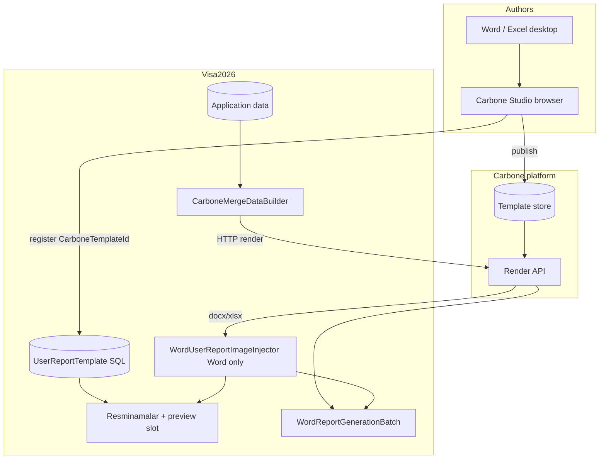
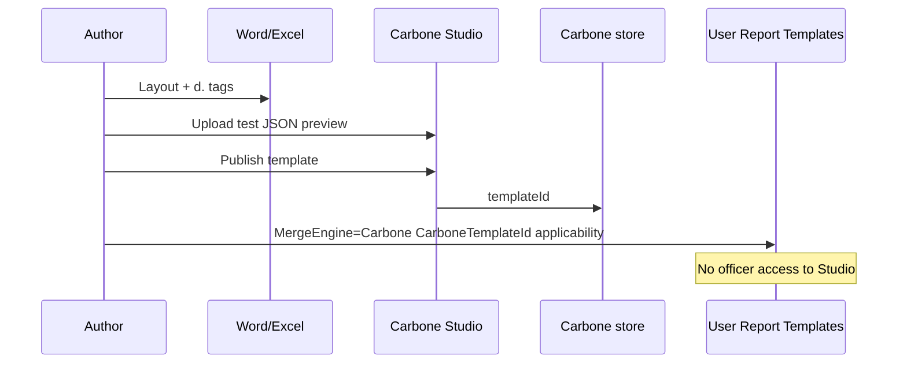
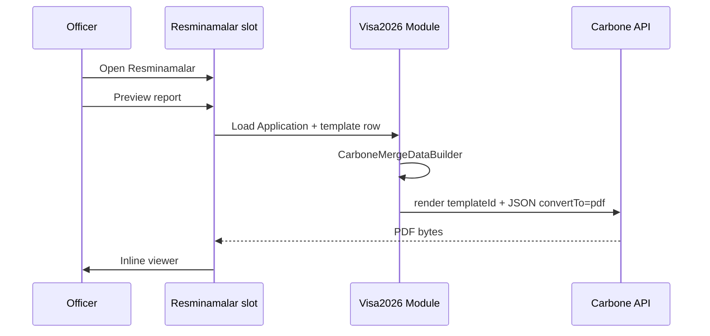

# Carbone integration plan — Visa2026

> **Status:** Draft v0.3 — **`carbone` branch** (product decisions §2 complete 2026-06-18)  
> **Branch goal:** Evaluate and optionally adopt [Carbone](https://carbone.io/) as the **merge engine** for user report templates (Word + Excel), while keeping **Resminamalar officer UX** unchanged.  
> **Related:** [`docs/APPLICATION_REPORT_PACKAGE.md`](APPLICATION_REPORT_PACKAGE.md), [`docs/USER_TEMPLATE_AUTHOR_GUIDE.md`](USER_TEMPLATE_AUTHOR_GUIDE.md), [`docs/EXCEL_TEMPLATE_REPORTING_PLAN.md`](EXCEL_TEMPLATE_REPORTING_PLAN.md), [`.cursor/skills/carbone/`](../.cursor/skills/carbone/), [`.cursor/skills/visa2026-user-report-templates/`](../.cursor/skills/visa2026-user-report-templates/)  
> **Not in scope (v1):** Replacing DevExpress XtraReports, PDF form mapping, ministry **code-backed** removed reports, in-browser ONLYOFFICE/DxRichEdit authoring (separate track).

---

## 1. Problem and target

### Today

| Layer | Implementation |
|-------|----------------|
| **Templates** | `UserReportTemplate.TemplateFile` (`FileData` in SQL) + seeds in `Resources/Templates/` |
| **Word merge** | **DocxTemplater** — `BindModel("ds", …)`, `{{ds.*}}`, `{{#ds.rows}}` |
| **Excel merge** | **ClosedXML** — same placeholder names where possible |
| **Photos** | `WordUserReportImageInjector` + `{{IMAGE:…}}` (not DocxTemplater Images) |
| **Officers** | **Resminamalar** → inline PDF preview + ZIP via `WordReportGenerationBatch` |
| **Authors** | Word/Excel on desktop → upload in XAF → Extract / Validate |

### Target

| Actor | Tool | Responsibility |
|-------|------|----------------|
| **Template author** | **Carbone Studio** (+ desktop Word/Excel for layout) | Design templates with `{d.…}` tags; publish template ID |
| **Visa officer** | **Visa2026 only** | Resminamalar catalog, readiness, preview, ZIP — **no Carbone UI** |
| **Runtime** | **Carbone on-prem** | Merge Word **and** Excel templates + JSON → DOCX/XLSX/PDF |
| **Word photos** | **Post-merge injector** (unchanged) | Carbone fills text; `WordUserReportImageInjector` on DOCX bytes for `{{IMAGE:…}}` |
| **Catalog** | **SQL `UserReportTemplate`** | Name, applicability, visibility, link to Carbone (`CarboneTemplateId`) |

### Core principle

**One catalog in SQL, one merge call at generation time, temporary dual merge during migration:**

- **Legacy (temporary):** DocxTemplater (Word) + ClosedXML (Excel) + SQL blob — until each template is migrated and signed off.
- **Target:** Carbone for **both** Word and Excel; template master in Carbone; Visa2026 stores **ID + metadata**.
- **Sunset:** Remove DocxTemplater / ClosedXML user-report paths after **all** catalog templates use `MergeEngine = Carbone` (Phase 5 complete + verification).

Officers always preview **filled** documents from **real Application data**, not Studio sample JSON.

---

## 2. Product decisions (approved 2026-06-18)

| # | Topic | Decision |
|---|--------|----------|
| 1 | **Production deployment** | **On-prem Carbone** — ministry JSON/PII stays on LAN; no Carbone Cloud in prod |
| 2 | **Excel merge** | **Carbone for both** Word and Excel — sunset ClosedXML for user templates after migration |
| 3 | **Person photos (Word)** | **Keep `WordUserReportImageInjector`** on DOCX bytes after Carbone text merge — **no** Carbone Enterprise image formatters required |
| 4 | **Dual-stack duration** | **Temporary** — per-template `MergeEngine` until full migration; then remove legacy merge code |
| 5 | **Carbone Cloud** | **Dev/spike only** (Phase 0–1 optional); prod uses on-prem URL in `Carbone__BaseUrl` |
| 6 | **Studio access** | **VisaOffice** role / template admins only (decided 2026-06-18) |
| 7 | **SQL `FileData` cache** | **Snapshot on publish** (decided) — Carbone merges; SQL blob is audit/backup/download only; admin **Sync from Carbone** after publish |

---

## 3. Architecture



**Word with photos:** `Carbone render → DOCX` → if template contains `{{IMAGE:` → **`WordUserReportImageInjector`** → then PDF preview / ZIP (same two-step idea as today after DocxTemplater).

**Excel:** Carbone output only (no image injector in v1).

### Storage

| Asset | Master location | Visa2026 SQL |
|-------|-----------------|--------------|
| Template `.docx` / `.xlsx` | **Carbone** (merge master) | `CarboneTemplateId` + optional **`FileData` snapshot** (audit) |
| Catalog metadata | **Visa2026** | Existing fields + new merge-engine fields |
| Legacy templates | **SQL `FileData`** until migrated | `MergeEngine = DocxTemplater` |
| Merged output | **Ephemeral** | Not stored (same as today) |

### What we do **not** embed in v1

- Carbone Studio inside Blazor (optional later: embeddable Studio v5 + commercial license).
- Carbone as documentation MCP in production (use **`.cursor/skills/carbone`** for dev only).

---

## 4. Deployment

| Environment | Carbone | Notes |
|-------------|---------|-------|
| **Production** | **On-prem only** (decided) | Ubuntu compose or dedicated VM on LAN; document in `docs/ENVIRONMENTS.md` |
| **Dev / spike** | On-prem Docker profile **or** Carbone Cloud | Cloud OK for Phase 0–1 only; no production Application data on Cloud |
| **Image** | [carbone/carbone-ee](https://hub.docker.com/r/carbone/carbone-ee) or licensed binary | LibreOffice in container for PDF conversion |

Community vs Enterprise: **photos not on Carbone** — community/on-prem EE for merge + PDF is sufficient if injector handles images.

### Compose sketch (dev profile, not implemented yet)

```yaml
# docker-compose.dev.yml — future profile: carbone
carbone:
  image: carbone/carbone-ee:latest   # or community image per license review
  ports:
    - "127.0.0.1:4000:4000"
  environment:
    - CARBONE_EE_LICENSE=...          # secrets in .env.dev only
```

Visa2026 app env (examples):

```text
Carbone__BaseUrl=http://carbone:4000           # prod: on-prem LAN URL only
Carbone__ApiKey=...                            # on-prem auth if enabled
Carbone__DefaultConvertTo=pdf                  # Resminamalar preview
Carbone__TimeoutSeconds=60
```

Add to `.env.dev.example` / `.env.prod.example` as placeholders — **never commit keys**.

---

## 5. Domain model changes

### New enum: `UserReportMergeEngine`

| Value | Merge path | Lifecycle |
|-------|------------|-----------|
| `DocxTemplater` | Word: DocxTemplater; Excel: ClosedXML | **Legacy** — default until template migrated |
| `Carbone` | Word **and** Excel via on-prem Carbone API | **Target** — all templates after migration |

### New fields on `UserReportTemplate`

| Field | Type | Purpose |
|-------|------|---------|
| `MergeEngine` | enum | Select merge pipeline |
| `CarboneTemplateId` | string, max 128 | Carbone template / version ID |
| `CarboneTemplateVersion` | string, optional | Pin version; null = deployed latest |
| `CarbonePublishedAt` | DateTime?, optional | Last sync from Studio |
| `TemplateFile` | FileData | DocxTemplater: **required** (merge source). Carbone: **optional snapshot** — filled by **Sync from Carbone**; **not** used for merge |

### Placeholders / validation

| Engine | Extract / Validate |
|--------|-------------------|
| DocxTemplater | Keep `UserReportPlaceholder` + `{{ds.*}}` rules |
| Carbone | Phase 2+: optional `ICarbonePlaceholderExtractor` or manual checklist; **no** automatic BO path validation in v1 spike |

### EF migration

- Module `ModuleUpdater` + nullable new columns; default `MergeEngine = DocxTemplater` for all existing rows.

---

## 6. Module services (Visa2026.Module)

### New abstractions

```text
Visa2026.Module/Services/Carbone/
├── CarboneOptions.cs              # bind from IConfiguration
├── ICarboneRenderClient.cs        # render + optional upload
├── CarboneHttpRenderClient.cs     # HttpClient implementation
├── ICarboneMergeDataBuilder.cs    # Application → JSON root { d: … }
├── CarboneMergeDataBuilder.cs     # wraps UserReportMergeDataHelper output
└── CarboneRenderRequest.cs        # templateId, data, convertTo, lang, timezone
```

### Integration point (single choke point)

Today generation flows through:

```text
ApplicationWordReportEntryGenerator
  → IUserReportGenerator / IExcelReportGenerator
  → UserReportGenerator / ExcelReportGenerator
```

**Change:** branch on `template.MergeEngine`:

```text
if (template.MergeEngine == Carbone)
  → ICarboneRenderClient.RenderAsync(..., convertTo: docx|xlsx)
  → if Word && template uses {{IMAGE: → WordUserReportImageInjector
  → then PDF preview via Carbone convertTo: pdf OR DevExpress converter
else
  → IUserReportGenerator / IExcelReportGenerator (legacy, temporary)
```

Preview: prefer Carbone `convertTo: pdf` **after** image injector for Word photo templates; Excel Carbone → PDF directly.

### JSON mapping strategy

1. **Reuse** `UserReportGenerator.BuildDataDictionary` / `UserReportMergeDataHelper` row builders (Forma 16, Sanawy, contract rows, photos metadata).
2. **Transform** to Carbone shape:

   | DocxTemplater | Carbone (example) |
   |---------------|-------------------|
   | `BindModel("ds", data)` | JSON root `{ "d": { ...data } }` |
   | `{{#ds.rows}}` / `{{.Person_FullName}}` | `{d.rows[i].Person_FullName}` loop rows in template |
   | `{{IMAGE:Person_Photo}}` | **Leave literal token in template** — Carbone merges surrounding text; **injector** replaces token (decided) |

3. **Document** mapping in `docs/CARBONE_PLACEHOLDER_MAPPING.md` (create in Phase 1) — one table per template family from `visa2026-user-report-templates`.

### Photos (decided)

**Do not** use Carbone `:img` / Enterprise image formatters. Pipeline:

1. Carbone render → **DOCX** with `{d.…}` filled and `{{IMAGE:Person_Photo}}` still present in cells.
2. **`WordUserReportImageInjector`** + `WordUserReportMergeImageExtractor` (reuse existing Module code).
3. Convert to PDF for preview if needed.

**Phase 0 exit:** Photo roster matches current Resminamalar output with this two-step path.

---

## 7. Author workflow



| Step | Owner |
|------|--------|
| Design layout | Author (Word/Excel) |
| Tag syntax | Author + [Carbone skill](../.cursor/skills/carbone/SKILL.md) |
| Live merge preview while authoring | Carbone Studio |
| Register in production catalog | Author/admin in XAF |
| Test with real application | Resminamalar on Visa2026 |

**Optional Phase 5:** “Publish from Studio” webhook or admin script that sets `CarboneTemplateId` on a known `UserReportTemplate` row by basename.

---

## 8. Officer workflow (unchanged UX)



Readiness evaluator: extend to check `CarboneTemplateId` present when `MergeEngine = Carbone`; placeholder validation may stay DocxTemplater-only until Phase 4.

---

## 9. Phased delivery

### Phase 0 — Spike (1–2 weeks, no schema change)

**Goal:** Prove Carbone can replace merge for **one Word + one Excel** ministry template.

| Task | Detail |
|------|--------|
| Carbone account or local Docker | API key in user env / `.env.dev` |
| Pick templates | e.g. one roster Word + `433_gurlusyk_uzt.xlsx` |
| Manual tag migration | `{d.…}` in copies; keep originals in git |
| JSON export script | Console tool: load test `Application` from DB → JSON file |
| Render | CLI / Postman / `carbone-mcp` → compare PDF to current Resminamalar |
| Photos / loops | Word: Carbone DOCX + **injector**; Excel: Carbone xlsx only |
| Dev Carbone | Local Docker OK; prod spike uses on-prem compose |

**Exit:** Side-by-side PDF acceptable; **injector** photos match today; Excel row counts match.

**Deliverables:** `tools/CarboneSpike/` (optional), spike notes in [`.cursor/skills/carbone/learnings.md`](../.cursor/skills/carbone/learnings.md).

---

### Phase 1 — Infrastructure & config (1 week)

| Task | Detail |
|------|--------|
| `CarboneOptions` + `ICarboneRenderClient` | HttpClient, retries, timeout |
| `.env.*.example` | `Carbone__*` placeholders |
| Docker profile | `carbone` on dev + prod compose (on-prem pattern) |
| Health check | Startup log if Carbone unreachable (warn, don’t block app) |
| Docs | `docs/CARBONE_PLACEHOLDER_MAPPING.md` (draft) |

**Exit:** `dotnet` integration test calls Carbone with hard-coded template ID + fixture JSON.

---

### Phase 2 — Dual merge in Module (2–3 weeks)

| Task | Detail |
|------|--------|
| `UserReportMergeEngine` enum + EF columns | Default DocxTemplater |
| `CarboneMergeDataBuilder` | Map Application → `{ d: … }` |
| `ApplicationWordReportEntryGenerator` | Branch on `MergeEngine`; Carbone path wires **injector** for Word |
| Carbone Excel | Same entry generator; **no** ClosedXML when `MergeEngine = Carbone` |
| Unit tests | JSON shape for Forma 16 / Sanawy / Gurlusyk rows |
| Feature flag | `Carbone__Enabled=false` disables Carbone path |

**Exit:** One Carbone-backed template row in dev DB; Resminamalar preview works end-to-end.

---

### Phase 3 — Catalog & admin UX (1 week)

| Task | Detail |
|------|--------|
| XAF DetailView | `MergeEngine`, `CarboneTemplateId`, **Sync template file from Carbone** action |
| Readiness | Missing `CarboneTemplateId` → warning; optional stale snapshot vs `CarbonePublishedAt` |
| Permissions | Same as today (`UserReportTemplate` Write) |
| Author doc | Update `USER_TEMPLATE_AUTHOR_GUIDE.md` Carbone section |

**Exit:** Admin can register a Carbone template without developer deploy.

---

### Phase 4 — Batch ZIP & Excel (1–2 weeks)

| Task | Detail |
|------|--------|
| `WordReportBundleBuilder` | Carbone path for Excel + Word |
| ZIP worker | Same batch table; mixed engines in one ZIP |
| PDF preview | Prefer Carbone `convertTo: pdf` to reduce DevExpress load |
| Performance | Log render duration; set batch timeouts |

**Exit:** Multi-report ZIP with mix of legacy + Carbone templates (dev).

---

### Phase 5 — Template migration (temporary dual-stack)

| Wave | Templates |
|------|-----------|
| Pilot | 2 templates (Phase 0 pair) |
| High churn | User-edited templates only |
| Ministry seeds | `Resources/Templates/*` — per `_map.md`; retag `{d.…}` + register `CarboneTemplateId` |

Per template: set `MergeEngine = Carbone` only after Resminamalar preview/ZIP sign-off. **DocxTemplater + ClosedXML remain** for unmigrated rows.

**Seed updater:** register Carbone ID + metadata; optional `FileData` cache for audit.

### Phase 5b — Legacy merge sunset (after last template migrated)

| Task | Detail |
|------|--------|
| Audit | All active `UserReportTemplate` rows `MergeEngine = Carbone` |
| Remove | `UserReportGenerator` / `ExcelReportGenerator` from user-report path (or dead-code guard) |
| NuGet | Drop DocxTemplater / ClosedXML from user-report pipeline if unused elsewhere |
| Docs | Mark `{{ds.*}}` author guide as legacy; Carbone `{d.…}` canonical |

**Trigger:** zero production templates on `DocxTemplater` + team sign-off — no fixed calendar date until migration completes.

---

### Phase 6 — Production hardening (on-prem)

| Task | Detail |
|------|--------|
| On-prem Carbone | License, LibreOffice, backup — **required** for prod (decided) |
| Network | App → Carbone on LAN only; no outbound Cloud render in prod |
| Monitoring | Failed renders → logging / runtime error inbox |
| Rollback | Per template: `MergeEngine = DocxTemplater` during dual-stack window |
| E2E | EasyTest: open Resminamalar, preview one Carbone report (optional) |

---

## 10. Testing strategy

| Level | What |
|-------|------|
| **Unit** | `CarboneMergeDataBuilder` JSON snapshots per template family |
| **Integration** | `ICarboneRenderClient` against dev Carbone with fixture JSON |
| **Visual** | Compare PDF bytes or page count vs DocxTemplater baseline |
| **Manual** | Resminamalar on real Application (Turkmen text, photos, multi-row) |
| **Regression** | Unmigrated templates unchanged (`MergeEngine = DocxTemplater`) |
| **Injector** | Word photo roster: Carbone + injector vs legacy baseline |

Golden files: store under `Visa2026.Module.Tests/` or `tools/CarboneSpike/expected/` — small set only.

---

## 11. Security and compliance

| Topic | Action |
|-------|--------|
| **PII in JSON** | Render requests stay **on-prem Carbone** on LAN (decided) |
| **API keys** | OS env / `.env.*`; not in git |
| **Carbone Cloud** | **Not used in prod**; optional dev spike only |
| **License** | On-prem EE/trial; **no** Enterprise image module required (injector decision) |
| **Audit** | SQL `FileData` snapshot after **Sync from Carbone** (decided); Carbone store + VM backup |

---

## 12. Template storage rule (decided)

**Decision:** **Carbone + SQL snapshot on publish** (Option B).

| Role | Source |
|------|--------|
| **Merge at Resminamalar / ZIP** | **Carbone only** (`CarboneTemplateId`) — never read `TemplateFile` when `MergeEngine = Carbone` |
| **Audit / backup / download in XAF** | **`TemplateFile`** snapshot after admin runs **Sync template file from Carbone** |
| **Stale cache** | If Studio publishes a new version, admin re-syncs; readiness chip if `CarbonePublishedAt` > last sync (Phase 3) |

Carbone remains the **runtime master**; SQL copy is **read-only backup** for disaster recovery and “what file did we register?” — not a second editor path.

### Studio access (decided)

**VisaOffice** (and administrators with `UserReportTemplate` Write) get Carbone Studio accounts; **officers** do not — they only use Resminamalar in Visa2026.

---

## 13. Risks

| Risk | Mitigation |
|------|------------|
| Tag migration effort (~40 seeds) | Phased waves; temporary dual-stack |
| Carbone downtime blocks preview | Feature flag; revert template to DocxTemplater during migration |
| Carbone strips `{{IMAGE:…}}` tokens | Phase 0 verify tokens survive render; adjust template if needed |
| JSON mapping drift | Single `CarboneMergeDataBuilder` wrapping existing helpers |
| Authors confuse `{d.}` vs `{{ds.}}` | Dual author guide until Phase 5b sunset |

---

## 14. Success criteria (project)

- [ ] Officers use **same** Resminamalar UI; no Carbone login for officers.
- [ ] At least **one** production-ready Carbone template matches DocxTemplater output quality.
- [ ] **On-prem** Carbone documented in `docs/ENVIRONMENTS.md`.
- [ ] Rollback per template via `MergeEngine` without code deploy.
- [ ] All templates migrated; Phase **5b** legacy merge removed.
- [ ] Team agrees go/no-go on full migration after Phase 4.

---

## 15. Agent skills (after Phase 1)

| Skill | When |
|-------|------|
| [`.cursor/skills/carbone/`](../.cursor/skills/carbone/) | Tag syntax (installed) |
| **`visa2026-carbone`** (create later) | Spike, render client, mapping, compose — promote from this plan |

Update [`.cursor/skills/visa2026-user-report-templates/`](../.cursor/skills/visa2026-user-report-templates/) when migration waves start (Carbone vs DocxTemplater families).

---

## 16. Immediate next steps

1. ~~Product decisions~~ — complete (§2, §12).
2. **Phase 0:** Spike with on-prem Docker; Word roster + Excel list; **injector** path.
3. **Record results** in `.cursor/skills/carbone/learnings.md`.
4. If spike passes → Phase 1 `ICarboneRenderClient` + on-prem compose profile.

---

*Last updated: 2026-06-18 — v0.3 on `carbone` branch.*
