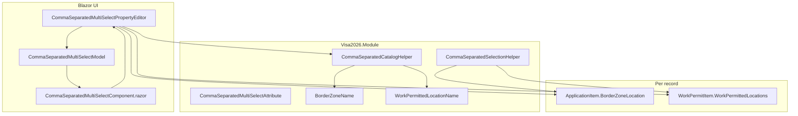

# Comma-separated multi-select catalog editor

Custom Blazor property editor for **short label lists** stored as a single comma-separated `nvarchar` field, with a **shared lookup catalog** for checkbox options. Used in two places in Visa2026.

## Where it is used

| Business object | Property | Catalog (lookup table) | Editor alias | Default when empty |
|-----------------|----------|------------------------|--------------|-------------------|
| `ApplicationItem` | `BorderZoneLocation` | `BorderZoneName` | `BorderZoneMultiSelect` | `Ýok` (via `CommaSeparatedSelectionHelper.NoneValue`) |
| `WorkPermitItem` | `WorkPermittedLocations` | `WorkPermittedLocationName` | `WorkPermittedLocationMultiSelect` | empty string |

Configuration is on the property via `[CommaSeparatedMultiSelect(...)]` and `[EditorAlias(...)]` in:

- `Visa2026.Module/BusinessObjects/ApplicationItem.cs`
- `Visa2026.Module/BusinessObjects/WorkPermitItem.cs`

**Not the same as** `Application.BorderZoneLocation` (FK to `BorderZoneLocation` lookup) — that is application-level and unrelated to this editor.

## Architecture



### Two layers of data

1. **Catalog (shared)** — rows in `BorderZoneName` / `WorkPermittedLocationName` (`LookupBase`, `NameTm` / `Name`). All users see the same checkbox labels. Maintained in the popup (**Add**, **Edit**, **Delete**).
2. **Selection (per item)** — comma-separated text on the current `ApplicationItem` or `WorkPermitItem`. Example: `Aşgabat, Mary, Balkan`. No FK; labels must match catalog `NameTm` text.

The UI list **CatalogItems** is built at runtime from the catalog (`CommaSeparatedCatalogHelper.LoadCatalogNames`) plus any labels still in the current draft selection (`MergeCatalogWithSelected`).

### Deferred commit

Add / rename / delete catalog rows and changes to the item string are held in the **detail view ObjectSpace** until the user clicks **OK** on the main popup (then **OK** saves the detail view as usual). `CommitPendingCatalogEntries()` runs when the main popup applies selection.

Catalog reload uses `IObjectSpace.GetObjects<T>()` (not `GetObjectsQuery`) so pending deletes/creates appear in the list before `CommitChanges`.

## Popup UX (current)

- Read-only summary field + **…** opens the popup.
- **Default mode (selection only):** **Selected: N**, checkboxes, **OK** / **Cancel**. No per-row **Edit**/**Delete**, no add row.
- **Gear** button (top right, tooltip *Manage catalog* / *Done*): toggles maintenance mode — per-row **Edit** / **Delete**, **New …** + **Add**; click again to return to selection-only.
- Full checkbox list (no search, no show-more; small catalogs only).
- Nested popups: **Rename**, **Delete?** confirm.
- Footer: **OK** / **Cancel**.
- Status banner for success/error (English strings today; localization later).

**Delete behavior:** removes the label from **all** items that use it (respecting draft selection on the record being edited), then deletes the catalog row.

**Rename behavior:** updates the catalog row and replaces the old label in every item’s comma-separated field.

## File map

### Module (`Visa2026.Module`)

| File | Role |
|------|------|
| `Editors/CommaSeparatedMultiSelectAttribute.cs` | Property attribute, editor aliases, default settings per alias |
| `Services/CommaSeparatedSelectionHelper.cs` | Parse/format/replace labels in comma strings; `NoneValue` = `Ýok` |
| `Services/CommaSeparatedCatalogHelper.cs` | Load/add/rename/delete catalog; usage count; strip label from all items |
| `Services/CatalogUsageContext.cs` | Draft-aware usage when editing one record |
| `Services/CatalogOperationResult.cs` / `CatalogRenameRequest.cs` | Operation results and rename payload |
| `Services/BorderZoneSelectionHelper.cs` | Thin alias over selection helper for border-zone call sites |
| `BusinessObjects/LookupBusinessObjects.cs` | `BorderZoneName`, `WorkPermittedLocationName` |
| `DatabaseUpdate/ApplicationItemBorderZoneLocationStringUpdater.cs` | Migration: string column + seed catalog |
| `DatabaseUpdate/WorkPermitItemPermittedLocationsStringUpdater.cs` | Migration: drop old city link table, string + catalog |
| `DatabaseUpdate/Updater.cs` | User role: Read/Write/Create/Delete on both catalog types |

### Blazor Server (`Visa2026.Blazor.Server`)

| File | Role |
|------|------|
| `Editors/CommaSeparatedMultiSelectPropertyEditor.cs` | XAF property editor; wires model callbacks |
| `Editors/CommaSeparatedMultiSelectModel.cs` | `ComponentModelBase` for the Razor component |
| `Editors/CommaSeparatedMultiSelectComponent.razor` | Popup UI |
| `Controllers/ApplicationItemDetailViewBorderZoneController.cs` | Hides duplicate border-zone view items on Application Item detail |
| `Model.xafml` | Single layout item for `BorderZoneLocation`; work permit layout for `WorkPermittedLocations` |
| `wwwroot/css/site.css` | `cs-multi-select-*` styles |

## Registration

Property editors are registered by alias on `string`:

```csharp
[PropertyEditor(typeof(string), CommaSeparatedMultiSelectEditorAliases.BorderZone, false)]
[PropertyEditor(typeof(string), CommaSeparatedMultiSelectEditorAliases.WorkPermittedLocation, false)]
```

Module updaters are registered in `Visa2026.Module/Module.cs`.

## Security

- Users: **Read, Write, Create, Delete** on `BorderZoneName` and `WorkPermittedLocationName` (catalog maintenance from the popup).
- Lookup **navigation** for those types remains denied for the user role (editing is in-popup only).
- Item properties `BorderZoneLocation` / `WorkPermittedLocations` follow normal `ApplicationItem` / `WorkPermitItem` permissions.

## Database

- `ApplicationItem.BorderZoneLocation` — `nvarchar(500)`
- `WorkPermitItem.WorkPermittedLocations` — `nvarchar(500)`
- Catalog tables: standard `LookupBase` columns (`Name`, `NameTm`, …)

Legacy `WorkPermitItemPermittedCity` / link table was removed by `WorkPermitItemPermittedLocationsStringUpdater`.

## Reports and merge fields

Item-level strings and catalog labels feed existing paths, for example:

- `ApplicationItem.BorderZoneLocation` / `BorderZoneLocation_NameTm`
- `ApplicationItem.WorkPermit_WorkPermittedLocations` → `WorkPermitItem.WorkPermittedLocations`

Word/Excel templates use these BO properties; they do not read `CatalogItems` directly.

## Adding a third usage

1. Add a `LookupBase` catalog type (or reuse one intentionally).
2. Add `nvarchar` property on the target BO.
3. Apply `[EditorAlias]` + `[CommaSeparatedMultiSelect(CatalogEntityType = typeof(...), NoneValue = ...)]`.
4. Extend `CommaSeparatedCatalogHelper` if the catalog type is not `BorderZoneName` / `WorkPermittedLocationName` (load, add, rename, delete, strip/rename on items).
5. Register a new alias in `CommaSeparatedMultiSelectEditorAliases` and a `[PropertyEditor]` line on the Blazor property editor class (or a dedicated editor class).
6. Add permissions and a `ModuleUpdater` if schema or seed data is required.

## Localization

UI strings are defined on `CommaSeparatedMultiSelectAttribute` (and overrides on the BO properties). They are **English** for now. Planned approach: wire attribute strings to the app localization catalog later without changing storage format.

Catalog **content** (`NameTm` in the database) stays Turkmen (or whatever users enter via **Add** / **Rename**).

## Related docs

- `AGENTS.md` — stack and Module vs Blazor split
- `docs/ROLE_PERMISSIONS_GUIDE.md` — security patterns
- `docs/LOCALIZATION_PLAN.md` — future UI translation
