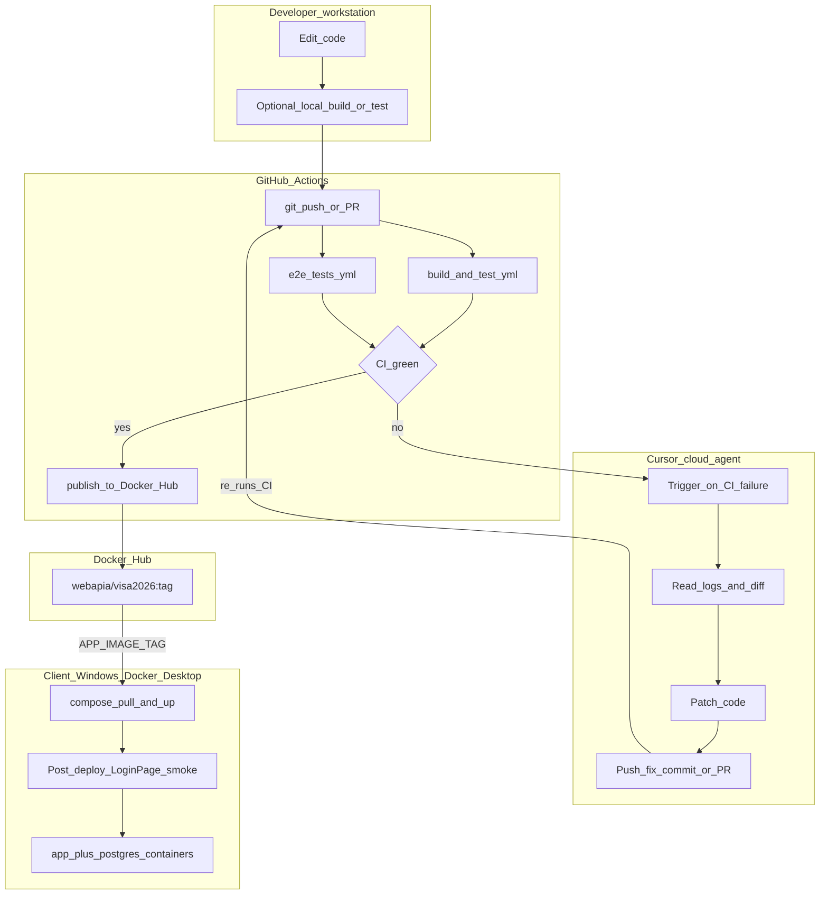
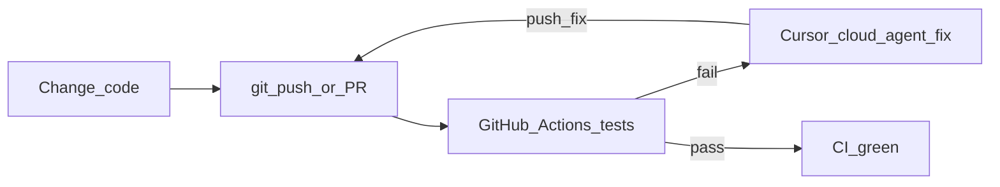
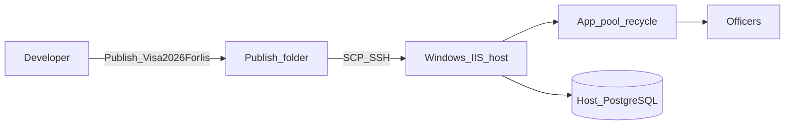

# Docker Desktop on Windows (IIS stays until proven)

## Verdict

**Yes — invest in Docker Compose on Windows via Docker Desktop as the multi-client target.** Same Hub Linux images (`webapia/visa2026` + `postgres:16`). Host = **Windows + Docker Desktop** (WSL2 backend), Linux containers (not Windows containers).

**Do not deprecate IIS yet.** IIS remains a supported on-prem path (and the live Calik slots) until Docker Desktop is completed successfully. Deprecation is a **late** step after a success gate, not Phase 1.

**Success gate before IIS deprecation (all required):**
1. Desktop runbook exists and a **pilot** stack is healthy (login smoke, update pull/up, backup/rollback exercised).
2. At least one **production-equivalent** cutover (or parallel Desktop stack replacing an IIS slot) has run stably.
3. Explicit human approval to mark IIS deprecated / legacy-only.

Until then: dual path — IIS for current hosts; Desktop for greenfield multi-client work once the runbook is usable.

## Why Docker Desktop on Windows fits

| Concern | IIS today | Docker Desktop (target) |
|---------|-----------|-------------------------|
| Artifact | `Publish-Visa2026ForIis.ps1` | Hub image `webapia/visa2026` ([docker-compose.prod.yml](../docker-compose.prod.yml)) |
| Update speed | Publish + SCP + recycle | `docker compose pull` + `up -d --no-deps app` |
| DB | Host PostgreSQL + env scripts | `postgres:16` container + named volume |
| Multi-client | Per-slot IIS scripts | **One compose project + one DB per client** |
| Host OS | Windows Server + IIS + Hosting Bundle | **Windows + Docker Desktop** (WSL2) |
| Ops surface | IIS/ANCM/certs/boot tasks | Desktop running, compose project, volumes, HTTPS proxy |

Domain model: **single-tenant per deployment** ([VISA2014_MIGRATION/MULTI_COMPANY_LEGACY_SOURCES.md](VISA2014_MIGRATION/MULTI_COMPANY_LEGACY_SOURCES.md)). Scale-out = **N independent stacks** (separate compose project / `.env` / volumes), not multi-tenant SaaS.

## Development and deployment flow

Target model: **develop locally → push/PR → GitHub Actions tests → (on fail: Cursor cloud agent fixes and pushes) → on green: publish Hub image → Windows clients pull on Docker Desktop → smoke-test**.

| Layer | Where | What |
|-------|--------|------|
| **Local** | Dev machine | Optional `dotnet build` / unit / EasyTest; may also use Docker Desktop for local compose |
| **CI** | GitHub Actions on **every push and PR** | `build-and-test.yml`; `e2e-tests.yml` |
| **Auto-fix** | Cursor **cloud** agent | Triggered when CI fails; patch + push; CI re-runs |
| **Post-deploy** | Client **Windows + Docker Desktop** | HTTP(S) `/LoginPage` smoke |

**CI rule:** Tests gate push/PR. Publish Hub only when green. On red: trigger Cursor cloud agent; do not publish.

### End-to-end (dev → CI → agent → Docker Desktop clients)



### Day-to-day (CI + agent)



### CI → agent → release → Windows Docker Desktop

```mermaid
sequenceDiagram
  participant Dev as Developer
  participant GHA as GitHub_Actions
  participant Agent as Cursor_cloud_agent
  participant Hub as Docker_Hub
  participant Desk as Windows_Docker_Desktop
  participant Off as Officers

  Dev->>GHA: git_push_or_PR
  GHA->>GHA: build_and_test_plus_E2E
  alt CI_fails
    GHA->>Agent: trigger_fix_on_failure
    Agent->>Agent: diagnose_and_patch
    Agent->>GHA: push_fix_commit_or_PR
    GHA->>GHA: re_run_tests
  end
  Note over GHA: Only_green_CI_publishes
  GHA->>Hub: publish_webapia_visa2026_tag
  Note over Desk: APP_IMAGE_TAG in .env.prod
  Desk->>Desk: backup_postgres_volume
  Desk->>Hub: compose_pull_app
  Desk->>Desk: compose_up_no_deps_app
  Desk->>Off: smoke_https_LoginPage
  Note over Desk: Rollback previous tag if smoke fails
```

Typical client host commands (PowerShell on Windows):

```powershell
cd C:\visa2026   # or per-client folder
# set APP_IMAGE_TAG=1.x.y in .env.prod  (only tags that passed CI)
docker compose -p visa2026-prod --env-file .env.prod -f docker-compose.prod.yml pull app
docker compose -p visa2026-prod --env-file .env.prod -f docker-compose.prod.yml up -d --no-deps app
curl.exe -sf -o NUL -w "%{http_code}`n" https://127.0.0.1/LoginPage
```

### IIS path (supported now; retire only after success gate)



Native IIS remains valid until Desktop is proven. Long-term multi-client model is Desktop compose, not IIS publish/recycle.

## Recommended policy

1. **New clients:** **Windows + Docker Desktop** + `docker-compose.prod.yml` (Linux containers). Document install (Desktop, WSL2, resources, autostart).
2. **IIS path:** remain **supported** until the success gate; do not add deprecated banners in Phase 1. Scripts and skill stay active for Calik/current hosts.
3. **Existing Calik IIS host:** cut over to Docker Desktop on that Windows host (or a Windows client server) when ready — same Hub image, migrate data, then freeze IIS.
4. **Optional:** Ubuntu Engine / droplet remain valid for Linux-only or cloud hosts; same images/compose family — secondary to Windows Desktop for this rollout.

## Gaps to close (Docker Desktop on Windows)

1. **Windows Docker Desktop runbook** — install Desktop + WSL2; folder layout (`C:\visa2026\`); compose start on login; firewall ports; resource limits (RAM/CPU for Blazor + Postgres).
2. **HTTPS** — reverse proxy (Caddy/nginx container or Windows reverse proxy) for Resminamalar template edit; cert trust on officer PCs.
3. **Version pinning** — `APP_IMAGE_TAG` in each client `.env.prod`.
4. **Per-client isolation** — compose project name, `DB_NAME`, volumes, ports when multiple stacks share one Windows host.
5. **Backup / update / rollback** — Postgres volume backup on Windows; pull/up/smoke; pin previous tag on failure.
6. **Dual-path docs first** — add Desktop runbook; say Desktop is the *target* for multi-client; keep IIS documented as current/supported until success gate. **Deprecate IIS only after success.** Skill later.
7. **CI → Cursor cloud agent** — auto-fix on Actions failure; publish only when green.
8. **Licensing** — Docker Desktop commercial use may require a paid license; confirm per client org before rollout.

## What not to do

- Do not build multi-tenant SaaS in one database — **one stack per client**.
- Do not use **Windows containers** for the app image — stay on **Linux containers** via Desktop/WSL2.
- Do not delete `scripts/windows-iis/` until the last IIS slot is retired.
- Do not expand IIS as the long-term multi-client path (maintain it; put new multi-client effort into Desktop).
- Do not create an empty Agent skill before the Windows Docker Desktop runbook exists and has been piloted.
- Do not mark IIS deprecated in docs/skills until the success gate passes.

## Docs first, then Agent skill (agreed)

Follow the repo funnel ([AGENTS.md](../AGENTS.md) / [DEPLOYMENT_LIFECYCLE_EXPERIENCE.md](DEPLOYMENT_LIFECYCLE_EXPERIENCE.md)): **one skill = one recurring task**; capture in docs first; promote after repeat or high risk.

| Step | Artifact | When |
|------|----------|------|
| 1 | **Desktop runbook in `docs/`** | **Now** — add `ON_PREM_WINDOWS_DOCKER_DESKTOP.md`; dual-path pointers (IIS still supported) |
| 2 | Harden docs (HTTPS, `APP_IMAGE_TAG`, multi-client isolation, CI→agent) | After runbook draft |
| 3 | **Pilot** (1–2 real Desktop stacks) | Capture verified fixes in the runbook notes |
| 4 | **Agent skill** `.cursor/skills/visa2026-windows-docker-desktop/` (`SKILL.md`, `reference.md`, append-only `learnings.md`) | **Only after 2+ verified deploys** |

**Do not** overload these for the new path:

- [setup-docker-engine](../.cursor/skills/setup-docker-engine/SKILL.md) — Ubuntu Engine
- [visa2026-windows-iis-deploy](../.cursor/skills/visa2026-windows-iis-deploy/SKILL.md) — IIS (supported until success gate)
- [visa2026-lifecycle-docker](../.cursor/skills/visa2026-lifecycle-docker/SKILL.md) — local/dev lifecycle, not client fleet

When the Desktop skill is promoted and the success gate passes, point AGENTS.md / prereqs at Desktop; then mark IIS skill legacy-only.

## Suggested rollout phases

1. **Dual-path docs** — add Windows Docker Desktop runbook; keep IIS fully supported (no deprecate banners yet).
2. **Desktop hardening** — HTTPS, tags, backup/update, multi-client isolation (still no IIS deprecate).
3. **Pilot** — non-prod Desktop stack; prove pull/up, smoke, backup/rollback.
4. **Promote Desktop skill** — after 2+ verified Desktop deploys (`visa2026-windows-docker-desktop`).
5. **Production-equivalent cutover** — migrate or parallel-run a real slot off IIS onto Desktop; stabilize.
6. **Deprecate IIS** — only after success gate + approval; archive IIS skill as legacy-only; keep scripts until last host gone.
7. **Scale** — copy `C:\visa2026` + `.env.prod` per client; same Hub tag for fleet updates.

## Resolved constraint

Client **target** host = **Windows OS + Docker Desktop** (Linux containers). **IIS remains supported** until the success gate. Ubuntu Engine optional for Linux/cloud sites.
