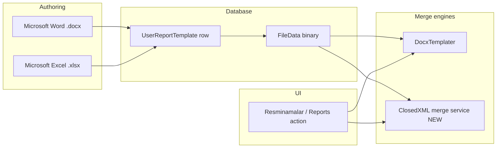

# Excel Template Reporting — Implementation Plan (ApplicationItem)

> **Status:** In progress — Phases 0–1 implemented (ClosedXML merge, BO fields, Resminamalar); seed + spike in repo.  
> **Merge library (decided):** **[ClosedXML](https://github.com/ClosedXML/ClosedXML)** (MIT) — **core package only**; layout is manual in Excel, code does **placeholder scan + data mapping** only.  
> **Scope (v1):** Manual **`.xlsx`** templates merged from **`ApplicationItem`** data (and optional **`Application`** header fields when generated from an **Application**).  
> **Out of scope (v1):** Word templates, ministry `IWordReportDefinition` reports, Registration/BusinessTrip roots, programmatic Excel layout (`tools/GenerateTemplates`), **ClosedXML.Report**, **MiniExcel**, **EPPlus**.

This document describes how to add Excel template reporting **alongside** the existing Word user-report pipeline (`UserReportTemplate`, DocxTemplater, **Resminamalar**). It mirrors the patterns in **`docs/USER_DEFINED_WORD_TEMPLATES_IDEA.md`** and **`docs/USER_TEMPLATE_AUTHOR_GUIDE.md`**, but uses **ClosedXML** instead of DocxTemplater because **DocxTemplater is Word-only**.

---

## 1. Goals

| Goal | Detail |
|------|--------|
| **Manual templates** | Users (or seeds) provide **`.xlsx`** files; **all layout, formatting, and column widths** are edited in **Microsoft Excel**. The app never generates sheet structure—only fills placeholders. |
| **ApplicationItem data** | Placeholders resolve against **`ApplicationItem`** properties (see **`docs/WORD_REPORT_PLACEHOLDER_REFERENCE.md`** → ApplicationItem section). |
| **Same operational model as Word** | Upload or seed → extract placeholders → validate → applicability by application type → generate from UI. |
| **Coexist with Word** | **Resminamalar** (or a sibling action) can download **`.docx` and `.xlsx`** in one zip when multiple reports apply. |
| **One XAF UI for both formats** | **Same** `UserReportTemplate` list/detail, file upload, Extract/Validate, applicability, and **Resminamalar** — authors only pick **output format** (Word vs Excel) and merge mode; no separate “Excel templates” module. |

---

## 2. Unified XAF workflow (Word and Excel)

**Yes — manual Excel templates should follow the same process as Word** so report authors learn one workflow. Implementation extends the existing **`UserReportTemplate`** feature; it does **not** introduce a parallel BO or navigation tree.

### Same UI (today + planned)

| Step | Word (today) | Excel (planned) |
|------|----------------|-----------------|
| **Where** | **Reports → User Report Templates** (`UserReportTemplate`, `[NavigationItem("Reports")]`) | **Same screen** |
| **Create row** | New → name, description, root BO, applicability | Same + set **`TemplateOutputFormat = Excel`**, **`ExcelMergeMode`** |
| **Upload file** | **Template File** (`FileData`) — `.docx` | Same control — **`.xlsx`** only when format is Excel |
| **Extract** | **Extract Placeholders** (`UserReportTemplateController`) | Same button → **`IExcelTemplatePlaceholderExtractor`** when format is Excel |
| **Validate** | **Validate Placeholders** | Same button → **`IExcelReportValidationService`** (shared rules / property paths) |
| **Activate** | **Is Active**, sort order | Same |
| **Generate** | **Resminamalar** on **Application** (`WordReportsController`) | Same button → Word **or** Excel generator by **`TemplateOutputFormat`** |
| **Seeds** | `Resources/Templates/*.docx` + `UserReportTemplateUpdater` | `Resources/Templates/Excel/*.xlsx` + same updater with `TemplateOutputFormat.Excel` |

### What authors do outside the app (unchanged idea)

| | Word | Excel |
|--|------|--------|
| **Design tool** | Microsoft Word | Microsoft Excel |
| **Tokens** | `{{ds.…}}`, `{{#ds.rows}}`, `{{.…}}` | **Same names** where possible (see planned **`EXCEL_PLACEHOLDER_REFERENCE.md`**) |
| **Layout** | User-controlled | User-controlled — ClosedXML only fills values / copies rows |

### Implementation notes (keep UX one-shaped)

1. **`TemplateOutputFormat`** enum on **`UserReportTemplate`** — drives file extension validation, which extractor/validator/generator runs, and optional appearance (hide Word-only hints on Excel rows).
2. **Do not** add a second ListView for Excel; filter or column **Format** on the existing list is enough.
3. **`UserReportTemplateController`** — branch on format in Extract/Validate (inject both Word and Excel services; same placeholder grid).
4. **`WordReportsController` / export orchestrator** — after loading active templates, call **`IUserReportGenerator`** or **`IExcelReportGenerator`** per row; one zip may contain `.docx` and `.xlsx`.
5. **Permissions** — same **`UserReportTemplate`**, **`UserReportPlaceholder`**, **`FileData`** types for Users role (already in **`Updater`** / `Ensure*`).

### Optional later (not required for parity)

- Separate **author guide** PDF/page: **`EXCEL_TEMPLATE_AUTHOR_GUIDE.md`** vs **`USER_TEMPLATE_AUTHOR_GUIDE.md`** — same steps, Excel-specific loop-row pictures.
- **Preview** tool for Excel (Word has `tools/PreviewWordReports` for ministry `.docx` only) — optional v2.

---

## 3. Non-goals (v1)

- Excel templates for **`Application`**, **`Registration`**, or **`BusinessTrip`** as merge root (can follow in v2 using the same infrastructure).
- Replacing **XtraReports** or existing **Word** ministry letters.
- Built-in **preview yellow-highlight** tool (optional later; Word has `tools/PreviewWordReports` only for embedded ministry `.docx`).
- Cell formulas that must be recalculated by Excel on open (possible later; v1 is **values only**).

---

## 4. Relationship to existing Word pipeline



| Concern | Word (today) | Excel (planned) |
|---------|----------------|-----------------|
| File type | `.docx` | `.xlsx` |
| Merge library | **DocxTemplater** 2.4.4 | **ClosedXML** (NuGet `ClosedXML`; MIT) |
| Layout | User-authored in Word | User-authored in Excel only |
| Placeholder prefix | `{{ds.…}}`, `{{#ds.rows}}`, `{{.…}}` | **Same token names** where possible (reduces author confusion) |
| Root BO | `Application` or `ApplicationItem` | **v1: `ApplicationItem` only** |
| Seeds folder | `Visa2026.Module/Resources/Templates/` | `Visa2026.Module/Resources/Templates/Excel/` (proposed) |
| Updater | `UserReportTemplateUpdater` | Extend or parallel **`EnsureTemplateExists`** for `.xlsx` |

---

## 5. Generation scenarios (ApplicationItem)

Two patterns cover most personnel / sanawy-style Excel needs.

**v1 (confirmed):** **List mode (B) only** from **Resminamalar** on **Application**. Single-item Excel (A) deferred to **v1.1** (optional ApplicationItem detail action).

### A. Single-item workbook (root = one `ApplicationItem`)

- **When:** User opens an **ApplicationItem** detail (or system generates one file per person).
- **Data bound:** One `ApplicationItem` instance → all `{{ds.*}}` tokens map to that item’s properties (same names as Word row fields but use **`ds.`** prefix because there is no row loop).
- **Example tokens:** `{{ds.Person_FullName}}`, `{{ds.Passport_Number}}` (alias of `Person_FullName` path on item — align with reference doc naming).

### B. List workbook (many items from one `Application`)

- **When:** User clicks **Resminamalar** on **Application**; template is marked **list mode**.
- **Data bound:** Header cells use **`Application`** fields (`{{ds.Application_FullApplicationNumber}}` or existing `Application` header placeholders). Table body uses **`{{#ds.rows}}` … `{{/ds.rows}}`** with **`{{.Person_FullName}}`** etc., same semantics as Word **`UserReportGenerator.BuildLaborContractStyleRows`** / `Application.ApplicationItems` (non-deleted items only).
- **Excel layout rule:** One **template row** (or block of rows) in the sheet is duplicated downward for each item; spike must define exact rules (see §5.3).

**Visibility:** Reuse **`IUserReportVisibilityService`** and **`ApplicabilityMode`** / **`ApplicableTypes`** already on **`UserReportTemplate`**, evaluated from the current **`Application`** (same as Word).

---

## 6. Merge engine: ClosedXML (placeholder + mapping only)

### 6.1 Decision

| Choice | Rationale |
|--------|-----------|
| **ClosedXML** (core) | **MIT** license; open `.xlsx`, read/write cell values, **insert/copy rows** for list templates; preserves user formatting when only cell **values** change. |
| **Not ClosedXML.Report** | Adds report/table tag semantics; we only need **fill-in-place** like `UserReportGenerator` + DocxTemplater for Word. |
| **Not MiniExcel** | `SaveAsByTemplate` uses its own binding model; less control to mirror `{{ds.*}}` / `{{#ds.rows}}` exactly. |
| **Not EPPlus** | Commercial license required for typical production use. |
| **Not DocumentFormat.OpenXml alone** | Same capabilities as ClosedXML but more low-level code for the same merge rules. |

**NuGet (implementation):** add **`ClosedXML`** to **`Visa2026.Module`** (pin a current stable version at implementation time; no dependency today).

### 6.2 In-house merge behavior (mirror Word)

Implement **`ExcelReportGenerator`** (name TBD) with the same responsibilities as **`UserReportGenerator`**, but using ClosedXML:

1. **Load** template bytes from **`UserReportTemplate.TemplateFile`** (unchanged workbook structure).
2. **Scan** all used cells (and optionally defined names) for `{{…}}` tokens → **`IExcelTemplatePlaceholderExtractor`** (regex aligned with Word extractor).
3. **Scalar replace:** for each `{{ds.Property}}`, set cell value from **`Application`** or **`ApplicationItem`** via reflection / validated paths (prefer **`*Text`** date fields).
4. **List expand (list mode):** locate template row between markers `{{#ds.rows}}` / `{{/ds.rows}}` (marker cells cleared after merge); **insert row copies** for each non-deleted **`ApplicationItem`**; fill `{{.Column}}` tokens per row (reuse row key set from **`BuildLaborContractRowDictionary`** where applicable, or full **`ApplicationItem`** property paths).
5. **Save** to output stream; do not recalculate workbook formulas in v1 (values only).

**No** code path that creates sheets, sets column widths, or applies styles—authors do that in Excel.

### 6.3 Technical spike (Phase 0 — gate before full build)

**Deliverable:** `tools/ExcelTemplateSpike/` (console) using **ClosedXML** only:

- Load a manually designed `.xlsx`.
- Merge **single-item** sample (`ApplicationItem`).
- Merge **list** sample (`Application` + N items).
- Document loop-row rules in **`docs/EXCEL_PLACEHOLDER_REFERENCE.md`**.

### 6.4 Placeholder discovery

- Scan all cells (and optionally defined names) for `{{…}}` tokens (regex aligned with Word extractor).
- Reuse validation rules from **`UserReportValidationService`** where possible (strip `ds.`, resolve property paths on `ApplicationItem` / `Application`).

### 6.5 Excel loop semantics (must be decided in spike)

Document in **`docs/EXCEL_PLACEHOLDER_REFERENCE.md`** (new):

- Where to put `{{#ds.rows}}` / `{{/ds.rows}}` (row index vs marker rows).
- **v1: no merged cells in the loop template row** (author guide); merged header areas outside the loop may exist if spike allows.
- Date/number formatting: prefer **`*Text`** properties (`Person_DateOfBirthText`) like Word user templates.

---

## 7. Domain model changes

### 7.1 Extend `UserReportTemplate` (recommended)

Add fields rather than a second BO type:

| Field | Type | Purpose |
|-------|------|---------|
| **`TemplateOutputFormat`** | enum `Word`, `Excel` | Chooses merge engine and allowed file extension |
| **`ExcelMergeMode`** | enum `SingleItem`, `ItemList` | Scenario A vs B (§4) |
| *(existing)* **`RootBoType`** | | v1: fix to **`ApplicationItem`** for Excel seeds, or **`Application`** for list headers + rows (see decision below) |

**Decision (confirmed):**

- **`RootBoType = ApplicationItem`** on the template row (same as Contract-style Word seeds).
- **List mode:** generator receives **`Application`**, reads non-deleted **`ApplicationItems`**, validates **header** placeholders against **`Application`** and **row** placeholders against **`ApplicationItem`** (split validation in Extract/Validate UI).
- Store **`ExcelMergeMode = ItemList`** on Excel templates; single-item mode reserved for v1.1.

### 7.2 File validation

- **Word:** `.docx` only when `TemplateOutputFormat == Word`.
- **Excel:** `.xlsx` only when `TemplateOutputFormat == Excel`.
- Controller **Extract / Validate** branches on format.

### 7.3 Placeholders child objects

- Reuse **`UserReportPlaceholder`** rows (no schema change).
- Validation service accepts format + root type + list vs single rules.

---

## 8. Services (Module)

New namespace: **`Visa2026.Module/Services/ExcelReports/`** (or `Services/UserReports/` alongside Word).

| Interface | Responsibility |
|-----------|----------------|
| **`IExcelTemplatePlaceholderExtractor`** | Scan `.xlsx` for `{{tokens}}` |
| **`IExcelReportValidationService`** | Validate tokens vs `ApplicationItem` / `Application` |
| **`IExcelReportGenerator`** | `GenerateAsync(template, application, stream)` and `GenerateAsync(template, applicationItem, stream)` |
| **`ExcelReportGenerator`** | **ClosedXML**: open template, extract tokens, replace/expand rows, save stream |

Wire in **`Visa2026.Blazor.Server/Startup.cs`** (scoped), same as **`IUserReportGenerator`**.

**Do not** use DocxTemplater, **ClosedXML.Report**, or **MiniExcel** for this feature.

---

## 9. UI and controllers

### 9.1 Template administration (shared with Word)

- **Single** **`UserReportTemplate`** DetailView for upload, Extract, Validate, applicability — no duplicate Excel admin UI.
- Extend **`UserReportTemplateController`**: branch Extract / Validate on **`TemplateOutputFormat`** (Word services vs Excel services).
- Model: **Template output format**, **Excel merge mode**; validate uploaded extension (`.docx` vs `.xlsx`); optional list column **Format**.

### 9.2 Generation entry points

| Entry | v1 |
|-------|-----|
| **Application** detail — **Resminamalar** | Include applicable **Excel list** templates in zip/download (**confirmed**) |
| **ApplicationItem** detail | **Not in v1** — single-item Excel deferred to v1.1 |

**`WordReportsController` evolution:**

- Rename internally or add **`ReportExportController`** that orchestrates Word + Excel (avoid duplicating zip logic).
- Zip may contain mixed `.docx` and `.xlsx` files.

### 9.3 Download

- Reuse **`IFileDownloader`**.
- File names: `{TemplateName}_{FullApplicationNumber}.xlsx` or `{TemplateName}_{Person_FullName}.xlsx` for single item.

---

## 10. Seeding and repo layout

Mirror Word seeds:

```
Visa2026.Module/Resources/Templates/Excel/
  Example_Item_List.xlsx      # optional seed
  README.md
```

| Step | Action |
|------|--------|
| Embed | `<EmbeddedResource Include="Resources\Templates\Excel\*.xlsx" />` in **`Visa2026.Module.csproj`** |
| Register | **`UserReportTemplateUpdater.EnsureTemplateExists`** (or `EnsureExcelTemplateExists`) with `TemplateOutputFormat.Excel`, `ExcelMergeMode`, `RootBoType`, applicability |
| DEBUG | Reload bytes each updater run (same as Word) |

Agent skill: extend **`visa2026-user-report-templates`** or add **`visa2026-user-report-templates-excel`** — Excel folder only, no Word layout edits.

---

## 11. Security and permissions

Apply the same lesson as Word (**existing “Users” roles need `Ensure*` patches**):

```csharp
// In Updater.CreateUserRole — outside "if (userRole == null)" only:
EnsureReadWriteCreatePermission<UserReportTemplate>(userRole);
EnsureReadOnlyPermission<UserReportPlaceholder>(userRole);
EnsureReadWriteCreatePermission<FileData>(userRole);
```

- No separate type permission if Excel uses the same **`UserReportTemplate`** entity.
- **Navigation:** Users do not need Reports admin menu if they only **generate** via Resminamalar; they need **Read** on templates + file data.
- **Action security:** If generation is blocked, add explicit allow for new action id in **Users** role (XAF Model / Action permissions).

---

## 12. Documentation

| Document | Purpose |
|----------|---------|
| **`docs/EXCEL_PLACEHOLDER_REFERENCE.md`** (new) | Tokens for `ApplicationItem` / list headers; link to Word reference for shared names |
| **`docs/EXCEL_TEMPLATE_AUTHOR_GUIDE.md`** (new) | Short author guide: Excel layout rules, loop row, Extract/Validate |
| **`docs/WORD_REPORT_PLACEHOLDER_REFERENCE.md`** | Remains canonical for shared property names; Excel doc references same `[NotMapped]` fields |
| **`Visa2026.Module/Resources/Templates/Excel/README.md`** | Seed registration checklist |

**Redundancy rule:** Same as Word — one business fact → one canonical placeholder; add `[NotMapped]` on **`ApplicationItem`** only after redundancy check.

---

## 13. Implementation phases

| Phase | Deliverable | Exit criteria |
|-------|-------------|---------------|
| **0 — Spike** | **ClosedXML** console merge; loop-row rules documented | One list + one single-item file from a **manual** `.xlsx` |
| **1 — Core** | `TemplateOutputFormat`, Excel extractor/validator/generator, DI | Unit-level merge tests or manual test from console |
| **2 — UI** | Template admin + validation in XAF | Upload `.xlsx`, Validate shows green/red rows |
| **3 — Seed** | One embedded seed + updater + permissions `Ensure*` | Fresh DB + existing Users role see template |
| **4 — Resminamalar** | Zip includes `.xlsx` for applicable applications | User role generates list report on `App_*` type |
| **5 — (Optional)** | ApplicationItem detail action for single-item Excel | One row → one workbook |
| **6 — Hardening** | Error messages, logging, E2E smoke | Invalid template / empty items handled clearly |

**First seed (confirmed):** Minimal personnel table (№, name, passport, visa, work permit) under `Resources/Templates/Excel/`, applicability **`App_Visa_and_WP_Ext`** (adjust when a real ministry `.xlsx` is ready). Replace seed file in place when the official form is available.

---

## 14. Risks and mitigations

| Risk | Mitigation |
|------|------------|
| Excel loop markers fragile (merged cells) | v1 doc: plain row template, no merged loop row; spike proves layout |
| Large applications (many items) | Stream output; optional row limit + warning in v1.1 |
| `DateTime` shown as US format | Use `*Text` properties in reference doc (same as `ApplicationDateText` for Word) |
| Permission drift on existing DBs | Always use **`EnsureReadWriteCreatePermission`** in updater, not only on role create |
| Duplicate placeholder names Word/Excel | Shared reference tables; single `[NotMapped]` source on BO |

---

## 15. Decisions log

| Topic | Decision |
|-------|----------|
| **Merge library** | **ClosedXML** (core, MIT); placeholder/mapping only; manual layout in Excel. |
| **Unified XAF UI** | One **`UserReportTemplate`** screen for Word and Excel; **`TemplateOutputFormat`** selects engine. |
| **v1 scope** | **List templates** from **Resminamalar** on **Application** only; single-item Excel → **v1.1**. |
| **Root / validation** | **`RootBoType = ApplicationItem`**; list merge from **`Application`**; validate headers on **`Application`**, rows on **`ApplicationItem`**. |
| **Placeholder syntax** | **Same as Word:** `{{ds.…}}`, `{{#ds.rows}}` / `{{/ds.rows}}`, `{{.…}}` inside the loop row. |
| **Loop row layout** | **No merged cells in the loop template row** for v1; spike documents exact marker row rules. |
| **Who uploads** | **Users** role may upload Excel templates in XAF (same as Word) **and** generate via Resminamalar; devs ship **seeds**. |
| **Existing DB rows** | Migration/default: existing templates **`TemplateOutputFormat = Word`** so current behavior is unchanged. |
| **First seed** | Minimal item-list `.xlsx`, **`App_Visa_and_WP_Ext`**, under `Resources/Templates/Excel/`. |

### Loop markers (documented in Phase 0)

See **`docs/EXCEL_PLACEHOLDER_REFERENCE.md`** — `{{#ds.rows}}` on the template row; optional `{{/ds.rows}}` on the following row (deleted after merge).

---

## 16. References (existing code)

| Area | Path |
|------|------|
| Word user merge | `Visa2026.Module/Services/UserReports/UserReportGenerator.cs` |
| Excel merge (planned) | `Visa2026.Module/Services/ExcelReports/ExcelReportGenerator.cs` (ClosedXML) |
| Third-party Excel | NuGet **`ClosedXML`** on **`Visa2026.Module`** |
| Visibility | `Visa2026.Module/Services/UserReports/UserReportVisibilityService.cs` |
| Resminamalar | `Visa2026.Module/Controllers/WordReportsController.cs` |
| Template BO | `Visa2026.Module/BusinessObjects/UserReportTemplate.cs` |
| Seeds | `Visa2026.Module/DatabaseUpdate/UserReportTemplateUpdater.cs` |
| Permissions | `Visa2026.Module/DatabaseUpdate/Updater.cs` |
| ApplicationItem fields | `Visa2026.Module/BusinessObjects/ApplicationItem.cs` |
| Placeholder catalog | `docs/WORD_REPORT_PLACEHOLDER_REFERENCE.md` (ApplicationItem section) |

---

*When implementation starts, update this file’s **Status** and tick phases in PR descriptions. Promote recurring steps to `.cursor/skills/` after the second Excel template ships.*
