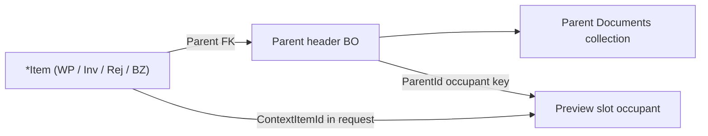
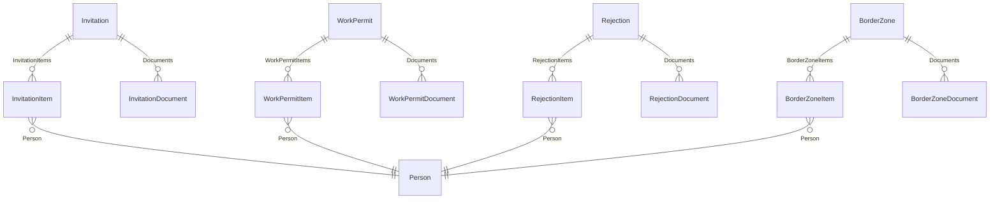
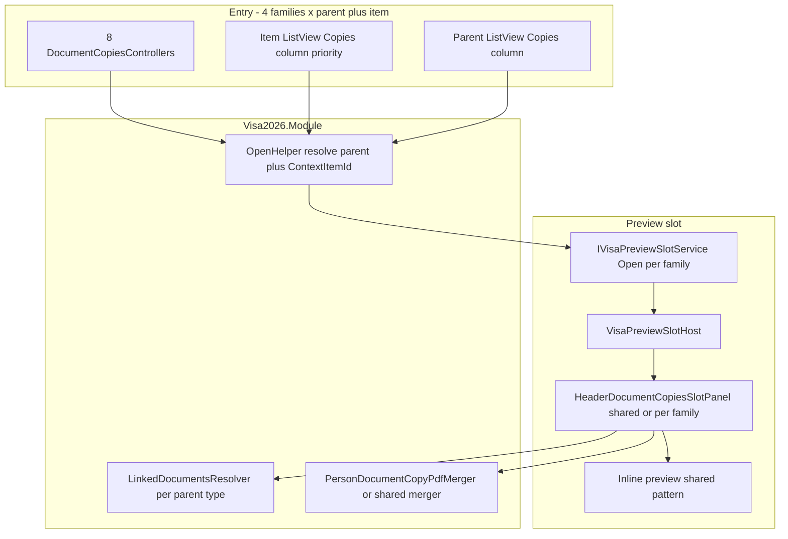

# Header & item document copies (Invitation, Work permit, Rejection, Border zone)

**Status:** **Implemented (Phases 0–2)** — preview-slot catalog for **parent-header** `Documents` on four related BO families, with entry from **parent** and **item** ListViews and DetailViews. Phases **3–4** remain deferred.

**Families in scope:**

| Family | Parent | Item (typical officer entry) | `*Document` today | Notes |
|--------|--------|------------------------------|-------------------|--------|
| Work permit | `WorkPermit` | `WorkPermitItem` | `WorkPermitDocument` | Optional `Application` FK |
| Invitation | `Invitation` | `InvitationItem` | `InvitationDocument` | Optional `Application` FK |
| Rejection | `Rejection` | `RejectionItem` | `RejectionDocument` | **Required** `Application` FK |
| Border zone | `BorderZone` | `BorderZoneItem` | **`BorderZoneDocument` *(Phase 0 — same release)*** | Mirror `Invitation` / `WorkPermit` `Documents`; see §Border zone schema |

**Doc filename** (`INVITATION_WORK_PERMIT_DOCUMENT_COPIES.md`) is historical — content covers all four families.

**Deferred (product decision — do not implement without explicit approval):**

| Phase | Topic | Status |
|-------|--------|--------|
| **0** *(Border zone — same release)* | `BorderZoneDocument` + `BorderZone.Documents` + DetailView tab (**required before Border zone preview**) | **Done** |
| **3** | Footer cross-links → Person / **ApplicationItem** document copies when `Application` FK set | **Deferred** |
| **4** | `*Image` preview; optional parent-scoped ZIP export | **Deferred** |

Officers who need ministry packaging today use **ApplicationItem** document copies ([`APPLICATION_ITEM_DOCUMENT_COPIES.md`](APPLICATION_ITEM_DOCUMENT_COPIES.md)).

**Agent skill:** [`.cursor/skills/visa2026-invitation-work-permit-document-copies/SKILL.md`](../.cursor/skills/visa2026-invitation-work-permit-document-copies/SKILL.md)

**Related (implemented today):**

| Scope | Doc / skill |
|-------|-------------|
| Person master catalog (includes work-permit / invitation **item** rows) | [`PERSON_DOCUMENT_COPIES.md`](PERSON_DOCUMENT_COPIES.md) · [`visa2026-person-document-copies`](../.cursor/skills/visa2026-person-document-copies/SKILL.md) |
| Application line ministry ZIP + linked snapshots | [`APPLICATION_ITEM_DOCUMENT_COPIES.md`](APPLICATION_ITEM_DOCUMENT_COPIES.md) · [`visa2026-document-copies`](../.cursor/skills/visa2026-document-copies/SKILL.md) |
| Preview slot shell | [`PREVIEW_SLOT.md`](PREVIEW_SLOT.md) · [`visa2026-preview-slot`](../.cursor/skills/visa2026-preview-slot/SKILL.md) |
| Ministry ZIP folder layout for `*Document` types | [`APPLICATION_DIPLOMA_PACKAGE_PLAN.md`](APPLICATION_DIPLOMA_PACKAGE_PLAN.md) |

---

## Why parent-scoped document copies

These BOs share one **header + many employee lines** shape. Scanned copies attach to the **parent**, not to each item:

| BO | Document collection | FK on document |
|----|---------------------|----------------|
| `Invitation` | `Documents` → `InvitationDocument` | `InvitationDocument.Invitation` |
| `WorkPermit` | `Documents` → `WorkPermitDocument` | `WorkPermitDocument.WorkPermit` |
| `Rejection` | `Documents` → `RejectionDocument` | `RejectionDocument.Rejection` |
| `BorderZone` | **`Documents` → `BorderZoneDocument` *(planned)*`** | *(not in schema today)* |

Today officers manage rejection files on the **Documents** tab of `Rejection_DetailView`. **`BorderZone` cannot store scan files yet** — it lacks the aggregated `Documents` collection that `Invitation` and `WorkPermit` already have. **Product decision:** add that schema in the **same release** as Border zone document preview (no preview entry that only shows a permanent empty state).

There is no in-slot **preview** from catalog ListViews or DetailViews for any of these families.

### Officer lookup paths (item-first vs parent-first)

Visa officers often work **by employee line**, not by header number:

| Typical navigation | BO | Default display | Why officers use it |
|--------------------|-----|-----------------|---------------------|
| **Work permit → items** | `WorkPermitItem` | `WorkPermitItemName` | Person + permit number, dates, state colours |
| **Invitation → items** | `InvitationItem` | `InvitationItemName` | Person-centric invitation lines |
| **Rejection → items** | `RejectionItem` | `RejectionItemName` | Person + rejection date (`Rejection.Date`) |
| **Border zone → items** | `BorderZoneItem` | Person + `BorderZone.BorderZoneNumber` | Person on border-zone permit line |
| **Header ListViews** | `WorkPermit`, `Invitation`, `Rejection`, `BorderZone` | Number / `RejectionTitle` / dates | Header-centric lookup |

**Product rule:** support **both** entry families in v1 for each family that has (or will have) parent documents. Treat **`*Item` ListView + DetailView as primary** (ListView **Copies** column; DetailView toolbar).

**Data rule unchanged:** files load from `parent.Documents` only. Item entry resolves the parent (`item.WorkPermit`, `item.Invitation`, `item.Rejection`, `item.BorderZone`) and passes optional **context item** metadata for the slot header — not a separate file index.

### How this differs from Person and ApplicationItem copies

| | ApplicationItem copies | Person copies | Header & item copies (planned) |
|---|------------------------|---------------|--------------------------------|
| **Index** | `ApplicationItem` FK snapshots | Live `Person` child collections | **Parent** `Documents` on invitation / work permit / rejection / border zone |
| **Typical entry BO** | `ApplicationItem` ListView | `Person` ListView / DetailView | **`*Item`** ListView + DetailView (also parent header views) |
| **Files per employee line** | One slot per application line | One row per item (parent files repeated) | **One row per `*Document`** on parent (shared across items) |
| **ZIP export** | `PdfGenerationBatch` | Out of scope v1 | **Out of scope v1** |
| **Multi-select** | Multiple application lines | Single person (v1) | **v1:** single row → one parent occupant |

**Person copies** already includes work permit, invitation, and rejection **sections** per person item. This feature answers: *“I opened the **line or header** in the work-permit / invitation / rejection / border-zone catalog — show scans in the preview slot without Person or ApplicationItem.”*

Do **not** extend `PersonLinkedDocumentsResolver` or `ApplicationItemLinkedDocumentsResolver` — different navigation context and catalog shape.

---

## Border zone schema (Phase 0 — same release as preview)

**Decision (product):** `BorderZone` must store file attachments **the same way** as `Invitation` and `WorkPermit` — parent-level aggregated `Documents` → `*Document` rows with `DocumentBase.File`. Phase 0 is **not** optional deferral and **not** “empty-state UI until later”; Border zone preview ships only after officers can attach files on the header BO.

### Parity with Invitation / Work permit

| Capability | `Invitation` / `WorkPermit` | `BorderZone` today | Phase 0 target |
|------------|----------------------------|--------------------|----------------|
| `Documents` collection on parent | Yes (`InvitationDocument` / `WorkPermitDocument`) | **Yes** (`BorderZoneDocument`) | Done |
| Documents tab on DetailView | Yes | **Yes** | Done |
| Preview slot catalog | Yes | Yes | Done |
| `Images` collection | Yes (phase 4 preview) | **No** | **Out of scope Phase 0** — documents only |

### Implementation checklist (mirror `InvitationDocument` / `Invitation.Documents`)

| # | Deliverable | Reference |
|---|-------------|-----------|
| 1 | `BorderZoneDocument.cs` — `DocumentBase`, `[RuleRequiredField] BorderZone BorderZone` | `InvitationDocument.cs` |
| 2 | `BorderZone` ctor — `Documents = new ObservableCollection<BorderZoneDocument>()` | `Invitation.cs` lines 31, 91–93 |
| 3 | `[Aggregated]` + `[InverseProperty(nameof(BorderZoneDocument.BorderZone))]` on `Documents` | `Invitation.Documents` |
| 4 | `DbSet<BorderZoneDocument>` in `Visa2026DbContext` | Other `*Document` sets |
| 5 | EF schema via XAF DB update (new table) | Deploy with app release |
| 6 | `BorderZone_DetailView` — **Documents** tab beside `BorderZoneItems` | `Invitation_DetailView` / `WorkPermit_DetailView` |
| 7 | `UiStrings.document-copies.json` — `BorderZone_DetailView` → `Documents` group captions | `Rejection_DetailView` block |
| 8 | `PersonLinkedDocumentsResolver` — optional **Border zone** section (future; not required for header preview v1) | Rejection section pattern |

**Implementation order within the release:** Phase 0 schema + Documents tab **first**, then Border zone slot/controllers in the same build (same or immediately following commit — not a later deploy).

**Do not** use `ApplicationItem.BorderZoneLocation` / `Visa.BorderZoneLocation` strings as scan storage — those remain **catalog labels** only.

## Officer workflow (target)

### Entry points (planned)

**Primary (item — person-centric lookup)** — same pattern for all four families:

| Where | Control | Behaviour |
|-------|---------|-----------|
| **`*Item` DetailView** (`WorkPermitItem`, `InvitationItem`, `RejectionItem`, `BorderZoneItem`) | Toolbar **Document copies** | Resolve parent from item FK; open slot with **context item** (person, dates) in header |
| **`*Item` ListView** | Toolbar **Document copies** | Single selected row → parent occupant + context item |
| **`*Item` ListView** | **Copies** link column | Per-row link → parent documents; header shows that employee line |

**Secondary (parent header):**

| Where | Control | Behaviour |
|-------|---------|-----------|
| **`WorkPermit` / `Invitation` / `Rejection` / `BorderZone` DetailView** | Toolbar **Document copies** | Open slot for current parent (no context item) |
| **Parent ListView** | Toolbar **Document copies** | Single selection → parent occupant |
| **Parent ListView** | **Copies** column | Per-row link → parent occupant |

**Nested views (same helpers):** `Person` DetailView embedded `WorkPermitItems`, `InvitationItems`, `RejectionItems` (and border-zone items if shown) use the **item** path. One open helper per family — do not fork resolvers per nested host.

### Resolve-via-parent (item entry)



| Step | Rule |
|------|------|
| 1 | From item: `parent = item.WorkPermit` / `item.Invitation` / `item.Rejection` / `item.BorderZone`; fail gracefully if parent null |
| 2 | Load catalog from `parent.Documents` (all four families after Phase 0) |
| 3 | Slot request: `{ ParentId, ContextItemId? }` — context optional |
| 4 | **Occupant key** uses **parent id only** (one slot per header; shared scans) |
| 5 | Bump slot `Version` when `ContextItemId` changes so header subtitle updates without stale person name |

When the parent has **multiple items**, show a short hint: scans are **shared for all employees** on this header.

### Panel layout (catalog mode)

Reuse the same **elevated card** UX as Person / ApplicationItem document copies ([`PREVIEW_SLOT.md`](PREVIEW_SLOT.md)).

1. **Header** — depends on entry path:
   - **From item:** person display name, item dates / status, parent identifier (`WorkPermitNumber`, `InvitationNumber`, `RejectionTitle` / `RejectedDocNumber`, `BorderZoneNumber`).
   - **From parent:** parent identifier, key dates, linked **`Application`** (required on `Rejection` / `BorderZone`; optional on work permit / invitation).
2. **Documents section** — one catalog row per `*Document` on the parent:
   - Label: file name and/or `Description` when set.
   - **Preview** when `File` is non-empty; empty-file readiness hint when the parent has no rows yet (same as invitation with zero uploads).
3. **Items roster** — when opened from **parent** (no context item), optional read-only list of linked `*Items` (person, dates, flags). When opened from **item**, skip roster or collapse to “other employees on this permit” link-only — avoid duplicating the ListView the officer came from.
4. **Footer (v1)** — **Refresh** + optional **gear** (per-file metadata). **No Download package**.

### Inline preview (exclusive mode)

Same pattern as existing document copies: catalog hides; merged PDF or image preview in **full slot width**.

- Reuse `PersonDocumentCopyPdfMerger` or extract shared `DocumentCopyPdfMerger` for single-record / multi-file sets.
- Header: **Download**, **Close** (no ministry batch summary).

### Cross-links (deferred — Phase 3)

When `Application` FK is set:

- Optional **Open person copies** for the context item’s `Person` when opened from item.
- Optional **Open application copies** when parent `Application` FK is set.

---

## Data model recap



**Preview v1 indexes:** parent `Documents` collections only. **Entry** may be any `*Item`; **never** a separate item-level document query.

**Existing load pattern** (reuse query shape):

- `PersonLinkedDocumentsResolver` — work permit, invitation, rejection sections (files from parent)
- `ApplicationItemLinkedDocumentsResolver` — work permit / invitation groups (not rejection today)

---

## Catalog rows & slot keys (planned)

Stable **`RecordKey`** strings for preview merge and future export:

| Parent | Source | Files from | Example `RecordKey` |
|--------|--------|------------|---------------------|
| `WorkPermit` | `WorkPermit.Documents` | `WorkPermitDocument` | `WorkPermitDocument:{documentId}` |
| `Invitation` | `Invitation.Documents` | `InvitationDocument` | `InvitationDocument:{documentId}` |
| `Rejection` | `Rejection.Documents` | `RejectionDocument` | `RejectionDocument:{documentId}` |
| `BorderZone` | `BorderZone.Documents` | `BorderZoneDocument` | `BorderZoneDocument:{documentId}` |

Optional merged row (alternative UX — **not recommended**): single row `WorkPermit:{id}/Scans` merging all files. Prefer **one row per document** to match the Documents tab and gear details.

**Occupant keys** (separate modes — do not mix with Person or ApplicationItem):

| Parent | `VisaPreviewSlotMode` (planned) | Occupant key | Request fields |
|--------|----------------------------------|--------------|----------------|
| `WorkPermit` | `WorkPermitDocumentCopies` | `work-permit-document-copies:work-permit:{id}` | `WorkPermitId`, optional `ContextWorkPermitItemId` |
| `Invitation` | `InvitationDocumentCopies` | `invitation-document-copies:invitation:{id}` | `InvitationId`, optional `ContextInvitationItemId` |
| `Rejection` | `RejectionDocumentCopies` | `rejection-document-copies:rejection:{id}` | `RejectionId`, optional `ContextRejectionItemId` |
| `BorderZone` | `BorderZoneDocumentCopies` | `border-zone-document-copies:border-zone:{id}` | `BorderZoneId`, optional `ContextBorderZoneItemId` |

Occupant key is **parent-only** so two officers (or two item rows on the same header) share one document catalog. Context item id affects **header copy only**, not occupant identity.

Keep **`DocumentCopiesSlotPanel`** (ApplicationItem) and **`PersonDocumentCopiesSlotPanel`** unchanged — new `*SlotPanel` components or one parameterized panel with `@key` on occupant.

---

## Architecture (planned)



### Implementation options (pick one when building)

| Approach | Pros | Cons |
|----------|------|------|
| **A. Twin stacks** — parallel resolver + component per BO | Clear occupant boundaries; mirrors Person vs ApplicationItem split | Some duplication |
| **B. Shared generic** — `ParentDocumentCopiesResolver<TParent,TDocument>` + one Blazor component | Less code | Harder XAF typing / localization |
| **C. Single resolver service** — `HeaderDocumentCopiesResolver` with enum discriminator | One file access path | Must keep invitation/work-permit keys distinct |

**Recommendation:** **B or C** when implementing all four families — shared `HeaderLinkedDocumentsResolver` + parameterized Blazor component; extract per-family localization keys. Use **twin stacks** only if a family needs exceptional UX.

---

## Module services (to add)

| File (planned) | Responsibility |
|----------------|----------------|
| `Services/HeaderLinkedDocuments/` shared DTOs | `HeaderLinkedDocumentRecord`, `HeaderLinkedDocumentsSnapshot` |
| `*LinkedDocumentsResolver.cs` (×4) or one generic resolver | Parent → document rows |
| `Localization/HeaderDocumentCopiesLocalization.cs` | Titles, sections, empty states (prefix per family) |
| `Controllers/*DocumentCopiesController.cs` (×8) | Parent + item × 4 families → open helper |
| `*DocumentCopiesOpenHelper.cs` (×4) | `TryOpenForParent`, `TryOpenForItem` → `IVisaPreviewSlotService` |
| **Phase 0:** `BorderZoneDocument.cs`, `BorderZone.Documents`, EF migration | Schema only |

**Reuse (call or extract):**

- `LoadDocumentFiles<TDocument>` pattern from `ApplicationItemLinkedDocumentsResolver`
- `PersonDocumentCopyPdfMerger` for preview PDF build
- `PersonDocumentCopiesListLinkClickController` + `_Host.cshtml` JS pattern for ListView column
- `PersonDocumentCopiesListViewColumnUpdater` pattern for `Model.xafml` column seed

**NotMapped ListView links (phase 2 — item ListViews first):**

```csharp
// *Item.cs (priority) and parent *.cs — one NotMapped property per BO
public string DocumentCopiesListLink => VisaUiMessages.Get("RejectionDocumentCopies.List.ColumnLink");
```

**Eight controllers** → **distinct action ids** (`ViewRejectionItemDocumentCopies`, …) but **four shared open helpers** (Person copies duplicate-action lesson).

---

## Blazor (to add)

| File (planned) | Responsibility |
|----------------|----------------|
| `IVisaPreviewSlotService` | `OpenWorkPermitDocumentCopiesAsync`, `OpenInvitationDocumentCopiesAsync`, `OpenRejectionDocumentCopiesAsync`, `OpenBorderZoneDocumentCopiesAsync` |
| `VisaPreviewSlotHost.razor` | Four new branches (or one parameterized branch) |
| `VisaPreviewSlotOccupantKeys.cs` | `For*DocumentCopies` per family |

Prefer **one** `HeaderDocumentCopiesSlotPanel.razor` + `HeaderDocumentCopiesComponent.razor` with family discriminator over twelve nearly identical files.

**CSS:** `header-document-copies-slot-panel` + family modifier classes extending `.resminamalar-slot-panel`.

---

## Phased delivery

| Phase | Focus | Status |
|-------|--------|--------|
| **0** | `BorderZoneDocument` + `BorderZone.Documents` + DetailView tab (**same release**, before Border zone slot) | **Done** |
| **1** | All four families: resolvers, item + parent DetailView, slot API, Preview, Refresh (Border zone after step 0 in same release) | **Done** |
| **2** | All families: item/parent ListView **Copies** column (no ListView toolbar); DetailView toolbar; gear | **Done** |
| **3** | Footer cross-link to Person / ApplicationItem | **Deferred** |
| **4** | `*Image` preview; optional parent ZIP | **Deferred** |

---

## Localization (planned prefix)

| Key area | Example keys |
|----------|----------------|
| Action title | `WorkPermitDocumentCopies.Title`, `InvitationDocumentCopies.Title`, `RejectionDocumentCopies.Title`, `BorderZoneDocumentCopies.Title` |
| List column | `*.List.ColumnLink`, `*.List.SelectOne` per family |
| Section / empty | `*.Section.Documents`, `*.Empty.Documents` |
| Shared scans hint | `HeaderDocumentCopies.Hint.SharedParentScans` |

Run `tools/GenerateModelLocalization` after adding `UiStrings.messages.json` entries.

---

## Security & file access

- File access validates read permission on the **parent** BO (`Invitation`, `WorkPermit`, `Rejection`, `BorderZone`).
- No new public anonymous routes.
- Preview downloads are per-document merges, not ministry packages.

---

## Testing (when implemented)

| Layer | Check |
|-------|--------|
| Module | Resolver from parent id; item open helper resolves parent; context header fields |
| Blazor | **Item** DetailView → slot → Preview; parent DetailView; context header updates on re-open |
| ListView | `RejectionItem_ListView`, `BorderZoneItem_ListView`, and other item ListViews — Copies column only |
| Border zone | Phase 0 + preview in one release; attach file on Documents tab → Preview in slot |
| Regression | Person / ApplicationItem occupants unchanged |

---

## Open product questions

1. **Items roster in slot** — when opened from **parent**, show linked employees or documents-only?
2. **ListView column priority** — all four `*Item` ListViews before parent header ListViews?
3. **Phase 3 cross-link** — Rejection / BorderZone always have `Application`: open **all** application items or only people on this header?
4. **Shared component** — one parameterized Blazor panel vs four twin panels?

**Resolved:** Border zone **Phase 0 ships in the same release** as preview; `BorderZone` gets parent `Documents` like `Invitation` / `WorkPermit` — **not** empty-state-only entry.
