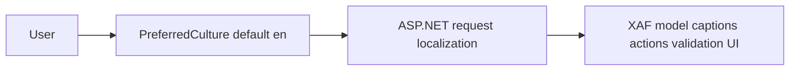

# Visa2026 — Localization Plan

**Status:** Draft (planning)  
**Current scope:** **Layer A only** — XAF Blazor application UI  
**Out of scope (for now):** Layer B (lookup/reference data), Layer C (reports, Word, PDF, user templates)  
**Target UI languages:** English, Turkish, Turkmen, Russian  
**Default UI language:** **English** (`en`)

This document is the contract for UI localization work. It does not implement features by itself.

---

## 1. Purpose (current initiative)

Enable users to use the **XAF Blazor shell** in **en / tr / tk / ru**, defaulting to **English**:

- Navigation, view captions, action titles, tooltips
- System validation messages exposed in the UI
- Custom controller dialogs and messages (where not already Turkmen **business data**)

**Not in this initiative:**

- Translating lookup rows (`Country.NameTm`, etc.) — see [§8 Deferred — Layer B](#8-deferred--layer-b-reference-data)
- Translating generated documents — see [§9 Deferred — Layer C](#9-deferred--layer-c-documents)
- Changing report/PDF/Word output language when the user switches UI language

**Known limitation while Layer B is deferred:** combo boxes and list cells still show **`NameTm`** (or English field captions with `(Tm)` data aliases). That is expected until a separate lookup-localization project runs.

---

## 2. Principles (Layer A)

| # | Principle |
|---|-----------|
| P1 | **UI language does not change document output.** Reports, PDFs, and Word generation behave as today. |
| P2 | **Default UI is English (`en`).** First visit and new users see English until they choose another language and it is persisted. |
| P3 | **Do not rename or repurpose `NameTm`** for UI work; it remains business/report data, not UI i18n. |
| P4 | **Do not apply Turkish (`tr`) culture** to Turkmen **data** strings in code paths shared with PDF mapping (existing invariant/Turkmen rules stay). |
| P5 | **Translate via XAF Application Model** where possible; avoid scattering UI translations only in C# attributes. |
| P6 | **No machine translation** for UI strings in v1; human or approved glossary only. |

---

## 3. UI language matrix (Layer A only)

| Language | BCP-47 | In scope | Notes |
|----------|--------|----------|--------|
| English | `en` | **Yes — default** | Source captions in model/code today |
| Turkish | `tr` | Yes | UI strings only |
| Turkmen | `tk` or `tk-TM` | Yes | Confirm .NET culture on Docker host |
| Russian | `ru` | Yes (confirm v1 priority) | UI strings only |

---

## 4. Current state (baseline)

| Area | Today |
|------|--------|
| UI captions | Mostly English `[XafDisplayName]`; some Turkmen labels on BOs (e.g. `WorkDuty`) |
| Host | `UseRequestLocalization()` in `Startup.cs` — **no** configured cultures or default |
| XAF model | No per-language caption aspects in committed model yet |
| User preference | `ApplicationUser.PreferredCulture` + DevExpress language switcher; ASP.NET culture cookie |
| Lookups | Still `DefaultProperty = NameTm` — **unchanged** in this initiative |
| Documents | Unchanged (Turkmen-first) |

---

## 5. Architecture (Layer A)

**Flow:**

1. Request arrives with culture **`en`** unless user has saved `PreferredCulture` (or explicit picker change sets cookie).
2. XAF resolves localized captions from Application Model + framework satellite resources for **en / tr / tk / ru**.
3. Business object **values** (person names, `NameTm` in grids, ministry RTF) are **not** translated by this pipeline.

**Recommendation:** Do not auto-apply browser `Accept-Language` until the user selects a language (keeps **English default** predictable). Optional: use browser language only as a hint on first login, not on every anonymous hit.

---

## 6. Implementation checklist (Layer A)

Work primarily in **`Visa2026.Blazor.Server`** (host, culture, picker) and **Application Model** (`Model.xafml`, `Visa2026.Module/Model.DesignedDiffs.xafml`). Module changes only for user culture field, validation message resources, and controller strings.

### 6.1 Host — `Visa2026.Blazor.Server`

- [x] **A1** `VisaLocalization.ConfigureServices` — `AddLocalization`, `RequestLocalizationOptions` (`en-US`, `tr-TR`, `tk-TM`, `ru-RU`), default `en-US`, cookie + query providers (no `Accept-Language`)
- [x] **A1** `VisaLocalization.UseVisaRequestLocalization` — wired in `Startup.Configure`
- [x] **A1** `DevExpress:ExpressApp:Languages` in `appsettings.json` (matches supported list; first = default)
- [x] **A1** `BlazorApplication.CustomizeLanguage` — XAF model language follows request culture / falls back to `en-US`
- [x] **A1** `Model.DesignedDiffs.xafml` — `PreferredLanguage="(User language)"`
- [x] **A2** DevExpress runtime language switcher (`ShowLanguageSwitcher: true`) on login page + settings menu
- [x] **A2** `UserCultureController` + `UserCultureHelper` — persist culture to `ApplicationUser.PreferredCulture`, restore on logon via `IXafCultureInfoService`

### 6.2 User preference

- [x] **A2** `ApplicationUser.PreferredCulture` (`string`, max 10, hidden from UI)
- [x] **A2** On logon: apply saved culture (`SetCultureAsync`) or seed from cookie / current request
- [x] **A2** Default role member permission + `EnsurePreferredCultureSelfWritePermission` in `Updater` (EF schema adds column on next DB update)

#### 6.2.1 Persistence across redeployments

User-selected UI language **survives normal app redeploys** (new Docker image, container restart, assembly version bump). It is **not** stored in the deployed binary or tied to a release tag.

| Store | Mechanism | Survives redeploy? | Notes |
|-------|-----------|-------------------|--------|
| **SQL Server** | `ApplicationUser.PreferredCulture` | **Yes** (if DB volume/data kept) | Authoritative for logged-in users. Restored on logon by `UserCultureController` → `UserCultureHelper.ApplyStoredCultureAfterLogonAsync`. Updated when the user changes language via `PersistCurrentCultureToUser`. |
| **Browser cookie** | `.AspNetCore.Culture` (1-year expiry, path `/`) | **Yes** (same site/domain) | Set by `VisaCulturePersistenceMiddleware` / `VisaCultureCookie`. Used by request localization and DevExpress `IXafCultureInfoService`. Helps before login and between full page loads. |

**Typical redeploy flow:**

1. New version starts → Blazor circuits drop; users refresh or sign in again.
2. If the culture **cookie** is still present → UI stays in that language immediately.
3. On **logon**, if cookie and DB differ or cookie is missing → **`PreferredCulture` from the database** wins (full reload via `SetCultureAsync`).

**When preference is lost or reset:**

- SQL database wiped or replaced with an empty DB (no `PreferredCulture` rows).
- User clears site cookies **and** has no saved DB value (e.g. never logged in after picking a language).
- Hostname or domain changes (cookie is domain-scoped; DB still applies after login on the new host).
- Selected culture removed from `VisaLocalization.SupportedCultureNames` → falls back to **`en-US`**.

**Operations note:** Prod/dev compose stacks that **retain the SQL volume** (see `docs/ENVIRONMENTS.md`) keep per-user language across rollouts. Redeploying only the app container does not clear preferences.

**Code:** `Visa2026.Blazor.Server/Localization/` (`UserCultureHelper`, `VisaCultureCookie`, `VisaCulturePersistenceMiddleware`, `VisaXafCultureInfoService`), `Visa2026.Blazor.Server/Controllers/UserCultureController.cs`, `Visa2026.Module/BusinessObjects/ApplicationUser.cs`.

### 6.3 XAF Application Model

- [x] **A3** Languages **tr-TR, tk-TM, ru-RU** via `Model.DesignedDiffs.Localization.*.xafml` (embedded) + `Model.*.xafml` on Blazor host
- [x] **A3–A4** Translation sources: `UiStrings.json` + `tools/GenerateModelLocalization/UiStrings.entities.json` + `UiStrings.views-a4.json`; regenerate with `tools/GenerateModelLocalization`
- [x] **A3** Translated: navigation (main groups), standard actions, `Application` / `ApplicationItem` / `Person` / `ApplicationUser` / roles, main list & detail views (captions, key columns, layout tab captions)
- [x] **A4** Remaining model translations: entity catalog (`UiStrings.entities.json`), supplemental views/layouts (`UiStrings.views-a4.json`); generator merges all three JSON sources
- [x] **A5** Controller/validation hard-coded strings; grid search placeholder; validation rule templates in localization xafml
- [ ] Prefer model **Caption** translations over duplicating `[XafDisplayName]` per language in C# (ongoing)

### 6.4 Code audit (Module controllers)

- [ ] Inventory hard-coded UI strings: `MessageOptions`, `ShowView` captions, `Application.ShowViewStrategy.ShowMessage`
- [ ] Move to localizable resources or model where found
- [ ] Leave **Turkmen document/report strings** and `NameTm` property paths untouched

### 6.5 Validation UI

- [ ] DevExpress validation rule messages → localized via model/resources
- [ ] Custom `IRule` / `RuleRequiredField` messages in controllers → resources

### 6.6 Explicitly out of scope

| Item | Reason |
|------|--------|
| `LookupBase` / seed JSON translations | Layer B |
| `NameTm` / `DefaultProperty` change | Layer B |
| XtraReports, Word, PDF, Excel templates | Layer C |
| EasyTest script language | E2E stays English |
| DataImporter CLI text | Not Blazor UI |

---

## 7. Phased roadmap (Layer A only)

| Phase | Deliverable |
|-------|-------------|
| **A0** | Approve this scope; UI string inventory (navigation + top 20 views) |
| **A1** | Request localization + default `en` + XAF culture integration — **done** (see `Visa2026.Blazor.Server/Localization/VisaLocalization.cs`) |
| **A2** | Language picker + persist `PreferredCulture` — **done** |
| **A3** | Model translations: navigation + system actions + main views — **done** (`UiStrings.json` + generated xafml) |
| **A4** | Model translations: remaining BOs, lookups, tracking views, detail layout tabs — **done** |
| **A5** | Controller/validation string pass + smoke test per culture |

**Open decisions (Layer A):**

- [ ] Ship all four UI languages in one release, or **en + tr** first then tk + ru?
- [ ] Russian UI required in first Layer A release?
- [ ] Browser language: ignore vs first-login hint?

---

## 8. Testing (Layer A)

- **Manual:** login, change language, verify navigation + one `Application` DetailView caption in **en, tr, tk, ru**
- **Regression:** generate one Turkmen Word report / PDF — output **unchanged** vs pre-localization
- **E2E:** keep primary path in **English**; add optional culture-cookie test after A2

---

## 9. Risks (Layer A)

| Risk | Mitigation |
|------|------------|
| `tk` culture unavailable on Linux container | Test Docker image early; document fallback |
| Mixed English captions + Turkmen `NameTm` in same grid | Expected until Layer B; document for users |
| Translations only in C# attributes | Prefer Model.xafml; harder for translators |
| Scope creep into reports/lookups | This plan’s **current scope** gate |

---

## 10. Translation workflow (UI only)

| Role | Task |
|------|------|
| Developer | Plumbing (A1–A2), model structure, string inventory |
| Translator | `Model.xafml` / `Model.DesignedDiffs.xafml` caption aspects |
| Reviewer | Spot-check **tk** UI strings (orthography; not the same as report §14 but same alphabet) |

**Artifact:** `docs/localization/ui-strings.csv` (optional) — ID, model node, en, tr, tk, ru, status.

---

## 11. Related documentation

- `AGENTS.md` — solution layout; UI host vs Module
- `REPORT_STANDARDS.md` — **not** in current scope (Layer C)
- `docs/USER_DEFINED_WORD_TEMPLATES_IDEA.md` — template i18n deferred

---

## 12. Decision log

| Date | Decision |
|------|----------|
| 2026-05-21 | Default UI language = **English (`en`)** |
| 2026-05-21 | **Current initiative = Layer A (XAF Blazor UI) only** |
| 2026-05-21 | Layer B (lookups) and Layer C (documents) **deferred** |
| 2026-05-21 | **A1 implemented** — `VisaLocalization`, appsettings `Languages`, `CustomizeLanguage` |
| 2026-05-21 | **A2 implemented** — `ShowLanguageSwitcher`, `PreferredCulture`, `UserCultureController` |
| 2026-05-21 | **A3 implemented** — `UiStrings.json`, `GenerateModelLocalization`, localization xafml (tr/tk/ru) |
| 2026-05-21 | Documented UI culture persistence across redeployments (DB + cookie); see [§6.2.1](#621-persistence-across-redeployments) |

---

## 13. Deferred — Layer B (reference data)

*Not part of the current initiative.*

**Started (foundation):**

| Piece | Location |
|-------|----------|
| Catalog identity enum | `GlobalLookupCatalogKind` + `[GlobalLookupCatalog(...)]` on global lookup BOs |
| Stable row key | `LookupBase.LocalizationKey` (seed: JSON `LocalizationKey` or `Code`) |
| UI resolver | `LookupLocalization.GetDisplayName` + `LookupBase.LocalizedDisplayName` |
| String table (sample) | `Visa2026.Module/Localization/LookupStrings.json` (`gender`, `urgency` — extend per catalog) |

**Wired (UI display):** `LookupLocalizationDisplay.ConfigureTypesInfo` sets `DefaultMember` = `LocalizedDisplayName` on every `[GlobalLookupCatalog]` BO (combos, lookup lists). **Gender** also overrides `ToString()` for extra display paths. Culture change reloads the page (`VisaXafCultureInfoService`), so labels refresh without a separate controller.

**Still deferred:** full `LookupStrings.json` for large catalogs (`country`, …); optional admin list column for `LocalizedDisplayName`; tenant lookups still use `NameTm`.

`NameTm` remains ministry/report data — not repurposed for UI i18n (principle P3).

---

## 14. Deferred — Layer C (documents)

*Not part of the current initiative.*

Future work: per-language Word templates, report cultures, XFA unchanged, Turkmen QA on `REPORT_STANDARDS.md`.

UI language switch must **not** imply document language switch.

---

## 15. Appendix — UI string inventory template

| ID | Source | Node / key | en | tr | tk | ru | Status |
|----|--------|------------|----|----|----|----|--------|
| NAV-001 | Model.xafml | Navigation / Application | Application | | | | Pending |

Populate in phase **A0** before model translation (A3).
