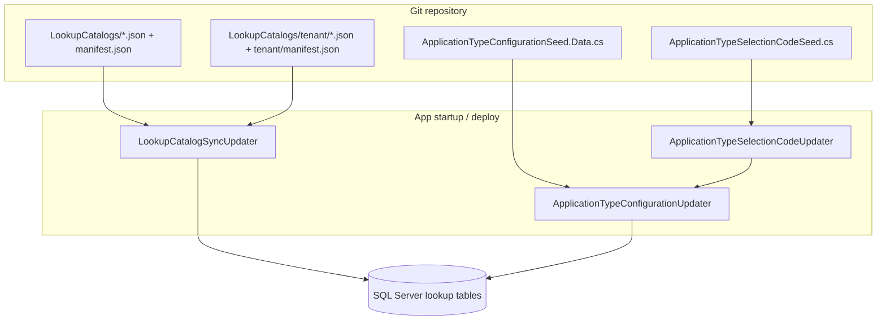

# Lookup data seeding (Visa2026)

How reference / lookup tables are populated and kept in sync across dev, Docker, and customer deployments.

**Agent skill (step-by-step):** [`.cursor/skills/visa2026-lookup-data/SKILL.md`](../.cursor/skills/visa2026-lookup-data/SKILL.md)

---

## Goals

- **Version-controlled** lookup data in git (not Excel as the runtime source).
- **Automatic sync on deploy** when the app starts (XAF `ModuleUpdater`), without editing rows in the Blazor lookup UI.
- **Same product build** can ship shared ministry catalogs to every customer, while **company-specific** data (positions, ministries, etc.) lives in a separate tenant pack.
- **`ApplicationType`** visibility flags (`Show*`) and ministry **`SelectionCode`** values stay correct after every release.

---

## What is *not* used anymore

| Old approach | Status |
|--------------|--------|
| `Visa2026.DataImporter/lookup.xlsm` as runtime seed | **Removed** (`--seed-lookups-only` CLI removed). File remains for `--export-lookup-catalogs` / `--dump-lookups`. |
| `LookupSeeder` OData POST from Excel | **Removed** — Module updaters on app startup. |
| `LOOKUPS.md` as source of truth | **Removed** — ApplicationType configuration now lives in `Visa2026.Module/DatabaseUpdate/LookupCatalogs/ApplicationTypeConfigurationCatalog.json`. |
| Blazor lookup screens for product fixes | **Avoid** for routine changes; use seed files + deploy. |

---

## Architecture (high level)



1. **Build** embeds `LookupCatalogs/**/*.json` into `Visa2026.Module`.
2. **App starts** → XAF runs database updaters (after schema is current).
3. **Updaters upsert** rows into SQL Server lookup tables.
4. **DataImporter** `data.yaml` scenarios assume lookups already exist (start app once before running the importer).

---

## Two seeding tracks

### 1. JSON catalogs (`LookupCatalogSyncUpdater`)

**Code:** `Visa2026.Module/DatabaseUpdate/LookupCatalogs/`  
**Updater:** `LookupCatalogSyncUpdater.cs`  
**Loader:** `LookupCatalogResourceLoader.cs` → `LookupCatalogEntitySync.cs`

Each catalog is a JSON file:

```json
{
  "rows": [
    {
      "Name": "…",
      "NameTm": "…",
      "Code": "…",
      "LocalizationKey": "…",
      "IsDefault": false
    }
  ]
}
```

**Lookup catalog JSON (global + tenant):** use **`NameTm`** for Turkmen titles; use **`LocalizationKey`** and/or **`Code`** for Layer B UI and upsert identity. Do **not** duplicate the same text in `Name` — the DB column is legacy-only. **`matchKey`** in manifests: **`NameTm`** for most catalogs, **`CodeOrName`** for `country` (and `project-contract` tenant), **`NameAndRegion`** for `city` (sync matches `NameTm` + region). Exceptions: **`ApplicationTypeConfigurationCatalog.json`** keeps `Name` as type key; organization singletons use `Name` / `FullName` / `FullAddress` as before.

**Layer B localization:** optional `LocalizationKey` (falls back to `Code` on sync) maps to embedded string tables (`LookupStrings.json`, `VisaLookupStrings.json`, `ApplicationTypeLookupStrings.json`, `CountryLookupStrings.json`). **Country** UI strings (235 rows, ISO alpha-3 keys) are generated with `scripts/local/Generate-CountryLookupStrings.ps1` (CLDR + `scripts/local/data/`). Legacy ministry codes (`UAE`, `ROM`, …) are in `scripts/local/data/country-legacy-overrides.json`. UI uses `LookupBase.LocalizedDisplayName`; `NameTm` stays report/PDF data per `docs/LOCALIZATION_PLAN.md`.

`manifest.json` lists catalogs in **dependency order** (e.g. `Region` before `City`).  
`tenant/manifest.json` is **merged** into the main manifest at runtime.

### 2. ApplicationType configuration (JSON catalog + generated C# seed)

**Not** in JSON catalogs (many `Show*` flags per row).

| Component | Role |
|-----------|------|
| `LookupCatalogs/ApplicationTypeConfigurationCatalog.json` | **Source of truth** for ApplicationType rows + `Show*` flags |
| `ApplicationTypeConfigurationSeed` + `.Data.cs` | Generated output used by updater; one row per `ApplicationType.Name`; **all `Show*` flags overwritten** on deploy |
| `ApplicationTypeSelectionCodeUpdater` | Sets ministry `SelectionCode` from `ApplicationTypeSelectionCodeSeed` |
| Regenerate `.Data.cs` | `scripts/local/Generate-ApplicationTypeConfigurationSeed.ps1` (from `ApplicationTypeConfigurationCatalog.json`) |

Registered in `Visa2026.Module/Module.cs` **after** `LookupCatalogSyncUpdater`.

---

## Global vs company-specific catalogs

### Global (shared — every deployment)

Embedded under `Visa2026.Module/DatabaseUpdate/LookupCatalogs/`.  
Listed in [`manifest.json`](../Visa2026.Module/DatabaseUpdate/LookupCatalogs/manifest.json).

| Entity | JSON file | Match key |
|--------|-----------|-----------|
| Country | `country.json` | Code, else Name |
| Gender | `gender.json` | Name |
| MaritalStatus | `marital-status.json` | Name |
| Urgency | `urgency.json` | Name |
| VisaCategory | `visa-category.json` | Name |
| VisaPeriod | `visa-period.json` | Name |
| VisaType | `visa-type.json` | Name |
| EducationLevel | `education-level.json` | Name |
| PurposeOfTravel | `purpose-of-travel.json` | Name |
| CheckPoint | `checkpoint.json` | Name |
| VisaIssuedPlace | `visa-issued-place.json` | Name |
| MigrationService | `migration-service.json` | Name |
| PassportType | `passport-type.json` | Name |
| Relationship | `relationship.json` | Name |
| ApplicationLocation | `application-location.json` | Name |
| ValidityDuration | `validity-duration.json` | Name |
| ApplicationState | `application-state.json` | Name |
| Region | `region.json` | Name |
| City | `city.json` | Name + Region |

### Company-specific / tenant (per deployment)

Embedded under `LookupCatalogs/tenant/` (and/or copied to disk — see below).  
Listed in [`tenant/manifest.json`](../Visa2026.Module/DatabaseUpdate/LookupCatalogs/tenant/manifest.json).

| Entity | JSON file | Match key |
|--------|-----------|-----------|
| Position | `tenant/position.json` | Code, else Name |
| Specialty | `tenant/specialty.json` | Name |
| EducationInstitution | `tenant/education-institution.json` | Name |
| Department | `tenant/department.json` | Name |
| Ministry | `tenant/ministry.json` | Name |
| CompanyProfile | `tenant/company-profile.json` | Name — **singleton** |
| ApplicationNumberingProfile | `tenant/application-numbering.json` | Name — **singleton** |
| AuthorizedSignatory | `tenant/authorized-signatory.json` | FullName — **singleton** |
| AuthorizedRepresentative | `tenant/authorized-representative.json` | FullName — **singleton** |
| ProjectContract | `tenant/project-contract.json` | Code, else Name |
| BorderZoneName | `tenant/border-zone-name.json` | Name — multi-select catalog for `ApplicationItem` / `Visa` border zones |
| WorkPermittedLocationName | `tenant/work-permitted-location-name.json` | Name — multi-select catalog for work-permitted locations on `ApplicationItem` / `WorkPermitItem` |
| Lodging | `tenant/lodging.json` | FullAddress — company lodging sites for `AddressOfResidence` |

**Singleton rules** (one DB row, rename-safe sync, report merge): [`LOOKUP_ORGANIZATION_SINGLETONS.md`](LOOKUP_ORGANIZATION_SINGLETONS.md).

For a **new customer**, replace these tenant JSON files (or overlay on the server) with that organization’s data. The repo’s tenant files are the **default/reference** company for this product line.

### Not seeded from JSON catalogs

| Entity | Reason |
|--------|--------|
| **ApplicationType** | C# seed + dedicated updaters |
| **BorderZoneLocation** | Legacy FK / UI catalog BO; **item/visa border zones** use comma-separated strings + **`BorderZoneName`** tenant JSON (`tenant/border-zone-name.json`) |
| **WorkPermitLocation** | Optional lookup BO (region-scoped); **work-permitted location labels** use **`WorkPermittedLocationName`** tenant JSON (`tenant/work-permitted-location-name.json`) |
| **MovementPermitLocation** | Intentionally excluded; maintain in app if needed |
| **ApplicationTypeFilter** | Deprecated; not seeded. Quick-code picker groups by `SelectionCode` hundreds (see `ApplicationTypeCodePickerHelper`). Full row: [`docs/DEPRECATED.md`](DEPRECATED.md). |

---

## Sync behavior on deploy

| Rule | Detail |
|------|--------|
| **When** | Each app startup that runs XAF `UpdateDatabaseAfterUpdateSchema` (deploy, local run, Docker recreate). |
| **Upsert** | Match existing row by manifest `matchKey`; otherwise create. |
| **Overwrite** | `syncMode: OverwriteScalars` — scalar properties in JSON **replace** DB values every deploy. |
| **Deletes** | **Never** for multi-row catalogs — rows removed from JSON stay in the DB (avoids FK breakage). |
| **Organization singletons** | Exception to “never delete”: one row per entity; see [`LOOKUP_ORGANIZATION_SINGLETONS.md`](LOOKUP_ORGANIZATION_SINGLETONS.md). |
| **FK resolution** | JSON keys `Region`, `Company`, `Ministry` resolve by **Name** to existing rows. |

If updaters do not run on a DB that already reports “current”, set **`FORCE_XAF_DB_UPDATE=true`** once — see [`docs/ENVIRONMENTS.md`](ENVIRONMENTS.md).

---

## Runtime file locations

| Source | Path |
|--------|------|
| Embedded (ship with build) | `Visa2026.Module` assembly → `DatabaseUpdate/LookupCatalogs/**` |
| Optional disk overlay | `{AppBaseDirectory}/LookupCatalogs/tenant/*.json` and `tenant/manifest.json` |

Disk overlay is useful for **customer-specific** packs without rebuilding the image.

---

## Developer workflows

### Change a global lookup (e.g. Country name)

1. Edit `Visa2026.Module/DatabaseUpdate/LookupCatalogs/country.json`.
2. Build and deploy / restart app.
3. Verify in UI or SQL.

### Change company positions or ministry

1. Edit `LookupCatalogs/tenant/position.json` (or ministry, department, etc.).
2. Deploy / restart app.

### Change ApplicationType visibility

1. Edit `Visa2026.Module/DatabaseUpdate/LookupCatalogs/ApplicationTypeConfigurationCatalog.json`.
2. Regenerate `ApplicationTypeConfigurationSeed.Data.cs`:

```powershell
.\scripts\local\Generate-ApplicationTypeConfigurationSeed.ps1
```
3. Deploy / restart app — **`Show*` always overwritten**.

### Bootstrap from legacy Excel (one-off)

If `lookup.xlsm` is still in `Visa2026.DataImporter`:

```powershell
dotnet run --project Visa2026.DataImporter -- --export-lookup-catalogs
```

- Writes **global** JSON + `manifest.json`.
- Writes **tenant** JSON + `tenant/manifest.json`.
- Skips **ApplicationType** and **MovementPermitLocation**.

Then commit the generated files.

Regenerate ApplicationType C# seed from the JSON catalog:

```powershell
.\scripts\local\Generate-ApplicationTypeConfigurationSeed.ps1
```

The script writes **UTF-8 without BOM**. Do not strip lines with `Set-Content -Encoding UTF8` (Windows PowerShell can mojibake Turkmen text in `NameTm`).

**PowerShell `ConvertTo-Json` trap:** a catalog with **one row** becomes `"rows": { ... }` instead of `"rows": [ { ... } ]`, which breaks `System.Text.Json` deserialization. Always emit an array (e.g. `rows = @(@($row))` or hand-write JSON for single-row catalogs like `business-trip-purpose.json`).

### Greenfield database

1. Start **Visa2026.Blazor.Server** (schema + updaters run).
2. Optionally set `FORCE_XAF_DB_UPDATE=true` once if needed.
3. Run scenario import:

```powershell
dotnet run --project Visa2026.DataImporter
```

### `data.yaml` imports

Lookup **names** in YAML (especially Turkmen strings for Country, etc.) must match seeded values exactly. Inspect the JSON catalogs under `Visa2026.Module/DatabaseUpdate/LookupCatalogs/`.

---

## Key source files

| Path | Purpose |
|------|---------|
| `Visa2026.Module/DatabaseUpdate/LookupCatalogs/manifest.json` | Global catalog registry |
| `Visa2026.Module/DatabaseUpdate/LookupCatalogs/tenant/manifest.json` | Tenant catalog registry |
| `Visa2026.Module/DatabaseUpdate/LookupCatalogSyncUpdater.cs` | Deploy sync entry point |
| `Visa2026.Module/DatabaseUpdate/ApplicationTypeConfigurationUpdater.cs` | ApplicationType `Show*` sync |
| `Visa2026.Module/DatabaseUpdate/ApplicationTypeSelectionCodeUpdater.cs` | Selection codes |
| `Visa2026.DataImporter/LookupCatalogExporter.cs` | xlsm → JSON export |
| `Visa2026.Module/Module.cs` | Updater registration order |

---

## Updater registration order (excerpt)

In `Module.cs`, lookup-related updaters run near the end of the updater list:

1. `LookupCatalogSyncUpdater` — JSON catalogs (global + merged tenant manifest)
2. `ApplicationTypeSelectionCodeUpdater` — fills `SelectionCode` when empty
3. `ApplicationTypeConfigurationUpdater` — full ApplicationType config + **overwrite `Show*`**

---

## Related documentation

- [`docs/ENVIRONMENTS.md`](ENVIRONMENTS.md) — Docker, `FORCE_XAF_DB_UPDATE`, deploy
- [`Visa2026.DataImporter/IMPORTING.md`](../Visa2026.DataImporter/IMPORTING.md) — scenario import (update seeding section when convenient)
- [`AGENTS.md`](../AGENTS.md) — agent skills index
