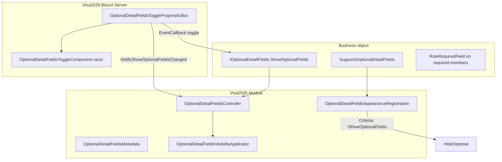

# Optional detail fields (gear toggle)

Reusable **detail-view** pattern for business objects with many properties: show **required** fields by default, hide **optional** fields until the user clicks a **gear** button (or until optional data already exists on the record).

Implemented for nested collection popups (e.g. Person → Salaries, Education, Position history) and any other `DetailView` where the type opts in.

## Where it is used

| Business object | Required (always visible) | Optional (gear / auto-expand) |
|-----------------|---------------------------|-------------------------------|
| `EmployeeSalary` | `Person`, `Amount`, `Currency` | `StartDate`, `EndDate`, `Title` (computed) |
| `EmployeePositionHistory` | `Position`, `ActualPosition`, `Person` | `StartDate`, `EndDate`, `Department`, `Title` (computed) |
| `Education` | `EducationLevel`, `EducationInstitution`, `EducationCountry`, `Specialty`, `Person`, `Documents` (required via `[RuleRequiredField]` on collection) | `GraduationYear` |
| `Person` | Members with `[RuleRequiredField]` (incl. conditional), e.g. `FirstName`, `LastName`, `DateOfBirth`, `Age`, `ForeignAddress`, `ForeignAddressCountry`, `VisaApplicationFamilyMembersText` (employees, default `Ýok`), … | e.g. `MiddleName`, `Photo`, `Email`, `HireDate`, `IsArchived`, `SponsoringEmployee` — not list tabs (`Documents`, `Passports`, … are optional collections) |
| `Passport` | `PassportNumber`, `PassportType`, `IssueDate`, `ExpirationDate`, `Authority`, `IssuedCountry`, `Person`, `DaysRemaining` | `IsCancelled` — not `Documents` / `Visas` / `Images` |
| `Visa` | `VisaNumber`, `VisaType`, `VisaCategory`, `VisaIssuedPlace`, dates, `Passport`, `BorderZoneLocation` (default `Ýok`) | e.g. `IssuingApplicationItem`, `InvitationItem`, `ExtensionRequired`, `IsCancelled`, `IsChanged`, `IsExtended`, `Notes` — not `Documents` / `Images` |
| `Invitation` | `InvitationNumber`, `StartDate`, `ExpirationDate`, `DaysRemaining`, `ValidityDuration` | `Application` (optional link; auto-expands when set) — not `InvitationItems` / `Documents` / `Images` |
| `InvitationItem` | `Invitation`, `Person`, `Passport` (always on detail layout) | `IsCancelled`, `IsChanged`, `IsUsed`, `InvitationItemName` — status flags live on items only (not on `Invitation`) |
| `WorkPermit` | `WorkPermitNumber`, `IssuedDate` | `Application` (optional link; auto-expands when set) — not `WorkPermitItems` / `Documents` / `Images` |
| `WorkPermitItem` | `Person`, `Passport`, `CurrentPositionHistory`, dates, `WorkPermitNumber`, `ASNumber`, `WorkPermittedLocations`, `DaysRemaining` | `IsCancelled` — with gear off, also hidden when parent `ApplicationType` disables `ShowWorkPermitItemIsCancelled`; with gear on, always shown; change workflow uses `ApplicationItem.WorkPermitItemIsChanged` |

**Optional** = own **direct** properties (scalar, reference, enum, date) **without** `[RuleRequiredField]`, detected at runtime. **Not included:** `IList` / collection properties (e.g. `Documents`, `Images`) — those stay on the detail layout outside the gear scope (see [Optional vs required](#optional-vs-required)).

Do **not** add custom `DetailView` layouts in `Model.xafml` for these types unless you have a strong reason — duplicate layout items caused duplicate fields on screen during initial rollout.

## UX behavior

1. **Default (new record):** Only required fields + gear (top of form, `xaf-optional-fields-toggle` CSS).
2. **Gear click:** Toggles `ShowOptionalFields`; optional members show or hide. Tooltip uses localized `Action.ToggleOptionalFields.Show` / `.Hide`.
3. **Auto-expand on open:** If any optional member has a meaningful value on a **saved** record, `ShowOptionalFields` is set automatically. **New** records stay collapsed until the user clicks the gear or sets an optional field.
4. **Auto-expand while editing:** Changing an optional property sets `ShowOptionalFields` to `true` when that change adds meaningful data (including on new records).
5. **New records and `StartDate`:** Optional non-nullable `DateTime` members on **new** objects are ignored for auto-expand detection so `StartDate = DateTime.Today` does not count as user data.

Computed read-only members (e.g. `Title`) are optional for layout purposes but are **not** used for auto-expand.

## Architecture



### Two mechanisms (both active)

1. **Conditional appearance** — Registered in `Module.cs` → `CustomizeTypesInfo` → `OptionalDetailFieldsAppearanceRegistration.Register`. Hides optional `ViewItem` / `LayoutItem` targets when `!ShowOptionalFields`.
2. **Imperative visibility** — `OptionalDetailFieldsVisibilityApplicator` sets `IAppearanceVisibility` on property editors after controls exist (needed for Blazor nested popups where appearance alone is unreliable).

The gear is a **custom property editor** on `ShowOptionalFields` (`[NotMapped]`, `[ImmediatePostData]`), not a toolbar `SimpleAction` (actions do not show reliably in nested collection detail popups).

## Adding optional fields to a new business object

### 1. Mark the type

```csharp
[SupportsOptionalDetailFields]
public class MyRecord : BaseObject, IOptionalDetailFields
{
```

### 2. Add the toggle property

Copy from `EmployeeSalary` (adjust namespace/index only):

```csharp
[NotMapped]
[ImmediatePostData]
[Index(-1000)]
[VisibleInListView(false)]
[VisibleInLookupListView(false)]
[EditorAlias(OptionalDetailFieldsEditorAliases.Toggle)]
[ModelDefault("CustomCSSClassName", "xaf-optional-fields-toggle")]
[XafDisplayName(" ")]
public bool ShowOptionalFields { get; set; }
```

### 3. Required vs optional members

- Put `[RuleRequiredField]` on every member that must **always** show and validate on save.
- Leave optional members **without** `[RuleRequiredField]`.
- For enums that are required, use a **nullable** enum type (e.g. `EmployeeCurrency?`) — XAF analyzer **XAF0009** requires nullable types for `RuleRequiredField` on enums.

### 4. Build and test

- Open detail (including nested list **New** / **Edit** popup).
- Confirm only required fields + gear by default.
- Set an optional value → optional section should expand.
- Open an existing row with optional data → optional fields visible without gear.
- Save without required fields → validation should fail as usual.

No change to `Module.cs` registration is needed beyond what already calls `OptionalDetailFieldsAppearanceRegistration.Register(typesInfo)`.

## Optional vs required

Detection lives in `OptionalDetailFieldsMetadata.IsOptionalDetailMember`:

| Treated as optional (gear scope) | Excluded (always on detail layout) |
|----------------------------------|-------------------------------------|
| No `[RuleRequiredField]` | `ShowOptionalFields` toggle |
| Visible in model (`Browsable`, `VisibleInDetailView`) | `[Browsable(false)]` |
| Direct properties: `string`, `DateTime` / `DateTime?`, `bool`, reference types, enums, writable `[NotMapped]` | **`IList` / collection properties** (e.g. `Documents`, `Images`) |
| | Computed `[NotMapped]` display (e.g. `Person.Age`: `int`, `AllowEdit=False`) — always visible, not in gear scope |

Auto-expand uses `HasPopulatedOptionalFields` + `HasMeaningfulOptionalValue` (non-empty string, non-default `DateTime`, non-null references, etc.).

## File map

### Module (`Visa2026.Module`)

| File | Role |
|------|------|
| `BusinessObjects/IOptionalDetailFields.cs` | `ShowOptionalFields` contract |
| `BusinessObjects/SupportsOptionalDetailFieldsAttribute.cs` | Type-level opt-in marker |
| `BusinessObjects/OptionalDetailFieldsSupport.cs` | Public helpers (`Supports`, `HasPopulatedOptionalFields`, `IsOptionalMember`) |
| `Appearance/OptionalDetailFieldsAppearanceRegistration.cs` | TypesInfo appearance rules + `OptionalDetailFieldsMetadata` |
| `Controllers/OptionalDetailFieldsController.cs` | Auto-expand, `ObjectChanged`, appearance refresh |
| `Controllers/OptionalDetailFieldsVisibilityApplicator.cs` | Blazor view-item visibility |
| `Editors/OptionalDetailFieldsEditorAliases.cs` | Editor alias `OptionalDetailFieldsToggle` |
| `Module.cs` | Calls `OptionalDetailFieldsAppearanceRegistration.Register` in `CustomizeTypesInfo` |

### Blazor Server (`Visa2026.Blazor.Server`)

| File | Role |
|------|------|
| `Editors/OptionalDetailFieldsTogglePropertyEditor.cs` | Gear property editor; `EventCallback` toggle |
| `Editors/OptionalDetailFieldsToggleModel.cs` | Component model |
| `Editors/OptionalDetailFieldsToggleComponent.razor` | Gear button UI (reuses `cs-multi-select-popup__gear-*` styles) |
| `wwwroot/css/site.css` | `.xaf-optional-fields-toggle` layout (full-width row, hidden caption) |

## Registration

- **Appearance:** `OptionalDetailFieldsAppearanceRegistration.Register(ITypesInfo)` from `Module.CustomizeTypesInfo`.
- **Property editor:** `[PropertyEditor(typeof(bool), OptionalDetailFieldsEditorAliases.Toggle, false)]` on `OptionalDetailFieldsTogglePropertyEditor`.
- **Controller:** `OptionalDetailFieldsController` is a standard XAF `ViewController<DetailView>` (no manual registration).

## Localization

| Key | Use |
|-----|-----|
| `Action.ToggleOptionalFields.Show` | Gear tooltip when optional fields are hidden |
| `Action.ToggleOptionalFields.Hide` | Gear tooltip when optional fields are visible |

Source: `tools/GenerateModelLocalization/UiStrings.messages.json`. Regenerate `VisaUiMessageCatalog.g.cs` after editing messages.

## Pitfalls (from implementation)

1. **Do not use `Func<Task>` on the Blazor component model** — use `EventCallback.Factory.Create` in `CreateComponentModel` (same as `CommaSeparatedMultiSelectPropertyEditor`).
2. **Do not call `Frame` from a property editor** — use `OptionalDetailFieldsController.NotifyShowOptionalFieldsChanged(DetailView)` for appearance refresh.
3. **Custom `Model.xafml` detail layouts** must include a `LayoutItem` for `ShowOptionalFields` (see `Person_DetailView`, `Visa_DetailView`, `EmployeeSalary_DetailView`). Without it, the gear never appears even when the BO implements `IOptionalDetailFields`.
4. **Avoid duplicate layout items** for the same property in custom + default layout merge — duplicates of `Amount`-style fields were caused by overlapping layout + default layout.
5. **One gear per detail view** — add `ShowOptionalFields` once in `Model.xafml` and set `Removed="True"` on any merged duplicate in other layout groups (`Passport_DetailView` and `Visa_DetailView` had duplicate gears from layout merge + `[Index(-1000)]`).
6. **`DetailView.Refresh()` alone** was insufficient when optional editors were not created while hidden; imperative applicator + appearance refresh after toggle is required.
7. **New records:** Auto-expand on open is disabled (`IsNewObject`) so `OnCreated` defaults (e.g. `ForeignAddressCountry`) do not reveal the optional section; use the gear or edit an optional field to show them.
8. **Auto-expand and `OnCreated` defaults** — non-nullable `DateTime` optional fields on **new** objects are ignored for auto-expand so `StartDate = DateTime.Today` does not force the optional section open on every new salary.

## Related docs

- `AGENTS.md` — Module vs Blazor.Server responsibilities
- `docs/COMMA_SEPARATED_MULTI_SELECT.md` — different pattern (gear on catalog popup, not detail optional fields)
- `docs/LOCALIZATION_PLAN.md` — UI string workflow
