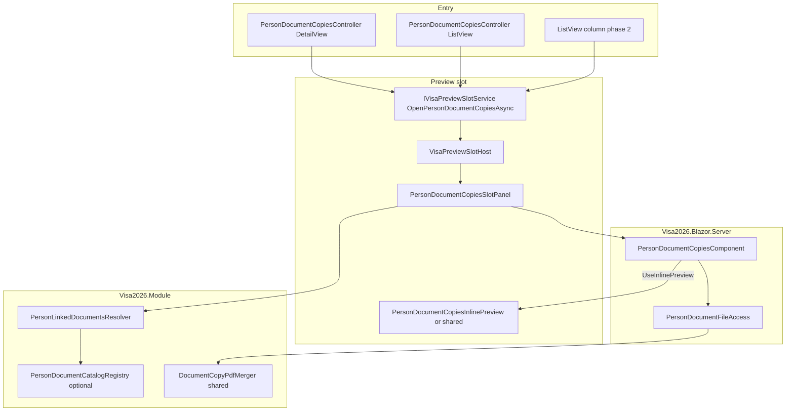

# Person document copies

**Status:** **Phases 1–2 shipped** — Person DetailView + ListView toolbar (single selection), per-row **Copies** column, sectioned catalog, per-record Preview + Refresh.

**Deferred (product decision — do not implement without explicit approval):**

| Phase | Topic |
|-------|--------|
| **3** | Footer cross-link → ApplicationItem document copies (`OpenDocumentCopiesAsync`) when person has application lines |
| **4** | Person-scoped ZIP export (separate from ministry `PdfGenerationBatch`) |

Officers who need ministry packaging today use **ApplicationItem** document copies ([`APPLICATION_ITEM_DOCUMENT_COPIES.md`](APPLICATION_ITEM_DOCUMENT_COPIES.md)).

**Agent skill:** [`.cursor/skills/visa2026-person-document-copies/SKILL.md`](../.cursor/skills/visa2026-person-document-copies/SKILL.md)

**Related (implemented today):**

| Scope | Doc / skill |
|-------|-------------|
| Application line(s) — ministry ZIP + application form | [`APPLICATION_ITEM_DOCUMENT_COPIES.md`](APPLICATION_ITEM_DOCUMENT_COPIES.md) · [`visa2026-document-copies`](../.cursor/skills/visa2026-document-copies/SKILL.md) |
| Invitation / Work permit / Rejection / Border zone header + item copies *(planned)* | [`INVITATION_WORK_PERMIT_DOCUMENT_COPIES.md`](INVITATION_WORK_PERMIT_DOCUMENT_COPIES.md) · [`visa2026-invitation-work-permit-document-copies`](../.cursor/skills/visa2026-invitation-work-permit-document-copies/SKILL.md) |
| Preview slot shell (resize, catalog card CSS, occupants) | [`PREVIEW_SLOT.md`](PREVIEW_SLOT.md) · [`visa2026-preview-slot`](../.cursor/skills/visa2026-preview-slot/SKILL.md) |
| Person BO collections & roles | [`Visa2026.Module/BusinessObjects/Person.md`](../Visa2026.Module/BusinessObjects/Person.md) |
| Which `*Document` types exist in ZIP packaging | [`APPLICATION_DIPLOMA_PACKAGE_PLAN.md`](APPLICATION_DIPLOMA_PACKAGE_PLAN.md) |

---

## Why Person-scoped document copies

Officers maintain **master person records** (`Person`) with many child BOs that carry scans (`Passport` → `PassportDocument`, `Education` → `EducationDocument`, etc.). Today, organized in-app preview of those files is spread across Person DetailView tabs and nested ListViews.

**Application item document copies** answers: *“For these application lines, are the **linked snapshot** attachments ready for the ministry ZIP?”*

**Person document copies** should answer: *“For this **person**, what attachment files exist, grouped by document type and record, and can I preview them in one place?”*

| | ApplicationItem copies (v2) | Person copies (planned) |
|---|---------------------------|-------------------------|
| **Index** | `ApplicationItem` FKs (`CurrentPassport`, …) | Live `Person` collections |
| **Rows** | One merged row per **slot key** across selected lines | One row per **child record instance** (each passport, visa, education, …) |
| **Layout** | Flat slot list + application form last | **Sections** by BO family; visas nested under passport |
| **ZIP export** | `PdfGenerationBatch` ministry package | **Out of scope v1** (preview/browse only); optional person export later |
| **Multi-select** | Multiple application lines | **v1:** single person; multi-person deferred |

Do **not** extend `ApplicationItemLinkedDocumentsResolver` for Person — different indexing rules and UI shape.

---

## Officer workflow (target)

### Entry points (planned)

| Where | Control | Behaviour |
|-------|---------|-----------|
| **`Person` DetailView** | Toolbar **Document copies** | Opens global preview slot for current person |
| **`Person` ListView** | Toolbar **Document copies** | Opens slot when **exactly one** row is selected |
| **`Person` ListView** | **Copies** link column | Per-row link → slot for that `Person.ID` |

### Panel layout (catalog mode)

Uses the same **elevated card** UX as Resminamalar / ApplicationItem document copies ([`PREVIEW_SLOT.md`](PREVIEW_SLOT.md)).

1. **Header** — person display name (+ optional personal number).
2. **Sectioned catalog** — scrollable groups:
   - **Passports** — each `Passport` row; badge **Current** when `PersonCurrentItems.GetCurrentPassport(person)`.
   - **Visas** — nested under owning passport (or sub-rows indented under passport section).
   - **Education**, **Medical records**, **Addresses of residence**, **Work permit items**, **Invitation items**, **Rejections** (product decision per section).
   - **Person documents** / **Family relation documents** — role-dependent (see §Visibility).
3. **Row actions** — **Preview** when `*Document` files exist; readiness hint when empty.
4. **Footer (v1)** — **Refresh** + optional **gear** (per-file names). **No Download package** in v1.

### Inline preview (exclusive mode)

Same pattern as existing document copies: catalog hides; merged PDF or image preview in **full slot width** (no catalog `max-width`).

- Reuse `ApplicationItemDocumentCopyPdfMerger` logic or extract shared `DocumentCopyPdfMerger` for single-record file sets.
- Header: **Download**, **Close** (no ministry batch summary unless multi-file export added later).

### Cross-link (deferred — Phase 3)

When person has `ApplicationItems`, a footer link **Open application copies** → `OpenDocumentCopiesAsync` with those item IDs was planned. **Not implemented** — revisit only after product signs off (which lines to include, UX when switching occupants).

---

## Visibility by person role

Mirror `Person` DetailView appearance rules ([`Person.md`](../Visa2026.Module/BusinessObjects/Person.md)):

| Section | Employee (`IsEmployee`) | Family member |
|---------|-------------------------|---------------|
| Passports, visas, education, medical, address | Yes | Yes |
| Work permit items, invitation items (employee workflows) | Yes | Typically hidden |
| `Person.Documents` (`PersonDocument`) | Yes | Hidden |
| `Person.FamilyRelationDocuments` | Hidden | Yes |
| `FamilyMemberImage` / `Images` | Optional gear — **v1 ZIP excludes images**; preview TBD | Same |

---

## Catalog sections & slot keys (planned)

Stable **`RecordKey`** strings for preview merge and future export:

| Section | Source | Files from | Example `RecordKey` |
|---------|--------|------------|---------------------|
| Passports | `Person.Passports` | `PassportDocument` | `Passport:{passportId}` |
| Visas | `Passport.Visas` | `VisaDocument` | `Passport:{passportId}/Visa:{visaId}` |
| Education | `Person.Educations` | `EducationDocument` | `Education:{educationId}` |
| Medical | `Person.MedicalRecords` | `MedicalRecordDocument` | `MedicalRecord:{id}` |
| Address | `Person.AddressesOfResidence` | `AddressOfResidenceDocument`, `LodgingDocument` | `AddressOfResidence:{id}` |
| Work permit | `Person.WorkPermitItems` → parent `WorkPermit` | `WorkPermitDocument` | `WorkPermitItem:{itemId}` |
| Invitation | `Person.InvitationItems` → `Invitation` | `InvitationDocument` | `InvitationItem:{itemId}` |
| Rejection | `Person.RejectionItems` | `RejectionDocument` | `RejectionItem:{itemId}` |
| Person files | `Person.Documents` | `PersonDocument` | `PersonDocument:{id}` |
| Family relation | `Person.FamilyRelationDocuments` | `PersonFamilyRelationDocument` | `FamilyRelationDocument:{id}` |

**Current badge:** compare record to `PersonCurrentItems` helpers (same rules as `ApplicationItem.OnCreated` sync).

Labels: new `VisaUiMessages` prefix `PersonDocumentCopies.Section.*` and `PersonDocumentCopies.Record.*` (or reuse captions from BO display names + record caption).

---

## Architecture (planned)



### Preview slot occupant (planned)

| Concept | Value |
|---------|--------|
| `VisaPreviewSlotMode` | `PersonDocumentCopies` (new enum value) |
| Request | `PersonDocumentCopiesSlotRequest { PersonIds }` |
| Occupant key | `person-document-copies:person:{personId}` |
| Panel CSS | `resminamalar-slot-panel person-document-copies-slot-panel` |

Keep **`DocumentCopiesSlotPanel`** for ApplicationItem only — separate occupant avoids mixing merge semantics and package options.

---

## Module services (to add)

| File (planned) | Responsibility |
|----------------|----------------|
| `Services/PersonLinkedDocuments/PersonLinkedDocumentsResolver.cs` | `Person` → sectioned snapshot of records + `FileData` rows |
| `Services/PersonLinkedDocuments/PersonLinkedDocumentSection.cs` | Section id, sort order, localized title |
| `Services/PersonLinkedDocuments/PersonLinkedDocumentRecord.cs` | One child BO instance + files + `RecordKey` + is-current flag |
| `Services/PersonLinkedDocuments/PersonDocumentCatalogRegistry.cs` | Optional: extensible section definitions |
| `Localization/PersonDocumentCopiesLocalization.cs` | Section/record labels |
| `Controllers/PersonDocumentCopiesController.cs` | DetailView + ListView actions → `OpenPersonDocumentCopiesAsync` |

**Reuse (extract or call):**

- `ApplicationItemDocumentCopyPdfMerger` — preview PDF build
- `DocumentFileUploadConstraints` — preview eligibility by content type
- `PersonCurrentItems` — current badges

**Do not call in v1:**

- `ApplicationItemPdfBatchEnqueueService`
- `ApplicationFilledFormPdfGenerator`
- `ApplicationItemLinkedDocumentsMerger`

---

## Blazor host (to add)

| File (planned) | Responsibility |
|----------------|----------------|
| `Components/PersonDocumentCopiesSlotPanel.razor` | Catalog / preview toggle; loads resolver |
| `Editors/PersonDocumentCopiesComponent.razor` | Sectioned catalog UI (`app-item-doc-copies--inline-slot`) |
| `Editors/PersonDocumentCopiesInlinePreview.razor` | Or extend `DocumentCopiesInlinePreview` with person request type |
| `Services/PersonDocumentFileAccess.cs` | Authorized preview/download for person-scoped files |
| `Services/VisaPreviewSlotService.cs` | `OpenPersonDocumentCopiesAsync` |
| `Components/VisaPreviewSlotHost.razor` | Branch for `PersonDocumentCopies` mode |
| `Module/Services/PreviewSlot/VisaPreviewSlotOccupantKeys.cs` | `ForPersonDocumentCopies` |

---

## Localization (planned)

- Prefix: `PersonDocumentCopies.*` in `tools/GenerateModelLocalization/UiStrings.messages.json`
- Action: `ViewPersonDocumentCopies` in `Model.DesignedDiffs.xafml`
- Regenerate: `dotnet run --project tools/GenerateModelLocalization/GenerateModelLocalization.csproj`

---

## Phased delivery

| Phase | Deliverable | Status |
|-------|-------------|--------|
| **1 — MVP** | Resolver + DetailView action + slot panel + sectioned catalog + per-record Preview + Refresh | **Shipped** |
| **2** | ListView toolbar + **Copies** column; gear file details; current badges; nested visa rows | **Shipped** |
| **3** | Link to ApplicationItem document copies when `ApplicationItems` exist | **Deferred** — product decision |
| **4 (optional)** | Person document ZIP export (separate from ministry `PdfGenerationBatch`) | **Deferred** — product decision |

---

## Build / verify (when implemented)

```powershell
dotnet build Visa2026.slnx -c Debug
```

Manual: open employee Person with passport + education scans → Document copies → preview each section → close preview → hard-refresh after CSS/JS changes.

---

## Open product questions

Record decisions here before **Phase 3** or **4** work starts:

1. **Phase 3** — Which `ApplicationItems` to pass when cross-linking (all lines vs current application / contract)?
2. Include **RejectionItem** / **TravelHistory** sections in catalog (currently included)?
3. Show **historical** passports/visas only, or filter to current + previous (like application slots)?
4. **Lodging** documents — separate rows or folded under address (current: nested under address)?
5. ListView column: icon-only vs text link (current: **Copies** text)?
6. **Phase 4** — Is person ZIP export needed at all vs preview-only + ApplicationItem ministry ZIP?
