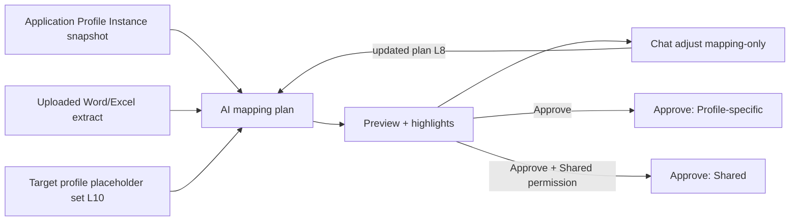

# Product spec — AI convert existing Word/Excel → profile templates

> **Status:** Draft product spec (not implemented)  
> **Audience:** Admin / officer on Application Profile Instance (primary) and profile Templates config (secondary)  
> **Related:** [`APPLICATION_PROFILE_PLAN.md`](APPLICATION_PROFILE_PLAN.md) (wizard Step 4, instance workspace), [`TEMPLATE_STAGING_EDIT.md`](TEMPLATE_STAGING_EDIT.md), [`USER_TEMPLATE_AUTHOR_GUIDE.md`](USER_TEMPLATE_AUTHOR_GUIDE.md), skills `visa2026-application-profile` + `visa2026-user-report-templates`  
> **Engineering (read before implementing):** [`TEMPLATE_AI_CONVERT_ENGINEERING_SPEC.md`](TEMPLATE_AI_CONVERT_ENGINEERING_SPEC.md) — Phase 0 service contracts for L7 / L8 / L10 / L11, locked decisions **E-D1**–**E-D8**, and slices **E0–E10**.  
> **Non-goal:** Officer-facing placeholder mapping UI. Conversion is automatic; officer only confirms preview.  
> **Non-goal (v1):** Persisting templates only on the Application Profile Instance.  
> **Locked:** AI mapping data access = **this Application Profile Instance only** (plus upload extract and placeholder token vocabulary).  
> **Locked:** Candidate upload must pass **suitability criteria**; UI **highlights** spans that will become placeholders from the library.  
> **Locked:** AI may **only** place library placeholders for mapped data — **no** other content/format changes; reject such requests.  
> **Locked:** After generate, officer may **Approve** or send **adjustment instructions** via chat UI (mapping-only; L8).  
> **Locked:** AI mapping uses **only** placeholders associated with the **target Application Profile** (template scope) — not the full system library.  
> **Locked:** AI provider is **pluggable** — do **not** lock the product to one vendor (Grok, Azure, OpenAI, etc.).  
> **Locked:** Without AI, officers can still **upload manually prepared** Word/Excel templates (placeholders already placed).

---

## 0. UI prototypes (draft)

Generated UX sketches (not production screens). Saved under [`docs/prototypes/`](prototypes/).

### Happy path

| # | Scenario | File |
|---|----------|------|
| 01 | Upload / Analyze | [`template-ai-convert-01-upload.png`](prototypes/template-ai-convert-01-upload.png) |
| 02 | Candidate check Pass + highlights | [`template-ai-convert-02-candidate-check.png`](prototypes/template-ai-convert-02-candidate-check.png) |
| 05 | Converting (progress) | [`template-ai-convert-05-converting.png`](prototypes/template-ai-convert-05-converting.png) |
| 03 | Preview + mapping chat + Approve | [`template-ai-convert-03-preview-chat.png`](prototypes/template-ai-convert-03-preview-chat.png) |
| 04 | Done (Profile-specific) | [`template-ai-convert-04-done.png`](prototypes/template-ai-convert-04-done.png) |

### Alternate / edge scenarios

| # | Scenario | File |
|---|----------|------|
| 06 | Candidate check **Fail** (Convert disabled) | [`template-ai-convert-06-candidate-fail.png`](prototypes/template-ai-convert-06-candidate-fail.png) |
| 07 | Candidate check **Warn** (continue checkbox) | [`template-ai-convert-07-candidate-warn.png`](prototypes/template-ai-convert-07-candidate-warn.png) |
| 08 | **AI off** — manual Add prepared template only | [`template-ai-convert-08-manual-add-ai-off.png`](prototypes/template-ai-convert-08-manual-add-ai-off.png) |
| 09 | Chat **rejects** rewrite/restyle (L8) | [`template-ai-convert-09-chat-reject-rewrite.png`](prototypes/template-ai-convert-09-chat-reject-rewrite.png) |
| 10 | Preview **Validate hard fail** (Approve disabled) | [`template-ai-convert-10-validate-fail.png`](prototypes/template-ai-convert-10-validate-fail.png) |
| 11 | Profile **config locked** (Approve disabled) | [`template-ai-convert-11-config-locked.png`](prototypes/template-ai-convert-11-config-locked.png) |
| 12 | **Needs help** / gap packet for developers | [`template-ai-convert-12-needs-help-gaps.png`](prototypes/template-ai-convert-12-needs-help-gaps.png) |
| 13 | **Excel roster** candidate check | [`template-ai-convert-13-excel-roster.png`](prototypes/template-ai-convert-13-excel-roster.png) |
| 14 | Upload **Shared** catalog confirm (C) | [`template-ai-convert-14-shared-confirm.png`](prototypes/template-ai-convert-14-shared-confirm.png) |
| 15 | Profile wizard **instance picker** (secondary entry) | [`template-ai-convert-15-wizard-instance-picker.png`](prototypes/template-ai-convert-15-wizard-instance-picker.png) |
| 16 | Preview **fill failed** → Placeholders tab fallback | [`template-ai-convert-16-fill-preview-fallback.png`](prototypes/template-ai-convert-16-fill-preview-fallback.png) |

Full set: **01–16** (happy path + edges).

---
## 1. Goal

Officer uploads a **filled** Word (`.docx`) or Excel (`.xlsx`) document they already use. The system **automatically** converts it into a Visa2026 merge template (placeholders from the allowed catalog), runs Extract/Validate, and lets the officer **accept after preview**. No mapping grid.

**Required for AI mapping:** an **Application Profile Instance**. Only that case data may be sent to AI for reverse-map; the same instance is used for filled preview. After Accept, the template is saved on the **parent Application Profile** catalog — not on the instance.

| In scope | Out of scope (v1) |
|----------|-------------------|
| Instance case workspace as **primary** (and required for AI) convert entry | Per-instance-only template storage |
| AI reverse-map using **only this instance** data + upload | AI reading other instances / unrelated BO rows / whole DB |
| Profile wizard entry only if an instance is selected as context | In-browser Word/Excel WYSIWYG editor |
| Word letters and Excel rosters equally | 100% unattended publish with no preview |
| Propose **missing** properties for developers (gap list) | PDF/scanned image OCR as primary path |
| Save to parent profile: **Profile-specific** or **Shared** | Inventing runtime merge fields that work before deploy |
| Placeholder token vocabulary as emit constraint | Treating Cursor IDE as a runtime AI provider |
| AI tokens = **target Application Profile** template scope only | AI using the full system-wide placeholder library |
| Pluggable AI provider interface | Hard-coding a single vendor SDK as the only path |
| Manual upload of already-tokenized templates (AI optional) | Requiring AI for every template add |
| Candidate suitability check + **highlight** replaceable spans | Accept without showing what will be replaced |
| AI limited to **placeholder placement** for mapped fields | AI rewriting prose, layout, styles, or images |
| Preview **Approve** or **chat adjustments** (mapping-only) | Chat that restyles/rewrites the document |

---

## 2. Locked decisions — context vs save target

| # | Topic | Decision |
|---|--------|----------|
| L1 | Conversion **context** | **Application Profile Instance required** for AI mapping (linked people, dates, project, resolved person-related rows for that instance, etc.). |
| L2 | Save target after Accept | Always the **parent Application Profile** template catalog (`ApplicationProfileTemplate` + bridged `UserReportTemplate`). Instance is **not** a template owner in v1. |
| L3 | Catalog choice **B** | **Profile-specific** — **default** on Accept. |
| L4 | Catalog choice **C** | **Shared / global** — **opt-in** on Upload/Done; requires elevated permission (same gate as Shared catalog maintenance / Include admin). |
| L5 | Do not | Auto-save every conversion to Shared; do not save Accept only onto the instance. |
| L6 | **AI data access for mapping** | AI may use **only** (1) the **uploaded document extract** and (2) a **snapshot of this Application Profile Instance** (and its linked data for that case). No other instances, no unrelated Persons/Applications, no bulk DB reads. |
| L7 | **Candidate check + highlight** | Before Accept, the upload is scored against **suitability criteria**. Spans that match instance values and map to the **target Application Profile placeholder set** (L10) are **highlighted** so the officer sees what will become tokens — still no manual mapping grid. |
| L8 | **AI scope = placeholder placement only** | AI is responsible **only** for mapping instance-matched data to **library placeholders** (which spans become which tokens / loops). AI must **not** change any other text, wording, structure, styles, fonts, colors, images, headers/footers, or sheet layout. If asked (by prompt, officer instruction, or model drift) to rewrite, restyle, translate, or redesign the document, the system **rejects** that request and keeps the original content/format. |
| L9 | **Approve or chat adjust** | After a draft template exists, the officer may **Approve** (Use template) **or** give **adjustment instructions** in a **chat UI**. Chat turns may only refine **placeholder mapping** (which span ↔ which library token / loop). Out-of-scope chat asks are **rejected in-chat** with a short reason; document content/format stays unchanged. |
| L10 | **Placeholder set = target profile template scope** | When mapping, AI may use **only** placeholders associated with the **target Application Profile** for this convert (the parent profile whose catalog will receive the template), further limited by this template’s **data scope** and that profile’s enabled person/packs toggles. AI must **not** use the full system-wide placeholder library or tokens from other profiles. Chat remaps are limited to the same set. |
| L11 | **Pluggable AI provider — no single-vendor lock-in** | Product and Module code depend on an **`ITemplateConvertAiProvider`** (or equivalent) abstraction. Concrete vendors (xAI Grok, Azure OpenAI, OpenAI, on-prem, none/heuristics-only) are **adapters** selected by config. Do **not** bake one vendor’s SDK, prompts, or APIs into officer UX or domain services. Switching provider must not require redesigning Upload / Candidate check / Preview / chat / L6–L10 rules. |
| L12 | **Manual template upload always available** | Officers can **always** add a template by uploading a **manually prepared** `.docx` / `.xlsx` that already contains library placeholders (existing Add / Include / staging path). AI convert is an **optional** accelerator. When AI is off (`None`) or unavailable, manual upload remains the supported way to put templates on the target Application Profile (Profile-specific or Shared per B/C rules). |

### L6 — AI mapping payload (allowed vs forbidden)

| Allowed into the AI prompt / tool payload | Forbidden |
|-------------------------------------------|-----------|
| Parsed text/cells from the **uploaded** Word/Excel | Other Application Profile Instances |
| **This** instance scalars (number, dates, project, visa fields on the case, etc.) | Unrelated Person / Passport / Visa rows not linked to this instance |
| **This** instance linked People + auto-resolved children (sticky links / M2M for this case) | Whole lookup tables, other profiles cases, Report Dashboard dumps |
| **Target-profile placeholder vocabulary** (L10) — names/paths only for this Application Profile + data scope / packs — so AI can only emit allowed `{{…}}` | Full system placeholder list; other profiles’ tokens; arbitrary SQL, admin secrets, files from other BOs |

Server-side Extract/Validate still run **locally** against the same **target-profile** vocabulary (plus structural loop/IMAGE rules). That list is a **constraint**, not a second data source for reverse-mapping **values**.

### L10 — Target Application Profile placeholder set

| Include in AI vocabulary | Exclude |
|--------------------------|---------|
| Tokens allowed for the **target Application Profile** (parent of this convert) | Tokens only used by other profiles |
| Tokens consistent with chosen **data scope** (header / people / both) | Packs disabled by this profile’s person toggles (e.g. no Education tokens if Education not required) |
| Structural markers already supported for that family (`{{#ds.rows}}`, `{{IMAGE:…}}` where profile allows) | Entire `WORD_REPORT_PLACEHOLDER_REFERENCE` dump unless filtered to this profile |
| Same set for **chat** remaps (L9) | Suggesting a token from another profile “because it exists in the product” |

If a document value has no token in this set → **gap** (Needs help), not a foreign-profile token.

### L11 — Pluggable providers (no vendor lock-in)

| Do | Do not |
|----|--------|
| Define a stable contract: mapping plan in/out, reject rewrite, L6/L10 payload shape | Call Grok/Azure/OpenAI APIs directly from Blazor UI or BOs |
| Config: `TemplateAiConvert:Provider` = `None` \| `AzureOpenAI` \| `xAI` \| … + secrets per slot | Ship with a single hard-coded vendor as the only supported runtime |
| Keep L7 deterministic matching + local writer vendor-agnostic | Put layout/content rules inside one vendor’s prompt only |
| Allow **AI off** (heuristics / manual Add) without removing the feature shell | Block the product roadmap on one commercial API |

Cursor / IDE agents remain **developer** tools only — not a runtime provider.

### L12 — Manual prepared templates (no AI required)

| Path | When | Behavior |
|------|------|----------|
| **Add / upload prepared template** | Always (AI on or off) | Officer uploads Word/Excel **already** containing `{{…}}` from the target profile set (or authors via desktop staging). Extract → Validate → save to parent profile (B/C). |
| **AI Convert existing document** | Only when provider ≠ `None` and feature enabled | Filled-sample → candidate check → mapping → Approve/chat (this spec). |
| AI off / failed | Always | Hide or disable AI Convert; keep **Add prepared template** (+ staging Open/Sync). Do not block profile template configuration. |

Manual path does **not** require Candidate check highlights or chat. Same Extract/Validate and L10 token rules on save.

### L7 — Candidate suitability and highlight

The uploaded file is a **template candidate**. The system must decide whether it is convertible and show **where** library placeholders will replace text.

**Suitability criteria (v1 — fail Convert or block Accept when hard-fail):**

| Criterion | Pass when | Hard fail when |
|-----------|-----------|----------------|
| Format | `.docx` / `.xlsx` parseable OOXML | Corrupt / wrong type |
| Instance overlap | Enough document literals match values from **this** instance snapshot — **Pass** at ≥6 distinct header matches, or a roster loop plus ≥2; **Warn** at 3–5 (**E-D6**) | Fewer than 3 distinct header matches **and** no roster loop |
| Library coverage | Matched spans resolve to tokens in the **target Application Profile placeholder set** (L10) | Matches only unknown concepts (gap-only; no in-set hits) |
| Structure | Detectable header and/or people table consistent with chosen data scope | Empty body; image-only scan with no extractable text |
| Already a template | Few/no raw `{{…}}` tokens, or officer confirms re-convert | Optional warn if file already heavily tokenized |

**Highlight UX (officer still does not map tokens manually):**

| Element | Behavior |
|---------|----------|
| Highlighted text/cells | Spans (or Excel cells) whose content matches instance data and will be replaced by a token from the **target profile set** (L10) |
| Color / mark | Distinct highlight (e.g. yellow) on the candidate preview; optional chip on hover: library token display name only |
| Unmatched literals | No highlight, or muted “ignored / static” styling (letterhead, stamps, fixed legal wording) |
| Gap spans | Optional different mark (e.g. orange) for text that looks like data but has **no** library token — feeds Needs help; not written as unknown `{{…}}` |
| Interaction | View-only highlights in v1 — no drag-to-remap. Officer Accepts, Converts again, or Needs help |

Highlight can appear on **Candidate check** (before convert) and/or **Preview** (after convert, on master with tokens or side-by-side with original). Minimum for v1: **at least one screen** shows highlighted replaceable spans before Accept.

### L8 — AI may only place placeholders (no content/format edits)

| AI may do | AI must not do | If asked anyway |
|-----------|----------------|-----------------|
| Propose which highlighted spans map to which tokens in the **target profile set** (L10) | Rewrite sentences, titles, legal wording, or bilingual text | **Reject** — return error to officer / log; do not apply |
| Propose loop markers for roster tables already present | Add/remove paragraphs, rows, columns, pages | **Reject** |
| Leave static content untouched | Change fonts, sizes, colors, borders, merges, page setup | **Reject** |
| Leave images/stamps/logos as-is | Move, crop, replace, or delete images | **Reject** |
| Emit only tokens from the L10 vocabulary | Invent decorative text, “improve” the letter, or use other-profile tokens | **Reject** |

**Implementation rule:** Prefer a **local writer** (Open XML / ClosedXML) that substitutes **only** the approved highlight regions with `{{…}}` / loop markers. AI returns a **mapping plan** (regions → tokens), not a full rewritten document. If the provider returns a full rewritten file, **discard** it and fail Convert unless a strict diff proves only placeholder spans changed.

### L9 — Approve or adjust via chat

| Officer action | Effect |
|----------------|--------|
| **Approve** / **Use template** | Commit draft to parent profile catalog (B/C) — same as Done |
| **Chat message** | Natural-language adjustment of **mapping only** (e.g. "use passport number not ID", "this column is FullName", "do not replace the company letterhead") |
| Chat **accepted** | AI returns an updated **mapping plan** → local writer re-applies → highlights + Preview refresh |
| Chat **rejected** (L8) | In-chat reply: cannot change wording/layout/styles; suggest mapping-only phrasing. **No** document mutation |
| **Convert again** / new file | Still available; resets draft |

**Chat UI placement:** side panel on **Preview** (and optionally Candidate check after first analysis). Keep history for the current draft session only (v1).

**Allowed chat intents (examples):** remap a highlighted span to another token **in this profile set**; un-map a span (leave static); map an unmarked cell if it matches instance data + L10 set; adjust loop start/end on an existing table.  
**Rejected chat intents (examples):** "make it more formal", "translate to Russian", "fix the logo", "add a paragraph", "change font", "redesign the table", "use a field from another profile".

---

## 3. Entry points

| Where | Priority | Behavior |
|-------|----------|----------|
| **Application Profile Instance** case workspace (e.g. Templates / Resminamalar-adjacent action) | **Primary for AI Convert** | AI Convert uses **only this** instance as mapping data. Catalog target defaults to **Profile-specific** on the parent profile. Preview merges against this instance. **Add prepared template** also available here (L12). |
| Application Profile wizard → **Templates** (Step 4) | Always | **Add prepared template** always available (L12). AI Convert **requires** a concrete instance; without instance or AI, only manual Add / Include / staging. Same save rules (B default / C opt-in). |
| Profile-specific / Shared lists | Always | Manual Add/Include without AI. AI Convert only with instance context + provider enabled. |

### Config lock

| Situation | Rule |
|-----------|------|
| Parent profile **config locked** | **Use template** that writes Profile-specific or Shared is **blocked** (same as Add/Edit templates), unless a later carve-out is approved. |
| Convert + Preview only | Allowed for QA while locked if useful; Accept disabled with plain message (“Profile templates are locked”). |
| Unlock / admin override | Follow existing Application Profile lock policy (`APPLICATION_PROFILE_PLAN.md` § lock A). |

---

## 4. Screens

Five stages in one modal / wizard flow, plus a **chat panel** on Preview for mapping adjustments (L9). Officer never sees a placeholder **mapping grid**. Highlights show *what* will change; chat refines mapping only (L8).

### 4.1 Upload

**Purpose:** Choose file + catalog target + minimal options.

| Control | Rules |
|---------|--------|
| File picker | `.docx` or `.xlsx` only; max size = same as staging (`MaxFileSizeBytes` or existing upload limit) |
| Template name | Default from filename; officer may edit |
| Catalog target | **Profile-specific (B)** default · **Shared (C)** if permission — confirm copy when Shared: "Available to other profiles via Include" |
| Data scope | **Header / case**, **People roster**, or **Both** — default from profile person toggles / prior templates; officer may change |
| Context instance | **Required for AI.** Primary entry: fixed to current instance (read-only). Secondary entry: required dropdown of instances on this profile — Convert disabled until one is selected. |

**Primary CTA:** **Analyze** (run candidate check)  
**Secondary:** Cancel  

**Copy (instance):** "Upload a completed letter or spreadsheet for this case. Visa2026 will match it to this case data and highlight what becomes a template field."  
**Copy (secondary):** "Choose a case (instance), then upload a completed letter or spreadsheet. Mapping uses only that case data."

---

### 4.1b Candidate check

**Purpose:** Gate conversion on suitability and show **highlighted** replaceable content (L7).

| UI | Behavior |
|----|----------|
| Document preview | Rendered Word/Excel (or PDF snapshot) of the **upload** with highlights |
| Green/yellow highlights | Text/cells matching **this instance** that map to the **target profile placeholder set** (L10) |
| Orange / gap marks | Looks like variable data but no token in that set (optional) |
| Suitability panel | Pass / Warn / Fail + short reasons (criteria table in L7) |
| Summary chips | e.g. "12 fields matched", "3 roster cells", "2 gaps" |

| CTA | When enabled | Effect |
|-----|--------------|--------|
| **Convert** | Suitability **Pass** or **Warn** (not Fail) | Proceed to Converting |
| **Try another file** | Always | Back to Upload |
| **Needs help** | Warn/Fail or gaps present | Gap packet from unmatched / gap spans |
| **Cancel** | Always | Discard |

**Hard Fail:** Convert disabled. Officer must change file, data scope, or Needs help.  
**Warn:** Convert allowed after checkbox "Continue with warnings" (same spirit as soft Validate warnings).

Officer does **not** assign placeholders on this screen — only reviews highlights and suitability.

---

### 4.2 Converting

**Purpose:** Block UI while work runs; no mapping interaction.

| State | UI |
|-------|-----|
| Running | Progress: *Reading document → Matching fields → Building template → Checking* |
| Elapsed | Soft timer; cancel allowed until job commits bytes |
| Failure (hard) | Error panel + **Try another file** / **Cancel** (see §6) |

**Server steps (hidden):**

1. Parse document (Open XML / ClosedXML) — text, tables, sheet cells.  
2. Require **context Application Profile Instance**; build **instance-only** snapshot for mapping (L6).  
3. Load **target Application Profile placeholder set** (L10) for this profile + data scope + enabled packs (emit constraint only — not full system library).  
4. **Candidate analysis (L7):** match document literals to instance values; score suitability; build highlight regions (token in L10 set vs gap).  
5. Call AI provider (when enabled) with **upload extract + instance snapshot + L10 vocabulary only** — no other business data. Prefer AI to confirm/refine matches already found by deterministic instance↔literal matching; AI must not invent tokens or use off-profile tokens. Prompt and API contract enforce **L8** (mapping plan only; reject rewrite/restyle requests) and **L10**.  
6. **Local writer** applies **only** approved region→token substitutions (L8); layout and all non-mapped content unchanged. If AI returns rewritten body/format, **reject** and fail Convert.  
7. **Extract Placeholders** + **Validate Placeholders** (same services as `UserReportTemplate`) — local, not via AI.  
8. Persist draft (not catalog-live until Accept / Done).

Officer does **not** edit mappings on this screen.

---
### 4.3 Preview (+ chat adjust)

**Purpose:** Confirm the converted template; **Approve** or **adjust mapping via chat** (L9). Highlights from L7 may still be shown for trust.

| Mode | When | What officer sees |
|------|------|-------------------|
| **A — Instance filled** | Context instance present and merge succeeds | PDF (or Excel preview path) filled from **this instance** via existing merge preview pipeline |
| **B — Master placeholders** | Fill failed or officer toggles | File occupant / office-to-PDF of master with `{{…}}` visible (same as wizard Preview today) |
| **C — Highlight review** | Always available as tab/toggle | Original (or master) with the same **library-match highlights** as Candidate check — proves what was replaced |

**Chat panel (L9):**

| Element | Behavior |
|---------|----------|
| Thread | Session messages for this draft; officer types adjustment in natural language |
| Assistant reply | Confirms mapping change, or **rejects** out-of-scope asks (L8) without mutating the file |
| After accepted adjust | Re-run local writer + Extract/Validate + refresh Preview/highlights |
| Hint copy | "Ask to change which fields become placeholders for this profile. I cannot change layout or wording, or use fields from other profiles." |

**Actions:**

| CTA | Effect |
|-----|--------|
| **Approve** / **Use template** | Enabled only when Validate **passed** (or passed-with-warnings policy in §6) **and** profile not config-locked for template writes. Commits draft → parent profile `ApplicationProfileTemplate` (Profile-specific or Shared per Upload choice) + bridged `UserReportTemplate`. |
| **Send** (chat) | Mapping-only adjustment turn (L8/L9); not a commit |
| **Convert again** | Re-run with same file + options (or re-upload). Discard draft + chat session. |
| **Needs help** | Creates/exports **gap packet** (unmapped snippets + proposed new properties) for developer; draft kept or discarded per choice. |
| **Cancel** | Discard draft + chat; no catalog change. |

**Do not show:** token-by-token mapping table as the primary UI (officer does not pick tokens from a grid; chat + highlights are the adjustment UX).

**Optional (collapsed):** "What we changed" — short list of highlighted instance values → library tokens (read-only), for power users / support.

---

### 4.4 Done

**Purpose:** Confirm success after **Approve** (commit).

| Content |
|---------|
| Template name, format (Word/Excel) |
| Catalog target: **Profile-specific** or **Shared** (on **parent** profile — show profile name/code) |
| Context instance id/number used for convert (audit) |
| Readiness chip from Validate (Ready / Warnings) |
| **Open in catalog** / **Edit with desktop staging** (existing Open/Sync) / **Convert another** / **Close** |

Shared target: row appears in Shared include list; other profiles still **Include** per existing rules.  
Profile-specific: visible on this profile’s nested templates immediately for Resminamalar on instances of that profile.

---

## 5. Success criteria

### 5.1 Product (officer)

| ID | Criterion |
|----|-----------|
| P0 | With AI off, officer can add a manually prepared template to the target profile (Extract/Validate pass) without using Convert. |
| P1 | Officer completes Upload → Candidate check → Converting → Preview → Done **without** choosing placeholders from a grid. |
| P1a | Candidate check shows **highlights** on spans that map to the placeholder library before Convert/Approve. |
| P1b | Unsuitable uploads are blocked (Hard Fail) or warned before Convert. |
| P1c | On Preview, officer can **Approve** or use **chat** to adjust mapping; out-of-scope chat asks are rejected without changing content/format. |
| P2 | From **Use template**, template appears on the **parent Application Profile** in the chosen catalog (Profile-specific or Shared) — never as instance-only storage. |
| P3 | Resminamalar / profile nested catalog can merge the new template for instances of that profile (existing pipeline). |
| P4 | AI Convert always has a context instance; Preview mode A uses **that** instance’s data. |
| P4a | AI mapping payload contains no other instances or unrelated BO data (L6). |
| P5 | Preview is available within **p95 20 s** without AI and **p95 90 s** with AI (provider timeout 60 s) — **E-D7**. |
| P6 | Layout of letterhead/table structure is preserved enough that Preview is recognizable vs the upload. |

### 5.2 Quality (system)

| ID | Criterion |
|----|-----------|
| Q1 | Every token written into the file is in the **target Application Profile placeholder set** (L10) for that profile + data scope / packs **or** is a loop/structural token already supported for that set. |
| Q2 | Unknown / invented property names are **never** written as mergeable tokens; they go to the **gap list** only. |
| Q3 | Extract + Validate run before **Use template** is enabled (strict) or with explicit warning gate (see §6). |
| Q4 | Filled sample values used for reverse-map are removed from the saved template (no leftover personal data in master). |
| Q5 | Word and Excel paths both meet P1–P3 on a golden set of ≥3 real Calik documents each (pilot exit). |
| Q6 | Shared Accept requires the Shared permission gate; default path never writes Shared without explicit choice. |
| Q7 | AI request builder enforces L6 — unit/integration test proves non-instance data is not included in the provider payload. |
| Q8 | Highlight regions only mark spans tied to **library** tokens or explicit **gap** marks — never free-typed unknown placeholders in the file. |
| Q9 | Suitability Hard Fail prevents Convert; Warn requires explicit continue. |
| Q10 | Post-convert diff (or equivalent) proves only placeholder/loop substitutions changed; any other content/format delta fails Convert (L8). |
| Q11 | Prompts/API reject officer or system instructions that ask AI to rewrite, restyle, translate, or redesign the document — including via **chat UI**. |
| Q12 | Accepted chat turns only change the mapping plan + placeholder substitutions; chat history does not unlock L8. |
| Q13 | AI and chat vocabularies equal the **target profile** set only — unit test proves system-wide / other-profile tokens are not offered or written (L10). |
| Q14 | Domain convert services compile/run with provider = `None` and with a second stub adapter — no vendor types in Module domain API (L11). |

### 5.3 Pilot exit (before wide rollout)

| ID | Criterion |
|----|-----------|
| E1 | On golden set, ≥80% of conversions reach **Use template** without developer intervention. |
| E2 | Of those used, ≥90% produce acceptable filled output on a real instance (officer or BA sign-off). |
| E3 | Failures always offer **Convert again** or **Needs help** — no silent corrupt catalog row. |

---

## 6. When Validate fails

Validate (and Extract) reuse existing `UserReportTemplate` rules. Officer still sees **no mapping UI**.

### 6.1 Classification

| Class | Examples | Preview CTA |
|-------|----------|-------------|
| **Hard fail** | Unknown tokens, broken loop markers, unsupported IMAGE token, empty extract, corrupt OOXML | **Use template** disabled |
| **Soft fail / warning** | Optional pack referenced but person toggle off; low-confidence leftover literals | **Use template** allowed after checkbox “I understand warnings” (**E-D2** — locked; warnings only, never hard fail) |
| **Fill preview fail** | Instance merge error while Extract/Validate OK | Stay on Preview with mode B; **Use template** still allowed if Validate OK |
| **Config locked** | Profile templates read-only | **Use template** disabled; message points to lock policy |
| **No instance context** | AI convert attempted without instance | Convert disabled; do not call AI |
| **Candidate unsuitable** | L7 Hard Fail (no overlap, unreadable, etc.) | Stay on Candidate check; Convert disabled |

### 6.2 Officer experience (hard fail)

1. Stay on **Preview** (or Converting → Preview with error banner).  
2. Banner: “We could not finish this template automatically.”  
3. Short plain-language reason (1–2 lines), e.g. “A table of people was found but roster placeholders are not available for this profile’s person settings.”  
4. Actions: **Convert again** · **Needs help** · **Cancel**.  
5. **Needs help** stores: original file hash, draft bytes (optional), extract output, validate messages, unmapped text snippets, AI-proposed new properties (name suggestions only), context instance id.

### 6.3 Developer handoff (gap packet)

| Field | Purpose |
|-------|---------|
| Profile code / template name | Context |
| Context instance id | Reverse-map / repro |
| Suggested property / display label | From AI or heuristics |
| Sample value from upload / instance | Reverse-map evidence |
| Word vs Excel + location hint | Cell/paragraph |
| Validate error text | Exact system message |
| Intended catalog (B vs C) | Where Accept would have saved |

Developer adds real placeholder in a deploy (Cursor / map skill); officer re-runs **Convert** after upgrade. Runtime merge must not use proposed-only names.

### 6.4 Partial success policy (locked for v1)

- **Do not** auto-save a hard-fail draft into Profile-specific or Shared live catalog.  
- **Do not** save Accept onto the instance as a substitute when profile write is locked.  
- **Do** keep draft in session/temp until Cancel or successful Use.  
- **Do not** open a placeholder mapping editor as the recovery path in v1. Recovery = retry convert, change data scope / person toggles, or Needs help.

---

## 7. AI / no-AI

| Mode | Behavior |
|------|----------|
| **AI off** (current Calik) | Provider = `None`. **AI Convert** hidden/disabled. Officers use **Add prepared template** + desktop staging (L12). Product must not require AI to configure profile templates. |
| **AI on** | Any configured adapter behind `ITemplateConvertAiProvider` / `ITemplateConvertService`; secrets in env; feature flag per slot. Payload **must** obey L6/L10; role **must** obey L8/L9. Send only if legal/flag allows. **Manual Add remains available** alongside Convert. |

**Vendor examples (non-exhaustive, not preferred):** Azure OpenAI, xAI Grok, OpenAI, future on-prem. Choice is **ops/config**, not product lock-in (**L11**).

Cursor AI is **not** the runtime.

---

## 8. Permissions & privacy

| Topic | Rule |
|-------|------|
| Who (convert / Profile-specific Accept) | Same as template Add/Edit on that profile (`UserReportTemplate` write / profile config edit). |
| Shared (C) Accept | **Extra gate** — admin / Shared-catalog permission; never implied by instance edit rights alone. |
| Uploads + **this** instance data only | PII — send to cloud AI only if flag + legal OK; prefer redaction of ID numbers in v1 if cloud AI. Never attach other cases. |
| Audit | Log user, profile, context instance id, file name/hash, catalog target B/C, provider, validate result, accept/reject; record that payload scope was instance-only. |

---

## 9. Open decisions (narrow)

**All product and engineering decisions are locked as of 2026-08-20.** Engineering decisions **E-D1**–**E-D8** live in [`TEMPLATE_AI_CONVERT_ENGINEERING_SPEC.md`](TEMPLATE_AI_CONVERT_ENGINEERING_SPEC.md) §6.1 and §8. Only outstanding input: the **golden set** (3 real Çalık Word letters + 3 Excel rosters with a matching instance) for Q5 / pilot exit.

| # | Topic | Status |
|---|--------|--------|
| 1 | Soft warnings: checkbox vs block | **Locked — E-D2:** checkbox on Preview for warnings only |
| 2 | Default catalog target | **Locked — Profile-specific (B)**; Shared (C) opt-in |
| 3 | Save on instance vs parent profile | **Locked — parent profile only** (instance = context) |
| 3a | AI data access for mapping | **Locked — L6:** this Application Profile Instance (+ upload + token vocabulary) only |
| 3b | Candidate check + highlight | **Locked — L7:** suitability criteria + highlight library-bound spans before Accept |
| 3c | AI content/format changes | **Locked — L8:** placeholder placement only; reject rewrite/restyle |
| 3d | Approve vs chat adjust | **Locked — L9:** Approve or mapping-only chat on Preview |
| 3e | Placeholder vocabulary | **Locked — L10:** target Application Profile template scope only |
| 3f | AI vendor | **Locked — L11:** pluggable; no single-vendor lock-in |
| 3g | Manual upload without AI | **Locked — L12:** always available; AI optional |
| 4 | AI provider | **Locked — L11:** pluggable multi-vendor; which adapter to enable first is ops (staging first) |
| 5 | Excel preview fidelity | **Locked — E-D3:** DevExpress Spreadsheet → PDF; download + note only on failure |
| 6 | Convert while config locked | **Locked — E-D4:** already enforced in code — Preview OK, Approve blocked |

---

## 10. Implementation slice sketch (not scheduled)

1. Ensure **Add prepared template** path works with AI off (L12) — baseline before AI Convert.  
2. Modal shell from **instance** entry: Upload → Candidate check (highlight) → Converting → Preview → Done (provider optional).  
3. Deterministic instance-literal matcher + suitability score + highlight regions (L7).  
4. Wire Extract/Validate + draft persist + Use → parent `ApplicationProfileTemplate` (B default / C gated).  
5. Gap packet BO or export (include instance id + gap highlights).  
6. Secondary entry from profile wizard Step 4 **with required instance picker** for AI Convert only.  
7. AI provider **abstraction** + ≥1 adapter + feature flag + **L6 / L8 / L10 / L11** tests.  
8. Local placeholder writer + post-convert content/format diff gate (Q10).  
9. Preview **chat panel** (L9) + reject out-of-scope intents in-chat.  
10. Golden-set pilot on Demo slot.
## 11. One-line summary

**Officers can always upload manually prepared templates (L12). With AI: from an Application Profile Instance, upload a filled Word/Excel → candidate check highlights replacements using the target Application Profile placeholder set only → AI only proposes mappings within that set (no content/format changes; reject if asked) → local writer substitutes tokens → preview → officer Approves or chats mapping-only adjustments → Accept saves to the parent profile (Profile-specific by default, Shared opt-in);** no mapping grid; never store the template only on the instance; never feed AI other cases or other-profile tokens; if suitability or Validate fails, retry or send a gap packet to developers.