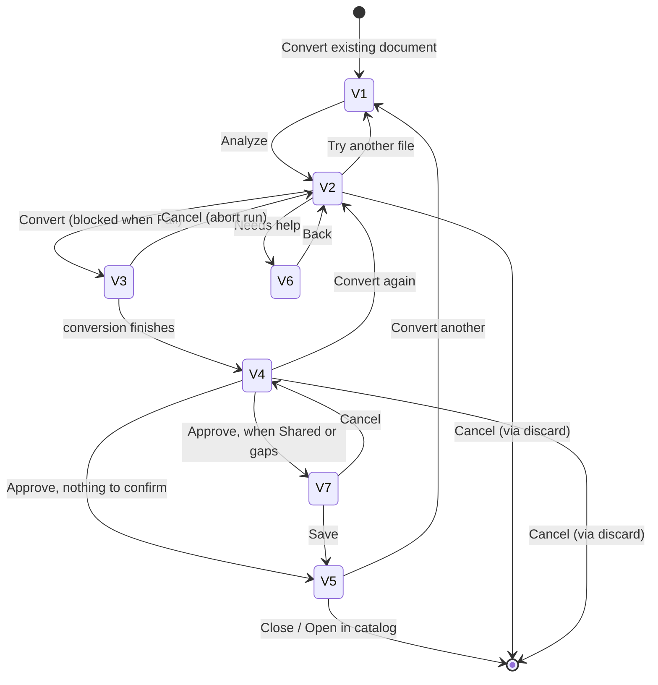

# Template AI convert — UI interaction scenario

**Status:** V1–V13 built in the officer-shell prototype (slice **E7a**) — all 16 prototype PNGs are now represented
**Canonical UX:** [`TEMPLATE_AI_CONVERT_PRODUCT_SPEC.md`](TEMPLATE_AI_CONVERT_PRODUCT_SPEC.md) (decisions L1–L13)
**Contracts:** [`TEMPLATE_AI_CONVERT_ENGINEERING_SPEC.md`](TEMPLATE_AI_CONVERT_ENGINEERING_SPEC.md) (E-D1–E-D8)
**Prototype:** `Visa2026.Blazor.Server/wwwroot/officer-shell/` — `js/template-convert-ui.js` (views), `js/template-convert-data.js` (state), `js/main.js` (`bindConvertEvents`)

This document answers one question for every screen: **which control does the officer touch, and what does the UI do next.** The product spec says what each screen is for; this says how the screens are wired. Build the Blazor lift (E7b) against this table, not against the PNGs — the PNGs disagree with each other on stepper shape and chrome.

---

## 1. Views

| ID | View | PNG | Where it lives | Built |
|----|------|-----|----------------|-------|
| **V0** | Entry points (templates catalog · case workspace) | 01 background, 05 background | Host page, not the modal | ✅ |
| **V1** | Upload | `01-upload` | Modal, narrow | ✅ |
| **V2** | Candidate check | `02-candidate-check`, `13-excel-roster` | Modal, wide | ✅ |
| **V3** | Converting | `05-converting` | Modal, narrow | ✅ |
| **V4** | Preview + mapping chat | `03-preview-chat`, `09-chat-reject-rewrite` | Modal, wide | ✅ |
| **V5** | Done | `04-done` | Modal, wide | ✅ |
| **V6** | Needs help — gap packet | `12-needs-help-gaps` | Modal, wide | ✅ (export stubbed) |
| **V7** | Confirm dialog (shared target / gaps) | `14-shared-confirm` | Layer over the modal | ✅ |
| **V8** | Candidate **Fail** | `06-candidate-fail` | V2 variant | ✅ |
| **V9** | Candidate **Warn** | `07-candidate-warn` | V2 variant | ✅ |
| **V10** | Validate fail (Approve blocked) | `10-validate-fail` | V4 variant | ✅ |
| **V11** | Config locked (Approve disabled) | `11-config-locked` | V2/V4 banner | ✅ |
| **V12** | Fill preview fallback (merge failed, Validate passed) | `16-fill-preview-fallback` | V4 variant | ✅ |
| **V13** | Add prepared template / AI off (**L12**) | `08-manual-add-ai-off` | Modal, narrow — separate mode | ✅ |

Two PNGs have no view of their own because the behavior lives inside a view that is built: `09-chat-reject-rewrite` is the refusal bubble in the V4 chat (**L8**), and `15-wizard-instance-picker` is the instance dropdown V1 renders when convert starts from the catalog.

---

## 2. Global rules

These apply on every view and are not repeated per view.

| Control / event | Behavior | Guard |
|-----------------|----------|-------|
| **X** (header) · **Cancel** (footer) · backdrop click · **Esc** | Close the modal, return to V0 | Beyond V1 and before V5, ask **V7 discard** first. On V5 the work is saved, so close is immediate |
| Modal opens | Always at **V1**, with all previous state cleared | — |
| Stage stepper | **Display only.** Officers cannot jump stages by clicking it | — |
| Config lock on the parent profile | **V11** banner on V2 and V4; Approve disabled, everything else works | Spec §3 *Config lock* |
| AI provider off / failed | Convert entry hidden or disabled; **Add prepared template** stays (L12) | Spec §7 |

**Why the discard prompt starts after V1:** on V1 the officer has typed a name and picked a file, which costs seconds to redo. From V2 onward there is an analysis, and from V4 there is a chat history — that is worth protecting.

---

## 3. V0 — Entry points

| Element | Where | Action | Result | Guard |
|---------|-------|--------|--------|-------|
| **Convert existing document** | Profile templates catalog, page head | Open modal at **V1**, `source = catalog` | V1 with the **instance picker** enabled | Always visible when the AI provider is on |
| **Convert existing document** | Case workspace → Resminamalar tab | Open modal at **V1**, `source = instance` | V1 with the context instance **read-only** | Only when the **Template convert editor** switch is on (**L13**) |
| **Add prepared template** | Beside Convert, in both places | Open modal in **manual mode** → **V13** | No analysis, no conversion | **Always available** (**L12**) — it is the fallback, so it never depends on AI |
| **Template convert editor** switch | Topbar | Toggle the per-user preference | Case entry appears / disappears immediately | Template-authoring permission |

The two convert entries differ in exactly one way: whether the officer must choose a context instance. Everything downstream is identical.

**Real-app hosts for E7b** (the prototype pages do not map one-to-one — see spec §3):

| Prototype | Real component | Where | Built |
|-----------|----------------|-------|-------|
| Templates catalog page head | `ApplicationProfileWizardStepTemplatesPerson.razor` | Beside `+ Add template` (wizard step 5). The navigation item called *Application Profile Templates* lists **profiles**, not templates, so it is **not** the host | ✅ 2026-08-21 |
| Case workspace entry bar | `ApplicationReportPackageComponent.razor` | The existing top action row, so both the preview-slot drawer and the officer-shell tab inherit it from one insertion | ✅ 2026-08-21 |
| Topbar L13 switch | **undecided** | Must persist per user; storage is an open decision recorded in spec **L13**. Stands in today as `TemplateAiConvert:Enabled` + `ShowInstanceEntry` in appsettings, always behind `TemplateConvertAccess.CanConvertTemplates()` | ⬜ |

**How the two entries differ in the shipped dialog** (`TemplateConvertDialog.razor`):

| | Case entry (`OpenAsync`) | Wizard entry (`OpenForProfileAsync`) |
|---|---|---|
| Match context | The open case, fixed | **Case to match against** picker in V1 — the 25 newest cases of that profile. With none, the officer is told to use `+ Add template` |
| Object space | The dialog creates and disposes its own | The **wizard's**, so an abandoned wizard rolls the template back with everything else |
| Save | Commits immediately; the catalog refreshes | Adds to the profile and waits for **Save profile**, like the existing add path. V5 says so |
| Visibility | `TemplateAiConvert:Enabled` **+** `ShowInstanceEntry` (**L13**) + permission | `Enabled` + permission — editing a profile already implies template authoring |

**What the shipped dialog does and does not do** (sequencing in `ITemplateConvertOrchestrator`):

| Flow element | State |
|--------------|-------|
| V1 Upload → V2 Candidate check → V4 Preview → V5 Done | Live against E1/E2/E5/E3/E6 with the real case |
| V1 instance picker (PNG 15) | Live on the wizard entry; **Check document** stays disabled until a case is chosen |
| V13 Add prepared template (L12) | Live — `manual` opens the same modal, skips matching, saves the file as-is |
| V7 discard confirm, V9 warning acknowledge, V10 error rail, V11 config lock | Live |
| V3 Converting | Collapsed to a busy state — the deterministic path returns in well under a second. Reinstate the progress view with **E10**, when a provider call makes the wait real |
| V4 *Filled preview* tab | Always the **V12** fallback: the template with placeholders plus the amber notice. A merged preview needs E4 draft persistence or an in-memory generate path |
| V4 mapping chat | Live — L8 classifier + `ITemplateConvertChatService` + `None` provider; accepted plans re-apply through `ApplyPlanAsync` |
| V6 gap packet | Not built — export handoff |
| Roster (`{{#ds.rows}}`) conversion | Blocked at candidate check with an explanation. The writer supports loop markers; deriving them from a candidate report does not exist yet |

**When the AI provider is off** (spec §7): Convert stays visible but **disabled** with an `AI off` badge, rather than disappearing — an entry point that vanishes reads as a bug and generates support questions. **Add prepared template** becomes the primary action.

---

## 4. V1 — Upload

| Element | Type | Action | Result |
|---------|------|--------|--------|
| Template name | text | Edit | Re-evaluates the **Analyze** guard; no re-render (keeps caret) |
| Catalog target | radio · Profile-specific / Shared | Select | Helper copy switches to the Shared warning; **Shared is confirmed later at Approve**, not here |
| Data scope | select · Header / People roster / Both | Select | Decides which placeholders may be used (E1 set) |
| Context instance | read-only (`source = instance`) or select (`source = catalog`) | Select | Sets the mapping data source |
| File | drop zone / sample buttons | Pick | Fills the name if empty, defaults the data scope from the file kind |
| **Choose a different file** | link | Click | Clears the file, returns the drop zone to empty |
| **Analyze** | primary | Click | → **V2** |
| Add a prepared template | link | Click | Leaves convert for the manual L12 path |

**Analyze guard:** file picked **and** name non-empty **and** an instance selected. Disabled otherwise; no error copy, because a disabled button next to three required markers already says it.

---

## 5. V2 — Candidate check

| Element | Type | Action | Result |
|---------|------|--------|--------|
| Document viewport | display | — | Matches highlighted, gaps outlined; hover shows the short code and token |
| Suitability / Summary / Criteria rail | display | — | Chips are derived, not stored: they recount after every chat remap |
| **Convert** | primary | Click | → **V3** |
| **Try another file** | secondary | Click | → **V1**, file cleared, name and target kept |
| **Needs help** | secondary | Click | → **V6** |
| **Cancel** | secondary | Click | Global close (discard prompt) |

**Convert guard by suitability (L7):**

| Suitability | Convert | Extra UI |
|-------------|---------|----------|
| **Pass** | Enabled | Rail heading reads *Criteria*, green ticks |
| **Warn** (V9) | **Disabled until acknowledged** | Rail heading *Soft warnings* (amber); **Continue with warnings** checkbox under the document; footer hint "Convert stays disabled until you confirm above" |
| **Fail** (V8) | **Disabled** | Rail heading *Fail reasons* (red) plus "This document cannot be converted"; footer hint "Conversion is disabled for failed checks"; **Try another file** and **Needs help** are the way out |

**Why Warn needs its own checkbox** (PNG 07, and it is the second acknowledgement in the flow): a conversion run is not free once E10 lands — it spends an AI provider call with a p95 of 90 s. The gate stops a doubtful document before that cost, whereas the V4 checkbox governs saving a validated template. Different question, different moment.

---

## 6. V3 — Converting

| Element | Type | Action | Result |
|---------|------|--------|--------|
| Progress bar + 4 steps | display | auto-advance | Reading → Matching → Building → Checking, then → **V4** |
| **Cancel** | secondary | Click | **Aborts the conversion and returns to V2** — it does not close the modal |

Cancel here means "stop this run", not "throw away my upload". Closing the modal from V3 requires the X or Esc, which then asks to discard.

---

## 7. V4 — Preview + mapping chat

| Element | Type | Action | Result |
|---------|------|--------|--------|
| **Filled preview** tab | tab | Click | Document with instance values, placeholders highlighted |
| **Placeholders** tab | tab | Click | Same document with `{{tokens}}` in place of values |
| **Highlights** tab | tab | Click | Flat list: short code, matched text, token, document address |
| Chat input + **Send** (or Enter) | text | Submit | Assistant replies; a mapping change re-renders the document and the chips |
| Chat — out-of-scope request | — | — | **Refused** with an amber bubble; nothing changes (**L8**, PNG 09) |
| Chat panel — validation **errors** present (V10) | — | — | **Replaced** by the validation error rail; no mapping instruction can repair a broken token |
| Acknowledge warnings | checkbox | Tick | Only when validation has warnings **and** no errors; unticked leaves Approve disabled (**E-D2**) |
| **Approve — save to profile** | primary | Click | → **V7** if confirmation is needed, otherwise → **V5** |
| **Convert again** | secondary | Click | → **V2**, keeping the file and the chat history |
| **Cancel** | secondary | Click | Global close (discard prompt) |

**Approve guard:** blocked by any validation **error** (V10) or by the profile **config lock** (V11); warnings block only until acknowledged.

**V10 — validate fail.** The preview opens on the **Placeholders** tab, because that is where the broken tokens are visible; each token the validator rejected is marked red inline so the rail and the document agree. Footer becomes **Convert again · Needs help · Cancel** with Approve disabled.

**V11 — config locked.** A `CONFIG LOCKED` badge sits next to the modal title and an amber banner explains that everything except saving still works. Upload, convert, preview, chat, and the gap packet stay live; only Approve is disabled, and it carries a lock icon.

**V12 — fill preview fallback.** Validate passed but merging this instance's data failed, so there are no values to render. The **Filled preview** tab is relabelled *Filled preview (error)* with a red mark, the preview opens on **Placeholders**, and an amber notice states that the master with tokens is being shown. **Approve stays enabled** — the template is sound; it was the merge that failed, and that is instance data, not a template defect (spec §6.1).

**Confirmation is required when** the catalog target is **Shared** (PNG 14) or **gaps remain** — spec §6.4. Both conditions are shown in **one** V7 dialog rather than chained prompts.

---

## 8. V5 — Done

| Element | Type | Action | Result |
|---------|------|--------|--------|
| Summary table | display | — | Name, format, catalog, parent profile, context instance, readiness |
| **Open in catalog** | primary | Click | Close modal, navigate to the profile templates catalog |
| **Edit with desktop staging** | secondary | Click | Hands off to the existing staging flow (`TEMPLATE_STAGING_EDIT.md`) |
| **Convert another** | secondary | Click | → **V1**, same source and instance, everything else cleared |
| **Close** | primary | Click | Close, **no** discard prompt — the template is saved |

---

## 9. V6 — Needs help (gap packet)

Reached from V2 and, later, from V4. Shows what the system could not map and offers the developer handoff described in spec §6.3.

| Element | Type | Action | Result |
|---------|------|--------|--------|
| Gap list | display | — | Each unmatched literal with its document address |
| **Download gap packet** | primary | Click | JSON/Markdown export (E-D8) |
| **Back** | secondary | Click | Returns to the view that opened it (V2 or V4) |

---

## 9b. V13 — Add prepared template (L12 manual path)

A separate **mode**, not a stage: `mode = 'manual'` swaps the modal body and hides the stepper, because there is nothing to step through. Reached from either entry point, with or without AI.

| Element | Type | Action | Result |
|---------|------|--------|--------|
| AI-off banner | display | — | Only when the provider is off: "AI conversion is not enabled for this environment" |
| Template name · Catalog target · File | form | Edit | Same controls as V1 |
| **Add template** | primary | Click | Validates and saves → **V5**, summarised as *Template added · Manually prepared — no AI conversion* |
| **Cancel** | secondary | Click | Closes; no discard prompt, since nothing was analyzed |

**No context instance field.** The file already carries its placeholders, so there is nothing to match against a case — asking for an instance would imply a mapping step that does not happen here. Validation against the profile placeholder set still runs on save; only the *matching* is skipped.

---

## 10. V7 — Confirm dialog

A layer over the modal, never a separate stage; the view underneath stays rendered.

| Trigger | Body | Confirm | Cancel |
|---------|------|---------|--------|
| Close beyond V1, before V5 | "Discard this conversion?" | Close modal | Stay |
| Approve with Shared target | "Available to other profiles via Include" | Save | Return to V4 |
| Approve with gaps | "N span(s) stay as literal text in every generated document" | Save | Return to V4 |
| Approve, Shared **and** gaps | Both lines in one dialog | Save | Return to V4 |

---

## 11. Transition map



---

## 12. State the flow depends on

Held in `template-convert-data.js` today, and in the E7b component state tomorrow. Views are pure functions of it.

| Field | Drives |
|-------|--------|
| `stage` | Which view renders |
| `source` (`instance` \| `catalog`) | Whether V1 shows a picker or a read-only instance |
| `fileId`, `templateName`, `catalogTarget`, `dataScope`, `instanceId` | V1 controls and every guard |
| `progress`, `stepIndex` | V3 |
| `previewTab`, `chat`, `remaps` | V4 |
| `acknowledgedWarnings` | Approve guard |
| `acknowledgedCandidate` | Convert guard on a **Warn** candidate (V9) |
| `configLocked` | V11 badge and banner; Approve disabled. Comes from the parent profile, never a user preference |
| `fillPreviewFailed` | V12 tab mark, fallback notice, and the token fallback on the Filled tab |
| `mode` (`convert` \| `manual`) | V13 — swaps the modal body, title, footer and hides the stepper |
| `aiEnabled` | Entry-point state (Convert disabled with an `AI off` badge). Deployment flag per slot, not a preference |
| `confirm` | V7 layer (null when closed) |
| `returnStage` | Where V6 goes Back to |
| `savedTemplate` | V5 summary |

**Derived, never stored:** the highlight list (base report + `remaps`), the summary chips, and every guard. Storing them is how a chat remap ends up showing a stale gap count.

---

## 13. Deep links for review

`?convert=` on any officer-shell route opens a stage directly, and `?editor=1` flips the L13 switch:

```text
#/templates?convert=upload
#/templates?convert=candidate
#/templates?convert=roster        V2 with the Excel roster
#/templates?convert=converting
#/templates?convert=preview
#/templates?convert=done
#/templates?convert=help          V6 gap packet
#/templates?convert=confirm       V4 with the V7 dialog open (Shared + gaps)
#/templates?convert=fail          V8 candidate Fail (HR memo fixture)
#/templates?convert=warn          V9 candidate Warn (hand-tokenized draft fixture)
#/templates?convert=validate-fail V10 preview with validation errors
#/templates?convert=locked        V11 preview with the profile config locked
#/templates?convert=preview&locked=1   any stage can be locked with ?locked=1
#/templates?convert=fill-error    V12 preview with the instance merge failed
#/templates?convert=manual        V13 Add prepared template
#/templates?ai=off                entry points with the AI provider disabled
#/case/c1/resminamalar?editor=1   case entry point, L13 switch on
```

Prototype-only. They exist so parity review and headless screenshots do not need click-through, and they must not survive the Blazor lift.
