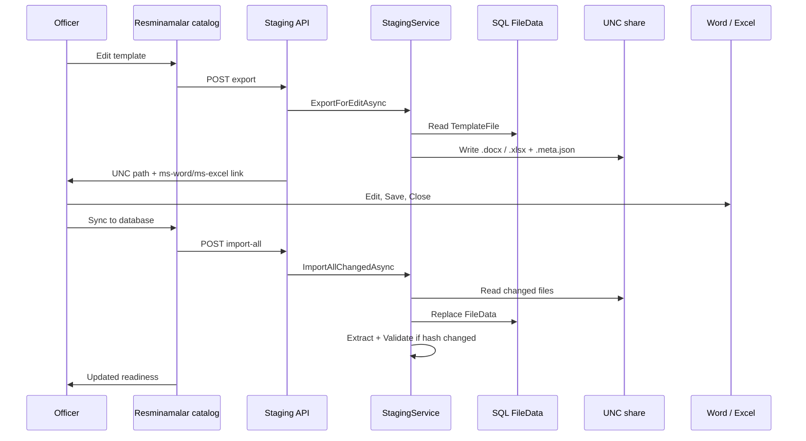
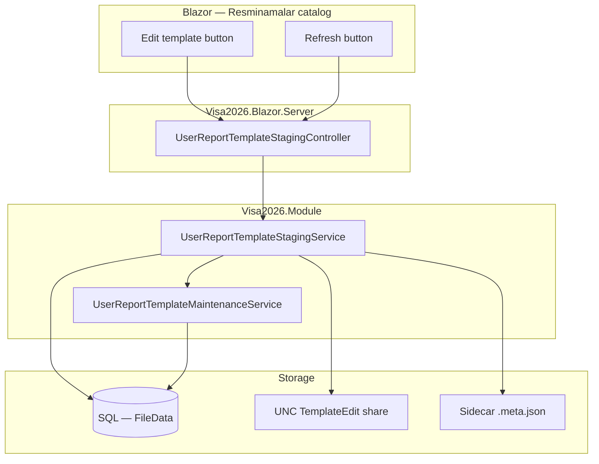

# Template staging edit (Resminamalar desktop Word/Excel)

> **Status:** Phases 1–3 implemented (Module services, API, Resminamalar catalog UI). Enable via `TemplateEditStaging:Enabled` and configure UNC share.  
> **Related:** [`APPLICATION_REPORT_PACKAGE.md`](APPLICATION_REPORT_PACKAGE.md) (Resminamalar catalog), [`USER_TEMPLATE_AUTHOR_GUIDE.md`](USER_TEMPLATE_AUTHOR_GUIDE.md), [`.cursor/skills/visa2026-resminamalar/SKILL.md`](../.cursor/skills/visa2026-resminamalar/SKILL.md).

Officers edit **user report templates** (Word `.docx` / Excel `.xlsx`) from the **Resminamalar catalog** without opening **User Report Template** DetailView or manually downloading and re-uploading files.

## Prerequisites (confirmed)

- **Staging** is a **network share** both the app (service account) and officers can read/write.
- Officers have **Microsoft Word / Excel** installed on their workstations.
- **In-browser** Spreadsheet / Rich Edit on DetailView is **out of scope** for this feature (desktop edit via share only).

---

## Officer workflow

| Step | Officer action | System behavior |
|------|----------------|-----------------|
| 1 | Click **Edit template** on a catalog row (gear panel) | Export `FileData` from DB → write to network share → attempt open in Word/Excel |
| 2 | Edit, **Save**, **Close** in desktop app | File remains on the share |
| 3 | Click **Sync to database** in catalog footer | Import all **changed** staged files → replace DB blobs → Extract + Validate when hash changed → reload catalog readiness |

The officer stays in **Resminamalar**. The database is canonical **after Sync to database**. Use **Refresh** only to reload catalog readiness without importing from the share.



---

## Design decisions (locked)

| # | Decision | Choice |
|---|----------|--------|
| 1 | **Import scope on Refresh** | Import **all changed files on the share** (not limited to current session) |
| 2 | **Extract + Validate on import** | Run **only when file hash changed** since last import |
| 3 | **Open file after export** | **Try** `ms-word:` / `ms-excel:` Office protocol; **fallback** UNC path + **Copy path** button |
| 4 | **DetailView link in catalog** | **Remove** — catalog **Edit template** is the only entry point; DetailView remains in nav for admins |

---

## Non-goals

- In-browser Spreadsheet / Rich Edit on User Report Template DetailView
- Editing ministry **seed files in git** (`Resources/Templates/`)
- Version history, check-out UI, or multi-user merge conflict resolution (v1: last import wins)
- Auto-sync without officer clicking **Refresh**

---

## Architecture



### Layer responsibilities

| Layer | Location | Responsibility |
|-------|----------|----------------|
| **Staging service** | `Visa2026.Module/Services/UserReports/` | Export/import bytes, path rules, hash compare, lock detection, metadata |
| **Maintenance service** | `Visa2026.Module/Services/UserReports/` | Shared Extract + Validate (refactored from `UserReportTemplateController`) |
| **API controller** | `Visa2026.Blazor.Server/Controllers/` | Auth, permission checks, return UNC + open URL |
| **Catalog UI** | `ApplicationReportPackageComponent.razor` | Edit button, extended Refresh, copy-path JS |
| **Slot host** | `ResminamalarSlotPanel.razor` | Wire import result into catalog reload |

### Current behavior (to replace)

| Control | Today | After this feature |
|---------|-------|-------------------|
| **Edit template** | Opens `UserReportTemplate_DetailView/{id}` in new tab | Export to share + open in Office |
| **Refresh** | Reloads catalog from DB only | Import changed share files → then reload catalog |

---

## Configuration

Add to `appsettings.json` (and environment-specific overrides / `docs/ENVIRONMENTS.md`):

```json
"TemplateEditStaging": {
  "Enabled": true,
  "StagingRootUnc": "\\\\fileserver\\Visa2026\\TemplateEdit",
  "FileNamePattern": "{templateId}_{safeName}{extension}",
  "AutoExtractValidateOnImport": true,
  "MaxFileSizeBytes": 52428800
}
```

| Setting | Purpose |
|---------|---------|
| `Enabled` | Kill switch if share unavailable |
| `StagingRootUnc` | **UNC only** (`\\server\share`) — app pool identity **and** officers need read/write |
| `FileNamePattern` | Stable mapping; `{templateId}` ties file to DB row |
| `AutoExtractValidateOnImport` | After import with hash change, run Extract + Validate |
| `MaxFileSizeBytes` | Reject oversized imports |

**Do not** set `StagingRootUnc` to a local drive (`D:\`, `C:\`) or a relative project folder — always use the **share UNC** (e.g. `\\127.0.0.1\Visa2026TemplateEdit`).

**Deploy checklist**

- App pool / container service account: **Modify** on share
- Officers: **Modify** on same share
- Document UNC path per environment (dev / staging / prod)

### Local development (F5 / `dotnet run`)

| Item | Value |
|------|--------|
| **UNC** | `\\127.0.0.1\Visa2026TemplateEdit` (share name on your dev PC) |
| **Config** | `appsettings.Development.json` → `StagingRootUnc: "\\\\127.0.0.1\\\\Visa2026TemplateEdit"` |
| **Verify** | `.\scripts\local\Ensure-TemplateEditDevShare.ps1` |

Word/Excel opens via `ms-word:` / `ms-excel:` links to the UNC path. Use **Copy path** in the catalog if the browser blocks the protocol handler.

---

## Staging file layout

```
\\fileserver\Visa2026\TemplateEdit\
  {templateId}_{safeName}.docx
  {templateId}_{safeName}.docx.meta.json
  {templateId}_{safeName}.xlsx
  {templateId}_{safeName}.xlsx.meta.json
```

Example sidecar `{templateId}_{safeName}.docx.meta.json`:

```json
{
  "templateId": "3fa85f64-5717-4562-b3fc-2c963f66afa6",
  "templateName": "GT-15 Elyasow ckl",
  "outputFormat": "Word",
  "exportedAtUtc": "2026-06-20T10:15:00Z",
  "exportedByUserName": "officer1",
  "sourceContentHashSha256": "...",
  "lastImportedAtUtc": null,
  "lastImportedContentHashSha256": null
}
```

- **Export** writes/overwrites document + meta (`sourceContentHashSha256` = DB content at export time).
- **Import** compares staged file hash to `lastImportedContentHashSha256`; skip if unchanged.

---

## Implementation phases

### Phase 1 — Module services

#### `UserReportTemplateStagingService`

**`ExportForEditAsync(templateId, userName)`**

1. `UserReportTemplateEditAccess.CanEditTemplates()`
2. Load template + `FileData` from DB
3. Build path: `{StagingRootUnc}\{templateId}_{safeName}.docx|.xlsx`
4. Write bytes; write/update `.meta.json`
5. Return `StagingExportResult` (UNC path, template id, display name, extension)

**`TryImportAsync(templateId)`**

1. Read staged file + meta; validate `templateId` and extension vs `TemplateOutputFormat`
2. If missing → skip
3. If locked (`IOException`) → fail with user-friendly message
4. If SHA-256 unchanged since last import → skip
5. Non-secured object space (same as `UserReportTemplateController` maintenance)
6. Replace `TemplateFile.Content`; commit
7. If hash changed and `AutoExtractValidateOnImport` → call maintenance service
8. Update meta timestamps and `lastImportedContentHashSha256`

**`ImportAllChangedAsync()`**

- Scan share for `*.meta.json` entries
- Import each template whose staged file hash differs from last imported hash
- Return summary: imported / skipped / failed (+ per-template errors)

#### `UserReportTemplateMaintenanceService`

Extract reusable logic from `UserReportTemplateController`:

- `ExtractPlaceholdersAsync(templateId)` — Word: `IUserReportPlaceholderExtractor`; Excel: `IExcelTemplatePlaceholderExtractor`
- `ValidatePlaceholdersAsync(templateId)` — Word: `IUserReportValidationService`; Excel: `IExcelReportValidationService`

#### `TemplateEditStagingOptions`

Options class bound from config; register in `Startup.cs`.

---

### Phase 2 — API

**`UserReportTemplateStagingController`** (`Visa2026.Blazor.Server/Controllers/`)

| Method | Route | Purpose |
|--------|-------|---------|
| POST | `/api/user-report-templates/{templateId}/staging/export` | Export + return open info |
| POST | `/api/user-report-templates/staging/import-all` | Import all changed (Refresh) |
| POST | `/api/user-report-templates/{templateId}/staging/import` | Optional single-template import |

- `[Authorize]` on all endpoints
- Same permission gate as `UserReportTemplateEditAccess.CanEditTemplates()`

**Export response (example)**

```json
{
  "uncPath": "\\\\fileserver\\Visa2026\\TemplateEdit\\{id}_name.docx",
  "openUrl": "ms-word:ofe|u|file://fileserver/Visa2026/TemplateEdit/...",
  "displayName": "GT-15 Elyasow ckl",
  "templateId": "3fa85f64-5717-4562-b3fc-2c963f66afa6"
}
```

**Opening the file (browser)**

1. Attempt `window.open(openUrl)` for Office protocol (best-effort on Windows + Office).
2. Always show UNC path + **Copy path** (`navigator.clipboard.writeText`).
3. Toast if protocol blocked: “Open this path in Word: `\\fileserver\...`”

---

### Phase 3 — UI (Resminamalar catalog)

**File:** `Visa2026.Blazor.Server/Editors/ApplicationReportPackageComponent.razor`

1. Replace `<a href="...DetailView...">` with `DxButton` → `EditTemplateAsync(entry)`.
2. Remove `UserReportTemplateEditLinkService.GetDetailViewUrl` usage from catalog (service may remain for other callers).
3. **Refresh:** call import-all API → show summary toast → existing `ReloadCatalogAsync()`.
4. Optional session hint: badge **“On share”** for templates exported in current browser session until Refresh succeeds.

**JS helper:** `wwwroot/js/template-staging-edit.js` — copy UNC, optional Office open attempt.

**Remove:** DetailView link from catalog entirely (decision #4).

---

### Phase 4 — Security and safety

| Risk | Mitigation |
|------|------------|
| Unauthorized access | `CanEditTemplates()` on every API call |
| Path traversal | Paths built only from `templateId` + sanitized name; never accept client paths |
| Wrong file type | Extension must match `TemplateOutputFormat` |
| Word/Excel lock | Catch `IOException`; message: close app and Refresh again |
| Concurrent edit | v1: last import wins; meta records `exportedByUserName` / timestamps |
| Oversized file | `MaxFileSizeBytes` on import |
| Broken placeholders | Extract + Validate after hash-changed import; readiness Warning in catalog |

---

### Phase 5 — Localization

New `VisaUiMessages` keys (and `UiStrings.messages.json` / `tk-TM`):

- `ApplicationReportPackage.EditTemplate.Exporting`
- `ApplicationReportPackage.EditTemplate.ExportedOpenPath`
- `ApplicationReportPackage.EditTemplate.ExportFailed`
- `ApplicationReportPackage.EditTemplate.CopyPath`
- `ApplicationReportPackage.Refresh.Importing`
- `ApplicationReportPackage.Refresh.ImportSummary`
- `ApplicationReportPackage.Refresh.FileLocked`

---

### Phase 6 — Testing

| Test | Type |
|------|------|
| Export writes bytes + meta | Unit |
| Import updates `FileData` | Unit |
| Import skips unchanged hash | Unit |
| Import triggers extract/validate when hash changed | Unit |
| Locked file → clear error | Unit |
| API 403 without write permission | Integration |
| LAN manual: export → edit → refresh → preview | Manual QA |

**Manual QA checklist**

- [ ] Resminamalar → gear → Edit template → file on share
- [ ] Edit in Word → Save → Close → Refresh → Preview reflects change
- [ ] Same for `.xlsx`
- [ ] Word still open → Refresh shows lock message
- [ ] User without template write → Edit hidden / API 403
- [ ] Refresh with no share changes → “0 imported” + catalog reload
- [ ] Placeholder edit → Refresh → Extract/Validate runs; readiness updates

---

### Phase 7 — Documentation and ops

- This file (`docs/TEMPLATE_STAGING_EDIT.md`) — canonical plan
- Update [`APPLICATION_REPORT_PACKAGE.md`](APPLICATION_REPORT_PACKAGE.md) — Edit / Refresh behavior when implemented
- Update [`ENVIRONMENTS.md`](ENVIRONMENTS.md) — share path and ACLs per environment
- Append to [`.cursor/skills/visa2026-resminamalar/learnings.md`](../.cursor/skills/visa2026-resminamalar/learnings.md) after first deploy

---

## Suggested implementation order

| # | Task |
|---|------|
| 1 | `TemplateEditStagingOptions` + config |
| 2 | `UserReportTemplateStagingService` |
| 3 | `UserReportTemplateMaintenanceService` (refactor from controller) |
| 4 | `UserReportTemplateStagingController` + DI |
| 5 | Catalog UI: Edit button + export flow |
| 6 | Catalog UI: Refresh import + messages |
| 7 | JS: copy UNC + Office open attempt |
| 8 | Unit tests |
| 9 | Localization + cross-doc updates |

---

## References (existing code)

| Area | Path |
|------|------|
| Catalog UI | `Visa2026.Blazor.Server/Editors/ApplicationReportPackageComponent.razor` |
| Edit link (to remove from catalog) | `Visa2026.Blazor.Server/Services/UserReportTemplateEditLinkService.cs` |
| Extract / Validate | `Visa2026.Module/Controllers/UserReportTemplateController.cs` |
| Edit permission | `Visa2026.Module/Services/UserReports/UserReportTemplateEditAccess.cs` |
| Template BO | `Visa2026.Module/BusinessObjects/UserReportTemplate.cs` |
| Catalog entries | `Visa2026.Module/Services/WordReports/ApplicationWordReportPackageCatalog.cs` |
