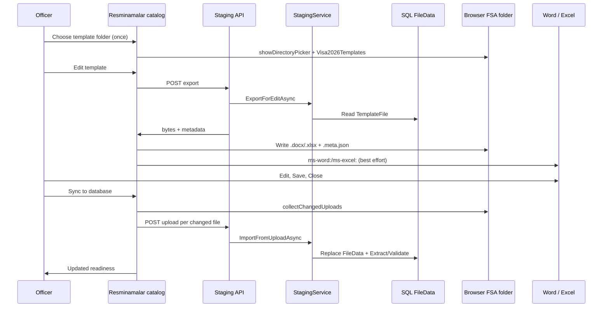
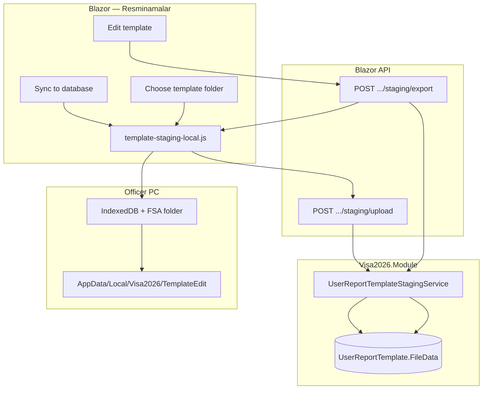

# Template staging edit — local sandbox (Resminamalar)

> **Status:** Implemented — officers edit Word/Excel templates from the Resminamalar catalog via a **local PC sandbox folder** (browser File System Access API). SMB/UNC share mode has been removed.  
> **Related:** [`APPLICATION_REPORT_PACKAGE.md`](APPLICATION_REPORT_PACKAGE.md), [`.cursor/skills/visa2026-resminamalar/SKILL.md`](../.cursor/skills/visa2026-resminamalar/SKILL.md).

Officers edit **user report templates** (`.docx` / `.xlsx`) from **Resminamalar** without opening User Report Template DetailView or manually downloading and re-uploading files. Templates are exported to a folder on the **officer PC**, edited in desktop Word/Excel, then synced back to the database.

---

## Officer workflow

| Step | Action | System |
|------|--------|--------|
| 1 | **Once:** Choose template folder (footer) | Officer grants write access to `%LOCALAPPDATA%\Visa2026\TemplateEdit` (browser remembers folder) |
| 2 | **Edit template** on a catalog row | Server returns template bytes → browser writes file + `.meta.json` → attempts Word/Excel open |
| 3 | Edit, **Save**, **Close** in Word/Excel | File stays in local sandbox |
| 4 | **Sync to database** (footer) | Browser uploads changed files → server replaces DB blobs → Extract + Validate when hash changed |
| 5 | **Refresh** (optional) | Reload catalog readiness only — does **not** import |



---

## Prerequisites

| Requirement | Notes |
|-------------|--------|
| **HTTPS** (production) | File System Access API requires a [secure context](https://developer.mozilla.org/en-US/docs/Web/API/Window/isSecureContext). `localhost` works for F5 dev; IIS prod needs HTTPS (`Enable-Visa2026IisHttps.ps1`). |
| **Edge or Chrome** | `showDirectoryPicker` support; officers use Windows workstations. |
| **Word / Excel** | Desktop apps for editing. |
| **Permissions** | `UserReportTemplateEditAccess.CanEditTemplates()` (same gate as template DetailView maintenance). |

---

## Configuration

### `TemplateEditStaging` (appsettings)

```json
{
  "TemplateEditStaging": {
    "Enabled": true,
    "LocalFolderSubfolderName": "Visa2026\\TemplateEdit",
    "FileNamePattern": "{safeName}{extension}",
    "AutoExtractValidateOnImport": true,
    "MaxFileSizeBytes": 52428800
  }
}
```

| Setting | Purpose |
|---------|---------|
| `Enabled` | Master switch; when false, Edit template / Sync are hidden |
| `LocalFolderSubfolderName` | Relative path under `%LOCALAPPDATA%` (default `Visa2026\TemplateEdit`) |
| `FileNamePattern` | Tokens: `{templateId}`, `{safeName}`, `{extension}` |
| `AutoExtractValidateOnImport` | Run Extract + Validate after successful import when hash changed |
| `MaxFileSizeBytes` | Upload size limit (default 50 MB) |

### Development (`appsettings.Development.json`)

- `TemplateEditStaging:Enabled: true`
- F5 on `https://localhost:5001` or `http://localhost:5001` (localhost is a secure context)

### Production (IIS slot env)

In `C:\visa2026\env\prod.env` (see `scripts/windows-iis/env/prod.env.example`):

```env
TEMPLATE_EDIT_STAGING_ENABLED=true
HTTPS_ENABLED=true
HTTPS_PORT=443
```

Then deploy and run `Enable-Visa2026IisHttps.ps1` for the slot. `Configure-Visa2026Production.ps1` writes `TemplateEditStaging` into `appsettings.Production.json`.

---

## Officer PC setup (one-time)

### 1. Choose template folder

In Resminamalar footer: **Choose template folder**.

1. In the picker **address bar**, paste: `%LOCALAPPDATA%\Visa2026\TemplateEdit`
2. Press **Enter** (create `Visa2026` and `TemplateEdit` if Windows asks)
3. With **TemplateEdit** selected, click **Select Folder**
4. Grant write permission when the browser asks

Default full path example: `C:\Users\<you>\AppData\Local\Visa2026\TemplateEdit`

**Do not** select protected roots (Documents, Desktop, Downloads) — the browser blocks them.

### 2. Office trust (if Word blocks auto-open)

Office may show *"Unsafe Content — Restricted Sites zone"* when launching from the browser.

**Production** (officers open `https://10.100.128.25`):

```powershell
.\scripts\windows-iis\Set-Visa2026TemplateEditOfficeTrust.ps1 -ServerHost 10.100.128.25
```

**Local dev** (`localhost:5001`):

```powershell
.\scripts\windows-iis\Set-Visa2026TemplateEditOfficeTrust.ps1 -IncludeLocalhost
```

Close Word/Edge, hard-refresh, try **Edit template** again. Fallback: open file from `%LOCALAPPDATA%\Visa2026\TemplateEdit` or use **Copy path**.

---

## Architecture



### Key files

| Area | Files |
|------|--------|
| **Module** | `UserReportTemplateStagingService`, `TemplateEditStagingOptions`, `UserReportTemplateStagingPathHelper`, `UserReportTemplateStagingMeta` |
| **Blazor** | `ApplicationReportPackageComponent.razor`, `UserReportTemplateStagingUiService`, `UserReportTemplateStagingController` |
| **JS** | `wwwroot/js/template-staging-local.js` |
| **IIS** | `Enable-Visa2026IisHttps.ps1`, `Configure-Visa2026Production.ps1`, `Set-Visa2026TemplateEditOfficeTrust.ps1` |

### API endpoints

| Method | Path | Purpose |
|--------|------|---------|
| `POST` | `/api/user-report-templates/{id}/staging/export` | Return template bytes + file name (used by Blazor interop) |
| `POST` | `/api/user-report-templates/{id}/staging/upload` | Import one changed file from officer PC |

---

## Rollout checklist (production)

1. Set slot env: `TEMPLATE_EDIT_STAGING_ENABLED=true`, `HTTPS_ENABLED=true`, `HTTPS_PORT=443`
2. Deploy publish output to IIS slot
3. Run `Enable-Visa2026IisHttps.ps1 -Profile Production -RedirectHttpToHttps`
4. Run `Configure-Visa2026Production.ps1 -Profile Production`
5. Officers use **`https://`** URL (not `http://`)
6. On each officer PC: `Set-Visa2026TemplateEditOfficeTrust.ps1 -ServerHost <server>`
7. Officer onboarding: Choose template folder → Edit template → Sync to database

---

## Non-goals

- SMB/UNC network shares for template staging (removed)
- In-browser Spreadsheet / Rich Edit on DetailView
- Editing ministry seed files in git (`Resources/Templates/`)
- Version history or check-out UI (v1: last sync wins)
- Auto-sync without officer clicking **Sync to database**

---

## Troubleshooting

| Symptom | Check |
|---------|--------|
| Folder picker on every Edit | Click **Choose template folder** first; folder handle is stored in IndexedDB |
| Export failed / staging disabled | `TemplateEditStaging:Enabled`, user has edit permission |
| Sync finds nothing | File saved in Word? Same sandbox folder? `.meta.json` present? |
| Word "Restricted Sites" | Run Office trust script; use HTTPS; or open file from Explorer |
| HTTPS required message | Production must use HTTPS; run `Enable-Visa2026IisHttps.ps1` |

---

## Removed (SMB share mode)

The following were removed when switching to local sandbox only:

- `TemplateEditStaging:StagingRootUnc`, `StagingLocalPath`, `Mode` enum
- `Ensure-Visa2026TemplateEditShare.ps1`, `Ensure-TemplateEditDevShare.ps1`
- `template-staging-edit.js`, server-side share scan (`ImportAllChangedAsync`)
- Port 445 / SMB ACL / `TEMPLATE_EDIT_UNC_HOST` / `TEMPLATE_EDIT_OFFICERS_PRINCIPAL`
