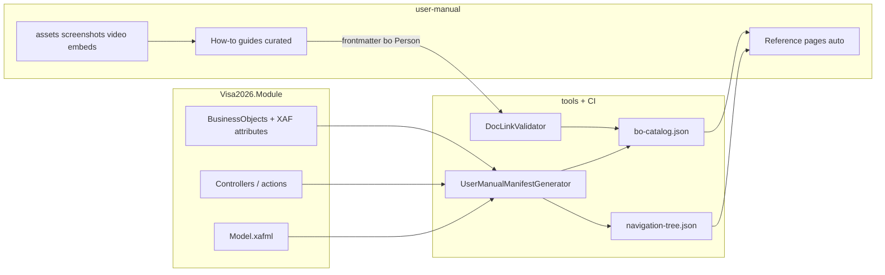

# User Manual — Implementation Plan

Status: **Draft v0.1 — approved for Phase 0 kickoff**  
Owner: Product + Visa officers + Tech lead  
Last updated: 2026-08-04

---

## 1. Purpose

Visa officers need a **web-hosted user manual** for Visa2026: step-by-step guides, UI screenshots, navigation help, and video tutorials — separate from developer documentation in `docs/`.

The manual must **stay aligned with BusinessObjects** as the application evolves (new fields, renamed screens, new workflows) without hand-maintaining BO tables in Markdown.

This plan defines architecture, repo layout, tooling, CI gates, AI-assisted authoring workflow, and a phased rollout.

### 1.1 Audience

| Audience | Needs |
|----------|--------|
| **Visa officers** (primary) | Daily workflows: persons, applications, progress, document copies, reports |
| **Visa chief / supervisors** | Dashboards, dossier export, oversight |
| **Administrators** | Configuration, templates, roles (simplified) |
| **Developers** | Maintain catalog generator and CI — not primary readers |

### 1.2 Distinction from existing docs

| Location | Role | Keep separate? |
|----------|------|----------------|
| `docs/` (this repo) | Implementation plans, migration, deploy, agent skills | **Yes** — developer-facing |
| `AGENTS.md`, `.cursor/skills/` | AI coding assistants | **Yes** |
| `docs/USER_TEMPLATE_AUTHOR_GUIDE.md` | Power-user template authoring | **Adapt** into manual (admin section) |
| **`user-manual/`** (new) | Officer how-to + BO reference | **This plan** |

---

## 2. Goals and non-goals

### 2.1 Goals

- Publish a **searchable static site** with sidebar navigation and deep links.
- **Auto-generate** BO catalog (names, nav paths, fields, required rules) from `Visa2026.Module`.
- **Curate** task-based guides (register employee, create application, document copies, etc.) with screenshots and embedded video.
- **CI validation**: broken BO links, missing assets, stale slug references fail the build.
- **AI-assisted drafting** from catalog + existing feature docs, with **human officer review** before publish.
- Support **localization** — **en, tr, tk, ru** (default `en`); mkdocs-static-i18n; phased content rollout — [localization.md](../.cursor/skills/visa2026-user-manual/localization.md).
- Optional later: **in-app Help** links from XAF views to manual URLs.

### 2.2 Non-goals (v1)

- Replacing XAF in-app tooltips or validation messages.
- Auto-generating full prose for every BO (only catalog pages + pilot guides).
- Storing large video files in **git** (final store is TBD — see [USER_MANUAL_E2E_MEDIA.md](USER_MANUAL_E2E_MEDIA.md) §5.1).
- Merging developer migration/deploy runbooks into the officer manual.
- **Code or implementation content on the officer site** — no C#, SQL, APIs, BO/property names, repo paths, or developer `docs/` links ([content-policy.md](../.cursor/skills/visa2026-user-manual/content-policy.md)).
- Real-time sync on every property change without a build (batch on PR/main is enough).

---

## 3. Architecture — two layers



| Layer | Contents | Source of truth | Update trigger |
|-------|----------|-----------------|----------------|
| **A — Catalog** | Type name, display name, `NavigationItem` path, properties, required/visibility hints, controller actions | C# + XAF model | Every CI build |
| **B — Guides** | Steps, business context, screenshots, videos | Markdown in `user-manual/docs/guides/` | Human + AI draft, officer review |

**Rule:** Layer B never invents field or menu names — it references Layer A by stable IDs (`bo: Person`, `slug: person/register`).

---

## 4. Tooling decisions

### 4.1 Static site generator — **MkDocs Material** (recommended)

| Criterion | MkDocs Material | Docusaurus |
|-----------|-----------------|------------|
| Markdown-first | Excellent | MDX-heavy |
| Setup for .NET team | Low (Python pip) | Higher (Node/React) |
| Search, nav, i18n | Built-in plugins | Built-in |
| Versioned manuals | `mike` plugin | Native |
| Custom BO reference templates | Jinja2 in gen step | React components |

**Decision:** Start with **MkDocs Material** in `user-manual/`. Revisit Docusaurus only if we need heavy interactive components.

### 4.2 Catalog generator — **.NET console** (`tools/UserManualManifestGenerator`)

- Loads `Visa2026.Module` (post-build) via reflection or Roslyn.
- Reads `[UserDocumentation]`, `[NavigationItem]`, `[XafDisplayName]`, `[DisplayName]`, `[RuleRequiredField]`, `[Appearance]` (visibility criteria summary).
- Optionally parses `Model.DesignedDiffs.xafml` for navigation items not expressed on BO classes.
- Outputs JSON under `user-manual/generated/` (committed on main after gen, or CI artifact — see §8).

### 4.3 Hosting — **GitHub Pages** (phase 1), on-prem static optional (phase 2)

- Reuse existing Pages pattern (`scripts/ci/Prepare-UiScenarioPagesPublish.ps1` spirit).
- Site URL TBD: `https://<org>.github.io/Visa2026/manual/` or custom domain.
- On-prem: nginx/IIS static folder beside Visa2026 IIS slots for officers without GitHub access.

### 4.4 Video

- Record: EasyTest `Record-EasyTest.ps1` / CI ffmpeg (primary); OBS / Loom optional for narration.
- **Storage backend: open** until Phase 3 — options in [USER_MANUAL_E2E_MEDIA.md](USER_MANUAL_E2E_MEDIA.md) §5.1 (embed, static, object storage, PostgreSQL/`FileData`, hybrid).
- Title convention: `Visa2026 — <task> (v2026.08)`.

---

## 5. Repository layout

```
user-manual/
  mkdocs.yml
  requirements.txt              # mkdocs-material, mkdocs-static-i18n
  docs/
    en/
      index.md
      getting-started/
      guides/                   # Layer B — curated
        _template.md
        person-register.md
        ...
      reference/                # Layer A — partially generated
      administration/
    tr/                         # same slug paths as en/
    tk/
    ru/
  assets/
    screenshots/
      v2026.08/
        en/
        tr/
        tk/
        ru/
  generated/
    bo-catalog.json
    navigation-tree.json
```

tools/
  UserManualManifestGenerator/
    UserManualManifestGenerator.csproj
    Program.cs
    Readers/
      BusinessObjectCatalogReader.cs
      NavigationReader.cs
      ControllerActionReader.cs

Visa2026.Module/
  Documentation/
    UserDocumentationAttribute.cs

scripts/ci/
  Build-UserManual.ps1          # gen → validate → mkdocs build
  Validate-UserManualLinks.ps1
  Publish-UserManualPages.ps1

.github/workflows/
  user-manual.yml
```

---

## 6. Code contract — linking docs to BusinessObjects

### 6.1 Attribute (Module)

```csharp
namespace Visa2026.Module.Documentation;

[AttributeUsage(AttributeTargets.Class, AllowMultiple = false, Inherited = false)]
public sealed class UserDocumentationAttribute : Attribute
{
    public string Slug { get; }
    public string? Category { get; init; }  // e.g. "Person management"
    public UserDocumentationAttribute(string slug) => Slug = slug;
}
```

Apply on feature anchors (not every lookup row):

```csharp
[UserDocumentation("person/overview", Category = "Person management")]
public class Person : BaseObject { ... }

[UserDocumentation("applications/overview", Category = "Applications")]
public class Application : BaseObject { ... }
```

### 6.2 Guide frontmatter (required fields)

```yaml
---
title: Register a new employee
slug: person/register
bo: Person
relatedBo: [Passport, Education]
navPath: Employee
roles: [Visa Officer]
status: draft | review | published
screenshotsVersion: "2026.08"
locale: en
video: https://youtu.be/xxxxxxxx
sourceDocs:                          # traceability for AI / reviewers
  - docs/PERSON_INCOMPLETE_DATA.md
  - docs/PERSON_DETAIL_NESTED_COLLECTION_TABS.md
---
```

### 6.3 Catalog JSON shape (generated)

```json
{
  "generatedAt": "2026-08-04T12:00:00Z",
  "assemblyVersion": "1.0.0.0",
  "types": [
    {
      "name": "Person",
      "fullName": "Visa2026.Module.BusinessObjects.Person",
      "displayName": "Person",
      "navigationPath": null,
      "userDocSlug": "person/overview",
      "userDocCategory": "Person management",
      "properties": [
        {
          "name": "FirstName",
          "displayName": "First name",
          "required": true,
          "hiddenWhen": "PersonRole != Employee"
        }
      ],
      "actions": [
        { "id": "OpenDossier", "caption": "Open dossier", "view": "DetailView" }
      ],
      "guideSlugs": ["person/register", "person/dossier"]
    }
  ]
}
```

`guideSlugs` populated by scanning guide frontmatter in CI.

---

## 7. Information architecture (site navigation)

Mirror **curriculum tiers** (simple → hard): [curriculum.md](../.cursor/skills/visa2026-user-manual/curriculum.md). Sidebar sections follow **CRUD on BOs first**, **template generation last**.

```
Home
Getting started                    (tier 0)
  Login and roles
  Main navigation

Person records                     (tiers 1–3 — Read → Create → Update)
  Find and open a person
  Register a new employee
  Add a passport
  Update employee details
  Mark incomplete / complete

Applications                       (tier 4)
  Create an application
  Add application items
  Track application progress

Document packages                  (tier 5)
  Ministry document copies
  Resminamalar report package

Tracking & dossier                 (tier 6)
  Report Dashboard
  Person dossier

Administration                     (tier 7 — hardest, last)
  User report templates
  Edit and sync templates
  Roles overview (simplified)

Reference (from catalog)
  … grouped by NavigationItem / BO
```

Cross-linking rule: every guide step links to `reference/<bo>#section`. Higher-tier guides link to prerequisite guides (e.g. Resminamalar → `applications/create`).

Release notes
  What's new in v2026.xx
```

---

## 8. CI pipeline

### 8.1 Workflow (`user-manual.yml`)

Triggers: `push` to `main`, `pull_request` when paths under `user-manual/`, `tools/UserManualManifestGenerator/`, `Visa2026.Module/Documentation/`, or tagged BOs with `[UserDocumentation]` change.

```text
1. dotnet build Visa2026.slnx -c Debug
2. dotnet run --project tools/UserManualManifestGenerator -- \
     --module Visa2026.Module/bin/Debug/net8.0/Visa2026.Module.dll \
     --output user-manual/generated
3. ./scripts/ci/Validate-UserManualLinks.ps1
4. pip install -r user-manual/requirements.txt
5. mkdocs build -f user-manual/mkdocs.yml
6. (main only) Publish-UserManualPages.ps1 → gh-pages or artifact
```

### 8.2 Validator rules

| Check | Severity |
|-------|----------|
| Guide `bo:` not in catalog | **Fail** |
| Guide `slug:` duplicate | **Fail** |
| `[UserDocumentation]` slug with no guide and no reference stub | **Warn** (fail after Phase 2) |
| Broken internal Markdown links | **Fail** |
| `screenshotsVersion` folder missing under `assets/screenshots/` | **Warn** |
| `video:` URL unreachable | **Warn** (optional HTTP HEAD) |

### 8.3 Generated artifacts — commit policy

| Artifact | Policy |
|----------|--------|
| `bo-catalog.json` | Commit on `main` after release gen (diff visible in PR) |
| `reference/*.md` | Generate in CI only (do not commit) OR commit for offline review — **TBD in Phase 1** |
| Built `site/` | Never commit; Pages deploy only |

---

## 9. Media strategy

### 9.1 Screenshots

| Method | When |
|--------|------|
| **Manual** (annotated PNG) | Pilot guides, complex dialogs (Resminamalar, Document copies) |
| **EasyTest capture** (Selenium) | Regression — same flow, fresh PNG per release |

EasyTest integration (Phase 3):

1. Test navigates using existing `e2e-*` CSS hooks (`ModelDefault("CustomCSSClassName", ...)`).
2. Save PNG to `user-manual/assets/screenshots/<version>/<locale>/`.
3. PR that changes Blazor layout may update screenshot baselines (review in PR).

### 9.2 Versioning

- Folder per app release: `assets/screenshots/v2026.08/`.
- Guide frontmatter `screenshotsVersion` must match folder.
- "What's new" page lists UI changes that require re-screenshot.

### 9.3 Video

- 5–12 minutes per workflow; one job-to-be-done each.
- Script = numbered steps from the written guide (single outline).
- Promote EasyTest MP4 to chosen store (TBD Phase 3); wire guide `video` / `videoStorage` frontmatter.
- Link from Reference page "Watch tutorial".

See [USER_MANUAL_E2E_MEDIA.md](USER_MANUAL_E2E_MEDIA.md) §5.1 for storage options.

---

## 10. AI-assisted authoring workflow

### 10.1 Allowed inputs to AI

- Generated `bo-catalog.json`
- Guide outline (bullet list from officer)
- Adapted source: `docs/PERSON_DOSSIER.md`, `docs/APPLICATION_ITEM_DOCUMENT_COPIES.md`, `docs/REPORT_DASHBOARD.md`, `docs/BUSINESS_LOGIC_BASELINE.md` (business context only)
- E2E test names / steps (behavioral truth)

### 10.2 Forbidden

- Inventing field labels, menu paths, or legal requirements not in catalog or source docs
- Publishing without officer review (`status: published` only after review)
- **Running E2E separately for manual publish** — use `Build-UserManual.ps1` only ([USER_MANUAL_PIPELINE.md](USER_MANUAL_PIPELINE.md))
- **Code-related content in `user-manual/`** — no programming snippets, CLR/BO names, SQL/OData, repo paths, or links to developer `docs/` ([content-policy.md](../.cursor/skills/visa2026-user-manual/content-policy.md))

### 10.3 Review checklist (officer)

- [ ] Steps match current UI (screenshots attached)
- [ ] Roles correct (officer vs admin)
- [ ] **No code** — no snippets, class/property names, or developer jargon ([content-policy.md](../.cursor/skills/visa2026-user-manual/content-policy.md))
- [ ] Turkmen / Russian UI labels noted where English manual differs
- [ ] Links open correct reference section (officer site only — not `docs/`)

### 10.4 Cursor skill

Agent workflow: **`.cursor/skills/visa2026-user-manual/SKILL.md`** (+ **`advisory.md`**, **`content-policy.md`**, **`curriculum.md`**, **`tracking.md`**, …).

- **Unified pipeline:** [`USER_MANUAL_PIPELINE.md`](USER_MANUAL_PIPELINE.md) — `Build-UserManual.ps1` runs UserManual E2E; not a separate runner
- **Officer content:** [`content-policy.md`](../.cursor/skills/visa2026-user-manual/content-policy.md) — UI language only; no code on the site
- **Advise before implement** — phase, audience, path options
- Read **`tracking.md`** + **`learnings.md`** before work; update **`tracking.md`** + append **`learnings.md`** after verified changes

---

## 11. Phased implementation

### Phase 0 — Scaffold (1–2 days)

**Deliverables**

- [ ] `user-manual/` with MkDocs Material, local `mkdocs serve`
- [ ] Placeholder `index.md`, `getting-started/login-and-roles.md`
- [ ] `docs/USER_MANUAL_IMPLEMENTATION_PLAN.md` (this file) linked from `AGENTS.md` Further docs
- [ ] Empty `tools/UserManualManifestGenerator` project compiles

**Acceptance:** `mkdocs build` succeeds; site renders locally.

---

### Phase 1 — Catalog generator + validator (3–5 days)

**Deliverables**

- [ ] `UserDocumentationAttribute` in Module
- [ ] Attributes on pilot types: `Person`, `Application`, `ApplicationItem`, `ApplicationProgress`
- [ ] Generator outputs `bo-catalog.json`, `navigation-tree.json`
- [ ] `Validate-UserManualLinks.ps1`
- [ ] `user-manual.yml` CI on PR (build + validate, no deploy)
- [ ] Auto-generated Reference index page (Jinja template or pre-render script)

**Acceptance:** PR fails if guide references `bo: NonExistent`; catalog lists pilot types with properties.

---

### Phase 2 — Pilot guides (1–2 weeks, parallel with officers)

**Deliverables**

- [ ] Guide template `guides/_template.md`
- [ ] Five pilot guides (draft → review → published):
  1. Register an employee (`Person`)
  2. Create an application (`Application`)
  3. Add application items (`ApplicationItem`)
  4. Document copies — ministry package (`ApplicationItem`)
  5. Person dossier (`PersonDossierHost` / Person flow)
- [ ] Manual screenshots (`v2026.08/en/`) for each
- [ ] Simplified admin page: user report templates (from `USER_TEMPLATE_AUTHOR_GUIDE.md`)

**Acceptance:** Officers sign off on five guides; CI green; internal link graph complete.

---

### Phase 3 — Publish + screenshot automation (1 week)

**Deliverables**

- [ ] `Publish-UserManualPages.ps1` → GitHub Pages
- [ ] EasyTest helper: capture screenshot after named test step
- [ ] One automated screenshot per pilot guide (optional baseline diff)
- [ ] Release notes page template

**Acceptance:** Public/internal URL serves manual; at least one screenshot refreshed by CI.

---

### Phase 4 — Expand coverage + i18n (ongoing)

**Deliverables**

- [ ] Remaining high-traffic guides: progress, Resminamalar, Report Dashboard, invitations, work permits
- [ ] `[UserDocumentation]` on all officer-facing feature anchors
- [ ] **tr, tk, ru** translations + screenshots for top 5 guides (after `en` published)
- [ ] Optional in-app Help URL setting (`SystemSettings` or appsettings `UserManualBaseUrl`)

**Acceptance:** Catalog warns for undocumented `[UserDocumentation]` types; 80% of daily officer tasks covered.

---

### Phase 5 — In-app Help (optional)

**Deliverables**

- [ ] Help action on DetailView toolbar when `UserDocumentationAttribute` present
- [ ] Opens manual slug in new tab

**Acceptance:** Person + Application detail show Help linking to correct page.

---

## 12. Reuse from existing repo

| Asset | Use in manual |
|-------|----------------|
| `docs/BUSINESS_LOGIC_BASELINE.md` | AI context; getting started "why" |
| `docs/PERSON_DOSSIER.md` | Adapt → person dossier guide |
| `docs/APPLICATION_ITEM_DOCUMENT_COPIES.md` | Adapt → document copies guide |
| `docs/APPLICATION_REPORT_PACKAGE.md` | Adapt → Resminamalar guide |
| `docs/REPORT_DASHBOARD.md` | Adapt → dashboard guide |
| `docs/USER_TEMPLATE_AUTHOR_GUIDE.md` | Adapt → administration |
| `docs/ROLE_PERMISSIONS_GUIDE.md` | Simplify → roles overview |
| `LookupNavigationStructure.md` | **Replace** with generated nav tree |
| EasyTest `:5050`, `e2e-*` CSS classes | Screenshot automation |
| `Prepare-UiScenarioPagesPublish.ps1` | Pattern for Pages deploy |

---

## 13. Roles and ownership

| Role | Responsibility |
|------|----------------|
| **Product / visa chief** | Prioritize guide list, final officer sign-off |
| **Visa officers** | Review steps, record videos, flag UI drift |
| **Tech lead** | Catalog generator, CI, attribute placement |
| **Developer** | `[UserDocumentation]` on new features in same PR as feature |
| **AI assistant** | Draft from catalog + source docs; never sole publisher |

**Definition of done for a feature PR (from Phase 2 onward):** new officer-visible workflow includes either an updated guide or a tracked doc ticket; `[UserDocumentation]` slug registered.

---

## 14. Success metrics

| Metric | Target (6 months post Phase 3) |
|--------|--------------------------------|
| Officer tasks with published guide | ≥ 80% of support questions |
| CI catalog drift failures caught pre-merge | 100% of renamed BOs |
| Guide freshness | `screenshotsVersion` within 1 minor release |
| Officer satisfaction (informal) | "Can find steps without asking dev" |

---

## 15. Decisions (recorded 2026-08-04)

Canonical record: [decisions.md](../.cursor/skills/visa2026-user-manual/decisions.md).

| # | Question | **Decision** |
|---|----------|--------------|
| 1 | Commit `bo-catalog.json`? | **Yes** on main |
| 2 | Generated reference `.md`? | **CI-only** |
| 3 | Hosting | **On-prem Docker container** |
| 4 | Locales | **en, tr, tk, ru** (en first) |
| 5 | `LookupNavigationStructure.md` | **Deprecate** when generator ships |
| 6 | Video storage | **On-prem static/object on LAN** (Phase 3); top 3–5 pilots |
| — | Publish authority | **Tech**; officer review before publish (D8) |
| — | Phase 2 pilots | Login/navigation + `person/register` |
| — | Deploy gate | Manual CI green for on-prem officer releases |

---

## 16. Related documents

| Document | Role |
|----------|------|
| [`USER_MANUAL_STATUS.md`](USER_MANUAL_STATUS.md) | **Snapshot, roadmap summary, changelog, next inline queue** |
| [`USER_MANUAL_PIPELINE.md`](USER_MANUAL_PIPELINE.md) | Unified build: E2E → media → catalog → mkdocs (single command) |
| [`USER_MANUAL_ROADMAP.md`](USER_MANUAL_ROADMAP.md) | Timeline, milestones |
| [`USER_MANUAL_E2E_MEDIA.md`](USER_MANUAL_E2E_MEDIA.md) | Screenshots & video contract with EasyTest |
| [`BUSINESS_LOGIC_BASELINE.md`](BUSINESS_LOGIC_BASELINE.md) | Business context for guides |
| [`TESTING_PLAN.md`](TESTING_PLAN.md) | EasyTest inventory for screenshot hooks |
| [`.cursor/skills/visa2026-user-manual/localization.md`](../.cursor/skills/visa2026-user-manual/localization.md) | Manual i18n: en, tr, tk, ru |
| [`.cursor/skills/visa2026-user-manual/testing-evidence.md`](../.cursor/skills/visa2026-user-manual/testing-evidence.md) | Green tick verification; `manual-test-reports/` |
| [`ROLE_PERMISSIONS_GUIDE.md`](ROLE_PERMISSIONS_GUIDE.md) | Source for admin roles page |
| [`LookupNavigationStructure.md`](../Visa2026.Module/BusinessObjects/LookupNavigationStructure.md) | Legacy hand-maintained nav (to be superseded) |
| [`.cursor/skills/visa2026-user-manual/SKILL.md`](../.cursor/skills/visa2026-user-manual/SKILL.md) | Agent skill: create, update, plan, fix, track doc generation |
| [`.cursor/skills/visa2026-user-manual/curriculum.md`](../.cursor/skills/visa2026-user-manual/curriculum.md) | Publish order: CRUD on BOs → template generation (tiers 0–7) |
| [`.cursor/skills/visa2026-user-manual/advisory.md`](../.cursor/skills/visa2026-user-manual/advisory.md) | When/how to document; options before implementation |
| [`.cursor/skills/visa2026-user-manual/content-policy.md`](../.cursor/skills/visa2026-user-manual/content-policy.md) | Officer site: no code — UI labels and screenshots only |
| [`.cursor/skills/visa2026-user-manual/tracking.md`](../.cursor/skills/visa2026-user-manual/tracking.md) | Living phase/guide/debt/CI status board |
| [`USER_MANUAL_STATUS.md`](USER_MANUAL_STATUS.md) | Snapshot, consolidated changelog, next inline queue |

---

## 17. Changelog

| Date | Change |
|------|--------|
| 2026-08-04 | Initial plan v0.1 |
| 2026-08-04 | Added `.cursor/skills/visa2026-user-manual/` agent skill |
| 2026-08-04 | Added `USER_MANUAL_ROADMAP.md` and `USER_MANUAL_E2E_MEDIA.md`; interlock with visa2026-easytest-e2e |
| 2026-08-04 | Video storage backend left open (options A–E in E2E media doc) |
| 2026-08-04 | Added `advisory.md` — advise-before-implement workflow in skill |
| 2026-08-04 | Added `curriculum.md` — CRUD-first documentation order (tiers 0–7) |
| 2026-08-04 | Added `USER_MANUAL_STATUS.md` — roadmap summary, changelog, next inline queue |
| 2026-08-04 | Added `content-policy.md` — officer manual must not contain code-related content |
| 2026-08-04 | Recorded D1–D17 — on-prem Docker hosting, tech publish, governance ([decisions.md](../.cursor/skills/visa2026-user-manual/decisions.md)) |
