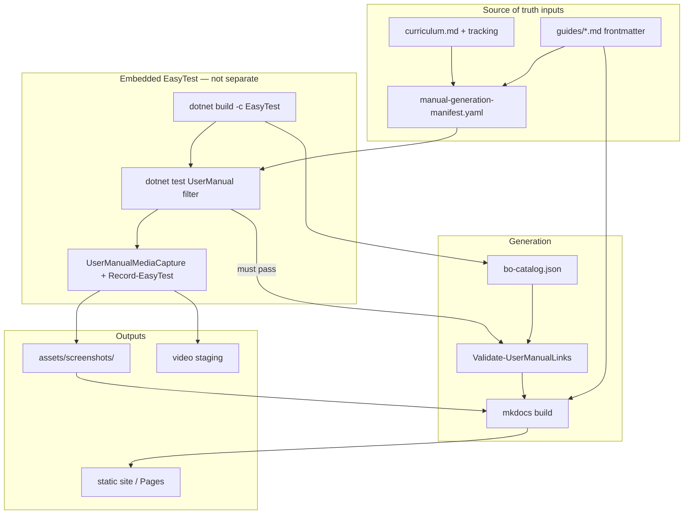

# User Manual — unified generation pipeline

Status: **Draft v0.1 — target architecture**  
Last updated: 2026-08-04

**Related:** [USER_MANUAL_IMPLEMENTATION_PLAN.md](USER_MANUAL_IMPLEMENTATION_PLAN.md) · [USER_MANUAL_STATUS.md](USER_MANUAL_STATUS.md) · [USER_MANUAL_E2E_MEDIA.md](USER_MANUAL_E2E_MEDIA.md) · [USER_MANUAL_ROADMAP.md](USER_MANUAL_ROADMAP.md) · [curriculum.md](../.cursor/skills/visa2026-user-manual/curriculum.md)

**Skills:** [visa2026-user-manual](../.cursor/skills/visa2026-user-manual/SKILL.md) (orchestrator) · [visa2026-easytest-e2e](../.cursor/skills/visa2026-easytest-e2e/SKILL.md) (journey implementation)

---

## 1. Product decision

**Officer documentation is a shipment gate**, not an afterthought.

If officers cannot follow the manual or it shows stale UI, the product fails in the field even when code compiles. Therefore:

| Principle | Meaning |
|-----------|---------|
| **Unified pipeline** | One command / one CI workflow generates **E2E media + catalog + manual site** — not a separate E2E runner that docs must chase |
| **Documentation drives E2E** | The **manual generation manifest** (curriculum + guides) defines *which* journeys must pass and *which* screenshots/videos to capture |
| **Fail closed on publish** | Published manual (`main` / release) does **not** deploy if UserManual E2E fails or media is missing |
| **E2E proves the manual** | Steps in guides must match executable tests; screenshots/video come from that same run |

**Source of truth (in order):**

```text
1. Curriculum + guide frontmatter (what we promise officers)
2. E2E scenario maps + UserManual tests (executable proof)
3. Generated bo-catalog.json (BO field names — never invented in prose)
4. Published MkDocs site (officer deliverable — **green tick** when verified)
5. Testing results report (separate — [testing-evidence.md](../.cursor/skills/visa2026-user-manual/testing-evidence.md))
```

Code can ship without an updated manual only as an **explicit exception** (tracked in `tracking.md` doc debt) — not by default.

---

## 2. Single entry point (not two runners)

### Local

```powershell
# Repo root — THE documentation generation command (Phase 1+)
./scripts/ci/Build-UserManual.ps1

# Optional flags (planned)
./scripts/ci/Build-UserManual.ps1 -RecordVideo
./scripts/ci/Build-UserManual.ps1 -SkipPublish
./scripts/ci/Build-UserManual.ps1 -GuideSlug person/register   # one guide only
```

### CI

**One workflow:** `.github/workflows/user-manual.yml` — replaces the idea of “run E2E separately, then hope someone updates screenshots.”

```text
user-manual.yml (on PR touching user-manual/, guides, UserManual tests, or Module UI)
  │
  ├─ 1. Build EasyTest
  ├─ 2. Run UserManual E2E subset (manifest-driven)
  ├─ 3. Collect screenshots + recordings → user-manual/assets/
  ├─ 4. UserManualManifestGenerator → bo-catalog.json
  ├─ 5. Validate-UserManualLinks.ps1 (links + manifest parity)
  ├─ 6. mkdocs build
  └─ 7. (main only) Publish-UserManualPages.ps1
```

**`e2e-tests.yml`** remains for **full regression** (nightly). **Manual generation** is **agent-triggered** (Cursor Cloud); **CI** on manual PRs runs `Build-UserManual.ps1` (E2E inside) — see [cursor-integration.md](../.cursor/skills/visa2026-user-manual/cursor-integration.md).

---

## 3. Pipeline diagram



---

## 4. Manual generation manifest

**New file (planned):** `user-manual/manual-generation-manifest.yaml`

Generated or hand-maintained from guide inventory — **the contract E2E must satisfy**.

```yaml
version: "2026.09"
locales: [en, tr, tk, ru]
defaultLocale: en
recordVideo: false   # true on release / workflow_dispatch

guides:
  - slug: person/register
    tier: 2
    e2eScenarioId: person-employee-create
    testFilter: "Category=UserManual&FullyQualifiedName~PersonOfficerJourney_LoginCreateEmployeeAddPassport"
    screenshots:
      - stepKey: employees-list
        file: person-register-step-02-employees-list.png
      - stepKey: employee-detail
        file: person-register-step-03-employee-detail.png
    video:
      outputName: person-register.mp4
      required: false
```

| Field | Role |
|-------|------|
| `testFilter` | Passed to `dotnet test --filter` inside `Build-UserManual.ps1` |
| `screenshots[]` | Expected files under `assets/screenshots/v{version}/{locale}/` |
| `video` | Optional; ffmpeg during same test run when `recordVideo: true` |

**Validator:** fails if a `published` guide lacks manifest entry, green E2E, or required PNGs.

---

## 5. E2E test tagging (UserManual category)

Tests that feed the manual are **not** a separate suite — they are existing (or new) facts tagged for the pipeline:

```csharp
[Trait("Category", "UserManual")]
[Trait("GuideSlug", "person/register")]
public class PersonOfficerJourneyTests { ... }
```

Filter for pipeline:

```text
Category=UserManual
```

**Rule:** adding a `published` guide without a `UserManual`-tagged test **blocks** `Build-UserManual.ps1`.

Implementation lives in **visa2026-easytest-e2e**; orchestration in **visa2026-user-manual**.

---

## 5.1 Unit tests (fast doc-generation layer)

**Yes — use xUnit unit tests** inside `Build-UserManual.ps1`. They complement EasyTest; they do **not** replace it.

| Layer | Trait / filter | Project | Speed | Proves |
|-------|----------------|---------|-------|--------|
| **Unit / contract** | `Category=UserManualDocs` | `tools/UserManualManifestGenerator.Tests/` (+ optional `Visa2026.Module.Tests/Documentation/`) | Seconds | Catalog JSON schema, generator reflection, slug rules, manifest ↔ frontmatter parity, nav invariants |
| **Script validator** | _(PowerShell)_ | `Validate-UserManualLinks.ps1` | Seconds | Broken `bo:` links, duplicate slugs, internal Markdown links |
| **E2E + media** | `Category=UserManual` | `Visa2026.E2E.Tests` | Minutes | Officer journeys, screenshots, video |

```text
Build-UserManual.ps1
  ├─ UserManualManifestGenerator → bo-catalog.json
  ├─ dotnet test --filter "Category=UserManualDocs"     ← fast, every PR
  ├─ Validate-UserManualLinks.ps1
  ├─ dotnet test --filter "Category=UserManual"         ← slow, same pipeline
  └─ mkdocs build
```

**Unit tests should cover (Phase 1+):**

- Generator output: required JSON fields, `userDocSlug` from `[UserDocumentation]`, property display names
- Catalog invariants: every `published` guide `bo:` exists in catalog; no duplicate slugs
- Manifest parity: each manifest row matches a guide file; `testFilter` non-empty for `published`
- Optional: snapshot tests for `navigation-tree.json` (review on intentional nav changes)

**Unit tests must not:**

- Launch Blazor or Selenium (that is E2E)
- Replace screenshot/video capture
- Invent labels — assert against reflection from `Visa2026.Module.dll`

**Example:**

```csharp
[Trait("Category", "UserManualDocs")]
public class BoCatalogGeneratorTests
{
    [Fact]
    public void Person_HasUserDocumentationSlug() { ... }
}
```

**CI:** `user-manual.yml` runs `UserManualDocs` on every manual-related PR; `UserManual` E2E runs in the same workflow (not a separate job). Local prose edit: `-SkipE2E` only — **never** skip `UserManualDocs` on publish.

---

## 6. Sequential steps (full pipeline)

| Step | Action | Fail publish? |
|------|--------|---------------|
| 1 | Load `manual-generation-manifest.yaml` + scan `guides/*.md` | Yes if inconsistent |
| 2 | `dotnet build Visa2026.slnx -c Debug` | Yes |
| 3 | `UserManualManifestGenerator` → `bo-catalog.json` | Yes |
| 4 | `dotnet test` — `Category=UserManualDocs` (unit/contract on catalog + guides) | **Yes** |
| 5 | `Validate-UserManualLinks.ps1` + manifest parity | Yes |
| 6 | `dotnet build Visa2026.slnx -c EasyTest` | Yes |
| 7 | Provision `Visa2026EasyTest` DB (same as E2E fixture) | Yes |
| 8 | Optional: start ffmpeg desktop capture | No (warn if missing) |
| 9 | `dotnet test` — manifest `testFilter` / `Category=UserManual` | **Yes** |
| 10 | `UserManualMediaCapture` writes PNGs to staging dir | Yes if required file missing |
| 11 | Copy PNGs → `user-manual/assets/screenshots/v{version}/{locale}/` | Yes |
| 12 | Stop ffmpeg; stage MP4 for video fields (storage TBD) | Warn if optional |
| 13 | Write `manual-test-reports/latest/summary.json` + HTML | Yes |
| 14 | Set guide `verified: true` (green tick metadata) from report | Yes for `published` |
| 15 | `mkdocs build` | Yes |
| 16 | `Publish-UserManualPages.ps1` (main / release only) | Yes |

**Local draft** (`-SkipPublish`): steps 1–15; allow `-SkipE2E` (steps 7–12) only for prose-only edits (explicit flag, logs warning). **Never** skip `UserManualDocs` on publish.

---

## 7. When the pipeline runs

| Trigger | Pipeline | Video |
|---------|----------|-------|
| PR changes `user-manual/`, manifest, UserManual tests, or linked BO UI | Full through mkdocs build | No |
| Merge to `main` | Full + publish site | Optional weekly / `workflow_dispatch` |
| Release tag | Full + publish + `recordVideo: true` | Yes |
| App deploy (IIS/Docker) | **Recommend:** run manual pipeline before or with deploy | Release |

**Shipment coupling (recommended):**

```text
App release checklist:
  [ ] Build-UserManual.ps1 green on release commit
  [ ] Officer sign-off on changed guides (status: published)
  [ ] Manual URL updated / linked from release notes
```

---

## 8. Division of responsibility

| Concern | visa2026-user-manual | visa2026-easytest-e2e |
|---------|----------------------|------------------------|
| `Build-UserManual.ps1` orchestration | **Owns** | Called by |
| `manual-generation-manifest.yaml` | **Owns** | Consumes `GuideSlug` |
| `UserManual` test traits / filters | Defines requirement | **Implements** E2E tests |
| `UserManualDocs` unit tests | Defines contract | **Implements** in `UserManualManifestGenerator.Tests` |
| `UserManualMediaCapture` | Defines output paths | **Implements** capture |
| `Record-EasyTest.ps1` / ffmpeg | Invokes inside pipeline | Documents driver/host pitfalls |
| Guide prose, tiers, curriculum | **Owns** | — |
| Full regression `e2e-tests.yml` | Informed by manifest | **Owns** broader suite |

---

## 9. Why not “E2E first, docs later”

| Separate runner | Unified pipeline |
|-----------------|------------------|
| Screenshots drift until someone remembers | Every manual build refreshes media |
| Guides can describe dead UI | Publish blocked if journey fails |
| Two teams / two schedules | One release artifact: **app + manual** |
| E2E green ≠ manual updated | E2E subset **is** the manual acceptance test |

---

## 10. Implementation phases (add to roadmap)

| Phase | Pipeline deliverable |
|-------|---------------------|
| **1** | `Build-UserManual.ps1` skeleton; catalog + validator (E2E stub) |
| **2** | Manifest file; wire **one** guide (`person/register`) end-to-end |
| **3** | `UserManual` trait; media capture; **fail closed** on publish |
| **4** | All tier 0–4 guides in manifest; video on release |
| **5** | Deploy checklist links manual URL |

---

## 11. Open decisions

| # | Question | Recommendation |
|---|----------|----------------|
| 1 | Allow `-SkipE2E` on CI? | **No** on main/publish; local only with warning |
| 2 | Manifest generated from frontmatter vs hand-edited? | **Generate** in step 1 from `guides/*.md` |
| 3 | Block app Docker publish if manual red? | **Policy** — recommend yes for on-prem officers |
| 4 | Full `e2e-tests.yml` vs subset | Subset in manual pipeline; full suite nightly |

---

## 12. Changelog

| Date | Change |
|------|--------|
| 2026-08-04 | Initial unified pipeline v0.1 — doc generation orchestrates E2E |
| 2026-08-04 | Added `UserManualDocs` xUnit layer — fast unit tests in same pipeline |
