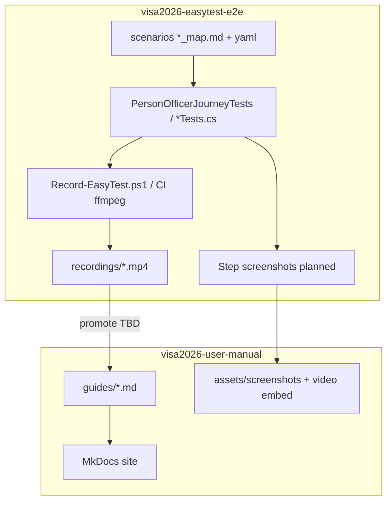

# User Manual — Roadmap

Status: **Draft v0.1**  
Owner: Product + Visa officers + Tech lead  
Last updated: 2026-08-04

**Related**

| Document | Role |
|----------|------|
| [`USER_MANUAL_STATUS.md`](USER_MANUAL_STATUS.md) | **Snapshot, changelog, next inline queue** |
| [`USER_MANUAL_IMPLEMENTATION_PLAN.md`](USER_MANUAL_IMPLEMENTATION_PLAN.md) | Architecture, repo layout, CI gates |
| [`USER_MANUAL_PIPELINE.md`](USER_MANUAL_PIPELINE.md) | Unified build — E2E embedded in doc generation |
| [`USER_MANUAL_E2E_MEDIA.md`](USER_MANUAL_E2E_MEDIA.md) | EasyTest ↔ manual screenshots & video contract |
| [`.cursor/skills/visa2026-user-manual/`](../.cursor/skills/visa2026-user-manual/SKILL.md) | Agent skill: create · update · plan · fix · track |
| [`.cursor/skills/visa2026-easytest-e2e/`](../.cursor/skills/visa2026-easytest-e2e/SKILL.md) | Agent skill: E2E journeys that **produce** media |
| [`.cursor/skills/visa2026-user-manual/tracking.md`](../.cursor/skills/visa2026-user-manual/tracking.md) | Living execution status (inventory, debt) |

**Next implementation queue:** [`USER_MANUAL_STATUS.md` §4](USER_MANUAL_STATUS.md#4-next-inline-for-implementation)

---

## 1. Vision

Officers use a **searchable web manual** (MkDocs) with step-by-step guides, **UI screenshots**, and **video tutorials** that stay aligned with the live application.

**Media truth source:** officer journeys exercised by **native XAF EasyTest** on `:5050` (`Visa2026EasyTest` DB) — not ad-hoc desktop captures that drift from CI.



---

## 2. Principles

| Principle | Meaning |
|-----------|---------|
| **Simplest → hardest** | Curriculum tiers 0–7 — [curriculum.md](../.cursor/skills/visa2026-user-manual/curriculum.md) |
| **Unified pipeline** | `Build-UserManual.ps1` = E2E + media + site — [USER_MANUAL_PIPELINE.md](USER_MANUAL_PIPELINE.md) |
| **Shipment gate** | Publish blocked if UserManual E2E fails |
| **Officers, not developers** | Published manual = UI language only — no code ([content-policy.md](../.cursor/skills/visa2026-user-manual/content-policy.md)) |
| **One journey, one guide** | Each guide maps to `[Trait("Category", "UserManual")]` test + scenario map |
| **Synthetic data only** | `E2ETestDataSeed` values in screenshots/video — never production PII |
| **English pilots first** | EasyTest en-US captions; **tr/tk/ru** prose + screenshots phased per [localization.md](../.cursor/skills/visa2026-user-manual/localization.md) |
| **Four locales** | Site ships en, tr, tk, ru switcher from Phase 0; content fills per tier |
| **CI refreshes media** | Every `Build-UserManual.ps1` run — not a separate E2E job |
| **Videos not in git** | Source MP4 from E2E only; **final store TBD** (embed, static, object, Postgres/`FileData`) — decide Phase 3 |

---

## 3. Timeline overview

Calendar assumes work starts **Q3 2026**. Adjust dates in [tracking.md](../.cursor/skills/visa2026-user-manual/tracking.md) as execution proceeds.

| Window | Milestone | Owner skills |
|--------|-----------|--------------|
| **Aug 2026 W1–2** | Phase 0: MkDocs scaffold + empty generator | user-manual |
| **Aug 2026 W3–4** | Phase 1: catalog JSON + link validator CI | user-manual |
| **Sep 2026** | Phase 2: 5 pilot guides (draft); **manual** screenshots for first 2 | user-manual + officers |
| **Sep 2026** | E2E: promote `person-register` scenario map → `scenarios/ready/` | easytest-e2e |
| **Oct 2026** | Phase 3: screenshot capture helper + copy to `user-manual/assets/` | easytest-e2e → user-manual |
| **Oct 2026** | Phase 3: `Record-EasyTest.ps1` videos for 3 pilot guides | easytest-e2e + user-manual |
| **Oct 2026** | GitHub Pages publish + `user-manual.yml` | user-manual |
| **Nov 2026 – Q1 2027** | Phase 4: expand guides; tk-TM assets; nightly E2E video artifacts | both |
| **Q1 2027** | Phase 5: in-app Help links | user-manual |

---

## 4. Roadmap by phase

### Phase 0 — Foundation (Aug 2026, ~1–2 weeks)

| # | Deliverable | Skill | Done when |
|---|-------------|-------|-----------|
| 0.1 | `user-manual/` MkDocs Material site | user-manual | `mkdocs build` green |
| 0.2 | `tools/UserManualManifestGenerator` (empty compiles) | user-manual | In solution |
| 0.3 | Placeholder pages + `mkdocs.yml` nav skeleton | user-manual | Local `mkdocs serve` |
| 0.4 | Link roadmap + E2E media contract in AGENTS.md | user-manual | Docs linked |

**E2E dependency:** none (parallel OK).

---

### Phase 1 — Catalog & validation (Aug–Sep 2026, ~2 weeks)

| # | Deliverable | Skill | Done when |
|---|-------------|-------|-----------|
| 1.1 | `UserDocumentationAttribute` + pilot BOs | user-manual | Person, Application, ApplicationItem, ApplicationProgress |
| 1.2 | `bo-catalog.json` + `navigation-tree.json` | user-manual | Committed on main |
| 1.3 | `Validate-UserManualLinks.ps1` | user-manual | Fails on bad `bo:` |
| 1.4 | `user-manual.yml` on PR (build + validate) | user-manual | CI green |
| 1.5 | Guide `_template.md` with `e2eScenarioId` frontmatter | user-manual | See [USER_MANUAL_E2E_MEDIA.md](USER_MANUAL_E2E_MEDIA.md) |

**E2E dependency:** align scenario **E2E-xxx** ids in `docs/TESTING_PLAN.md` with future guide slugs (planning only).

---

### Phase 2 — Pilot content (Sep 2026, ~3–4 weeks)

Follow **[curriculum](../.cursor/skills/visa2026-user-manual/curriculum.md)** tiers 0–4 first; tier 5+ in Phase 4.

| # | Deliverable | Tier | Skill | Done when |
|---|-------------|------|-------|-----------|
| 2.0 | Getting started (login, navigation) | 0 | user-manual | published |
| 2.1 | Find / open person; **register** employee; **add passport** | 1–2 | user-manual | published |
| 2.2 | Update person; mark incomplete | 3 | user-manual | published |
| 2.3 | Create application | 4 | user-manual | published |
| 2.4 | Add application items | 4 | user-manual | published |
| 2.5 | Manual PNG screenshots for tier 0–4 pilots | — | user-manual | `v2026.09/en/` |
| 2.6 | E2E `person-employee-create` + passport in `scenarios/ready/` | 2 | easytest-e2e | CI-stable |
| 2.7 | _(Deferred Phase 4)_ document copies, dossier, Resminamalar | 5–6 | user-manual | backlog |
| 2.8 | _(Deferred Phase 4–5)_ user report templates | 7 | user-manual | backlog |

**Phase 2 pilot set (reordered):** tier 0–4 only — not document copies / dossier / templates first.

**E2E ↔ guide mapping (target)**

| Guide slug | E2E scenario folder | Existing test |
|------------|---------------------|---------------|
| `person/register` | `person-employee-create` | `EmployeeTests` / officer journey |
| `person/register` (passport) | `person-employee-passport-create` | `PersonOfficerJourney_*AddPassport` |
| `applications/create` | _planned_ `application-create` | Backlog |
| `applications/add-items` | _planned_ | Backlog |
| `applications/document-copies` | _planned_ | Backlog |
| `person/dossier` | _planned_ | Backlog |

---

### Phase 3 — Unified pipeline & publish (Oct 2026, ~3 weeks)

| # | Deliverable | Skill | Done when |
|---|-------------|-------|-----------|
| 3.1 | `Build-UserManual.ps1` runs UserManual E2E + `UserManualMediaCapture` | both | Fail closed on red |
| 3.2 | `[Trait("Category", "UserManual")]` on curriculum tests | easytest-e2e | Filter `Category=UserManual` |
| 3.3 | `manual-generation-manifest.yaml` from guides | user-manual | Validator parity |
| 3.4 | Copy PNGs → `user-manual/assets/`; optional ffmpeg in same script | both | One guide E2E |
| 3.5 | `user-manual.yml` — single workflow (no separate media step) | user-manual | PR + main |
| 3.6 | `Publish-UserManualPages.ps1` + video staging (storage TBD) | user-manual | URL live |

**CI integration (target)**

```text
user-manual.yml / Build-UserManual.ps1:
  EasyTest (Category=UserManual) → screenshots + recordings
  → catalog → validate → mkdocs build → (main) publish

e2e-tests.yml: full regression nightly — does NOT replace manual pipeline
```

---

### Phase 4 — Scale & i18n (Nov 2026 – Q1 2027, ongoing)

| # | Deliverable | Skill |
|---|-------------|-------|
| 4.1 | Guides: progress (tier 4), document copies & Resminamalar (tier 5), dossier & dashboard (tier 6) | user-manual |
| 4.2 | `[UserDocumentation]` on all officer feature anchors | user-manual |
| 4.3 | **tr, tk, ru** prose + screenshots for tier 0–4 pilots | user-manual (+ E2E per locale when app i18n ships) |
| 4.4 | E2E scenario per new guide before `published` | easytest-e2e |
| 4.5 | Stale guide detection (`screenshotsVersion` vs app version) | user-manual CI warn |
| 4.6 | Invitations, work permits (tier 4–5 as applicable) | user-manual |
| 4.7 | Tier 7: user report templates + template staging (administration) | user-manual |
| 4.8 | Replace `LookupNavigationStructure.md` with generated nav | user-manual |

**Coverage target:** ≥ 80% of daily officer tasks (tiers 0–6); tier 7 for template admins.

---

### Phase 5 — In-app Help (Q1 2027, optional)

| # | Deliverable | Skill |
|---|-------------|-------|
| 5.1 | `UserManualBaseUrl` in appsettings / SystemSettings | user-manual |
| 5.2 | Help toolbar action from `[UserDocumentation]` slug | user-manual |
| 5.3 | Deep link tested for Person + Application | both (E2E smoke optional) |

---

## 5. Skill responsibilities (interlock)

| Work | Primary skill | Secondary |
|------|---------------|-----------|
| MkDocs, guides, catalog, publish | **visa2026-user-manual** | — |
| Officer journey test / scenario map | **visa2026-easytest-e2e** | user-manual (guide slug) |
| Desktop video (`Record-EasyTest.ps1`, CI ffmpeg) | **visa2026-easytest-e2e** | user-manual (embed + release notes) |
| Step PNG capture at journey milestones | **visa2026-easytest-e2e** | user-manual (asset paths, guide wiring) |
| Guide prose, officer review, `status: published` | **visa2026-user-manual** | officers |
| `e2e-*` CSS hooks for stable capture | **feature skill** or Module | both |

**Handoff rule:** when adding a guide, open **two** tracking updates — guide row in user-manual `tracking.md` and scenario row in `docs/TESTING_PLAN.md` / E2E backlog.

---

## 6. Risks and mitigations

| Risk | Mitigation |
|------|------------|
| E2E flaky → stale screenshots | Capture only on green CI; manual fallback for Phase 2 |
| TabbedMDI wrong list (Family vs Employees) | `NavigateEmployeesList()` — see easytest learnings |
| Video shows synthetic data on wrong audience | Officer review; pick internal static/object/FileData if public embed unsuitable |
| Guide steps diverge from E2E | `e2eScenarioId` in frontmatter; CI warns if scenario missing |
| Screenshot PII on public Pages | Internal hosting first; synthetic E2E data only |
| Two skills edited inconsistently | [USER_MANUAL_E2E_MEDIA.md](USER_MANUAL_E2E_MEDIA.md) contract |

---

## 7. Success metrics

| Metric | Target | When |
|--------|--------|------|
| Pilot guides published | 5 | End Phase 2 |
| Guides with E2E scenario in `ready/` | 2+ | End Phase 2 |
| Guides with auto screenshots | 5 | End Phase 3 |
| Guides with video published | 3+ | End Phase 3 |
| Manual site URL live | 1 | End Phase 3 |
| Officer tasks documented | ≥ 80% | End Phase 4 |

---

## 8. Changelog

| Date | Change |
|------|--------|
| 2026-08-04 | Initial roadmap v0.1; E2E media interlock documented |
| 2026-08-04 | Video storage options open until Phase 3 |
| 2026-08-04 | Curriculum: CRUD-first → template generation last |
| 2026-08-04 | Unified pipeline — doc generation orchestrates E2E ([USER_MANUAL_PIPELINE.md](USER_MANUAL_PIPELINE.md)) |
| 2026-08-04 | Status hub — roadmap + changelog + next inline ([USER_MANUAL_STATUS.md](USER_MANUAL_STATUS.md)) |
