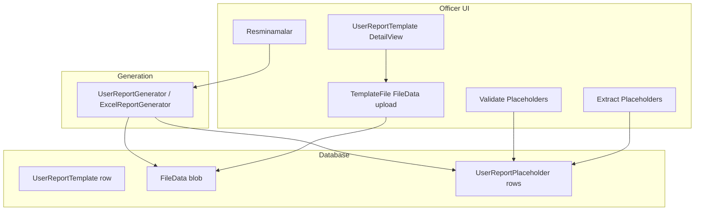

# User report template in-app editing — implementation plan

> **Status:** Draft **v0.3** — preview-slot shell; Word **`DxRichEdit`**; Excel **open-source in-browser** via **Univer** (POC-gated), **ONLYOFFICE Community** fallback (see §7).  
> **Implementation skill:** [`.cursor/skills/visa2026-user-report-template-editing/SKILL.md`](../.cursor/skills/visa2026-user-report-template-editing/SKILL.md)  
> **Shell skill:** [`.cursor/skills/visa2026-preview-slot/SKILL.md`](../.cursor/skills/visa2026-preview-slot/SKILL.md) · [`docs/PREVIEW_SLOT.md`](PREVIEW_SLOT.md)  
> **Scope:** `UserReportTemplate` (`Visa2026.Module/BusinessObjects/UserReportTemplate.cs`) — officer-maintained Word/Excel templates used by **Resminamalar**.  
> **Out of scope:** Code-backed ministry Word reports (`IWordReportDefinition`, `Resources/FormTemplates/`), XtraReports, PDF form mapping.

---

## 1. Problem and vision

### Today

Officers with **Write** on `UserReportTemplate` can change layout by:

1. Downloading or replacing **Template File** (`FileData`) via the XAF file-attachment control (select file → upload → **Save** on the detail view).
2. Running **Extract Placeholders** and **Validate Placeholders** (`UserReportTemplateController`).
3. Testing from **Resminamalar** on an application.

That works without redeploy, but the UX is **download / edit in desktop Office / upload**. Officers must understand file replacement, and layout iteration feels like IT work.

### Target

| Actor | Responsibility |
|-------|----------------|
| **Visa officer** | Open template from the app, edit layout and `{{…}}` placeholders, **Save** back to the database, run validation, activate, test in Resminamalar. |
| **Developer** | Placeholder catalogs (`WORD_REPORT_PLACEHOLDER_REFERENCE.md`, `EXCEL_PLACEHOLDER_REFERENCE.md`), author guides, optional **one-time seeds** for new basenames, merge engine fixes — **not** day-to-day layout edits for user templates. |

**Not a goal:** Make Microsoft Word or Excel desktop apps write directly to SQL Server without application code. Saving to the database always goes through Visa2026 (in-app editor or controlled upload).

---

## 2. Platform constraints (Visa2026 Blazor Server)

Stack already includes:

| Package / module | Role today |
|------------------|------------|
| `DevExpress.ExpressApp.Office` + `Office.Blazor` | Registered in `Startup.cs` (`.AddOffice()`); used for PDF preview conversion, not template editing. |
| `FileAttachments` | `UserReportTemplate.TemplateFile` → `DxFileDataPropertyEditor` (upload/download). |
| DocxTemplater + ClosedXML | Merge at generation time only. |

DevExpress XAF **Office module on Blazor** ([docs](https://docs.devexpress.com/eXpressAppFramework/400003)):

| Editor | Blazor Server |
|--------|:-------------:|
| **Rich Text** (`DxRichEdit` / `RichTextPropertyEditor`) | Supported |
| **Spreadsheet** | **Not supported** in XAF Office Blazor |
| **PDF Viewer** | Supported |

Implication:

| Format | In-app edit + save to `FileData` |
|--------|----------------------------------|
| **Word (.docx)** | **Feasible** — `DxRichEdit` in preview slot (§6.3). |
| **Excel (.xlsx)** | **No DevExpress Blazor spreadsheet** — use **open-source embed** after POC (§7): primary **Univer** (Apache-2.0); fallback **ONLYOFFICE Community** (AGPL, Docker). Until POC passes: slot **upload strip** only (§6.4). |

References:

- [Use Rich Text Documents in Business Objects (XAF)](https://docs.devexpress.com/eXpressAppFramework/400004)
- [DxRichEdit document management (Blazor)](https://docs.devexpress.com/Blazor/403344)
- [File Attachments (Blazor)](https://docs.devexpress.com/eXpressAppFramework/112781)

---

## 3. Current architecture (baseline)



| Component | Location |
|-----------|----------|
| BO | `Visa2026.Module/BusinessObjects/UserReportTemplate.cs` |
| Extract / Validate | `Visa2026.Module/Controllers/UserReportTemplateController.cs` |
| Edit link from Resminamalar | `Visa2026.Blazor.Server/Services/UserReportTemplateEditLinkService.cs` |
| Permissions | `Updater.EnsureUserReportTemplateOfficerPermissions` |
| Seeds (embedded `.docx` / `.xlsx`) | `DatabaseUpdate/UserReportTemplateUpdater.cs` |
| Author workflow (today) | `docs/USER_TEMPLATE_AUTHOR_GUIDE.md` |

**Seed vs officer copy:** `UserReportTemplateUpdater` loads embedded resources into `FileData`. In **DEBUG**, seeded file content may be **overwritten** on startup when the resource changes — officer edits to seeded rows can be lost locally. In **production**, file bytes are typically updated only for **new** template rows. Document this for officers once in-app edit ships.

---

## 4. Target officer workflow (preview slot — recommended)

Officers edit templates **in context** of the application they are working on, using the same **`#visa-preview-slot`** shell as Resminamalar — not a separate browser tab to `UserReportTemplate_DetailView` with file upload.

### Primary path (from Resminamalar)

1. Open **Resminamalar** on an application (preview slot catalog — already shipped).
2. Toggle footer **gear** → **Edit template** on a report row (e.g. *Gurlusyk ckl*).
3. Slot switches occupant to **`TemplateEditor`** (full-width editor mode — same “exclusive preview” layout rules as merged PDF preview).
4. **Word:** edit in **`DxRichEdit`**; type placeholders per **`docs/WORD_REPORT_PLACEHOLDER_REFERENCE.md`**.
5. **Save template** → `FileData` in DB → auto **Extract** + **Validate**; footer shows validation summary.
6. **Back to reports** → restores **Resminamalar** catalog for the same application (preserve `ApplicationId` / item scope).
7. **Preview** on that row → merged PDF in slot (existing `ReportPackageInlinePreview`) to confirm officer changes.

### Excel (preview slot — phased)

| Phase | Officer experience |
|-------|-------------------|
| **1 (ship with Word)** | Same **`TemplateEditor`** occupant: **Download** + **Replace .xlsx** in footer → `FileData` → Extract/Validate. Keeps application context; desktop Excel for layout. |
| **1b (POC)** | Validate **Univer** round-trip on real ministry templates (§7.3). **Do not** block Word editor on POC outcome. |
| **3 (after POC pass)** | **Univer** embedded in slot: edit cells in browser → **Save** → `FileData` → Extract/Validate → Preview. |
| **3 (POC fail)** | **ONLYOFFICE Docs Community** (Docker on company Ubuntu) in slot iframe; callback save to `FileData` (§7.4). |

Placeholder help link + validation summary in footer for all Excel phases.

### Admin path (secondary)

**Reports → User Report Templates** detail view stays for **metadata only** (name, applicability, `RootBoType`, **Is Active**, sort). Optional **Open in editor** action launches the same **`TemplateEditor`** occupant. Demote raw **Template File** upload for users who have slot edit rights (Phase 2).

### Developer (ongoing)

- Maintain **`WORD_REPORT_PLACEHOLDER_REFERENCE.md`** and **`EXCEL_PLACEHOLDER_REFERENCE.md`** when BO/report aliases change.
- Optional **one-time seeds** for new basenames; officers own live `FileData` in DB.
- Do **not** edit officer-owned templates in git after bootstrap.

---

## 4b. Why preview slot (not DetailView popup)

| Approach | Verdict |
|----------|---------|
| **`UserReportTemplate` DetailView + DxRichEdit popup** | Possible but officers leave application context; duplicates Resminamalar “gear → Edit template” which today opens `target="_blank"` detail. |
| **New `#visa-preview-slot` occupant `TemplateEditor`** | **Recommended** — matches [preview-slot design principles](PREVIEW_SLOT.md): one global slot, exclusive full-width body, return navigation, same CSS as PDF preview. |
| **Third mode inside `ResminamalarSlotPanel` only** | Avoid — mixes read (catalog/preview) and write (edit) in one panel; harder to reason about `OccupantKey` / `@key` remount. |

**Skill split:**

| Skill | Owns |
|-------|------|
| [visa2026-preview-slot](../.cursor/skills/visa2026-preview-slot/SKILL.md) | `TemplateEditor` host branch, slot CSS, full-width editor layout, occupant keys |
| [visa2026-resminamalar](../.cursor/skills/visa2026-resminamalar/SKILL.md) | Replace `href` edit link with `OpenTemplateEditorAsync` |
| [visa2026-user-report-template-editing](../.cursor/skills/visa2026-user-report-template-editing/SKILL.md) | Editor bodies, save → `FileData`, Extract/Validate, Excel OSS POC/embed |
| [visa2026-user-report-templates](../.cursor/skills/visa2026-user-report-templates/SKILL.md) | Git seeds, `*_map.md`, embed — not officer DB editing |

---

## 4c. Target officer workflow (legacy — superseded by §4)

<details>
<summary>Earlier DetailView-centric draft (do not implement as primary)</summary>

1. Reports → User Report Templates → Edit document popup on detail view.
2. … (see git history v0.1)

</details>

---

## 5. Phased delivery

| Phase | Deliverable | Word | Excel | Effort (order of magnitude) |
|-------|-------------|:----:|:-----:|-------------------------------|
| **0** | This plan + author-guide cross-links | — | — | Done when merged |
| **1** | **`TemplateEditor`** slot + Word `DxRichEdit` + save/validate + back to Resminamalar | Yes | Upload strip | Medium |
| **1b** | **Excel OSS POC** — Univer round-trip on `433_gurlusyk_ckl.xlsx`, `Sanaw_hasaba_alys.xlsx` (§7.3) | — | Spike | Small |
| **2** | Officer lifecycle: Duplicate template, placeholder help, demote raw upload | Yes | Upload | Small |
| **3a** | **Univer** in `TemplateEditor` slot (if POC **pass**) | — | In-browser | Medium–large |
| **3b** | **ONLYOFFICE Community** integration (if POC **fail**) | — | In-browser | Large |
| **4** | Optional revision history (`UserReportTemplateRevision`) | Yes | Yes | Medium |

**Recommendation:** Ship **Phase 1** (Word + Excel upload strip) in parallel with **Phase 1b** POC. Commit to **Phase 3a or 3b** only after POC results are recorded in this doc §7.5.

---

## 6. Phase 1 — Template editor in preview slot (technical design)

### 6.1 New occupant

| Item | Proposal |
|------|----------|
| **Mode** | `VisaPreviewSlotMode.TemplateEditor` |
| **Key** | `template-editor:{templateId}:return:{resminamalarOccupantKey}` — e.g. `template-editor:{guid}:return:resminamalar:app:{appId}` |
| **Request DTO** | `TemplateEditorSlotRequest` — `TemplateId`, `ReturnResminamalar` (application id, scope, item ids), optional `EntryKey` for post-save preview |
| **API** | `IVisaPreviewSlotService.OpenTemplateEditorAsync(request, ownerViewId)` |
| **Panel** | `TemplateEditorSlotPanel.razor` — header (template name, validation badge), body (Word or Excel UI), footer (Save, Back to reports, Preview report, placeholder help link) |
| **Host** | Branch in `VisaPreviewSlotHost.razor` with `@key="_state.Version"` |

### 6.2 Resminamalar entry point

Replace today’s `target="_blank"` link in `ApplicationReportPackageComponent.razor`:

```text
gear → Edit template
  → OpenTemplateEditorAsync(TemplateEditorSlotRequest, ownerViewId)
  → slot occupant = TemplateEditor (not navigation to UserReportTemplate_DetailView)
```

Keep `UserReportTemplateEditLinkService` for admin list optional deep-link only.

### 6.3 Word editor body

| Element | Proposal |
|---------|----------|
| **Component** | `TemplateEditorWordBody.razor` — `DxRichEdit`, `DocumentFormat.OpenXml`, full slot width |
| **CSS** | Reuse `.resminamalar-slot-panel--preview` full-width rules ([preview-slot reference](../.cursor/skills/visa2026-preview-slot/reference.md)) — editor is not a catalog card |
| **Permissions** | `UserReportTemplateEditAccess` / Write on template + `FileData` |
| **After save** | Shared `IUserReportTemplateMaintenanceService.ExtractAndValidateAsync` (refactor from `UserReportTemplateController`) |
| **Unsaved** | Confirm on Back / occupant switch if `Modified` |

### 6.4 Excel panel body (Phase 1 — upload strip)

| Element | Proposal |
|---------|----------|
| **Component** | `TemplateEditorExcelBody.razor` — file name, **Download**, **Replace .xlsx** (`DxFileInput`), validation summary, link to **`EXCEL_PLACEHOLDER_REFERENCE.md`** |
| **After upload** | Same Extract + Validate as Word save |
| **Later** | Replaced or extended by `TemplateEditorExcelUniverBody.razor` or ONLYOFFICE iframe (§7) when Phase 3 ships |

### 6.4b Excel panel body (Phase 3 — in-browser, after POC)

| Element | Proposal |
|---------|----------|
| **Primary (Univer)** | `TemplateEditorExcelUniverBody.razor` — embed [Univer](https://github.com/dream-num/univer) via JS interop or dedicated host page in slot; full width like Word editor |
| **Load** | `GET` template bytes from `IUserReportTemplateMaintenanceService` → Univer import |
| **Save** | Export xlsx bytes → `FileData.LoadFromStream` → `CommitChanges` → Extract/Validate |
| **Fallback (ONLYOFFICE)** | `TemplateEditorExcelOnlyOfficeBody.razor` — iframe to Document Server; app endpoints: file URL + JWT-signed config + **callbackUrl** → download saved file → `FileData` |

See §7 for OSS comparison and POC gate.

### 6.5 Implementation sketch

| Layer | Work |
|-------|------|
| **Module** | `PreviewSlot/` — mode, request, occupant key, `OpenTemplateEditorAsync` |
| **Blazor.Server** | `TemplateEditorSlotPanel.razor`, word/excel bodies, `VisaPreviewSlotService` |
| **Module** | `IUserReportTemplateMaintenanceService` — load/save `FileData`, extract, validate |
| **Resminamalar** | `ApplicationReportPackageComponent` — button calls slot API instead of `href` |
| **CSS** | `site.css` — `.template-editor-slot-panel` extends preview full-width pattern |
| **Docs** | `PREVIEW_SLOT.md` occupants table + this plan §6 |

### 6.6 Load / save (Word)

```text
Load:
  ObjectSpace.GetObject<UserReportTemplate>(id)
  stream = TemplateFile.OpenReadStream()
  richEdit.LoadDocumentAsync(bytes, DocumentFormat.OpenXml)

Save:
  await richEdit.SaveDocumentAsync()
  content = richEdit.DocumentContent
  TemplateFile.LoadFromStream(MemoryStream(content), fileName, size)
  ObjectSpace.CommitChanges()
  await ExtractAndValidateAsync(template)
```

Use **non-secured** object space only where existing `UserReportTemplateController` already does for placeholder delete (see resminamalar learnings).

### 6.7 DocxTemplater compatibility rules (officer-facing)

Rich Edit must **not** break merge rules documented in `USER_TEMPLATE_AUTHOR_GUIDE.md`:

- Placeholders are **plain text**, not Word merge fields.
- Loop markers (`{{#ds.rows}}` … `{{/ds.rows}}`) must stay in valid positions (often one paragraph or table row).
- `{{IMAGE:…}}` and photos — verify after Phase 1 QA; may need “do not edit image anchors” note in author guide.

Post-save **Validate Placeholders** remains the gate before **Is Active**.

### 6.8 Phase 1 acceptance criteria

- [ ] From Resminamalar (application **003**), gear → **Edit template** opens slot editor without leaving app tab.
- [ ] Word: edit body text in slot, **Save**, **Back to reports** → same Resminamalar catalog.
- [ ] **Preview** on that row shows merged output reflecting edit.
- [ ] Extract + Validate after save; errors visible in editor footer.
- [ ] Excel: **Replace .xlsx** in slot + validate; no broken occupant switch.
- [ ] Slot resize + dark theme OK ([preview-slot verify](../.cursor/skills/visa2026-preview-slot/SKILL.md)).

### 6.9 Phase 1 tests

| Type | What |
|------|------|
| Manual | Edit → save → Resminamalar on known application |
| Manual | Broken placeholder → Validate shows error → fix in editor → re-validate |
| E2E (optional later) | EasyTest: open template detail, trigger action, smoke save (if Rich Edit automatable) |

---

## 7. Excel in-browser — open-source strategy (decided)

DevExpress **does not** ship a Blazor spreadsheet editor (XAF Office Blazor: Spreadsheet **not supported**). Third-party **commercial** options (Syncfusion, GrapeCity, etc.) are **out of scope** — Visa2026 requires **open-source** in-browser Excel.

### 7.1 Decision summary

| Role | Choice |
|------|--------|
| **Primary OSS embed** | **[Univer](https://github.com/dream-num/univer)** — **Apache-2.0**, actively maintained (Luckysheet successor) |
| **Fallback OSS** | **[ONLYOFFICE Docs Community](https://www.onlyoffice.com/compare-editions)** — **AGPL v3**, Docker Document Server, highest Excel fidelity |
| **Rejected for new work** | Luckysheet (archived), FortuneSheet (weaker xlsx fidelity vs ministry templates), Handsontable (not fully OSS for commercial use), DevExpress Spreadsheet (not Blazor-native) |
| **Interim until Phase 3** | Slot **upload strip** (§6.4) — does not block Word editor |

### 7.2 OSS comparison (embed in preview slot)

| Product | License | Deploy model | Excel fidelity | Save to `FileData` |
|---------|---------|--------------|----------------|-------------------|
| **Univer** | Apache-2.0 | JS library in slot panel / small host page | Good for grid editing; **must POC** on merged cells + loop rows | Export xlsx bytes in app → `LoadFromStream` |
| **ONLYOFFICE Community** | AGPL v3 | Separate **Docker** service (fits company Ubuntu compose) | **Highest** — real spreadsheet UI | [callbackUrl](https://api.onlyoffice.com/docs/docs-api/usage-api/callback-handler/) → download `url` → `FileData` |
| **Collabora Online CODE** | MPL-2.0 | Docker + WOPI | High (LibreOffice) | WOPI PutFile — heavier integration; **not** first choice |

**Legal note:** ONLYOFFICE AGPL may require compliance review before embedding in a proprietary on-prem product; often acceptable for **internal LAN** document server. Univer Apache-2.0 avoids copyleft for embed. Record sign-off in §7.5 before Phase 3b.

### 7.3 Phase 1b — POC gate (mandatory before Phase 3)

Run on **real** seeded templates (not blank workbooks):

| # | Template | Checks |
|---|----------|--------|
| 1 | `Resources/Templates/Excel/433_gurlusyk_ckl.xlsx` | Import → edit `{{.RowNumber}}` / header cell → export → ClosedXML merge / Resminamalar preview |
| 2 | `Resources/Templates/Excel/Sanaw_hasaba_alys.xlsx` | Same + `{{#ds.rows}}` row, merged headers, Turkmen labels |
| 3 | Both | `ExcelTemplateSpike` extract finds all placeholders; no structural corruption |

**Pass criteria:**

- Placeholder tokens unchanged or correctly re-extractable after round-trip.
- Merge output matches pre-edit baseline except for intentional cell edit.
- Column widths / merged regions acceptable for officer use (document any gaps).

**POC artifact:** short note in `docs/USER_REPORT_TEMPLATE_IN_APP_EDITING_PLAN.md` §7.5 + optional spike under `tools/ExcelTemplateSpike/` (e.g. `poc-univer-roundtrip`).

| POC result | Next phase |
|------------|------------|
| **Pass** | **Phase 3a** — Univer in `TemplateEditor` slot |
| **Fail** | **Phase 3b** — ONLYOFFICE Community on dev/prod Docker stack |

### 7.4 ONLYOFFICE fallback (Phase 3b sketch)

| Item | Proposal |
|------|----------|
| **Infra** | `onlyoffice-documentserver` container on company Ubuntu (see `docs/ON_PREM_LINUX_SERVER.md` / compose profile `tools` or dedicated compose overlay) |
| **App endpoints** | `GET /api/user-report-templates/{id}/document` (serve xlsx with auth); `POST /api/onlyoffice/callback` (receive status `2`, fetch updated file) |
| **Slot UI** | iframe `DocsAPI.DocEditor` with `documentType: "cell"`, `callbackUrl`, JWT if enabled |
| **Security** | Officer auth only; template Write permission; no public anonymous URLs |

### 7.5 POC / decision log

| Date | Template | Engine | Result | Decision |
|------|----------|--------|--------|----------|
| — | — | — | *Pending Phase 1b* | — |

### 7.6 Deprecated options (not pursuing)

| Option | Why not |
|--------|---------|
| Microsoft 365 / WOPI | Not open source; licensing |
| Windows `SpreadsheetControl` admin tool | Second client; not in-browser |
| DevExpress ASP.NET Core Spreadsheet | Commercial; separate non-Blazor host |
| Desktop Excel only (long term) | Officers asked for in-browser; upload strip is **interim** only |

---

## 8. Phase 2 — Officer lifecycle (summary)

| Feature | Purpose |
|---------|---------|
| **Duplicate template** | Copy `FileData` + metadata to new row (officer creates variant without developer seed). |
| **Placeholder help** | Detail view panel: link to reference docs + last validation summary + common `ds` examples. |
| **Demote upload** | Hide `TemplateFile` upload for users with **Edit document**; show “Last saved …” + **Edit document** primary. |
| **Resminamalar** | Keep **Edit template** gear link; optional deep-link opens editor directly (`?edit=1`). |

---

## 9. Phase 4 — Revision history (optional)

| Field | Type | Notes |
|-------|------|-------|
| `UserReportTemplateRevision` | New BO | `Template`, `SavedOn`, `SavedBy`, `FileData` snapshot, optional comment |
| Trigger | On successful in-app save or upload | Retain last N revisions per template |

Rollback = replace current `TemplateFile` from revision row + Extract/Validate.

---

## 10. Security and permissions

| Rule | Detail |
|------|--------|
| Edit document | Requires existing `UserReportTemplate` Write + `FileData` Write (already granted to officer role). |
| Extract / Validate | `UserReportPlaceholder` delete for full grid refresh (existing pattern). |
| New templates | Create + initial file still needed (upload or “blank .docx” seed in Phase 2). |
| Audit | Consider audit trail on `FileData` / template row (XAF Audit Trail module is already in solution). |

---

## 11. Relationship to repo maps and seeds

| Artifact | Developer (git) | Officer (DB) |
|----------|-----------------|--------------|
| `*_map.md` + scan | Required for **new seeded** basenames and deterministic dev QA | Not required for ad-hoc DB-only templates |
| `Resources/Templates/*` embed | Bootstrap / restore defaults | Superseded by officer `FileData` after first in-app save (prod) |
| Placeholder reference docs | **Source of truth** for allowed keys | Primary editing aid in UI |

Officer-only templates: officers can maintain layout entirely in the app once **Duplicate** or **New + blank doc** exists; developers only extend BO placeholders in code when new data fields are needed.

---

## 12. Open questions

| # | Question | Default if unanswered |
|---|----------|------------------------|
| 1 | Max template size (MB)? | 10 MB for Rich Edit + FileData |
| 2 | Auto Extract/Validate after every save, or prompt? | Auto with toast summary |
| 3 | Allow in-app edit on **inactive** templates only? | Allow anytime user has Write |
| 4 | Excel in-browser after POC | **Univer** if pass; **ONLYOFFICE Community** if fail (§7) |
| 5 | ONLYOFFICE AGPL legal sign-off before Phase 3b? | Required — record in §7.5 |
| 6 | Revision history in v1 or v2? | **v2** |

---

## 13. Related documents

| Doc | Role |
|-----|------|
| `docs/USER_TEMPLATE_AUTHOR_GUIDE.md` | Officer placeholder rules (update when Phase 1 ships) |
| `docs/USER_DEFINED_WORD_TEMPLATES_IDEA.md` | Original hybrid vision |
| `docs/EXCEL_TEMPLATE_REPORTING_PLAN.md` | Excel merge pipeline (already implemented) |
| `docs/APPLICATION_REPORT_PACKAGE.md` | Resminamalar catalog + gear entry point |
| `docs/PREVIEW_SLOT.md` | Shell occupants + `TemplateEditor` row |
| `.cursor/skills/visa2026-preview-slot/SKILL.md` | Shell/CSS/occupant checklist |
| `.cursor/skills/visa2026-user-report-template-editing/SKILL.md` | Implementation skill — phase gates, editor save flow |
| `docs/WORD_REPORT_PLACEHOLDER_REFERENCE.md` | Allowed Word keys |
| `docs/EXCEL_PLACEHOLDER_REFERENCE.md` | Allowed Excel keys |
| `.cursor/skills/visa2026-user-report-templates/SKILL.md` | Dev seed/map workflow (unchanged for ministry baselines) |
| [Univer](https://github.com/dream-num/univer) | Primary OSS Excel embed (Apache-2.0) |
| [ONLYOFFICE Docs API](https://api.onlyoffice.com/docs/docs-api/) | Fallback embed + callback save |

---

## 14. Changelog

| Version | Date | Notes |
|---------|------|-------|
| 0.3 | 2026-05-28 | **OSS Excel strategy** — Univer primary (Apache-2.0), ONLYOFFICE Community fallback (AGPL); Phase 1b POC gate; §7 decision log. |
| 0.2 | 2026-05-28 | **Preview slot** as primary shell — `TemplateEditor` occupant; Resminamalar entry; Excel upload strip in slot. |
| 0.1 | 2026-05-28 | Initial plan — Word in-app editor Phase 1; Excel constraints; phased delivery. |
