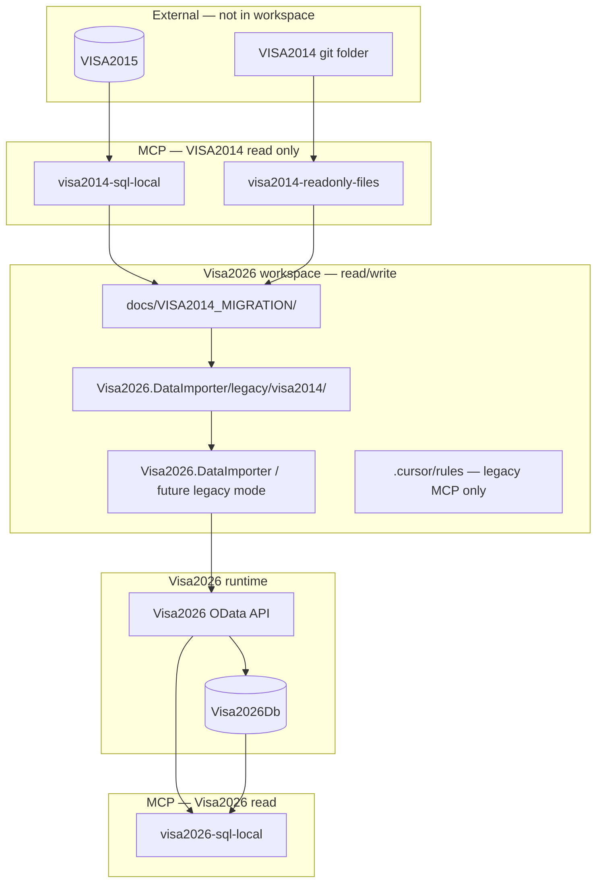
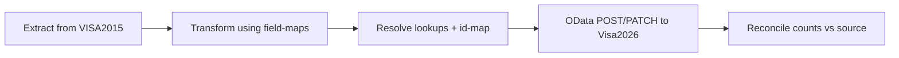
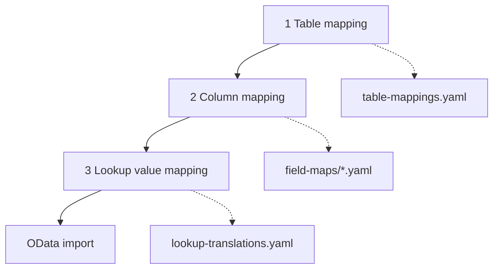
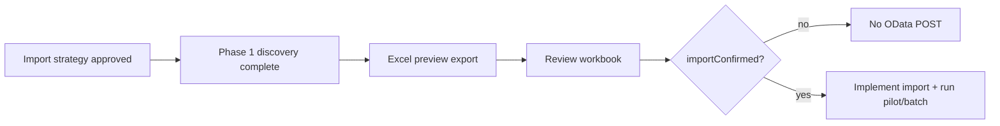

# VISA2014 → Visa2026 production data migration

Plan for importing production data from the legacy **VISA2014** application into **Visa2026**. The legacy system has its own git repository and SQL Server database; schemas differ, so migration requires explicit mapping and a controlled import protocol.

**Status:** Phase 1 in progress — see **[STATUS.md](VISA2014_MIGRATION/STATUS.md)** (dashboard) and **[migration-status.yaml](VISA2014_MIGRATION/migration-status.yaml)** (machine-readable tracker).

**Agent skill:** [`.cursor/skills/visa2014-to-visa2026-import/SKILL.md`](../.cursor/skills/visa2014-to-visa2026-import/SKILL.md)

---

## Goals

- Import **production data** from VISA2014 into Visa2026 safely and repeatably.
- Keep **Visa2026 as the only workspace** for day-to-day AI and developer work — legacy content is accessed via **MCP read-only** channels to avoid repo confusion.
- **Write target data only through Visa2026 OData** (same path as `Visa2026.DataImporter`), not direct SQL inserts into Visa2026.
- Maintain **version-controlled mapping artifacts** in this repo (tables, columns, lookup values) so import logic is reviewable and rerunnable.
- **Document and confirm each Business Object** in mapping artifacts **before** any import code or OData load runs for that entity.
- Preserve an **ID remapping trail** (old GUID → new OData `ID`) for entities loaded in dependency order.

---

## Non-goals (for clarity)

| Topic | Note |
|-------|------|
| **`ApplicationMigrationSlaProfile`** | Visa2026 tenant lookup for **workflow SLA** — unrelated to VISA2014 data import. |
| **Editing VISA2014** | Legacy repo is read-only; **`VISA2015`** is read-only SQL — no writes to either. |
| **VISA2014 repo as schema authority** | **`VISA2015`** is source of truth; repo is supplementary context only. |
| **Cloning VISA2014 into Visa2026 git** | Keep repositories sibling folders under `Documents\GitHub`. |

---

## Environment layout

**Naming:** legacy **git repo / app** = **VISA2014**; legacy **SQL database** = **`VISA2015`** (as in SSMS).

### Source of truth (legacy side)

| Priority | Source | MCP | Authoritative for |
|----------|--------|-----|-------------------|
| **1 — primary** | **`VISA2015` database** | `visa2014-sql-local` | Tables, columns, types, PK/FK, row counts, **actual stored values**, DISTINCT lookup values in production |
| **2 — supplementary** | **VISA2014 repo** | `visa2014-readonly-files` | BO class names, EF/XPO hints, property labels, business-logic context — **not** ground truth when repo ≠ DB |

**Conflict rule:** if the VISA2014 codebase disagrees with **`VISA2015`** (table name, column, type, value), **trust the database**. Record the mismatch in the dossier `mapping.notes` and map from SQL.

**Discovery order:** start from **`visa2014-sql-local`** (find tables, schema, samples), then use **`visa2014-readonly-files`** only to explain or cross-check — never to override SQL evidence.

| Layer | Visa2026 (target) | VISA2014 legacy |
|-------|-------------------|-----------------|
| Git folder | `C:\Users\webap\Documents\GitHub\Visa2026` | `C:\Users\webap\Documents\GitHub\VISA2014` |
| SQL Server (local dev) | `localhost\SQLEXPRESS` | same instance |
| SQL database | `Visa2026DbDev` / `Visa2026DbProd` | **`VISA2015`** |
| MCP — SQL | `visa2026-sql-local` → `Visa2026DbDev` | `visa2014-sql-local` → `VISA2015` |
| MCP — files | — | `visa2014-readonly-files` → VISA2014 repo (**supplementary** — see source-of-truth table above) |
| Import write path | Visa2026 OData | **None** (read-only) |

**Docker dev stack:** if legacy DB is restored via Docker instead of Express, set `SERVER_NAME` / `DATABASE_NAME` in `.cursor/mcp.json` accordingly (see [reference.md](../.cursor/skills/visa2014-to-visa2026-import/reference.md)).

**Cursor workspace:** open **Visa2026 only**. Do not add VISA2014 as a workspace root or multi-root folder for migration work.

---

## Access strategy: MCP “air gap”

Legacy content is reached only through named MCP servers so agents do not grep or edit the wrong repository.



### MCP preflight (every migration session)

1. Confirm Cursor workspace root is **Visa2026**, not VISA2014.
2. **`visa2014-sql-local`** → `VISA2015` (legacy). **`visa2026-sql-local`** → Visa2026 DB (target validation).
3. Never POST/PATCH to VISA2014 OData or write to `VISA2015` during import.
4. **One BO at a time** — only one discovery dossier `in_progress`.
5. Prefer checked-in artifacts: **`legacy/visa2014/order.yaml`** (dependency order), `discovery/{Entity}.yaml`, `entity-inventory.yaml`.

### Planned MCP configuration (`.cursor/mcp.json`)

Local **SQL Express** (both `VISA2015` and `Visa2026DbDev` on `localhost\SQLEXPRESS`):

```json
"visa2014-sql-local": {
  "env": {
    "SERVER_NAME": "localhost\\SQLEXPRESS",
    "DATABASE_NAME": "VISA2015",
    "SQL_AUTH_MODE": "sql",
    "SQL_USERNAME": "sa",
    "SQL_PASSWORD": "${env:SA_PASSWORD}",
    "TRUST_SERVER_CERTIFICATE": "true"
  }
},
"visa2026-sql-local": {
  "env": {
    "SERVER_NAME": "localhost\\SQLEXPRESS",
    "DATABASE_NAME": "Visa2026DbDev",
    ...
  }
}
```

**Docker dev SQL** (port 1433): use `"SERVER_NAME": "127.0.0.1"` instead. Reload MCP after edits.

**Filesystem MCP note:** the official filesystem server can write within allowed paths. Treat VISA2014 as read-only in process (OS read-only flag, read-only clone, or skill/rule: never write via `visa2014-readonly-files`).

### Restore legacy database (optional)

Skip if **`VISA2015`** already exists on `localhost\SQLEXPRESS`. For **Docker dev SQL**:

```powershell
.\migration-scripts\Restore-BackupToLocalSql.ps1 `
  -BackupFile .\visa2015-prod.bak `
  -DatabaseName VISA2015
```

- Treat `.bak` files as **sensitive** — do not commit (`*.bak` is gitignored).

Optional Windows user env: **`VISA2014_REPO_PATH`** = `C:\Users\webap\Documents\GitHub\VISA2014` for scripts and skill references.

---

## Import architecture

**Source:** **`VISA2015`** SQL via `visa2014-sql-local` (authoritative). VISA2014 repo via `visa2014-readonly-files` is **additional context only**.  
**Transform:** mapping YAML + code in `Visa2026.DataImporter` (or a dedicated legacy import mode).  
**Load:** Visa2026 **OData** POST/PATCH via existing `ApiClient` / upsert patterns.



### Reuse from Visa2026.DataImporter

| Existing piece | Role in migration |
|----------------|-------------------|
| `ApiClient` | JWT + OData CRUD against Visa2026 |
| `BaseImporter` / entity importers | Patterns for bulk POST, lookup cache |
| `Excelmappings.cs` | Upsert keys, column kinds, entity order reference |
| `ODataBatch` | Batch creates where applicable |
| Visibility preflight | Target `ApplicationType.Show*` must match Module catalog before transactional import |

**OData exposure:** if a Visa2026 BO is missing from the EDM model, add it in `Visa2026.Blazor.Server/WebApi/WebApiServiceExtensions.cs` before import (see [visa2026-dataimporter skill](../.cursor/skills/visa2026-dataimporter/SKILL.md)).

### Planned repository layout

```
docs/VISA2014_MIGRATION/
  discovery/
    README.md                 # per-BO discovery rules
    _template.yaml
    Person.yaml               # one dossier per target OData entity
    ...
  entity-inventory.yaml       # summary index (synced from dossiers)
  schema-snapshot.md            # bootstrap only — global table index
  lookup-translations.yaml    # layer 3 — lookup value semantic map
  table-mappings.yaml           # layer 1 — legacy table → OData entity
  property-gap-registry.yaml  # cross-BO gap + dedupe index
  discovery-queue.yaml          # pointer only — order lives in order.yaml

Visa2026.DataImporter/legacy/visa2014/
  order.yaml                  # CANONICAL dependency order — discovery + import
  field-maps/                 # per BO — propertyGaps, defaults, deduplication
  samples/
  id-map/
```

---

## Mapping protocol

Migration mapping has **three layers**. All three must be documented during discovery — import must not rely on coincidental name matches between VISA2014 and Visa2026.



| Layer | Artifact | Maps |
|-------|----------|------|
| **1 — Tables** | [`table-mappings.yaml`](VISA2014_MIGRATION/table-mappings.yaml) | Legacy SQL table(s) + BO → Visa2026 OData entity |
| **2 — Columns** | [`field-maps/{Entity}.yaml`](../Visa2026.DataImporter/legacy/visa2014/field-maps/) | Legacy column → target property, transform, defaults |
| **3 — Lookup values** | [`lookup-translations.yaml`](VISA2014_MIGRATION/lookup-translations.yaml) | Legacy lookup **value** → Visa2026 catalog **value** (same meaning, different representation) |

Cross-index: [`entity-inventory.yaml`](VISA2014_MIGRATION/entity-inventory.yaml) · [`property-gap-registry.yaml`](VISA2014_MIGRATION/property-gap-registry.yaml)

---

### Layer 1 — Table mapping (`table-mappings.yaml`)

One entry per legacy → target entity pairing (or explicit `skip`).

| Field | Meaning |
|-------|---------|
| `legacy.schema` / `legacy.table` | VISA2014 SQL table |
| `legacy.boClass` | VISA2014 persistent class |
| `target.odataEntity` | Visa2026 OData entity set |
| `relationship` | `one_to_one` · `merge` · `split` · `many_to_one` |
| `legacyTablesExtra` | Additional source tables when `merge` |
| `fieldMap` | Path to layer-2 field map |

Example:

```yaml
- id: person-employee
  legacy:
    schema: dbo
    table: Employee
    boClass: Employee
  target:
    odataEntity: Person
  relationship: merge
  legacyTablesExtra:
    - schema: dbo
      table: FamilyMember
  fieldMap: Visa2026.DataImporter/legacy/visa2014/field-maps/Person.yaml
  status: mapped
```

Register in discovery when `legacy.tables[]` is confirmed; sync `entity-inventory.yaml` `legacyTable`.

---

### Layer 2 — Column mapping (`field-maps/*.yaml`)

Maps **legacy columns** to **Visa2026 properties** on the target BO from layer 1.

| Field | Meaning |
|-------|---------|
| `source.table` / `source.schema` | Primary legacy table (must match table-mappings) |
| `fields[].source` | Legacy **column** name |
| `fields[].target` | Visa2026 **property** name |
| `fields[].transform` | How values convert (`identity`, `lookup`, `date`, …) |
| `fields[].lookupCatalog` | When `transform: lookup` — key in `lookup-translations.yaml` |
| `fields[].lookupMatch` | Target catalog property after translation (`Name`, `Code`) |

Example:

```yaml
source:
  table: Employee
  schema: dbo
target:
  odataEntity: Person
fields:
  - source: PassportNumber          # legacy column
    target: PassportNumber          # Visa2026 property
    upsertKey: true
  - source: DeptName                # legacy column (string — not Visa2026 Name)
    target: Department
    transform: lookup
    lookupCatalog: Department       # → lookup-translations.yaml catalog id
    lookupMatch: Name
  - source: AppTypeCode
    target: ApplicationType
    transform: lookup
    lookupCatalog: ApplicationType
    lookupMatch: Name
```

Every mapped column appears in `fields[]`. Unmapped legacy columns → `propertyGaps.legacyOnly`. Unmapped target properties → `propertyGaps.targetOnly`.

---

### Layer 3 — Lookup value mapping (`lookup-translations.yaml`)

Lookups are **catalogs** (Country, Department, ApplicationType, …). The **same real-world meaning** often has **different stored values** in VISA2014 vs Visa2026 (label, code, GUID, Turkmen vs English, renamed ministry types).

**Do not assume** `legacy "Invitation"` equals target `"Invitation"` — map explicitly:

```yaml
catalogs:
  - targetCatalog: ApplicationType
    targetMatchProperty: Name
    legacy:
      storage: inline_on_bo
      table: dbo.Application
      column: ApplicationTypeName
      valueKind: string
    values:
      - legacy: "Invitation"
        target: "App_Inv"
      - legacy: "Приглашение"
        target: "App_Inv"
      - legacy: "INVWP"
        target: "App_Inv_And_WP"
    unmappedPolicy: block_row

  - targetCatalog: Department
    targetMatchProperty: Name
    legacy:
      storage: fk_guid
      table: dbo.Employee
      column: DepartmentId
      valueKind: guid
      sampleQuery: |
        SELECT d.Oid, d.Title, COUNT(*) FROM dbo.Employee e
        JOIN dbo.Department d ON e.DepartmentId = d.Oid
        GROUP BY d.Oid, d.Title
    values:
      - legacy: "HR Dept"
        target: "Human Resources"
      - legacy: "Кадры"
        target: "Human Resources"
    unmappedPolicy: quarantine
```

| `legacy.storage` | When |
|--------------------|------|
| `inline_on_bo` | String/code column on transactional table |
| `legacy_lookup_table` | Separate legacy lookup table; sample via SQL |
| `fk_guid` | Legacy FK to lookup row — map via sampled display column or legacy id |

| `unmappedPolicy` | Import behavior when legacy value has no row in `values` |
|------------------|----------------------------------------------------------|
| `block_row` | Do not import row; log |
| `skip_row` | Same as block for required lookups |
| `quarantine` | Manual review queue |
| `use_default` | Use `unmappedDefault` (document carefully) |

**Discovery:** for each `fields[].lookupCatalog`, run `sampleQuery` / DISTINCT on legacy, add **every** distinct value to `values[]`. Target side must exist in Visa2026 ([`LOOKUP_SEEDING.md`](LOOKUP_SEEDING.md)).

**ApplicationType** targets must match [`ApplicationTypeConfigurationCatalog.json`](../Visa2026.Module/DatabaseUpdate/LookupCatalogs/ApplicationTypeConfigurationCatalog.json) `Name` keys (e.g. `App_Inv`, not display title).

Field maps reference catalogs by name:

```yaml
fields:
  - source: OldCountryCode
    target: Country
    transform: lookup
    lookupCatalog: Country
    lookupMatch: Code
```

---

### Entity inventory (`entity-inventory.yaml`)

Each row summarizes one BO after its **discovery dossier** is closed. Do not add rows ahead of dossier work except as queue placeholders.

| Field | Meaning |
|-------|---------|
| `targetODataEntity` | Visa2026 OData entity set name |
| `discoveryDossier` | Relative path under `docs/VISA2014_MIGRATION/` |
| `discoveryStatus` | `not_started` · `in_progress` · `complete` · `blocked` · `skip` |
| `importConfirmed` | `false` until human sign-off; **`true` required before import code or OData load** |
| `importConfirmedAt` / `importConfirmedBy` | Audit trail (dossier + `order.yaml`) |
| `legacyTable` | Primary SQL table in VISA2015 (from dossier) |
| `legacyBo` | VISA2014 persistent class name |
| `importStatus` | After confirmation: `pending` · `pilot` · `imported` · `blocked` · `skip` |
| `blockReason` | Why skipped or blocked (see [`DEPRECATED.md`](DEPRECATED.md)) |
| `tableMappingId` | Id from `table-mappings.yaml` |

**Transform kinds:** `identity` · `lookup` · `enum` · `date` · `bool` · `split` · `concat` · `constant` · `custom` — see **Layer 2** and [`field-maps/_template.yaml`](../Visa2026.DataImporter/legacy/visa2014/field-maps/_template.yaml).

Per-field keys for **missing values**, **mismatches**, and **dedupe** — see **§ Data quality, gaps, and deduplication** below.

### ID remapping

- Do **not** reuse VISA2014 GUIDs as Visa2026 primary keys unless explicitly verified safe.
- During import, write `legacy/visa2014/id-map/{Entity}-{oldGuid}.json` → `{ "newId": "..." }`.
- Later entities resolve FKs through **id-map**, not legacy IDs.
- Prefer **natural-key upsert** (`PassportNumber`, `VisaNumber`, …) where OData upsert keys already exist in `Excelmappings.cs`.

### Import order and discovery order (same file)

**[`Visa2026.DataImporter/legacy/visa2014/order.yaml`](../Visa2026.DataImporter/legacy/visa2014/order.yaml)** is the single source of truth for:

1. **Discovery** — walk `entities[]` top-to-bottom; each entry's `dependsOn` must be satisfied before starting its dossier.
2. **OData import** — load entities in the same sequence (grouped by `importPhase` for batch runs).

Rules when editing `order.yaml`:

- **Array order = dependency order** — parents appear before children (topological sort).
- Insert new BOs at the correct position, not arbitrarily at the end.
- One BO per row: `targetODataEntity`, `dependsOn`, `discoveryDossier`, `discoveryStatus`, `importConfirmed`, `importPhase`.
- **`importConfirmed: true`** required before import implementation or OData load for that row (see § Import confirmation gate).

Typical sequence (extend as dossiers are added):

1. Lookups — seeded in Visa2026 by Module updaters; translate in `lookup-translations.yaml` when a transactional BO needs them  
2. **Person** and person-scoped children (`dependsOn: [Person]`)  
3. **Application** (`dependsOn: [Person]`) → **ApplicationItem** (`dependsOn: [Person, Application]`)  
4. Visas, invitations, work permits (`dependsOn: [Application]` or `[ApplicationItem]`)  
5. **ApplicationProgress** / history  
6. **Attachments** last  

---

## Data quality, gaps, and deduplication

Discovery and import must handle **incomplete**, **misaligned**, and **duplicate** legacy data explicitly — not silently on import.

### Bidirectional property gaps

Record gaps in each **`field-maps/{Entity}.yaml`** (`propertyGaps`) and summarize in [`property-gap-registry.yaml`](VISA2014_MIGRATION/property-gap-registry.yaml).

| Direction | Meaning | Typical action |
|-----------|---------|----------------|
| **Legacy-only** | VISA2014 column/BO data with **no** Visa2026 property | `drop` (default), `archive_in_notes`, or `map_to_target` if a home exists |
| **Target-only** | Visa2026 property **required or desired**; legacy has no column | **`default`** + `missingBehavior` on import |
| **Mismatch** | Both sides have a field but **type, split, or semantics** differ | `transform` + entry under `propertyGaps.mismatches` |

**Discovery step (per BO):** compare Visa2026 BO properties (`BusinessObjects/{Entity}.cs`) to legacy columns in the dossier. List every unmatched column/property in `propertyGaps` before marking the dossier `complete`.

### Missing values and defaults

When legacy is NULL/empty or a **target-only** property has no source:

| `missingBehavior` | Effect on import |
|-------------------|------------------|
| `use_default` | Apply `default` / `defaultValue` from field-map or `propertyGaps.targetOnly` |
| `allow_null` | POST null when OData/validation allows |
| `skip_row` | Do not import this legacy row; log count |
| `block_import` | Fail pilot/batch for this entity until mapping fixed |
| `block_entity` | Entire BO blocked in `order.yaml` until resolved |

**Default kinds:** `constant` (fixed value) · `null` · `derive` (document formula in `notes`) · `lookup_default` (fallback catalog row — avoid inventing ministry data).

Example (target-only):

```yaml
propertyGaps:
  targetOnly:
    - targetProperty: Gender
      required: true
      default: lookup_default
      defaultValue: "Unknown"          # must exist in Visa2026 Gender catalog or add translation first
      missingBehavior: use_default
      notes: "Legacy had no gender column before 2018"
```

Example (legacy null on mapped field):

```yaml
fields:
  - source: BirthDate
    target: BirthDate
    transform: date
    missingBehavior: allow_null        # or skip_row if Visa2026 validation requires it
    default: null
    defaultValue: null
```

### Property mismatches

Document semantic differences under `propertyGaps.mismatches` or on the `fields[]` row (`mismatchNotes`, non-identity `transform`):

- Legacy **one column** → Visa2026 **two properties** (`split`, `concat` reverse)
- Legacy **code** → Visa2026 **lookup** (`lookup` + `lookup-translations.yaml`)
- Legacy **enum int** → Visa2026 **bool** or different enum
- Legacy **string date** → OData **date** (`date` transform + format note)

Resolve in discovery; import code should not guess.

### Duplicate consolidation (legacy DB)

Legacy production data may contain **duplicate business keys** (same passport, visa number, application number, etc.). **Do not import duplicates** into Visa2026.

Define per entity in **`field-maps/{Entity}.yaml`** → `deduplication`:

| Field | Purpose |
|-------|---------|
| `keys` | Legacy column(s) defining identity (usually same as `upsertKey`) |
| `canonicalRule` | Which duplicate row wins: `most_complete` (max non-null cols), `most_recent` (max tie-break date), `lowest_gc_record`, `min_legacy_id` |
| `mergeBeforeImport` | `coalesce_non_null` — fill canonical row from siblings before import |
| `action` | `import_one` (default) · `skip_all_duplicates` · `quarantine` (log for manual review) |

**Discovery:** run duplicate probe SQL ([reference.md](../.cursor/skills/visa2014-to-visa2026-import/reference.md) § Duplicate detection) and record duplicate group counts in the dossier `mapping.notes`.

**Import:** extract step collapses to **one canonical legacy row per `keys` group**; all legacy IDs in the group map to the **same** new OData `ID` in `id-map/` so downstream FKs resolve without creating duplicate persons/applications.

```yaml
deduplication:
  enabled: true
  keys: [PassportNumber]
  canonicalRule: most_complete
  tieBreakColumn: ModifiedOn
  mergeBeforeImport: coalesce_non_null
  action: import_one
```

### Reconciliation checks (post-import)

| Check | Pass criteria |
|-------|----------------|
| Legacy duplicate groups | Imported OData count ≤ distinct legacy key groups |
| Skipped rows | `skip_row` count logged and explained |
| Target-only defaults | Spot-check defaulted fields; no silent ministry/legal placeholders |
| Legacy-only dropped | Documented in `propertyGaps.legacyOnly` with `disposition: drop` |
| Property gaps index | [`property-gap-registry.yaml`](VISA2014_MIGRATION/property-gap-registry.yaml) updated per BO |
| Lookup value coverage | Every legacy distinct value in sampled catalogs has `values[]` entry or `unmappedPolicy` |
| Table/column registry | [`table-mappings.yaml`](VISA2014_MIGRATION/table-mappings.yaml) matches field-maps `source.table` |

---

## Phased delivery

| Phase | Goal | Primary outputs |
|-------|------|-----------------|
| **0 — Access** | Local `VISA2015`, MCP servers, restore script verified | MCP preflight passes |
| **0b — Import strategy** | Plan waves, environments, cutover **before code** | [IMPORT_PLAN_AND_STRATEGY.md](VISA2014_MIGRATION/IMPORT_PLAN_AND_STRATEGY.md), `import-strategy.yaml` `approved` |
| **1 — Discovery** | **Atomic per-BO** in dependency order + **3-layer mapping** | `order.yaml`, `table-mappings.yaml`, `field-maps/`, `lookup-translations.yaml`, dossiers `complete` |
| **1b — Excel preview** | Consolidated legacy → **Excel** for human review | `preview-export/*.xlsx` per BO ([EXCEL_PREVIEW_EXPORT.md](VISA2014_MIGRATION/EXCEL_PREVIEW_EXPORT.md)) — **scalar + file stubs only** |
| **1c — Confirm** | **Human sign-off** per BO after Excel review | `importConfirmed: true` on dossier + `order.yaml` |
| **2 — Lookup value audit** | Every legacy distinct value has `legacy → target` row | `lookup-translations.yaml` complete per catalog |
| **3 — Pilot** | One **confirmed** entity end-to-end (candidate: **Person**) | Importer code (after strategy approved) + OData import + reconciliation |
| **4 — Core transactional** | Applications, items, visas, permits | Ordered import runs, id-map populated |
| **5 — Attachments** | Binary files linked to BOs | File copy + OData file property updates ([FILE_AND_IMAGE_IMPORT.md](VISA2014_MIGRATION/FILE_AND_IMAGE_IMPORT.md)) |
| **6 — Validation & cutover** | UAT, reconciliation, prod runbook | Checklist signed off |

**First import target:** empty or disposable **`Visa2026DbDev`** — never first-run against production Visa2026.

---

## Import confirmation gate (document before implement)

Each Visa2026 Business Object must be **fully documented** and **explicitly confirmed** before **any import implementation or OData load** for that entity.

**Global gate (before any import code):** [IMPORT_PLAN_AND_STRATEGY.md](VISA2014_MIGRATION/IMPORT_PLAN_AND_STRATEGY.md) must be **`approved`** in [`import-strategy.yaml`](../Visa2026.DataImporter/legacy/visa2014/import-strategy.yaml). Discovery and mapping may proceed while strategy is `draft`.

This separates **discovery** (agent/human fills mapping YAML) from **authorization to import** (human confirms the dossier is correct).



**Full gate order:** strategy `approved` → discovery `complete` → **Excel preview** → `importConfirmed: true` → implement/run. See [EXCEL_PREVIEW_EXPORT.md](VISA2014_MIGRATION/EXCEL_PREVIEW_EXPORT.md).

### What must be documented (before confirmation)

For each BO in [`order.yaml`](../Visa2026.DataImporter/legacy/visa2014/order.yaml), all of the following checked in and consistent:

| Artifact | Required content |
|----------|------------------|
| `discovery/{Entity}.yaml` | `discoveryStatus: complete` (or `skip` / `blocked` with reason); checklist flags true |
| `table-mappings.yaml` | Layer 1 row for legacy table(s) |
| `field-maps/{Entity}.yaml` | Layer 2 columns, `propertyGaps`, `deduplication`, upsert keys |
| `lookup-translations.yaml` | Layer 3 for every `lookupCatalog` referenced by the field-map |
| `entity-inventory.yaml` | Row synced |
| `property-gap-registry.yaml` | Gap/dedupe summary updated |

**Agents:** may complete Phase 1 documentation. **Must not** write `--import-visa2014` handler code or POST OData for an entity until **`importConfirmed: true`**.

### Confirmation fields

On each dossier and matching `order.yaml` entity row:

| Field | Values | Meaning |
|-------|--------|---------|
| `importConfirmed` | `false` (default) · `true` | Human authorized import implementation + runs |
| `importConfirmedAt` | ISO date or null | When sign-off recorded |
| `importConfirmedBy` | string or null | Reviewer (name or `session: …`) |

Set **`importConfirmed: true`** only after reviewing:

- [ ] **Excel preview** — [`--export-visa2014-preview`](VISA2014_MIGRATION/EXCEL_PREVIEW_EXPORT.md); main sheet = import-ready target values; `_Skipped` / `_UnmappedLookups` acceptable
- [ ] Legacy table/columns match **`VISA2015`** (not repo guesses)
- [ ] Every mapped column has transform or documented gap
- [ ] Lookup translations cover sampled DISTINCT values (or `unmappedPolicy` accepted)
- [ ] Dedupe keys and canonical rule agreed
- [ ] Target-only defaults acceptable for ministry/legal fields
- [ ] `dependsOn` entities are `importConfirmed: true` or `skip` / `blocked`

For `discoveryStatus: skip` or `blocked`, leave `importConfirmed: false` unless explicitly waiving downstream (document in `mapping.notes`).

### What confirmation unlocks

Only when **`importConfirmed: true`** for an entity (and satisfied `dependsOn`):

1. **Implement** extract/transform/load in `Visa2026.DataImporter` (or legacy import mode) for that BO.
2. **Run** pilot or batch OData import into Visa2026.
3. Set `importStatus: pilot` | `imported` after successful reconciliation.

Until then: discovery, SQL probes, and YAML edits only — **no target writes**.

---

## Discovery (Phase 1) — atomic per BO, dependency order

Discovery is **not** a bulk table scan. Each **Visa2026 target Business Object** is one **atomic unit**. The **sequence** matches OData import: follow [`order.yaml`](../Visa2026.DataImporter/legacy/visa2014/order.yaml) `entities[]` top-to-bottom and honor each row's `dependsOn`.

```mermaid
flowchart TD
  O[order.yaml entities in dependency order] --> B[Bootstrap once: global table index]
  B --> P[Pick first eligible BO]
  P --> D{dependsOn satisfied?}
  D -->|no| Wait[Discover dependency BO first]
  Wait --> P
  D -->|yes| Work[Open discovery/Entity.yaml]
  Work --> T1[Review Visa2026 BO]
  Work --> T2[SQL schema + FKs — VISA2015]
  Work --> T3[Cross-check VISA2014 repo hints]
  Work --> T4[Table + column + lookup maps]
  Work --> T5[Sync inventory + order.yaml status]
  T5 --> Done{complete | blocked | skip}
  Done --> P
```

### Bootstrap (once per database restore)

Run **once** before the per-BO queue — materialize in [`schema-snapshot.md`](VISA2014_MIGRATION/schema-snapshot.md) only:

- [ ] Confirm MCP → `VISA2015` (`SELECT DB_NAME()`)
- [ ] Global table list + approximate row counts
- [ ] Identify XAF / security / audit tables to **`skip`** in dossiers
- [ ] Mark bootstrap `complete` in `order.yaml` → `bootstrapOnce` (and `discovery-queue.yaml` pointer if used)

Do **not** put per-BO column/FK detail in `schema-snapshot.md` — that belongs in each dossier.

### Per-BO atomic checklist

For each BO, copy [`discovery/_template.yaml`](VISA2014_MIGRATION/discovery/_template.yaml) if missing, then complete **all** steps in one session:

| Step | Action | MCP / source | Output |
|------|--------|--------------|--------|
| 1 | **Target BO** — properties, required fields, child collections | Visa2026 `BusinessObjects/*.cs`, `*.md` | `visa2026.boPath`, checklist `target_bo_reviewed` |
| 2 | **Legacy schema (authoritative)** — tables, columns, types, PK, FKs, row count | **`visa2014-sql-local`** → **`VISA2015`** | `legacy.tables[]`, dossier `legacy.*` |
| 3 | **Legacy BO hints (optional)** — class name, source file; reconcile with step 2 | `visa2014-readonly-files` | `legacy.boClass`, `legacy.boPath`; note repo/DB mismatches |
| 4 | **Table mapping** — legacy table(s) → target OData entity | `table-mappings.yaml` |
| 5 | **Column mapping** — every legacy column ↔ target property | `field-maps/{Entity}.yaml` → `fields[]` |
| 6 | **Lookup value mapping** — sample DISTINCT legacy values | `lookup-translations.yaml` → `catalogs[].values` |
| 7 | **Property gaps** — unmatched columns/properties | `propertyGaps` |
| 8 | **Dedupe rules** | `deduplication` + SQL probe |
| 9 | **Defaults / mismatches** | `missingBehavior`, transforms |
| 10 | **Inventory sync** | `entity-inventory.yaml`, `property-gap-registry.yaml` |
| 11 | **Close dossier** | `order.yaml` + dossier status |

**Rule:** do not set dossier `complete` until **table**, **column**, and **lookup value** mappings are documented (or explicitly `skip`/`blocked`), and checklist flags are `true`.

**After `complete`:** leave **`importConfirmed: false`** until a human reviews and signs off (Phase **1b**). Discovery alone does **not** authorize import.

### Discovery status values

| Status | Meaning |
|--------|---------|
| `not_started` | Queued; no work yet |
| `in_progress` | Current atomic session — only one BO at a time |
| `complete` | Dossier + field-map + inventory synced |
| `blocked` | Cannot map yet — reason recorded |
| `skip` | No import (system table, deprecated, no Visa2026 home) |

### Pick next BO (dependency order)

1. Open [`order.yaml`](../Visa2026.DataImporter/legacy/visa2014/order.yaml).
2. Walk **`entities`** in array order (already dependency-sorted).
3. Pick the **first** row where `discoveryStatus` ∉ `complete`, `blocked`, `skip` **and** every `dependsOn` entity is `complete`, `blocked`, or `skip`.
4. Do **not** skip ahead to a later BO because it is easier — downstream FK mapping requires upstream dossiers first.
5. When adding a new BO, **insert** it at the correct dependency position and add `discovery/{Entity}.yaml` from [`_template.yaml`](VISA2014_MIGRATION/discovery/_template.yaml).

If a dependency is `blocked`, leave downstream rows `not_started` unless the dependency dossier documents an explicit waiver.

### Entity inventory (`entity-inventory.yaml`)

Summary index — **updated when each dossier closes**, not ahead of it:

| Field | Meaning |
|-------|---------|
| `targetODataEntity` | Visa2026 OData entity set name |
| `discoveryDossier` | Path to `discovery/{Entity}.yaml` |
| `discoveryStatus` | Mirrors dossier status |
| `importConfirmed` | Mirrors dossier — **`true` before import code or OData load** |
| `legacyTable` | Primary legacy SQL table (from dossier) |
| `legacyBo` | VISA2014 BO class name |
| `importStatus` | After confirmation: `pending` · `pilot` · `imported` · `blocked` · `skip` |
| `blockReason` | Why blocked/skipped |

---

## Discovery checklist (deprecated — use per-BO dossiers)

The bulk checklist below is replaced by **§ Discovery (Phase 1) — atomic per Business Object** and [`discovery/README.md`](VISA2014_MIGRATION/discovery/README.md).

<details>
<summary>Legacy bulk checklist (reference only)</summary>

Use **`visa2014-sql-local`** for global bootstrap only:

- [ ] List tables / row counts → `schema-snapshot.md`
- [ ] Identify system tables to skip

Per BO — use dossier checklist instead of this list.

</details>

---

## Validation and reconciliation

After each import batch:

| Check | How |
|-------|-----|
| Row counts | Source SQL count vs Visa2026 OData `$count` or SQL MCP on target |
| Spot records | Compare key fields for N random legacy IDs via id-map |
| Lookup integrity | No unresolved `lookup` transforms in import log |
| OData errors | Log 400 responses; fix mapping or Web API exposure |
| Files | Attachment count and file size checksums where applicable |

---

## Safety and secrets

- VISA2014 production data is **PII-sensitive** — same handling as droplet DB mirrors.
- Do not commit: `.bak` files, `id-map/` with prod GUIDs, unredacted `samples/`.
- Legacy MCP and DB: **read-only** by policy.
- Target writes: **OData only** under a service account with appropriate Visa2026 role (not raw `sa` on Visa2026 unless strictly local dev).

---

## Import best practices (OData load)

Phase 3+ must follow the same patterns as [Visa2026.DataImporter](../Visa2026.DataImporter/IMPORTING.md) and [visa2026-dataimporter skill](../.cursor/skills/visa2026-dataimporter/SKILL.md):

- **Pre-flight:** Blazor running, lookups seeded, server ready, OData BOs exposed, layer 3 complete.
- **ETL:** SQL extract → dedupe → transform → id-map FK resolve → **upsert** (natural keys, not legacy GUIDs).
- **Idempotency:** GET by upsert key → PATCH or POST; safe re-runs.
- **Pilot → reconcile → expand** on disposable DB before production.
- **Logging:** success / failed / skipped / dedupeMerged — no silent drops.

**Full guide:** [`.cursor/skills/visa2014-to-visa2026-import/import-practices.md`](../.cursor/skills/visa2014-to-visa2026-import/import-practices.md)

---

## Implementation options (code)

| Option | When |
|--------|------|
| **A — Extend `Visa2026.DataImporter`** with `--import-visa2014` reading `legacy/visa2014/` | **Recommended first** — reuses `ApiClient`, one tool chain |
| **B — New `Visa2026.LegacyImport` console** | If extract/transform grows large (streaming SQL, file copies) |

Mapping stays in **YAML**; code implements extract/transform/load only.

**Per-entity rule:** add importer support for a BO **only after** `import-strategy.yaml` is **`approved`**, dossier is `discoveryStatus: complete`, and **`importConfirmed: true`** (see § Import confirmation gate).

**Import plan:** [IMPORT_PLAN_AND_STRATEGY.md](VISA2014_MIGRATION/IMPORT_PLAN_AND_STRATEGY.md) — approve before § Implementation options work begins.

---

## Related skills and docs

| Resource | Use |
|----------|-----|
| [EXCEL_PREVIEW_EXPORT.md](VISA2014_MIGRATION/EXCEL_PREVIEW_EXPORT.md) | **Consolidated legacy → Excel** before import (scalar only; binary stubs) |
| [FILE_AND_IMAGE_IMPORT.md](VISA2014_MIGRATION/FILE_AND_IMAGE_IMPORT.md) | **Binary files / images** — separate wave from Excel preview |
| [IMPORT_PLAN_AND_STRATEGY.md](VISA2014_MIGRATION/IMPORT_PLAN_AND_STRATEGY.md) | **Import plan — approve before implementation** |
| [visa2014-to-visa2026-import](../.cursor/skills/visa2014-to-visa2026-import/SKILL.md) | MCP preflight, discovery, mapping, pilot import; [MATURITY.md](../.cursor/skills/visa2014-to-visa2026-import/MATURITY.md) experience loop |
| [import-practices.md](../.cursor/skills/visa2014-to-visa2026-import/import-practices.md) | **OData ETL, upsert, reconciliation, cutover** (Phase 3+) |
| [visa2026-dataimporter](../.cursor/skills/visa2026-dataimporter/SKILL.md) | Target OData import, seed scenarios, Web API exposure fixes |
| [visa2026-lookup-data](../.cursor/skills/visa2026-lookup-data/SKILL.md) | ApplicationType and catalog alignment |
| [LOOKUP_SEEDING.md](LOOKUP_SEEDING.md) | Target lookups must exist before transactional import |
| [DEPRECATED.md](DEPRECATED.md) | Legacy BOs/properties with no Visa2026 home |
| [IMPORTING.md](../Visa2026.DataImporter/IMPORTING.md) | OData importer phases and upsert behavior |
| [mirror-droplet-db-to-local](../.cursor/skills/mirror-droplet-db-to-local/SKILL.md) | Pattern for local `.bak` restore (Visa2026 prod); same scripts for VISA2015 |

---

## Next steps

**Live tracker:** [STATUS.md](VISA2014_MIGRATION/STATUS.md) · [migration-status.yaml](VISA2014_MIGRATION/migration-status.yaml) — workstreams, entities, lookup audit, open issues.

High-level backlog (detail in tracker):

1. [x] Approve import strategy (`import-strategy.yaml` → `approved`, 2026-06-21)
2. [ ] Implement `--export-visa2014-preview` (Person pilot)
3. [ ] **Confirm Person** — Excel review + mapping sign-off; set `importConfirmed: true`
4. [ ] **Application** discovery (next in `order.yaml`)
5. [ ] Add Passport to `order.yaml`; pilot Person on `Visa2026DbDev` (after 2–3)

---

## Revision log

| Date | Change |
|------|--------|
| 2026-06-20 | Initial plan: MCP air gap, OData target, mapping layout, phases |
| 2026-06-20 | Scaffolding: MCP, rule, skill, restore script, discovery/mapping stubs |
| 2026-06-20 | Phase 1: atomic per-BO discovery (dossiers, queue, checklist) |
| 2026-06-20 | Discovery + import share `order.yaml` dependency-ordered `entities[]` |
| 2026-06-20 | Data quality: bidirectional gaps, defaults, mismatches, legacy dedupe |
| 2026-06-20 | Three-layer mapping: tables, columns, lookup values (semantic) |
| 2026-06-20 | Import best practices skill doc (OData ETL, upsert, reconciliation) |
| 2026-06-20 | Legacy SQL database name **VISA2015**; local MCP → `localhost\SQLEXPRESS` |
| 2026-06-20 | **Source of truth:** **`VISA2015`** authoritative; VISA2014 repo supplementary only |
| 2026-06-20 | **Import confirmation gate:** document + `importConfirmed` before import code or OData load |
| 2026-06-20 | **IMPORT_PLAN_AND_STRATEGY.md** + strategy approval gate; skill MATURITY / mandatory learnings loop |
| 2026-06-20 | **Excel preview export** — consolidated VISA2015 → xlsx before import ([EXCEL_PREVIEW_EXPORT.md](VISA2014_MIGRATION/EXCEL_PREVIEW_EXPORT.md)) |
| 2026-06-20 | **Status tracker** — [STATUS.md](VISA2014_MIGRATION/STATUS.md) + [migration-status.yaml](VISA2014_MIGRATION/migration-status.yaml) (workstreams, issues, lookup audit) |
| 2026-06-21 | **File/image import track** — [FILE_AND_IMAGE_IMPORT.md](VISA2014_MIGRATION/FILE_AND_IMAGE_IMPORT.md); Excel excludes binary bytes |
