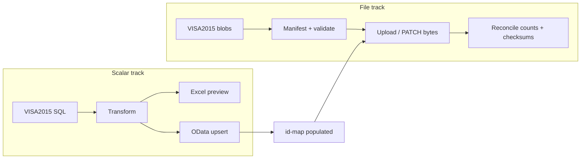

# VISA2014 → Visa2026 — file and image import

**Purpose:** Plan **binary file / image import** as a **separate track** from scalar OData load and **Excel preview**. Excel is for tabular transform review only — **not** photo bytes, scan attachments, PDFs, or other blobs.

**Status:** specified — implementation follows [`import-strategy.yaml`](../../Visa2026.DataImporter/legacy/visa2014/import-strategy.yaml) `attachmentsWave: last` and per-BO `importConfirmed`.

**Related:** [IMPORT_PLAN_AND_STRATEGY.md](./IMPORT_PLAN_AND_STRATEGY.md) · [EXCEL_PREVIEW_EXPORT.md](./EXCEL_PREVIEW_EXPORT.md) · [import-practices.md](../../.cursor/skills/visa2014-to-visa2026-import/import-practices.md)

---

## Two tracks (do not mix)

| Track | Sink | When | Contents |
|-------|------|------|----------|
| **Scalar + lookup** | Excel preview → OData POST/PATCH | Per BO wave (`person-domain`, `application-domain`, …) | Strings, numbers, dates, bools, lookup FKs resolved via `lookup-translations.yaml` |
| **Files / images** | OData file properties or staged blob + reference | **After** owning BO exists in Visa2026 + `id-map/` | `byte[]` inline fields, `FileData` aggregates, `*Document` child rows |



**Rule:** `--export-visa2014-preview` and Excel review **must not** embed binary columns. Use **audit stubs** only (see § Excel exclusion).

---

## Legacy inventory (VISA2015 — verified 2026-06-21)

### Person — inline photo

| Legacy | Type | Active rows | With data | Notes |
|--------|------|-------------|-----------|-------|
| `dbo.Person.Photo` | `varbinary(max)` | 2,569 | **2,567** (~99.9%) | Avg ~473 KB; max ~15 MB; min ~3 KB |

**Visa2026 target:** `Person.Photo` — `byte[]` with `[ImageEditor]` (inline on BO, **not** `FileData`).

### Attachment / document patterns (defer to attachments wave)

| Legacy table | ~Rows | Blob column | Typical link | Visa2026 home (planned) |
|--------------|-------|-------------|--------------|-------------------------|
| `dbo.PassportCopy` | ~9,157 active | `Göçürme` (`varbinary`) | `Passport` FK | `PassportDocument` + `FileData` (after Passport BO import) |
| `dbo.PassportCopy` | ~4,317 active (Education FK) | `Göçürme` | `Education` FK | `EducationDocument` + `FileData` (after Education BO import) |
| `dbo.FileData` | 107 | `Content` + `FileName` | XAF aggregate | Various `FileData` / `DocumentBase` targets |
| `dbo.FamilyProofDocument` | ~994 | `CopyOfDocument` | Person / family | `PersonDocument` or related |
| `dbo.Copy` | ~104 active | `CopyOfDocument` → `FileData` | `IPersonn_SpidKepilnama`, Passport, Visa, … | `MedicalRecordDocument` + synthetic `MedicalRecord` parent (Spid kepilnama — see discovery/MedicalRecord.yaml) |

**Schema snapshot** also flags attachment deferrals: `FileData`, `PassportCopy`, `Copy` ([`schema-snapshot.md`](schema-snapshot.md)).

### Visa2026 attachment model (target)

| Pattern | Example | Import shape |
|---------|---------|--------------|
| Inline `byte[]` on BO | `Person.Photo` | PATCH photo bytes on existing Person `ID` from id-map |
| Aggregated `FileData` | `DocumentBase.File`, `ApplicationProgress.MinistryLetterFile` | POST/PATCH `FileData` + link on parent |
| Child `*Document` rows | `PassportDocument`, `PersonDocument`, `EducationDocument`, … | POST child BO with nested or linked `FileData` |

Document uploads in Visa2026 enforce type/size rules (`DocumentFileUploadConstraints`, max MB from `SystemSettings`).

---

## Ordering and gates

Align with [`order.yaml`](../../Visa2026.DataImporter/legacy/visa2014/order.yaml) and import waves:

| Step | Action | Gate |
|------|--------|------|
| 1 | Person **scalar** OData upsert (no `Photo` bytes in POST body if oversized / separate step) | Person `importConfirmed`; id-map for `Person.Oid` |
| 2 | Person **Photo** file pass | Step 1 reconciled |
| 3 | Transactional BOs (Application, ApplicationItem, Passport, …) scalar | Parent id-maps |
| 4 | Per-BO document scans (`PassportCopy` → `PassportDocument`, …) | Owning BO + Passport/Visa id-maps |
| 5 | **Attachments wave** (`importPhase: attachments`) | All parent BO id-maps stable |

**Excel preview** runs at step 1 review only — **before** `importConfirmed` — and covers scalar columns + file **stubs**, not bytes.

**Pilot (Person):** scalar Person import first; Photo as **follow-up sub-pass** in same pilot or immediately after scalar reconciliation — document in run log.

---

## Excel preview — binary exclusion

Binary fields **never** appear as Excel cell payloads.

### Field-map convention

For each `transform: bytes` or file-backed property, add:

```yaml
fields:
  - source: Photo
    target: Photo
    transform: bytes
    importWave: file-follow-up          # not scalar-first POST
    excelExport:
      mode: stub                         # exclude | stub
      stubColumns:
        - _hasPhoto
        - _photoByteLength
        - _photoSha256
    missingBehavior: allow_null
```

| `excelExport.mode` | Main sheet | OData import |
|--------------------|------------|--------------|
| `exclude` | Column omitted | Normal file wave |
| `stub` (recommended) | Audit columns only | Bytes via file pass |

**Stub column definitions** (computed at export time from SQL, not from cell storage):

| Column | Meaning |
|--------|---------|
| `_hasPhoto` | `true` when `DATALENGTH(Photo) > 0` |
| `_photoByteLength` | `DATALENGTH(Photo)` or null |
| `_photoSha256` | SHA-256 hex of blob (for reconcile; optional on large DBs — sample or async) |

Same pattern generalizes: `_hasFile`, `_fileByteLength`, `_fileSha256`, `_legacyFileName` for `FileData`-linked sources.

### Workbook sheets

| Sheet | Binary content |
|-------|----------------|
| `{Entity}` main | **Stubs only** — no base64, no hex dump |
| `_FileManifest` (planned) | Optional summary: legacy id, target property, byte length, hash, import status — for file-wave planning; still **no** embedded bytes |
| `_Skipped` / `_Meta` | Unchanged from [EXCEL_PREVIEW_EXPORT.md](./EXCEL_PREVIEW_EXPORT.md) |

---

## File import wave — technical options

Open decision: [`import-strategy.yaml`](../../Visa2026.DataImporter/legacy/visa2014/import-strategy.yaml) → `openDecisions.file-blob-strategy`.

| Option | Mechanism | Pros | Cons |
|--------|-----------|------|------|
| **A — OData JSON base64** | PATCH `Person({id})` with `Photo` as base64 in JSON body | Reuses `ApiClient`; no new endpoint | Payload size limits, memory, timeout on ~15 MB photos; may not fit all `FileData` shapes |
| **B — OData `$value` / stream** | PUT binary to property `$value` URL | Better for large blobs | XAF Web API support must be verified per property; more client code |
| **C — Staged files + OData reference** | Write files to Visa2026 file store path; PATCH metadata only | Handles large volume; resumable | Needs server-side path contract or admin API; **must not** bypass XAF validation entirely |
| **D — Two-step FileData** | POST `FileData` entity, then PATCH parent link | Matches `DocumentBase` / `[FileAttachment]` | More round-trips; child BO creation order (`PassportDocument` then `File`) |

**Baseline recommendation (draft — confirm at strategy approval):**

- **`Person.Photo`:** Option **A** for typical sizes (&lt; 2 MB after Visa2026 `ProcessPassportPhoto`); fall back to **B** if OData rejects large PATCH.
- **`PassportCopy` / `*Document`:** Option **D** — create child document row, upload `FileData.Content` + `FileName`, link to parent from id-map.
- **Volume / prod cutover:** Option **C** as optional accelerator only if validated on staging (same audit trail as OData).

**Target write path remains OData** (or OData-documented file endpoints exposed by Visa2026 Web API) — **never** direct SQL `INSERT` into Visa2026 `FileData` tables.

---

## Idempotency, validation, quarantine

| Concern | Strategy |
|---------|----------|
| **Idempotency** | Key file pass on `(legacyOid, targetProperty)` or `(legacyOid, legacyFileOid)`; skip if `_photoSha256` unchanged and target already has same length/hash |
| **Missing blob** | `missingBehavior: allow_null` — log; do not fail scalar import |
| **Corrupt / empty** | `DATALENGTH = 0` or unreadable → quarantine row in `_FileQuarantine` manifest (not OData POST) |
| **Type validation** | Visa2026 `DocumentFileUploadConstraints` for `FileData`; sniff magic bytes vs extension from legacy `FileName` |
| **Size limits** | Respect `SystemSettings.MaxDocumentSizeInMB`; quarantine oversize with reason |
| **Reconcile** | Legacy count with `DATALENGTH > 0` vs target non-null Photo / `FileData.Size`; spot-check SHA-256 on N samples |

### Quarantine manifest (planned artifact)

```
Visa2026.DataImporter/legacy/visa2014/file-import/
  manifests/Person-photo-manifest.csv    # gitignored if prod PII
  quarantine/                            # gitignored
```

Columns: `_legacyRowId`, `_targetEntity`, `_targetProperty`, `_byteLength`, `_sha256`, `_status`, `_reason`.

---

## CLI (planned — after strategy approved)

```powershell
# Scalar only (default) — Photo omitted or null in POST
dotnet run --project Visa2026.DataImporter -- `
  --import-visa2014 --entity Person --skip-file-properties

# File follow-up pass
dotnet run --project Visa2026.DataImporter -- `
  --import-visa2014-files --entity Person --property Photo

# Attachments wave
dotnet run --project Visa2026.DataImporter -- `
  --import-visa2014-files --wave attachments
```

Exact flags TBD in implementation; **must** share id-map and manifest with scalar importer.

---

## Per-BO checklist (discovery)

When a dossier maps binary or file fields:

- [ ] Legacy column/table + `DATALENGTH` stats in dossier `mapping.notes`
- [ ] Target property type: inline `byte[]` vs `FileData` vs child `*Document`
- [ ] Field-map: `transform: bytes` or `file_ref` + `excelExport.mode: stub`
- [ ] `importWave`: `scalar` | `file-follow-up` | `attachments`
- [ ] File pass **`dependsOn`** id-map for owning BO
- [ ] Reconciliation: count + optional hash spot-check

---

## Revision log

| Date | Change |
|------|--------|
| 2026-06-21 | Initial file/image import plan — separate from Excel preview; Person.Photo inventory; options + ordering |
