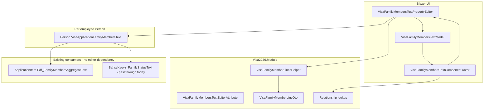

# Visa family members text editor (plan)

Custom Blazor property editor for **structured manual family lines** on an employee `Person`, stored in a single multiline `string` field. Inspired by the UX and layering of [COMMA_SEPARATED_MULTI_SELECT.md](./COMMA_SEPARATED_MULTI_SELECT.md), but the domain is **row CRUD** (name, birth date, relationship), not a shared checkbox catalog.

**Status:** Phase 1 implemented (custom Blazor property editor on `Person.VisaApplicationFamilyMembersText`).

## Business context

| Concept | Role |
|---------|------|
| `Person.FamilyMembers` | Master list: full `Person` rows (`IsEmployee = false`) with passports, addresses, etc. Used when family **accompanies** the employee in Turkmenistan. |
| `Person.VisaApplicationFamilyMembersText` | Manual lines when master `FamilyMembers` is empty but visa PDF still needs household info (family abroad, not in TM, etc.). Always visible on employee DetailView. |

Precedence for PDF and related aggregates (already implemented on `ApplicationItem`):

1. If employee has any active `FamilyMembers` → format from master (`FormatFamilyMembersFromMaster`).
2. Else if manual text is non-empty → use parsed manual lines (`VisaFamilyMemberLinesHelper`).

Master formatting (target for manual serialization):

```text
{FullName}; {DateOfBirth:dd.MM.yyyy}; {Relationship.NameTm}
```

Example:

```text
Smith John; 15.03.2010; oglum
Doe Jane; 01.07.1985; aýaly
```

Lines are separated by `Environment.NewLine` (CRLF on Windows is acceptable; parser should normalize `\r\n` / `\n`).

Property documentation today: `Visa2026.Module/BusinessObjects/Person.cs` (`VisaApplicationFamilyMembersText`).

## Recommendation (summary)

| Decision | Choice | Rationale |
|----------|--------|-----------|
| Storage | Keep `string` on `Person.VisaApplicationFamilyMembersText` | No schema change; PDF/Word paths already read the property; backward compatible with any existing free-text rows. |
| Editor pattern | Popup list editor (like comma-separated multi-select shell) | Read-only summary + **…** → modal → **OK** / **Cancel**; changes commit with the Person detail view `ObjectSpace`. |
| Relationship UI | Dropdown from `Relationship` lookup (`NameTm` display) | Same catalog as real family members; global seed (`relationship.json`); **no** add/rename/delete of `Relationship` inside this popup (unlike `BorderZoneName` catalog gear). |
| Full name | Single free-text field per row | Manual entries are not `Person` records; may not match `FirstName`/`LastName` split. Matches `Person.FullName` usage in master formatter. |
| Birth date | `DateTime` date picker, `dd.MM.yyyy` | Matches `Person.DateOfBirth` display and master formatter. |
| Serialized relationship | Store `Relationship.NameTm` in the line | Matches `FormatFamilyMembersFromMaster`; PDF and merge fields expect Turkmen labels, not OIDs. |
| Module logic | `VisaFamilyMemberLinesHelper` (+ small DTO) | Parse / format / validate / tolerant import of legacy lines; testable without Blazor. |
| Editor registration | Dedicated alias on `string`, e.g. `VisaFamilyMembersTextEditor` | One usage today; avoid overloading `CommaSeparatedMultiSelect` (different semantics). |

**Do not** store JSON in the column unless you accept a migration and breaking existing DB values; the visa pipeline assumes human-readable lines.

### Sahsy kagyz (`SahsyKagyz_FamilyStatusText`) caveat

Master `FamilyMembers` produce a **different** shape (`relLower-Name dd.MM.yyyyý. CODE.`). Manual text is currently passed through unchanged for `SahsyKagyz_FamilyStatusText`. Phase 1 of this editor should optimize for **visa PDF line format** only. Optional phase 2: build `SahsyKagyz_FamilyStatusText` from parsed manual rows (would require nationality per row or a separate field—out of scope unless product asks).

## Comparison with comma-separated multi-select

| Aspect | Comma-separated multi-select | Visa family members text editor |
|--------|------------------------------|----------------------------------|
| Stored value | Comma-separated labels | Newline-separated `name; date; relation` rows |
| Second data layer | Shared catalog table (`BorderZoneName`, …) | None (rows are only on the employee) |
| Popup primary action | Checkboxes (multi-select) | Row list + Add / Edit / Delete |
| Lookup maintenance in popup | Optional gear (catalog CRUD) | **Not** for `Relationship` (read-only pick list) |
| Cross-record updates | Rename/delete label on all items | N/A (employee-local data only) |

Reuse from the existing component:

- Inline read-only summary `DxTextBox` + **…** button.
- `DxPopup` with footer **OK** / **Cancel**, `CloseOnOutsideClick="false"`.
- `ComponentModelBase` + `BlazorPropertyEditorBase` + `IComplexViewItem` for `IObjectSpace`.
- Deferred commit: popup edits draft lines; property value updates on **OK**; parent XAF Save persists DB.
- CSS namespace: either extend `cs-multi-select-*` with BEM modifiers or add `visa-family-lines-*` alongside (prefer separate prefix to avoid confusion).

## Architecture



## Wire format (canonical)

### One line

```text
{FullName}; {BirthDate:dd.MM.yyyy}; {RelationshipNameTm}
```

Rules:

- Separator between fields: `"; "` (semicolon + space) — same as master formatter.
- `FullName`: trimmed; must be non-empty on save.
- `BirthDate`: invariant `dd.MM.yyyy`; parse with `DateTime.TryParseExact` and `CultureInfo.InvariantCulture`.
- `RelationshipNameTm`: trimmed `Relationship.NameTm` at save time; if lookup row is deleted later, keep stored text (display warning in editor).

### Document

- Lines joined with `Environment.NewLine`.
- Empty lines ignored.
- Trim whole document; empty document → `null` or `""` (pick one and use consistently in helper).

### Legacy / import tolerance

On parse, support:

- Extra spaces around `;`.
- Missing relationship (show row with validation error until user picks one).
- Unknown `RelationshipNameTm` (show raw text in dropdown as “custom (legacy)” or force re-selection on edit).
- Old free-form paragraphs (single line without `;`) → one “legacy” row with full text in name field and empty date/relationship until user fixes.

Optional `ModuleUpdater` **not** required for format; optional **normalization** script/importer pass can be a separate task.

## Popup UX (proposed)

### Detail view (closed state)

- Read-only summary:
  - Empty → localized “No family members declared” (or blank).
  - Non-empty → `"{count} family member(s)"` plus optional first line truncated, e.g. `Smith John; 15.03.2010; oglum`.
- **…** opens popup (hidden when `ReadOnly` / view mode).

### Popup (main)

| Area | Behavior |
|------|----------|
| Header | Title e.g. “Family members for visa (manual)” |
| Count | `Members: {n}` |
| List | Each row: display `FullName`, `dd.MM.yyyy`, `RelationshipNameTm`; actions **Edit**, **Delete** |
| Add | **Add member** opens inline form or nested mini-popup |
| Row form | Full name (text), Birth date (`DxDateEdit`), Relationship (`DxComboBox` bound to `Relationship` list, `NameTm` visible) |
| Footer | **OK** (validate all rows, serialize, close), **Cancel** (discard draft) |
| Status banner | Validation errors (required fields, invalid date) |

No catalog gear, no global rename/delete.

### Validation (on OK)

- Every row: non-empty full name, valid birth date, relationship selected.
- Optional: warn if birth date in future; optional duplicate name+date warning (non-blocking).
- Block OK if any row invalid; keep popup open.

### Visibility

On employee `Person` DetailView, `VisaApplicationFamilyMembersText` is always shown (employee-only via existing `EmployeeOnly` appearance). Family member persons do not see employee fields.

## Module design

### `VisaFamilyMemberLineDto` (or `VisaFamilyMemberLine`)

```csharp
public sealed class VisaFamilyMemberLineDto
{
    public string FullName { get; set; }
    public DateTime? BirthDate { get; set; }
    public string RelationshipNameTm { get; set; }  // serialized form
    public Guid? RelationshipOid { get; set; }    // UI only; not persisted in string
}
```

### `VisaFamilyMemberLinesHelper`

| Method | Purpose |
|--------|---------|
| `Parse(string? text)` | `IReadOnlyList<VisaFamilyMemberLineDto>` |
| `Format(IEnumerable<VisaFamilyMemberLineDto> lines)` | Canonical string for `Person` property |
| `TryParseLine(string line, out VisaFamilyMemberLineDto row, out string? error)` | Single-line tolerant parse |
| `ResolveRelationship(IObjectSpace os, string? nameTm)` | `Relationship` entity for dropdown round-trip |
| `LoadRelationshipOptions(IObjectSpace os)` | Ordered by `NameTm` for combo |

Unit tests (recommended): round-trip, legacy lines, empty, semicolon edge cases.

### `VisaFamilyMembersTextEditorAttribute`

- `PopupTitle`, button labels (English defaults; localized like comma-separated).
- `[AttributeUsage(Property)]` on `VisaApplicationFamilyMembersText`.

### `Person` property attributes (after implementation)

```csharp
[EditorAlias(VisaFamilyMembersTextEditorAliases.Default)]
[VisaFamilyMembersTextEditor]
public virtual string VisaApplicationFamilyMembersText { get; set; }
```

## Blazor Server design

| File | Role |
|------|------|
| `Editors/VisaFamilyMembersTextPropertyEditor.cs` | `[PropertyEditor(typeof(string), alias, false)]`, wires `IObjectSpace`, read/write `PropertyValue` via helper |
| `Editors/VisaFamilyMembersTextModel.cs` | `ComponentModelBase`: draft lines, relationship list, popup visibility, callbacks |
| `Editors/VisaFamilyMembersTextComponent.razor` | UI |
| `wwwroot/css/site.css` | `visa-family-lines-*` styles (or shared popup styles) |

Registration: same pattern as `CommaSeparatedMultiSelectPropertyEditor` (no Module change beyond attribute alias constant).

Localization: add `VisaFamilyMembersText.*` keys to `tools/GenerateModelLocalization/UiStrings.messages.json`, resolver in `Visa2026.Module/Localization/` (mirror `CommaSeparatedMultiSelectLocalization`).

## Security

| Entity | Permission |
|--------|------------|
| `Person.VisaApplicationFamilyMembersText` | Normal **Person** Read/Write for users who edit employees (`EnsureFullAccessRecursivePermission<Person>` on existing **Users** roles in `Updater.cs`) |
| `Relationship` | **Read** only in this editor (combo data source); `EnsureReadOnlyPermission<Relationship>` for existing **Users** roles |
| `Country` | **Read** only (country-of-residence combo); `EnsureReadOnlyPermission<Country>` for existing **Users** roles |

Do not grant Create/Delete on `Relationship` through this popup.

## Database

No change: `VisaApplicationFamilyMembersText` remains unlimited `nvarchar` (already on `Person`).

## Reports and PDF

No change required when serialization matches master format:

- `ApplicationItem.Pdf_FamilyMembersAggregateText` → uses manual text when master list empty.
- `PdfFormMapping` → `Pdf_FamilyMembersAggregateText` on application item.

Word templates that reference manual text directly are rare; prefer `Pdf_FamilyMembersAggregateText` or master-driven fields.

## Implementation phases

### Phase 1 — MVP (recommended first PR)

1. `VisaFamilyMemberLinesHelper` + DTO + unit tests.
2. Blazor property editor + attribute + alias registration.
3. Apply `[EditorAlias]` on `Person.VisaApplicationFamilyMembersText`.
4. Localization keys for popup chrome.
5. CSS for popup layout.
6. Manual QA: on an employee, add 2 manual family rows, save, open visa application PDF preview and confirm `_241` / aggregate field.

### Phase 2 — Polish

- Legacy line import UX (banner: “Some lines could not be parsed”).
- List ordering (e.g. by birth date or name).
- Copy from master `FamilyMembers` button (“Import from family list”) → maps `FullName`, `DateOfBirth`, `Relationship.NameTm` into draft rows (user confirms in popup). **Does not** create `Person` rows.

### Phase 3 — Optional

- Derive `SahsyKagyz_FamilyStatusText` from parsed manual rows (needs product rules + maybe extra column for nationality).
- DataImporter / seed support for `VisaApplicationFamilyMembersText` in demo scenarios.

## File map (planned)

### Module (`Visa2026.Module`)

| File | Role |
|------|------|
| `Services/VisaFamilyMemberLinesHelper.cs` | Parse / format / validate |
| `Services/VisaFamilyMemberLineDto.cs` | Row model |
| `Editors/VisaFamilyMembersTextEditorAttribute.cs` | Property metadata + alias constants |
| `Localization/VisaFamilyMembersTextLocalization.cs` | UI strings |
| `BusinessObjects/Person.cs` | `[EditorAlias]` + attribute on property |

### Blazor Server (`Visa2026.Blazor.Server`)

| File | Role |
|------|------|
| `Editors/VisaFamilyMembersTextPropertyEditor.cs` | XAF property editor |
| `Editors/VisaFamilyMembersTextModel.cs` | Component model |
| `Editors/VisaFamilyMembersTextComponent.razor` | Popup UI |
| `wwwroot/css/site.css` | Styles |

### Tests

| File | Role |
|------|------|
| `Visa2026.Module.Tests/.../VisaFamilyMemberLinesHelperTests.cs` | Parse/format (add test project only if already used in repo; otherwise test via E2E later) |

## Alternatives considered

| Alternative | Why not (for now) |
|-------------|-------------------|
| New child table `VisaManualFamilyMember` | Correct relational model but schema + migration + duplicate of `Person` family; manual field exists for lightweight case. |
| JSON in `VisaApplicationFamilyMembersText` | Breaks PDF passthrough and human inspection in SQL. |
| Reuse `CommaSeparatedMultiSelect` | Wrong UX (checkboxes) and wrong persistence (comma labels vs structured rows). |
| Nested `Person` creation in popup | Out of scope; use master `FamilyMembers` collection for real persons. |
| Split `FirstName` / `LastName` in manual rows | Extra UI without PDF benefit. |

## Related docs

- [COMMA_SEPARATED_MULTI_SELECT.md](./COMMA_SEPARATED_MULTI_SELECT.md) — popup editor pattern reference
- `AGENTS.md` — Module vs Blazor split
- `docs/LOOKUP_SEEDING.md` — `Relationship` catalog seed
- `Visa2026.Module/BusinessObjects/ApplicationItem.cs` — `Pdf_FamilyMembersAggregateText`, `FormatFamilyMembersFromMaster`
- `Visa2026.Module/BusinessObjects/Person.cs` — property definitions and Appearance rules
