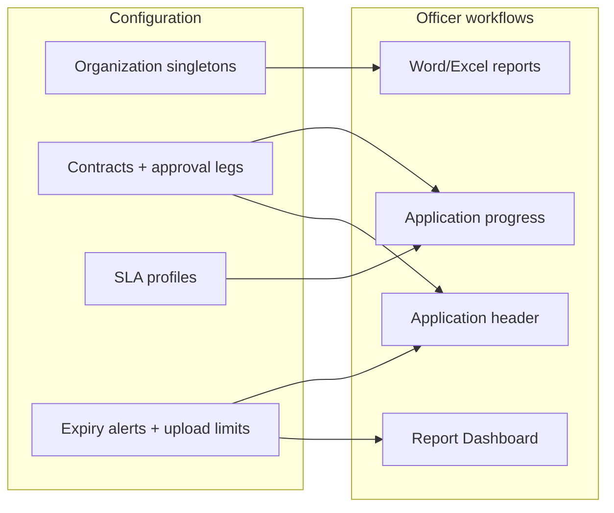

# Configuration overview

The **Configuration** menu holds tenant settings that affect **applications**, **reports**, **SLA warnings**, and **upload limits**. Most visa officers never open these screens; **VisaOffice** and **administrator** accounts maintain them.

!!! warning "Office-wide impact"
    Changes here affect every future application, report merge, and expiry warning — not only your own work.

## Who can open Configuration

| Role | Typical access |
|------|----------------|
| **Visa Officer** (`Users`) | Configuration menu is **hidden** |
| **VisaOffice** / **Administrator** | Full **Configuration** menu |

If you need a change and do not see **Configuration**, ask your supervisor — do not use another person's account.

## Open the Configuration menu

1. Sign in with a **VisaOffice** or administrator account.
2. In the left menu, expand **Configuration**.
3. Select the item you need (see table below).

The menu lists eleven items. Some open a **single company record** (singleton); others open a **list** you can add rows to.

## Configuration items — quick map

| Left menu item | Record type | What it controls | Guide |
|----------------|-------------|------------------|-------|
| **Company** | Singleton | Legal name, address, letterhead code for reports | [Organization settings](organization.md) |
| **Application Numbering** | Singleton | Prefix, format, and next application number | [Organization settings](organization.md) |
| **Authorized Signatory** | Singleton | Signatory name and passport for Word/PDF merges | [Organization settings](organization.md) |
| **Authorized Representative** | Singleton | Representative contact and passport for merges | [Organization settings](organization.md) |
| **Project contracts** | Catalog | Contract/project names linked to approval routes | [Contracts and approvals](contracts-and-approvals.md) |
| **Approving ministries** | Catalog | Ministry short names on progress steps | [Contracts and approvals](contracts-and-approvals.md) |
| **Approval Leg Profile** | Catalog | Ordered ministry review chain + linked contracts | [Contracts and approvals](contracts-and-approvals.md) |
| **Application Migration Sla Profile** | Catalog | Working-day SLA at migration service per application type | [SLA settings](sla.md) |
| **Ministry review SLA** | Singleton | Default working-day SLA per ministry leg | [SLA settings](sla.md) |
| **Document expiration alerts** | Catalog | Calendar-day thresholds before document expiry | [Alerts and upload limits](alerts-and-upload-limits.md) |
| **Upload limits** | Singleton | Max image and attachment size (MB) | [Alerts and upload limits](alerts-and-upload-limits.md) |
| **Application Profiles** | Catalog | Reusable application configuration (route, fields, templates) | [Application profiles](application-profiles.md) |

## Singleton vs catalog

| Pattern | Behaviour | Examples |
|---------|-----------|----------|
| **Singleton** | One row for the whole office — open the list and edit the existing record; do not create duplicates | Company, Application Numbering, Authorized Signatory, Authorized Representative, Ministry review SLA, Upload limits |
| **Catalog** | Many rows — use **New** on the list toolbar | Project contracts, Approving ministries, Approval Leg Profile, Application Migration Sla Profile, Document expiration alerts |

!!! note "Tenant catalogs on workflow forms"
    Other tenant values (**Lodging**, **Subcontractor**, **Education institution**, **Position**, border zone labels, …) are **not** maintained here. Officers add them **inline on the parent screen** where they are used — for example [Add an address](../../employee/add-address.md) for **Lodging** on **Address of residence**. Always search before **New** to avoid duplicate catalog rows.

!!! tip "Deploy and seed data"
    Some defaults arrive from JSON seed files on deploy. After go-live, officers still edit values in these screens. See developer doc `docs/LOOKUP_ORGANIZATION_SINGLETONS.md` for technical detail.

## How Configuration links to daily work

- **Organization** values merge into [Resminamalar](../../applications/resminamalar.md) Word reports (company block, signatory lines).
- **Project contracts** and **Approval Leg Profile** filter choices on [Create an application](../../applications/create.md) and drive [Track application progress](../../applications/progress.md) ministry steps.
- **Application Profiles** define which fields and progress rules officers get when they [choose a profile](../../applications/application-profiles.md) at create.
- **SLA** settings feed working-day warnings on progress (when enabled in your deployment).
- **Document expiration alerts** define when visas, passports, and similar records show **expiring soon** states used by dashboard and list styling.
- **Upload limits** cap scan and attachment size on person and application forms.

## What to read next

| Topic | Guide |
|-------|-------|
| Company identity and numbering | [Organization settings](organization.md) |
| Contracts and ministry routes | [Contracts and approvals](contracts-and-approvals.md) |
| Application profiles (wizard) | [Application profiles](application-profiles.md) |
| Migration and ministry SLA | [SLA settings](sla.md) |
| Expiry thresholds and file sizes | [Alerts and upload limits](alerts-and-upload-limits.md) |
| Report templates (separate menu) | [User report templates](../user-report-templates.md) |

## Common problems

| Problem | What to do |
|---------|------------|
| Configuration menu missing | Your role may be **Users** only — request **VisaOffice** access |
| Two rows for Company / Signatory | Delete extras; keep one singleton row per type |
| Application type missing from SLA profile | Open **Application Migration Sla Profile** detail → link the type in **Application types** |
| Officers cannot upload large scans | Raise **Upload limits** within the shown MB cap, or compress files |
