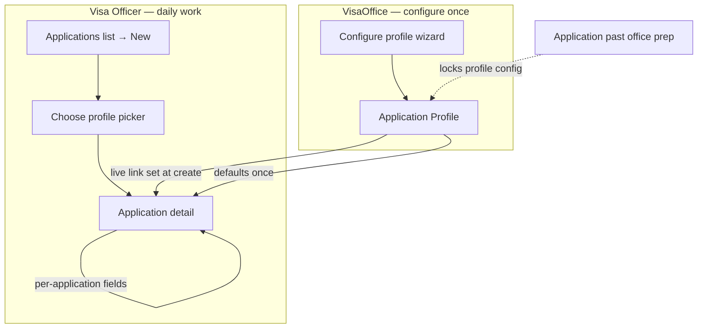

# Application profiles — how configuration works

Visa2026 is moving from picking a legacy **Application Type (Deprecated)** code on every new file to a shared **Application Profile**. This guide explains the **officer** view: what a profile is, how you **choose** one when creating an application, and what stays editable on the application afterward.

VisaOffice staff who **define** profiles use [Configure application profiles](../administration/configuration/application-profiles.md).

!!! info "Screenshots (preview)"
    Profile **picker** and **configuration wizard** screens are new. This guide uses **live UI labels** and diagrams. Officer screenshots will be added later — no automated capture is required to follow the steps today.

## At a glance

| Idea | What it means for you |
|------|------------------------|
| **Live link** | The application keeps a link to one profile. Profile rules (visibility, progress route, templates) apply to that application **without copying** a full duplicate configuration. |
| **Choose once at create** | You pick the profile when you start **New** on an Applications list. After save, **Application Profile** on the detail form is **read-only**. |
| **Per-application values** | Fields such as **Visa Type**, **Project Contract**, **Urgency**, and dates are filled on the application. The profile may **seed defaults** at create; you can change them on the application later. |
| **Config lock** | When any application using a profile has left **office preparation**, that profile’s **configuration** becomes read-only for admins. **New** applications may still use a locked profile. |

## Old way vs new way

| | Legacy (being replaced) | Application Profile |
|---|-------------------------|---------------------|
| **At create** | Enter **Application Type Code** (three digits) on a blank form | **New** opens a **profile picker** → **Use profile (live link)** |
| **Configuration** | Hidden inside deprecated **Application Type** records | **Configuration → Application Profiles** → **Configure profile** (wizard) |
| **After save** | **Application Type** fixed | **Application Profile** fixed; header fields you own stay editable |

During transition you may still see **Application Type (Deprecated)** filled automatically from the profile — that is for backward compatibility only.

## Lifecycle (live configuration)

**Configuration-related** (from profile, live): related-to family (issuance, registration, …), directed-to route (via ministry / direct migration), produce/cancel rules, approval legs, person-data requirements, nested templates list.

**Per-application** (on the application record): visa lookups, contract, urgency, dates, signatory lines when shown — seeded from profile defaults where configured, then officer-owned.

## Step 1 — Open the correct Applications list

Same as [Applications — ministry and direct migration](overview.md):

| Procedure route | List |
|-----------------|------|
| Via ministry | **Applications (via ministry)** |
| Direct migration | **Applications (direct migration)** |

The profile picker **filters** profiles for the list you opened (ministry-route profiles on the ministry list, and so on).

## Step 2 — Start New (profile picker)

1. On the list toolbar, select **New**.
2. Wait for **Choose Application Profile** (picker) — not a blank application form.
3. Read each row: **name**, **code**, **Related to**, and **Via ministry** or **Direct migration**.
4. Select the row for your procedure.
5. Select **Use profile (live link)**.

!!! tip "Recently used profiles"
    Profiles you used recently on this route tend to appear **near the top** of the list.

!!! note "Config locked badge"
    A profile may show **Config locked** when an existing application already left office preparation. You can **still** use it for a **new** application — only **editing that profile’s configuration** is blocked (admins use **Clone** to make a new variant).

## Step 3 — Complete the application header

After **Use profile (live link)**:

1. The **application detail form** opens.
2. Confirm **Application Profile** (read-only) matches your choice.
3. Fill visible header fields — only fields that apply to this profile appear.
4. Defaults from the profile (for example **Visa Type**, **Project Contract**) may already be filled.
5. Select **Save**.

On first save, Visa2026 assigns **Application Number** / **Full Application Number** and treats progress as **office preparation** until you add progress rows ([Track application progress](progress.md)).

## Step 4 — Add people and continue workflow

1. Open the **Application items** tab → [Add application items](add-items.md).
2. Track progress, document copies, and report packages as today — [progress](progress.md) · [document copies](document-copies.md) · [Resminamalar](resminamalar.md).

Profile changes made later by VisaOffice (for example a new nested template) affect **behaviour** on linked applications; they do **not** overwrite values you already entered on the header.

## Who configures profiles?

| Role | Task |
|------|------|
| **Visa Officer** | Pick a profile at create; edit per-application fields |
| **VisaOffice** / **Administrator** | Create and edit profiles under **Configuration → Application Profiles** — see [Configure application profiles](../administration/configuration/application-profiles.md) |

## Common problems

| Problem | What to do |
|---------|------------|
| Picker list is empty | Ask VisaOffice to activate profiles under **Configuration → Application Profiles** |
| Expected profile missing on ministry list | It may be **direct migration** only — open **Applications (direct migration)** |
| **New** opens a blank form (old behaviour) | Your deployment may not have the picker yet — use **Application Type Code** until upgraded; ask IT |
| Wrong profile after save | Profile cannot be changed on a saved application — supervisor may delete/recreate or use a new file |
| Fields missing on header | Profile configuration hides non-applicable fields — confirm the correct profile with VisaOffice |

## What to read next

- [Create an application](create.md) — checklist aligned with the profile picker
- [Applications — ministry and direct migration](overview.md) — choose the correct list
- [Configure application profiles](../administration/configuration/application-profiles.md) — VisaOffice wizard (admin)
- [Configuration overview](../administration/configuration/overview.md) — other Configuration menu items
